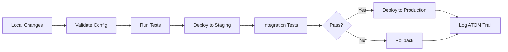

# KENL Cloudflare Infrastructure

**Modular, cross-platform Cloudflare deployment for KENL with SAIF workflows**

> 🌍 **Platform Support**: Windows 10/11, Linux (any distro), macOS 12+

---

## 🚀 Quick Start (Choose Your Clone Method)

```
┌─────────────────────────────────────────────────────────────────────────┐
│                     CLONE OPTIONS (Pick One)                            │
├─────────────────────────────────────────────────────────────────────────┤
│                                                                         │
│  Option A: Full KENL Repository (Recommended)                          │
│  ┌───────────────────────────────────────────────────────────┐         │
│  │ git clone https://github.com/toolate28/kenl.git           │         │
│  │ cd kenl/cloudflare-infrastructure                         │         │
│  └───────────────────────────────────────────────────────────┘         │
│  ✅ Get: Everything (all KENL modules + Cloudflare)                    │
│  ✅ Size: ~50MB                                                        │
│  ✅ Use case: Full KENL ecosystem                                      │
│                                                                         │
│  ─────────────────────────────────────────────────────────────         │
│                                                                         │
│  Option B: Sparse Clone (Cloudflare Only)                             │
│  ┌───────────────────────────────────────────────────────────┐         │
│  │ git clone --depth 1 --filter=blob:none \                 │         │
│  │   --sparse https://github.com/toolate28/kenl.git         │         │
│  │ cd kenl                                                    │         │
│  │ git sparse-checkout set cloudflare-infrastructure         │         │
│  └───────────────────────────────────────────────────────────┘         │
│  ✅ Get: Just cloudflare-infrastructure/ directory                     │
│  ✅ Size: ~5MB                                                         │
│  ✅ Use case: Standalone Cloudflare deployment                         │
│                                                                         │
│  ─────────────────────────────────────────────────────────────         │
│                                                                         │
│  Option C: Submodule (Integrate into Your Project)                    │
│  ┌───────────────────────────────────────────────────────────┐         │
│  │ cd your-project/                                           │         │
│  │ git submodule add \                                        │         │
│  │   https://github.com/toolate28/kenl.git kenl             │         │
│  │ git submodule update --init --depth 1 \                   │         │
│  │   --sparse kenl/cloudflare-infrastructure                 │         │
│  └───────────────────────────────────────────────────────────┘         │
│  ✅ Get: Cloudflare infrastructure as submodule                        │
│  ✅ Size: ~5MB                                                         │
│  ✅ Use case: Add to existing project, track KENL updates             │
│                                                                         │
└─────────────────────────────────────────────────────────────────────────┘
```

**🔗 Immutable Design**: All scripts use relative paths. Works with ANY clone method. No broken links.

---

## 🖥️ Platform-Specific Setup

<details>
<summary><b>Windows (PowerShell)</b></summary>

```powershell
# Install Node.js (for Wrangler)
winget install OpenJS.NodeJS

# Install Wrangler CLI
npm install -g wrangler

# Clone (choose Option A, B, or C above)
git clone https://github.com/toolate28/kenl.git
cd kenl\cloudflare-infrastructure

# Authenticate
wrangler login

# Deploy
.\workflows\SAIF-CLOUDFLARE-SETUP.md
```
</details>

<details>
<summary><b>Linux (Bash)</b></summary>

```bash
# Install Node.js (Ubuntu/Debian)
sudo apt update && sudo apt install -y nodejs npm

# OR (Fedora/RHEL)
sudo dnf install -y nodejs npm

# Install Wrangler CLI
npm install -g wrangler

# Clone (choose Option A, B, or C above)
git clone https://github.com/toolate28/kenl.git
cd kenl/cloudflare-infrastructure

# Authenticate
wrangler login

# Deploy
./workflows/SAIF-CLOUDFLARE-SETUP.md
```
</details>

<details>
<summary><b>macOS (Zsh/Bash)</b></summary>

```bash
# Install Node.js (via Homebrew)
brew install node

# Install Wrangler CLI
npm install -g wrangler

# Clone (choose Option A, B, or C above)
git clone https://github.com/toolate28/kenl.git
cd kenl/cloudflare-infrastructure

# Authenticate
wrangler login

# Deploy
./workflows/SAIF-CLOUDFLARE-SETUP.md
```
</details>

---

## Architecture Principles

### Modularity First
- **One script = One responsibility** (< 200 lines ideal)
- **Composable utilities** that chain together
- **No megalithic scripts** - break into focused modules
- **Testable independently** - each script has clear I/O

### Domain Structure

**Public Domains** (`*.toolated.online`):
- `kenl.toolated.online` - Main web interface (Cloudflare Pages)
- `api.toolated.online` - Backend API (Cloudflare Workers)

**Subdomains** (per KENL module):
- `gaming.toolated.online` - KENL2 Play Card browser
- `dev.toolated.online` - KENL3 development dashboards
- `atom.toolated.online` - KENL4 ATOM trail analytics

## Directory Structure

```
cloudflare-infrastructure/
├── schemas/              # D1 database schemas (one file per table)
│   ├── atom_trails.sql
│   ├── playcard_rules.sql
│   ├── users.sql
│   └── sessions.sql
├── workers/              # Cloudflare Workers (small, focused)
│   ├── api-atom/         # ATOM trail query API
│   ├── api-playcard/     # Play Card validation API
│   ├── auth/             # Authentication worker
│   └── logging/          # Centralized logging worker
├── pages/                # Cloudflare Pages sites
│   ├── kenl-web/         # Main website
│   └── atom-dashboard/   # ATOM analytics dashboard
├── scripts/              # Small utility scripts
│   ├── validate-config.sh      # Validate wrangler.toml
│   ├── sync-d1.sh              # SQLite -> D1 sync
│   ├── deploy-worker.sh        # Deploy single worker
│   ├── create-kv-namespace.sh  # Create KV namespace
│   └── backup-to-r2.sh         # Backup to R2
├── workflows/            # SAIF workflow orchestrators
│   ├── SAIF-CLOUDFLARE-SETUP.md
│   ├── SAIF-GITHUB-INTEGRATION.md
│   └── SAIF-BAZZITE-GAMING.md
└── docs/
    ├── ARCHITECTURE.md
    ├── DEPLOYMENT.md
    └── DOMAIN-ROUTING.md
```

## Quick Start

### 1. Initialize Cloudflare Services
```bash
cd cloudflare-infrastructure/workflows
./saif-cloudflare-setup.sh --init
```

### 2. Deploy Individual Services
```bash
# Deploy ATOM API worker
./scripts/deploy-worker.sh api-atom

# Sync ATOM database to D1
./scripts/sync-d1.sh atom_trails

# Create KV namespace for sessions
./scripts/create-kv-namespace.sh sessions
```

### 3. Run SAIF Workflow
```bash
# Full Cloudflare setup with validation
./workflows/saif-cloudflare-setup.sh --validate
```

## Services Overview

### Cloudflare D1 (SQLite-Compatible Database)
- **atom_trails** - Syncs with local `~/.kenl/db/atom-trails.db`
- **playcard_rules** - Validation rules for Play Cards
- **users** - User accounts for web interface
- **sessions** - Active user sessions

### Cloudflare Workers (API Endpoints)
- **api-atom** - Query ATOM trails, get analytics
- **api-playcard** - Validate and serve Play Cards
- **auth** - User authentication (OAuth + API tokens)
- **logging** - Centralized logging with Analytics Engine

### Cloudflare KV (Key-Value Storage)
- **sessions** - User session tokens (TTL: 24h)
- **cache** - Cached Play Cards and validation results
- **rate-limits** - API rate limiting counters

### Cloudflare R2 (Object Storage)
- **kenl-atom-archives** - ATOM trail archives (30+ days)
- **playcard-repo** - Community Play Card repository
- **backups** - Automated database backups

### Cloudflare Pages (Static Sites)
- **kenl.toolated.online** - Main KENL website
- **atom.toolated.online** - ATOM analytics dashboard (Grafana-style)

## SAIF Workflows

### 1. Cloudflare Setup (`SAIF-CLOUDFLARE-SETUP.md`)
Intelligently sets up all Cloudflare services with validation:
- Creates D1 databases and applies schemas
- Deploys Workers with dependency checking
- Configures KV namespaces and bindings
- Sets up R2 buckets with lifecycle rules
- Configures DNS and WAF rules
- Validates everything before going live

### 2. GitHub Integration (`SAIF-GITHUB-INTEGRATION.md`)
Automates CI/CD with ATOM logging:
- GitHub Actions for automated deployment
- ATOM trail logging for all deployments
- Rollback on failed deployment
- Secrets management with Cloudflare vault

### 3. Bazzite Gaming Configuration (`SAIF-BAZZITE-GAMING.md`)
Hardware-specific gaming optimizations:
- Detects hardware profile (AMD/NVIDIA/Intel)
- Applies optimal Play Cards
- Configures MangoHud, Gamescope
- Logs all changes with ATOM trail

## Deployment Flow



## Integration with Existing ATOM System

**This infrastructure extends the existing ATOM database** (see `modules/KENL4-monitoring/docs/ATOM-DATABASE-ARCHITECTURE.md`):

- Local SQLite (`~/.kenl/db/atom-trails.db`) remains source of truth
- Cloudflare D1 is a **sync target** for web queries
- R2 archives long-term ATOM trails (30+ days)
- Workers Analytics provides real-time metrics

## Security

- **D1 databases**: Row-level security with user context
- **Workers**: Rate limiting (100 req/min per IP)
- **KV namespaces**: Scoped access tokens
- **R2 buckets**: Private by default, signed URLs for access
- **Pages**: Static content, no server-side execution

## Development

### Prerequisites
```bash
# Install Wrangler CLI
npm install -g wrangler

# Login to Cloudflare
wrangler login

# Verify access
wrangler whoami
```

### Local Testing
```bash
# Test worker locally
cd workers/api-atom
wrangler dev

# Test D1 database locally
wrangler d1 execute kenl-atom-trails --local --file=../../schemas/atom_trails.sql
```

## 🚨 Immutability Guarantee

### Works Standalone - No Breaking Links
All scripts use **relative paths only**:

```bash
# ✅ Works in ANY clone method (A, B, or C)
./scripts/create-d1-database.sh kenl-atom-trails
./scripts/apply-schema.sh kenl-atom-trails schemas/atom_trails.sql
./scripts/deploy-worker.sh api-atom --production
```

All documentation links are relative:
```markdown
# ✅ Always works
[Architecture](docs/ARCHITECTURE.md)
[Deployment Guide](docs/DEPLOYMENT.md)
[Setup Workflow](workflows/SAIF-CLOUDFLARE-SETUP.md)
```

**If you extract just `cloudflare-infrastructure/`**:
- ✅ All scripts work
- ✅ All documentation accessible
- ✅ All workflows functional
- ✅ Workers deploy independently

---

## ATOM Trail

```
ATOM-README-20251116-002: Updated README with cross-platform clone options
Intent: Enable standalone module usage on Windows/Linux/Mac with immutable links
Architecture: Visual clone chart + platform-specific setup guides
Validation: All relative paths ensure no broken dependencies
Previous: ATOM-INFRA-20251116-001
```

## License

MIT - Same as KENL repository

## Links

- [Main KENL README](../README.md)
- [ATOM Database Architecture](../modules/KENL4-monitoring/docs/ATOM-DATABASE-ARCHITECTURE.md)
- [Cloudflare Integration Case Study](../case-studies/CLOUDFLARE_INTEGRATION.md)
- [SAIF Framework](../dotfiles/SAIF-FRAMEWORK.md)
