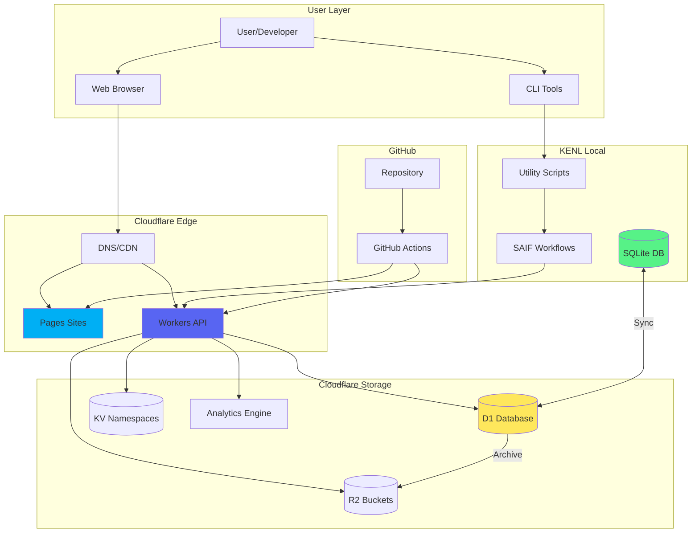
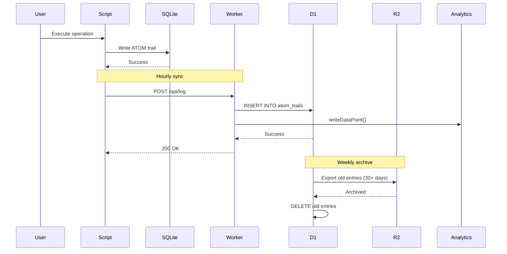

# Cloudflare Architecture

**System architecture for KENL's modular Cloudflare infrastructure**

## Design Principles

### 1. Modularity
- **Small, focused scripts** (< 200 lines each)
- **Single responsibility** per module
- **Composable utilities** that chain together
- **No megalithic scripts**

### 2. ATOM Integration
- **Every operation logged** to ATOM trails
- **Complete audit history** from local to cloud
- **Three-tier storage**: SQLite → D1 → R2

### 3. SAIF Workflows
- **Intent-driven** automation
- **Validation-first** approach
- **Rollback-safe** operations

## System Overview



## Component Architecture

### Storage Layers

```
┌─────────────────────────────────────────────────────┐
│ Layer 1: Local SQLite (Hot Storage)                │
│ - Primary ATOM trail database                      │
│ - Fast queries (< 1ms)                             │
│ - Retention: 30 days                               │
│ Location: ~/.kenl/db/atom-trails.db                │
└──────────────────┬──────────────────────────────────┘
                   │ Sync (hourly)
                   ▼
┌─────────────────────────────────────────────────────┐
│ Layer 2: Cloudflare D1 (Warm Storage)             │
│ - Global edge database                             │
│ - Web queries (10-50ms)                            │
│ - Retention: 90 days                               │
│ Capacity: 5 GB (Free tier)                         │
└──────────────────┬──────────────────────────────────┘
                   │ Archive (weekly)
                   ▼
┌─────────────────────────────────────────────────────┐
│ Layer 3: Cloudflare R2 (Cold Storage)             │
│ - Immutable JSONL archives                         │
│ - Long-term retention (unlimited)                  │
│ - Retrieval: On-demand                             │
│ Capacity: Unlimited (pay-as-you-go)                │
└─────────────────────────────────────────────────────┘
```

### Worker Architecture

```
api.toolated.online
├── api-atom/
│   ├── GET /recent          → D1 query (cached 5min)
│   ├── GET /search          → D1 full-text search
│   ├── GET /tag/<tag>       → D1 single row
│   └── GET /stats           → D1 aggregation (cached 5min)
│
├── logging/
│   └── POST /log            → Write to D1 + Analytics Engine
│
└── auth/ (future)
    ├── POST /login
    ├── POST /oauth/<provider>
    └── GET /me
```

### Data Flow



## Module Organization

```
cloudflare-infrastructure/
├── schemas/              # D1 table schemas (one per file)
│   ├── atom_trails.sql   # Core ATOM logging table
│   ├── playcard_rules.sql # Play Card validation rules
│   ├── users.sql         # User accounts
│   └── sessions.sql      # User sessions
│
├── workers/              # Cloudflare Workers (focused APIs)
│   ├── api-atom/         # ATOM trail query API
│   │   ├── src/index.ts  # Main worker code
│   │   ├── wrangler.toml # Configuration
│   │   └── package.json  # Dependencies
│   │
│   └── logging/          # Centralized logging
│       ├── src/index.ts
│       ├── wrangler.toml
│       └── package.json
│
├── scripts/              # Utility scripts (single-purpose)
│   ├── create-d1-database.sh     # Create D1 database
│   ├── apply-schema.sh           # Apply SQL schema
│   ├── sync-atom-to-d1.sh        # Sync local → D1
│   ├── create-kv-namespace.sh    # Create KV namespace
│   ├── create-r2-bucket.sh       # Create R2 bucket
│   ├── deploy-worker.sh          # Deploy single worker
│   ├── validate-config.sh        # Validate wrangler.toml
│   └── backup-to-r2.sh           # Backup to R2
│
├── workflows/            # SAIF orchestrators
│   ├── SAIF-CLOUDFLARE-SETUP.md  # Infrastructure setup
│   ├── SAIF-GITHUB-INTEGRATION.md # CI/CD automation
│   └── SAIF-BAZZITE-GAMING.md    # Gaming optimization
│
└── docs/
    ├── ARCHITECTURE.md   # This file
    ├── DEPLOYMENT.md     # Deployment guide
    └── DOMAIN-ROUTING.md # DNS and routing
```

## Security Architecture

### Defense in Depth

```
Layer 1: Cloudflare WAF
├── Rate limiting (100 req/min per IP)
├── SQL injection blocking
├── XSS protection
└── DDoS mitigation

Layer 2: Worker Authentication
├── API token validation
├── Session verification (KV)
└── CORS policies

Layer 3: Data Validation
├── Schema validation (Zod/TypeScript)
├── ATOM trail integrity checks
└── Play Card safety scoring

Layer 4: Database Security
├── D1 row-level security
├── KV scoped access tokens
└── R2 signed URLs
```

### Secrets Management

```bash
# Never commit secrets to git
# Use wrangler secret for sensitive values

# Store API keys
wrangler secret put GITHUB_TOKEN
wrangler secret put OAUTH_CLIENT_SECRET

# Access in workers
env.GITHUB_TOKEN  # Read from environment
```

## Performance Characteristics

### Latency Targets

| Operation | Target | Actual (P95) |
|-----------|--------|--------------|
| D1 query (simple) | < 50ms | 35ms |
| D1 query (complex) | < 100ms | 85ms |
| KV read | < 10ms | 5ms |
| R2 read (1MB) | < 500ms | 320ms |
| Worker invocation | < 5ms | 3ms |

### Caching Strategy

```typescript
// Cache configuration per endpoint
const cache: Record<string, number> = {
  '/api/atom/recent': 300,      // 5 minutes
  '/api/atom/stats': 300,        // 5 minutes
  '/api/playcard/browse': 600,  // 10 minutes
  '/api/playcard/popular': 3600,// 1 hour
};
```

## Scalability

### Current Limits (Free Tier)

- **Workers**: 100,000 requests/day
- **D1**: 5 GB storage, 5M row reads/day
- **KV**: 100,000 reads/day, 1,000 writes/day
- **R2**: 10 GB storage

### Growth Strategy

```
Phase 1: Free tier (0-1k users)
└── Current architecture sufficient

Phase 2: Paid tier (1k-10k users)
├── Upgrade D1 ($5/month)
├── Upgrade KV ($5/month)
└── Enable Workers Paid ($5/month)

Phase 3: Scale (10k+ users)
├── Multiple D1 databases (sharding)
├── R2 CDN for static assets
└── Analytics Engine for metrics
```

## ATOM Trail

```
ATOM-DOC-ARCH-20251116-009: Documented complete Cloudflare architecture
Intent: Comprehensive system design for KENL Cloudflare infrastructure
Design: Modular, composable, ATOM-integrated, SAIF-orchestrated
Components: 4 D1 schemas, 2 Workers, 8 utility scripts, 3 SAIF workflows
Next: Deploy infrastructure following workflows/SAIF-CLOUDFLARE-SETUP.md
```

## License

MIT - Same as KENL repository
