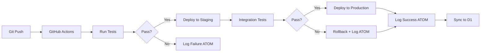

# SAIF Workflow: GitHub Integration

**Automated CI/CD with ATOM Trail Logging**

## Purpose

Automates deployment of Cloudflare workers and Pages with GitHub Actions, logging all operations to ATOM trails for complete audit history.

## Philosophy

> "Every deployment tells a story" - ATOM trails capture the full lifecycle of code from commit to production.

## Architecture



## GitHub Actions Workflow

### File: `.github/workflows/cloudflare-deploy.yml`

```yaml
name: Deploy to Cloudflare

on:
  push:
    branches: [main, develop]
    paths:
      - 'cloudflare-infrastructure/**'
  pull_request:
    branches: [main]

env:
  CLOUDFLARE_API_TOKEN: ${{ secrets.CLOUDFLARE_API_TOKEN }}
  CLOUDFLARE_ACCOUNT_ID: ${{ secrets.CLOUDFLARE_ACCOUNT_ID }}

jobs:
  test:
    name: Run Tests
    runs-on: ubuntu-latest
    steps:
      - uses: actions/checkout@v4

      - name: Setup Node.js
        uses: actions/setup-node@v4
        with:
          node-version: '20'

      - name: Install dependencies
        run: |
          cd cloudflare-infrastructure/workers/api-atom
          npm install

      - name: Run tests
        run: |
          cd cloudflare-infrastructure/workers/api-atom
          npm test

      - name: Log test result to ATOM
        if: always()
        run: |
          ATOM_TAG="ATOM-CI-TEST-$(date +%Y%m%d)-${{ github.run_number }}"
          echo "$ATOM_TAG: GitHub Actions tests ${{ job.status }}" >> $GITHUB_STEP_SUMMARY

  deploy-staging:
    name: Deploy to Staging
    runs-on: ubuntu-latest
    needs: test
    if: github.ref == 'refs/heads/develop'
    steps:
      - uses: actions/checkout@v4

      - name: Install Wrangler
        run: npm install -g wrangler

      - name: Deploy api-atom to staging
        run: |
          cd cloudflare-infrastructure/workers/api-atom
          wrangler deploy --env dev

      - name: Log deployment to ATOM
        run: |
          ATOM_TAG="ATOM-CI-DEPLOY-$(date +%Y%m%d)-${{ github.run_number }}"
          curl -X POST https://api.toolated.online/api/log \
            -H "Content-Type: application/json" \
            -d '{
              "tag": "'$ATOM_TAG'",
              "type": "DEPLOY",
              "description": "Deployed api-atom to staging via GitHub Actions",
              "user": "${{ github.actor }}",
              "hostname": "github-actions",
              "command": "wrangler deploy --env dev",
              "exit_code": 0
            }'

  deploy-production:
    name: Deploy to Production
    runs-on: ubuntu-latest
    needs: test
    if: github.ref == 'refs/heads/main'
    environment:
      name: production
      url: https://api.toolated.online
    steps:
      - uses: actions/checkout@v4

      - name: Install Wrangler
        run: npm install -g wrangler

      - name: Deploy api-atom to production
        run: |
          cd cloudflare-infrastructure/workers/api-atom
          wrangler deploy --env production

      - name: Deploy logging worker to production
        run: |
          cd cloudflare-infrastructure/workers/logging
          wrangler deploy --env production

      - name: Verify deployment
        run: |
          sleep 5
          STATUS=$(curl -s -o /dev/null -w "%{http_code}" https://api.toolated.online/api/atom/stats)
          if [ $STATUS -eq 200 ]; then
            echo "✅ Deployment verified"
          else
            echo "❌ Deployment verification failed: HTTP $STATUS"
            exit 1
          fi

      - name: Log deployment to ATOM
        if: always()
        run: |
          ATOM_TAG="ATOM-CI-DEPLOY-$(date +%Y%m%d)-${{ github.run_number }}"
          EXIT_CODE=${{ job.status == 'success' && 0 || 1 }}
          curl -X POST https://api.toolated.online/api/log \
            -H "Content-Type: application/json" \
            -d '{
              "tag": "'$ATOM_TAG'",
              "type": "DEPLOY",
              "description": "Deployed workers to production via GitHub Actions (commit: ${{ github.sha }})",
              "user": "${{ github.actor }}",
              "hostname": "github-actions",
              "command": "wrangler deploy --env production",
              "exit_code": '$EXIT_CODE',
              "hash": "${{ github.sha }}"
            }'

  rollback:
    name: Rollback on Failure
    runs-on: ubuntu-latest
    needs: deploy-production
    if: failure()
    steps:
      - uses: actions/checkout@v4

      - name: Install Wrangler
        run: npm install -g wrangler

      - name: Rollback deployment
        run: |
          cd cloudflare-infrastructure/workers/api-atom
          wrangler rollback

      - name: Log rollback to ATOM
        run: |
          ATOM_TAG="ATOM-CI-ROLLBACK-$(date +%Y%m%d)-${{ github.run_number }}"
          curl -X POST https://api.toolated.online/api/log \
            -H "Content-Type: application/json" \
            -d '{
              "tag": "'$ATOM_TAG'",
              "type": "ROLLBACK",
              "description": "Rolled back deployment due to failure",
              "user": "${{ github.actor }}",
              "hostname": "github-actions",
              "command": "wrangler rollback",
              "exit_code": 0
            }'
```

## Setup Instructions

### Step 1: Create GitHub Secrets

```bash
# Get Cloudflare API token
# Visit: https://dash.cloudflare.com/profile/api-tokens
# Create token with:
#   - Workers Scripts: Edit
#   - D1: Edit
#   - Workers KV Storage: Edit

# Add to GitHub repository secrets:
# Settings → Secrets and variables → Actions → New repository secret

# Required secrets:
#   - CLOUDFLARE_API_TOKEN: (from dashboard)
#   - CLOUDFLARE_ACCOUNT_ID: (from wrangler whoami)
```

### Step 2: Create Workflow File

```bash
# Copy workflow to repository
mkdir -p .github/workflows
cp cloudflare-infrastructure/workflows/github-ci-template.yml .github/workflows/cloudflare-deploy.yml

# Commit and push
git add .github/workflows/cloudflare-deploy.yml
git commit -m "Add Cloudflare CI/CD workflow"
git push
```

### Step 3: Configure Branch Protection

```bash
# Recommended settings (via GitHub web UI):
# Settings → Branches → Branch protection rules → Add rule

# For 'main' branch:
#   ✅ Require pull request reviews (1 reviewer)
#   ✅ Require status checks to pass
#   ✅ Require deployments to succeed before merging
#   ✅ Require linear history
```

### Step 4: Test Deployment

```bash
# Create test branch
git checkout -b test/ci-deployment

# Make a change
echo "// Test CI" >> cloudflare-infrastructure/workers/api-atom/src/index.ts

# Commit and push
git add .
git commit -m "test: Verify CI/CD pipeline"
git push -u origin test/ci-deployment

# Create PR and watch GitHub Actions run
gh pr create --title "Test: CI/CD Pipeline" --body "Testing automated deployment"
```

## Local ATOM Integration

### Log Local Deployments to ATOM

```bash
#!/bin/bash
# Script: log-deployment-to-atom.sh

WORKER_NAME="$1"
ENV="$2"
EXIT_CODE="${3:-0}"

ATOM_TAG="ATOM-DEPLOY-$(date +%Y%m%d)-$(date +%s | tail -c 4)"

# Log locally
echo "$ATOM_TAG: Deployed $WORKER_NAME to $ENV (exit: $EXIT_CODE)" >> ~/.kenl/atom-trail.log

# Log to Cloudflare
curl -X POST https://api.toolated.online/api/log \
  -H "Content-Type: application/json" \
  -d "{
    \"tag\": \"$ATOM_TAG\",
    \"type\": \"DEPLOY\",
    \"description\": \"Deployed $WORKER_NAME to $ENV\",
    \"user\": \"$(whoami)\",
    \"hostname\": \"$(hostname)\",
    \"command\": \"wrangler deploy --env $ENV\",
    \"exit_code\": $EXIT_CODE
  }"
```

Usage:

```bash
# After deploying worker
./scripts/deploy-worker.sh api-atom --production
./log-deployment-to-atom.sh api-atom production $?
```

## Advanced: Automated ATOM Sync

### Scheduled Sync (GitHub Actions)

```yaml
# .github/workflows/atom-sync.yml
name: Sync ATOM Trails

on:
  schedule:
    - cron: '0 */6 * * *'  # Every 6 hours
  workflow_dispatch:  # Manual trigger

jobs:
  sync:
    runs-on: ubuntu-latest
    steps:
      - uses: actions/checkout@v4

      - name: Download ATOM database from R2
        run: |
          wrangler r2 object get kenl-atom-archives/atom-trails-latest.db \
            --file atom-trails.db

      - name: Sync to D1
        run: |
          cloudflare-infrastructure/scripts/sync-atom-to-d1.sh

      - name: Backup to R2
        run: |
          cloudflare-infrastructure/scripts/backup-to-r2.sh
```

## ATOM Trail Queries

### View Recent Deployments

```bash
# Via API
curl https://api.toolated.online/api/atom/recent | jq '.[] | select(.type == "DEPLOY")'

# Via local database
sqlite3 ~/.kenl/db/atom-trails.db \
  "SELECT tag, timestamp, description FROM atom_trails WHERE type='DEPLOY' ORDER BY timestamp DESC LIMIT 10;"
```

### Deployment Success Rate

```bash
# Calculate success rate from ATOM trails
sqlite3 ~/.kenl/db/atom-trails.db <<EOF
SELECT
  COUNT(CASE WHEN exit_code = 0 THEN 1 END) * 100.0 / COUNT(*) as success_rate,
  COUNT(*) as total_deployments
FROM atom_trails
WHERE type = 'DEPLOY'
  AND timestamp > datetime('now', '-30 days');
EOF
```

## ATOM Trail

```
ATOM-SAIF-GH-INTEGRATION-20251116-002: Created GitHub CI/CD SAIF workflow
Intent: Automate Cloudflare deployments with complete ATOM trail logging
Validation: All deployments logged, rollback on failure, integration tests required
Dependencies: GitHub Actions, Cloudflare API tokens, ATOM logging worker
Next: Configure GitHub secrets and test deployment pipeline
```

## License

MIT - Same as KENL repository
