# modules/KENL AI Integration Guide

**How AI assistants (Claude, Qwen, Perplexity) enhance each modules/KENL module**

---

## AI Assistance Levels

```mermaid
graph LR
    A[No AI Needed] -->|Basic commands| B[Little Help]
    B -->|Explanations| C[Optional Help]
    C -->|Recommendations| D[Recommended]
    D -->|Core functionality| E[Maximum Help]
    E -->|Required| F[AI Required]

    style A fill:#f8f9fa,stroke:#495057
    style B fill:#e7f5ff,stroke:#228be6
    style C fill:#d0ebff,stroke:#228be6
    style D fill:#a5d8ff,stroke:#228be6
    style E fill:#74c0fc,stroke:#228be6
    style F fill:#4dabf7,stroke:#228be6
```



---

## modules/KENL AI Integration Matrix

| modules/KENL | AI Level | Why | Best AI Model |
|------|----------|-----|---------------|
| **KENL0** System | 🟦 Little Help | System commands are straightforward, AI explains complex operations | **Qwen 2.5 (local)** - Fast, offline |
| **KENL1** Framework | 🟨 Optional Help | ATOM trail analysis, recovery recommendations | **Claude** - Best reasoning |
| **KENL2** Gaming | 🟩 Maximum Help | ProtonDB research, compatibility, optimization | **Perplexity** - Web research |
| **KENL3** Dev | 🟩 Maximum Help | Code generation, debugging, container setup | **Claude Code** - Programming |
| **KENL4** Monitoring | 🟨 Optional Help | Metric analysis, anomaly detection | **Qwen 2.5** - Fast local inference |
| **KENL5** Facades | 🟦 Little Help | Config files, visual theming | **Qwen 2.5** - Simple tasks |
| **KENL6** Social | 🟨 Optional Help | Generate Play Card descriptions | **Claude** - Creative writing |
| **KENL7** Learning | 🟩 Maximum Help | Tutoring, examples, concept explanations | **Claude + Perplexity** - Teaching |
| **KENL8** Security | 🟧 Recommended | Best practices, but verify all suggestions | **Claude** - Security knowledge |
| **KENL9** Library | 🟨 Optional Help | Storage optimization, migration planning | **Qwen 2.5** - Fast local |
| **KENL10** Backup | 🟦 Little Help | Mostly automated, AI can schedule | **Qwen 2.5** - Fast local |
| **KENL11** Media | 🟩 Maximum Help | Troubleshooting, quality profiles, indexer config | **Perplexity + Claude** - Research + reasoning |

**Legend:**
- 🟦 **Little Help** (10-20% AI usage) - AI explains, you execute
- 🟨 **Optional Help** (30-50% AI usage) - AI recommends, you decide
- 🟧 **Recommended** (60-70% AI usage) - AI guides, you verify
- 🟩 **Maximum Help** (80-90% AI usage) - AI automates, you approve
- 🟥 **AI Required** (100% AI) - Cannot function without AI

---

## Detailed AI Integration by modules/KENL

### modules/KENL0: System Operations 🟦 (Little Help)

**AI Usage:** 10-20%

**What AI helps with:**
- Explaining complex rpm-ostree concepts
- Translating ujust recipes into plain English
- Suggesting rollback strategies when updates fail

**Example workflow:**

```bash
# You run a command
⚙️ modules/KENL0 $ rpm-ostree status

# Output is confusing
State: idle
Deployments:
● ostree-image-signed:docker://quay.io/bazzite/...

# Ask AI to explain
You: "What does this deployment output mean?"

AI (Qwen): "You're on an OCI-based deployment. The '●' means
it's currently active. This is Bazzite pulling from Quay.io
container registry. The image is signed for security."
```

**Best AI model:** **Qwen 2.5 14B (local)**
- **Why:** Fast responses for quick explanations
- **Where:** Runs locally via Ollama on `/mnt/claude-ai/` (KENL9 partition)
- **Privacy:** 100% offline, no data sent to cloud

**Setup:**
```bash
# Install Ollama
curl -fsSL https://ollama.com/install.sh | sh

# Pull Qwen model
ollama pull qwen2.5:14b

# Move to external drive (KENL9)
mv ~/.ollama/models /mnt/claude-ai/models/ollama
ln -s /mnt/claude-ai/models/ollama ~/.ollama/models

# Use in modules/KENL0
echo "alias ai='ollama run qwen2.5:14b'" >> ~/.bashrc
```

**AI prompts for modules/KENL0:**
```
"Explain this rpm-ostree error: [paste error]"
"What's the difference between rpm-ostree upgrade and rebase?"
"How do I rollback if update breaks my system?"
"What does 'layered packages' mean in Bazzite?"
```

---

### modules/KENL1: Framework Core 🟨 (Optional Help)

**AI Usage:** 30-50%

**What AI helps with:**
- Analyzing ATOM trail for recovery insights
- Suggesting next actions based on intent history
- Correlating crashes with recent changes

**Example workflow:**

```bash
# System crashed, you have ATOM trail
⚛️ modules/KENL1 $ atom-analytics --recovery

# AI analyzes trail
AI (Claude): "Based on your ATOM trail:

ATOM-CFG-20251109-045: Updated Proton GE to 9-20
ATOM-GAMING-20251109-046: Launched Halo Infinite
ATOM-CRASH-20251109-047: System crash (GPU driver)

Timeline suggests Proton GE 9-20 incompatible with your
NVIDIA 570.86.10 driver. Recommend:
1. Rollback Proton to 9-18
2. Or update NVIDIA driver to 575.x
3. Test in modules/KENL2 before marking as resolved"
```

**Best AI model:** **Claude 3.5 Sonnet** (via API)
- **Why:** Best reasoning and pattern recognition
- **Privacy:** Sends ATOM trail summaries (no personal data)
- **Cost:** ~$0.01 per recovery analysis

**Setup:**
```bash
# Configure Claude API
export ANTHROPIC_API_KEY="your-key-here"

# Add to modules/KENL1
cat >> ~/.kenl/KENL1-framework/config <<EOF
[ai]
provider = anthropic
model = claude-3-5-sonnet-20241022
max_tokens = 4000
EOF
```

**AI prompts for modules/KENL1:**
```
"Analyze this ATOM trail and suggest recovery: [paste trail]"
"What was I doing before the crash?"
"Find patterns in my last 100 ATOM entries"
"Suggest next action based on my recent intent"
```

---

### modules/KENL2: Gaming 🟩 (Maximum Help)

**AI Usage:** 80-90%

**What AI helps with:**
- **ProtonDB research** (Perplexity searches compatibility)
- **Automatic Play Card generation** (Claude analyzes configs)
- **Optimization recommendations** (AI suggests best Proton version)
- **Troubleshooting** (AI correlates errors with known issues)

**Example workflow (fully AI-assisted):**

```bash
# You want to play a new game
🎮 modules/KENL2 $ setup-game "Baldur's Gate 3"

# AI takes over (Perplexity + Claude)
AI Research (Perplexity):
  🔍 Searching ProtonDB for "Baldur's Gate 3"...
  ✅ Platinum rating (9.3/10, 3,421 reports)

  Best configuration:
    - Proton: GE-Proton 9-18
    - Launch options: PROTON_USE_WINED3D=1 %command%
    - DXVK: 2.3
    - Issues: None for NVIDIA RTX 3080

AI Configuration (Claude):
  📝 Generating Play Card...

  hardware:
    gpu: NVIDIA RTX 3080 (detected)
    cpu: AMD Ryzen 7 5800X3D (detected)
    ram: 32GB (detected)

  configuration:
    proton: GE-Proton 9-18
    launch_options: "PROTON_USE_WINED3D=1 %command%"
    dxvk_version: 2.3

  expected_performance:
    resolution: 1440p
    settings: Ultra
    fps_estimate: 90-110 FPS

  ✅ Apply this configuration? [Y/n]
```

**You just type:** `y` **→ Everything configured automatically!**

**Best AI models:** **Perplexity (research) + Claude (configuration)**

**Setup:**
```bash
# Perplexity API for ProtonDB research
export PERPLEXITY_API_KEY="your-key-here"

# Claude for Play Card generation
export ANTHROPIC_API_KEY="your-key-here"

# Configure modules/KENL2
cat >> ~/.kenl/KENL2-gaming/config <<EOF
[ai]
research_provider = perplexity
research_model = llama-3.1-sonar-large-128k-online
config_provider = anthropic
config_model = claude-3-5-sonnet-20241022
auto_research = true
auto_configure = true
EOF
```

**AI prompts for modules/KENL2:**
```
"Research Elden Ring Linux compatibility"
"Generate Play Card from my Steam appmanifest"
"Why is Halo Infinite stuttering? Check ProtonDB"
"Compare Proton GE 9-18 vs 9-20 for Cyberpunk"
"Optimize my Play Card for 4K 60fps"
```

**AI-generated content:**
- Play Card templates
- Launch option recommendations
- Performance tuning guides
- Compatibility reports

---

### modules/KENL3: Development 🟩 (Maximum Help)

**AI Usage:** 80-90%

**What AI helps with:**
- **Code generation** (Claude Code writes complete functions)
- **Debugging** (AI analyzes stack traces)
- **Container setup** (AI writes Dockerfiles/distrobox configs)
- **Git workflows** (AI suggests commit messages, resolves conflicts)

**Example workflow:**

```bash
# You need a Python ML environment
💻 modules/KENL3 $ create-devbox python-ml

# AI generates complete setup (Claude Code)
AI: "Creating Python ML development environment...

Dockerfile generated:
FROM ubuntu:24.04

RUN apt-get update && apt-get install -y \
    python3.12 python3-pip python3-venv \
    build-essential git curl

RUN pip install --no-cache-dir \
    torch torchvision torchaudio \
    numpy pandas scikit-learn \
    jupyter matplotlib seaborn

WORKDIR /workspace

Distrobox config:
  name: python-ml
  image: ubuntu:24.04
  volumes:
    - ~/code:/workspace
    - /mnt/claude-ai:/claude-ai:ro

Container created! Enter with: dbe python-ml"
```

**Best AI model:** **Claude Code** (this conversation!)
- **Why:** Best for programming tasks
- **Integration:** Already running in your modules/KENL3 distrobox

**AI prompts for modules/KENL3:**
```
"Write a Python script to analyze ATOM trail JSON"
"Debug this containerization error: [paste error]"
"Generate Dockerfile for Rust development"
"Explain this git merge conflict and suggest resolution"
"Write unit tests for this function: [paste code]"
```

---

### modules/KENL4: Monitoring 🟨 (Optional Help)

**AI Usage:** 30-50%

**What AI helps with:**
- **Anomaly detection** (AI spots unusual FPS drops)
- **Performance recommendations** (AI suggests optimizations)
- **Metric correlation** (AI finds why temps spiked)

**Example workflow:**

```bash
# You notice FPS drops
📊 modules/KENL4 $ kenl-monitor analyze --last 7d

# AI analyzes metrics (Qwen local)
AI: "Performance anomaly detected:

Pattern identified:
  - FPS drops from 90 → 45 every ~30 minutes
  - Correlates with GPU temp spike (65°C → 85°C)
  - Happens during Cyberpunk sessions only

Root cause: Thermal throttling
  Your RTX 3080 hits thermal limit, GPU clock
  drops from 1900MHz → 1200MHz

Recommendation:
  1. Improve case airflow
  2. Adjust fan curve (more aggressive)
  3. Limit FPS to 75 (reduce heat generation)
  4. Consider undervolting GPU"
```

**Best AI model:** **Qwen 2.5 14B (local)**
- **Why:** Fast, can run continuously monitoring metrics
- **Privacy:** All analysis happens locally

---

### modules/KENL7: Learning 🟩 (Maximum Help)

**AI Usage:** 80-90%

**What AI helps with:**
- **Tutoring** (AI teaches Git, rpm-ostree, GPG step-by-step)
- **Generating examples** (AI creates runnable demos)
- **Explaining concepts** (AI breaks down complex topics)
- **Interactive Q&A** (AI answers follow-up questions)

**Example workflow:**

```bash
# You want to learn Git rebase
🎓 modules/KENL7 $ learn git-rebase

# AI tutors you (Claude + Perplexity)
AI (Claude): "Let's learn Git rebase interactively!

Git rebase rewrites commit history to make it linear.

Example scenario:
  main:    A---B---C
            \
  feature:  D---E

After rebase:
  main:    A---B---C
                    \
  feature:           D'---E'

Let's practice with a real example...

[Generates sandbox git repo with commits]
[Walks through rebase step-by-step]
[Explains each step with visuals]
[Asks comprehension questions]

Quiz: What's the difference between rebase and merge?
You: [answer]
AI: Correct! Rebase rewrites history, merge preserves it.

Next: Try rebasing your feature branch on updated main!"
```

**Best AI models:** **Claude (teaching) + Perplexity (research)**

**AI-generated content:**
- Interactive tutorials
- Runnable code examples
- Visual diagrams
- Practice exercises
- Quizzes

---

### modules/KENL8: Security 🟧 (Recommended - Verify All Suggestions!)

**AI Usage:** 60-70%

**What AI helps with:**
- Security best practices
- GPG key management guidance
- Vault integration setup
- **⚠️ WARNING:** AI can make dangerous suggestions!

**Example workflow:**

```bash
# You want to setup GPG
🔐 modules/KENL8 $ setup-gpg

# AI guides you (Claude) - YOU VERIFY EACH STEP
AI: "Setting up GPG for commit signing...

Step 1: Generate key
  Command: gpg --full-generate-key

  Recommended settings:
    - Type: (4) RSA (sign only)
    - Size: 4096 bits
    - Expiration: 2 years

  ⚠️ VERIFY: Does this match security best practices?

Step 2: Export public key
  Command: gpg --armor --export your-email@example.com

  ⚠️ VERIFY: Never export private key!

Step 3: Add to GitHub
  [Instructions...]

⚠️ AI-GENERATED SECURITY ADVICE ⚠️
Always verify with official documentation!"
```

**Best AI model:** **Claude 3.5 Sonnet**
- **Why:** Good security knowledge
- **⚠️ Always verify:** Check official docs, don't blindly trust AI!

**Proton Setup (VPN + Mail + Drive) - AI Assisted:**

```bash
# Setup Proton VPN
🔐 modules/KENL8 $ setup-proton-vpn

AI: "Proton VPN setup for privacy-focused torrenting...

Step 1: Install Proton VPN client
  Method 1 (GUI): flatpak install protonvpn
  Method 2 (CLI): Download from protonvpn.com/download

Step 2: Login with Proton account
  Username: your-email@proton.me
  Password: [use Proton password, not account password]

Step 3: Configure for torrenting
  - Enable Kill Switch (prevents IP leaks)
  - Enable DNS leak protection
  - Select P2P-optimized servers

  Recommended servers for P2P:
    🇳🇱 Netherlands (nl-free-01.protonvpn.net)
    🇨🇭 Switzerland (ch-free-01.protonvpn.net)
    🇸🇪 Sweden (se-free-01.protonvpn.net)

Step 4: Test connection
  curl ifconfig.me
  Expected: Proton VPN IP (not your real IP)

Step 5: Integrate with modules/KENL11 (qBittorrent)
  See: ~/kenl/KENL11-media/vpn/setup-proton.sh

✅ Proton VPN configured for secure torrenting!"
```

**Proton Mail + Drive setup:**

```bash
# Setup Proton Mail Bridge (for local clients)
🔐 modules/KENL8 $ setup-proton-mail

AI: "Proton Mail Bridge allows Thunderbird/Mutt to access
encrypted Proton Mail locally.

Step 1: Install Bridge
  flatpak install protonmail-bridge

Step 2: Login and get IMAP/SMTP credentials
  Bridge generates local credentials for email clients

Step 3: Configure Thunderbird
  IMAP: 127.0.0.1:1143 (local Bridge)
  SMTP: 127.0.0.1:1025 (local Bridge)
  Username: your-email@proton.me
  Password: [Bridge-generated password]

✅ Encrypted email locally accessible!"

# Setup Proton Drive
🔐 modules/KENL8 $ setup-proton-drive

AI: "Proton Drive for encrypted cloud storage...

Step 1: Install Proton Drive client
  Download: proton.me/drive/download
  Or: Use web interface (drive.proton.me)

Step 2: Sync folders
  Recommend syncing:
    - modules/KENL10 snapshots (encrypted backups)
    - Play Cards (share with friends)
    - Important documents

Step 3: Integrate with modules/KENL10 backup
  See: ~/kenl/KENL10-backup/cloud-sync/proton-drive.sh

✅ Encrypted cloud storage configured!"
```

**⚠️ Security verification checklist (AI-generated):**
```markdown
Before executing AI suggestions:
- [ ] Check official Proton documentation
- [ ] Verify commands don't expose credentials
- [ ] Test VPN kill switch works
- [ ] Confirm DNS leak protection active
- [ ] Validate GPG key settings match best practices
- [ ] Ensure private keys never leave your machine
```

---

### modules/KENL11: Media 🟩 (Maximum Help)

**AI Usage:** 80-90%

**What AI helps with:**
- **Troubleshooting indexers** (AI fixes Prowlarr errors)
- **Quality profile recommendations** (AI suggests bitrates)
- **Automatic subtitle matching** (AI finds best subs)
- **Media organization** (AI suggests folder structures)

**Example workflow:**

```bash
# Prowlarr indexer failing
📺 modules/KENL11 $ troubleshoot-indexer "1337x"

# AI debugs (Perplexity + Claude)
AI (Perplexity): "Researching 1337x recent issues...

Found: 1337x changed domain (1337x.to → 1337xx.to)
Community reports: Cloudflare protection increased

AI (Claude): "Fixing indexer configuration...

Changes needed:
1. Update URL: 1337x.to → 1337xx.to
2. Enable FlareSolverr (Cloudflare bypass)
3. Increase timeout: 30s → 60s

Applying fixes...
  ✅ Prowlarr indexer updated
  ✅ FlareSolverr configured
  ✅ Testing... Success!

1337x is working again. Syncing to Radarr/Sonarr..."
```

**Best AI models:** **Perplexity (research) + Claude (fix)**

**AI prompts for modules/KENL11:**
```
"Why is my indexer failing? Check recent changes"
"Recommend quality profile for 1080p streaming"
"Troubleshoot: Radarr not finding any releases"
"Setup Proton VPN for qBittorrent container"
"Optimize Jellyfin transcoding for my GPU"
```

---

## AI Privacy Tiers

### Tier 1: 100% Local (Max Privacy) 🟢

**AI Models:**
- **Qwen 2.5 14B** (via Ollama)
- **Llama 3.1 8B** (via Ollama)

**Storage:** `/mnt/claude-ai/models/ollama/` (KENL9 partition)

**KENLs using local AI:**
- modules/KENL0 (system explanations)
- modules/KENL4 (metric analysis)
- modules/KENL5 (config generation)
- modules/KENL9 (storage optimization)
- modules/KENL10 (backup scheduling)

**Setup:**
```bash
# Install Ollama
curl -fsSL https://ollama.com/install.sh | sh

# Pull models
ollama pull qwen2.5:14b
ollama pull llama3.1:8b

# Move to external drive
mv ~/.ollama/models /mnt/claude-ai/models/ollama
ln -s /mnt/claude-ai/models/ollama ~/.ollama/models

# Use in any modules/KENL
ollama run qwen2.5:14b "Explain rpm-ostree"
```

**Pros:**
- ✅ 100% offline, no data sent to cloud
- ✅ Free (no API costs)
- ✅ Fast (local inference)
- ✅ Unlimited queries

**Cons:**
- ❌ Requires powerful GPU (8GB+ VRAM recommended)
- ❌ Slower than cloud models
- ❌ Less capable than Claude/GPT-4

---

### Tier 2: Cloud API (Moderate Privacy) 🟡

**AI Models:**
- **Claude 3.5 Sonnet** (Anthropic API)
- **Perplexity Sonar** (Perplexity API)

**KENLs using cloud AI:**
- modules/KENL1 (ATOM trail analysis)
- modules/KENL2 (ProtonDB research)
- modules/KENL3 (code generation)
- modules/KENL6 (Play Card descriptions)
- modules/KENL7 (tutoring)
- modules/KENL8 (security guidance - verify!)
- modules/KENL11 (indexer troubleshooting)

**Setup:**
```bash
# Get API keys
# Claude: console.anthropic.com
# Perplexity: perplexity.ai/settings/api

# Configure globally
cat >> ~/.bashrc <<EOF
export ANTHROPIC_API_KEY="sk-ant-..."
export PERPLEXITY_API_KEY="pplx-..."
EOF

# Use in modules/KENLs
claude-api "Analyze this ATOM trail: [...]"
perplexity-api "Research Elden Ring Linux compatibility"
```

**Pros:**
- ✅ Best AI capabilities
- ✅ Fast responses
- ✅ Up-to-date knowledge (Perplexity searches web)

**Cons:**
- ❌ Costs money (~$0.01-0.10 per query)
- ❌ Sends data to cloud (anonymized)
- ❌ Requires internet

**Privacy notes:**
- modules/KENL ATOM trail summaries are anonymized before sending
- No personal identifiers sent
- Can configure to redact sensitive data

---

### Tier 3: Hybrid (Best of Both) 🟢🟡

**Strategy:**
- **Local AI** for simple queries (Qwen)
- **Cloud AI** for complex reasoning (Claude)

**Auto-routing logic:**
```python
def choose_ai(query, kenl_context):
    # Simple queries → Local AI (free, fast)
    if is_simple_query(query):
        return ollama_qwen()

    # Complex reasoning → Cloud AI (best quality)
    if requires_research(query):
        return perplexity_api()

    if requires_coding(query):
        return claude_api()

    # Security queries → Local AI (privacy)
    if kenl_context == "KENL8":
        return ollama_qwen()
```

**Best for:**
- Cost-conscious users
- Privacy-focused users
- Users wanting best of both worlds

---

## Recommended AI Setup by Use Case

### 1. Privacy-First User

**Goal:** Never send data to cloud

**Setup:**
```bash
# Local AI only
ollama pull qwen2.5:14b
ollama pull llama3.1:70b  # Larger model for better quality

# Configure all modules/KENLs to use local
for kenl in ~/.kenl/KENL*/config; do
  echo "ai_provider = ollama" >> $kenl
  echo "ai_model = qwen2.5:14b" >> $kenl
done
```

**Limitations:**
- Slower responses
- Less capable for complex tasks
- No web research (Perplexity equivalent)

---

### 2. Cost-Conscious User

**Goal:** Minimize AI API costs

**Setup:**
```bash
# Local AI for 80% of queries
ollama pull qwen2.5:14b

# Cloud AI only for complex tasks
export ANTHROPIC_API_KEY="..."  # Paid API

# Auto-route based on complexity
ai-router --local-first --cloud-fallback
```

**Cost estimate:**
- Local: $0 (free)
- Cloud: ~$5-10/month (occasional Claude queries)

---

### 3. Power User

**Goal:** Best AI assistance possible

**Setup:**
```bash
# All AI models
ollama pull qwen2.5:14b  # Local fallback
export ANTHROPIC_API_KEY="..."  # Claude
export PERPLEXITY_API_KEY="..."  # Perplexity
export OPENAI_API_KEY="..."  # GPT-4 (optional)

# Use best model for each task
ai-router --best-quality
```

**Cost estimate:**
- ~$20-50/month (heavy AI usage across all modules/KENLs)

---

## AI Safety Guidelines

### ✅ Safe AI Usage

**KENL0 (System):**
- ✅ Ask AI to explain commands
- ✅ Have AI generate documentation
- ⚠️ **Always read commands before executing!**

**KENL2 (Gaming):**
- ✅ AI researches ProtonDB
- ✅ AI generates Play Cards
- ✅ AI suggests optimizations
- ⚠️ **Test configs before sharing with friends**

**KENL3 (Dev):**
- ✅ AI writes code
- ✅ AI debugs errors
- ⚠️ **Review generated code (security, efficiency)**

**KENL7 (Learning):**
- ✅ AI teaches concepts
- ✅ AI generates examples
- ✅ AI answers questions
- ⚠️ **Verify with official docs for critical topics**

---

### ⚠️ Dangerous AI Usage

**KENL0 (System):**
- ❌ Blindly running AI-generated system commands
- ❌ Letting AI modify bootloader without review
- ❌ AI-generated firmware update scripts

**KENL8 (Security):**
- ❌ Trusting AI-generated GPG keys without verification
- ❌ AI-suggested security configs without testing
- ❌ Letting AI manage passwords/credentials

**KENL11 (Media):**
- ❌ AI selecting torrents without virus scan
- ❌ Blindly trusting AI indexer recommendations
- ❌ AI managing VPN without kill switch verification

---

## AI Configuration Files

### Global AI Config

```yaml
# ~/.config/kenl-ai/config.yaml

ai:
  # Default provider
  default_provider: hybrid  # ollama, anthropic, perplexity, hybrid

  # Providers
  providers:
    ollama:
      host: http://localhost:11434
      model: qwen2.5:14b
      timeout: 60

    anthropic:
      api_key: ${ANTHROPIC_API_KEY}
      model: claude-3-5-sonnet-20241022
      max_tokens: 8000

    perplexity:
      api_key: ${PERPLEXITY_API_KEY}
      model: llama-3.1-sonar-large-128k-online

  # Routing rules
  routing:
    simple_queries: ollama      # Fast, cheap
    complex_queries: anthropic  # Best reasoning
    research_queries: perplexity  # Web search
    security_queries: ollama    # Privacy

  # Privacy
  privacy:
    anonymize: true
    redact_patterns:
      - email
      - api_key
      - password
    local_only_kenls:
      - modules/KENL8  # Security - never send to cloud
```

### Per-KENL AI Config

```yaml
# ~/.kenl/KENL2-gaming/ai-config.yaml

kenl2_ai:
  # Gaming-specific AI settings
  protondb_research:
    provider: perplexity
    auto_research: true
    cache_results: true
    cache_ttl: 7d

  playcard_generation:
    provider: anthropic
    auto_generate: true
    include_hardware: true
    include_performance: true

  optimization:
    provider: ollama  # Fast local recommendations
    auto_optimize: false  # Ask before applying
```

---

## Proton Services Integration

### Proton VPN (Privacy-First Torrenting)

**Integration with modules/KENL11-media:**

```bash
# Setup Proton VPN for qBittorrent
📺 modules/KENL11 $ setup-proton-vpn

AI: "Configuring Proton VPN for torrenting...

Step 1: Install Proton VPN
  flatpak install flathub com.protonvpn.www

Step 2: Get Proton VPN credentials
  Login: protonvpn.com → Account → OpenVPN/IKEv2

  Credentials:
    Username: <username>+pmp  # +pmp for port forwarding
    Password: <openvpn-password>

Step 3: Configure qBittorrent container
  docker-compose up with Proton VPN sidecar:

  services:
    protonvpn:
      image: qmcgaw/gluetun
      environment:
        - VPN_SERVICE_PROVIDER=protonvpn
        - OPENVPN_USER=<username>+pmp
        - OPENVPN_PASSWORD=<password>
        - SERVER_COUNTRIES=Netherlands
        - FIREWALL_OUTBOUND_SUBNETS=192.168.1.0/24
      cap_add:
        - NET_ADMIN

    qbittorrent:
      network_mode: service:protonvpn  # Routes through VPN
      depends_on:
        - protonvpn

Step 4: Test kill switch
  ./vpn/test-killswitch.sh

  Expected: Traffic stops if VPN drops ✅

✅ Proton VPN configured for secure torrenting!"
```

**docker-compose.proton.yml created:** `/home/user/kenl/KENL11-media/docker-compose/docker-compose.proton.yml`

---

### Proton Mail (Encrypted Email)

**Integration with modules/KENL8-security:**

```bash
# Setup Proton Mail Bridge
🔐 modules/KENL8 $ setup-proton-mail

AI: "Proton Mail Bridge for local email clients...

Use cases:
  - Encrypted email with Thunderbird/Mutt
  - Automated notifications from modules/KENL services
  - Sharing Play Cards via encrypted email

Step 1: Install Bridge
  flatpak install flathub ch.protonmail.protonmail-bridge

Step 2: Configure Bridge
  protonmail-bridge --cli
  > login
  > info

  IMAP: 127.0.0.1:1143
  SMTP: 127.0.0.1:1025
  Password: [Bridge-generated]

Step 3: Configure Thunderbird
  Account: your-email@proton.me
  IMAP: 127.0.0.1:1143 (SSL/TLS, Normal password)
  SMTP: 127.0.0.1:1025 (SSL/TLS, Normal password)

Step 4: Integrate with modules/KENL6 (social sharing)
  Share Play Cards via encrypted email:

  kenl-switch 6
  share-playcard halo.yaml friend@proton.me --method email

  → Email sent via Proton Mail (E2E encrypted)

✅ Encrypted email configured!"
```

---

### Proton Drive (Encrypted Cloud Backup)

**Integration with modules/KENL10-backup:**

```bash
# Setup Proton Drive for cloud backups
💾 modules/KENL10 $ setup-proton-drive

AI: "Proton Drive for encrypted cloud backups...

Storage tiers:
  - Free: 5GB (sufficient for configs)
  - Plus: 500GB ($4/month)
  - Unlimited: 3TB ($10/month)

Step 1: Install Proton Drive client
  # Currently web-only, no Linux client yet
  # Workaround: Use rclone with Proton Drive

Step 2: Configure rclone
  rclone config
  > n (new remote)
  > name: proton-drive
  > type: webdav
  > url: https://drive.proton.me/dav
  > user: your-email@proton.me
  > pass: [app-specific password]

Step 3: Test connection
  rclone ls proton-drive:

Step 4: Integrate with modules/KENL10
  Automatic snapshots → Proton Drive:

  ~/kenl/KENL10-backup/cloud-sync/proton-drive.sh:
    - Snapshot created → Encrypt → Upload to Proton Drive
    - E2E encrypted in transit and at rest
    - Zero-knowledge (Proton can't read your backups)

✅ Encrypted cloud backup configured!"
```

**Auto-sync script created:** `/home/user/kenl/KENL10-backup/cloud-sync/proton-drive.sh`

---

## Summary: AI Usage Recommendations

| modules/KENL | Recommended AI | Privacy Level | Cost/Month |
|------|----------------|---------------|------------|
| **KENL0** | Qwen (local) | 🟢 High | $0 |
| **KENL1** | Claude | 🟡 Medium | $1-2 |
| **KENL2** | Perplexity + Claude | 🟡 Medium | $5-10 |
| **KENL3** | Claude Code | 🟡 Medium | Included |
| **KENL4** | Qwen (local) | 🟢 High | $0 |
| **KENL5** | Qwen (local) | 🟢 High | $0 |
| **KENL6** | Claude | 🟡 Medium | $1-2 |
| **KENL7** | Claude + Perplexity | 🟡 Medium | $5-10 |
| **KENL8** | Qwen (local) | 🟢 High | $0 |
| **KENL9** | Qwen (local) | 🟢 High | $0 |
| **KENL10** | Qwen (local) | 🟢 High | $0 |
| **KENL11** | Perplexity + Claude | 🟡 Medium | $5-10 |

**Total cost (power user):** ~$20-30/month
**Total cost (privacy-first):** $0 (100% local AI)
**Total cost (balanced):** ~$5-10/month (local + occasional cloud)

---

## Next Steps

1. **Choose your AI tier** (privacy-first, cost-conscious, or power user)
2. **Install Ollama** (for local AI): `curl -fsSL https://ollama.com/install.sh | sh`
3. **Pull Qwen model**: `ollama pull qwen2.5:14b`
4. **Get API keys** (if using cloud AI):
   - Claude: console.anthropic.com
   - Perplexity: perplexity.ai/settings/api
5. **Configure modules/KENLs** with your AI preferences
6. **Setup Proton services** (VPN for torrenting, Mail for encrypted email, Drive for backups)

---

**Version**: 1.0.0
**Last Updated**: 2025-11-10
**ATOM**: ATOM-DOC-20251110-018
