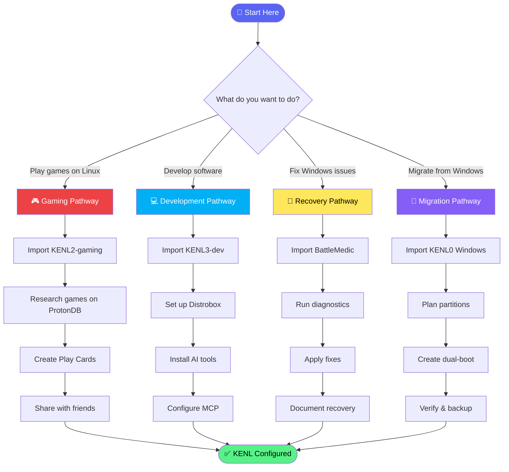

# KENL Getting Started

> **Your first step:** Choose your workflow style, then follow the appropriate setup path.

---

## 🎯 Choose Your Workflow

KENL supports two primary workflows:

### 🤖 AI-Assisted Workflow (Claude Code, Cursor, Copilot)
**Best for:** Users working with AI coding assistants
- **Tools:** Obsidian (optional) + context-sync MCP server
- **Benefit:** Persistent AI memory across chat sessions
- **Setup:** [Option A below](#option-a-ai-assisted-with-obsidian-optional)

### 🧑 Self-Propelled Workflow (Direct file editing)
**Best for:** Users who prefer traditional text editors
- **Tools:** Any text editor (VS Code, Vim, Nano, Notepad++)
- **Benefit:** Lightweight, no additional dependencies
- **Setup:** [Option B below](#option-b-self-propelled-workflow)

---

## Option A: AI-Assisted (with Obsidian - Optional)

This workflow uses Obsidian for documentation navigation (optional) and context-sync for AI memory persistence.

### When to use Obsidian:
- ✅ You want visual documentation navigation
- ✅ You use graph views and bidirectional linking
- ✅ You work with multiple interconnected documents

### When to skip Obsidian:
- ❌ You prefer terminal-based workflows
- ❌ You already use VS Code or another editor
- ❌ You want minimal dependencies

By the end, you'll have a personalized, documented, rollback-safe system tailored to YOUR needs.

---

### Step 1A: Install Obsidian (Optional)

**Skip this step if you prefer using your existing text editor.**

#### Linux (Bazzite/Fedora)

```bash
# Flatpak (recommended for immutable systems)
flatpak install flathub md.obsidian.Obsidian -y

# Grant home directory access
flatpak override md.obsidian.Obsidian --filesystem=home --user
```

#### Windows

```powershell
# Option 1: Winget (Windows 11)
winget install Obsidian.Obsidian

# Option 2: Chocolatey
choco install obsidian -y

# Option 3: Direct download
Start-Process "https://obsidian.md/download"
```

### Step 1B: Install context-sync (for AI memory)

```bash
# Install context-sync MCP server globally
npm install -g @context-sync/server

# Verify installation
context-sync --version
```

See [modules/KENL3-dev/context-sync/README.md](modules/KENL3-dev/context-sync/README.md) for detailed setup.

---

## Option B: Self-Propelled Workflow

This workflow uses standard text editors and file navigation.

### Step 1B: Choose Your Editor

Any of these work great with KENL:

| Editor | Best For | Installation |
|--------|----------|--------------|
| **VS Code** | Feature-rich IDE | `winget install Microsoft.VisualStudioCode` |
| **Vim/Neovim** | Terminal power users | Pre-installed on Linux |
| **Nano** | Simple terminal editing | Pre-installed on Linux |
| **Notepad++** | Windows lightweight | `winget install Notepad++.Notepad++` |
| **Sublime Text** | Fast, minimalist | `winget install SublimeText.SublimeText` |

**Recommendation:** VS Code provides excellent Markdown preview and Git integration.

### Step 1B Alternative: Browser-Based Documentation

You can also navigate KENL documentation directly on GitHub without any local tools:
- Browse: https://github.com/toolate28/kenl
- Navigate modules using web interface
- Use GitHub's Markdown rendering

---

## Step 2: Clone KENL Repository (Both Workflows)

```bash
# Clone to standard location
git clone https://github.com/toolate28/kenl.git ~/.kenl

# Or on Windows
git clone https://github.com/toolate28/kenl.git $env:USERPROFILE\.kenl
```

---

## Step 3: Setup Your Workspace

### For AI-Assisted Workflow (with Obsidian):

#### Option 3A: Use KENL Directory as Vault (Recommended)

1. Open Obsidian
2. Click **"Open folder as vault"**
3. Navigate to `~/.kenl` (or `%USERPROFILE%\.kenl` on Windows)
4. Click **Open**

#### Option 3B: Create Separate Vault with Links

```bash
# Create vault with standard structure
mkdir -p ~/.kenl-vault/{00-Dashboard,01-ATOM-Trails,02-Modules,03-Playcards,04-Archives}

# Create symlinks to KENL documentation
ln -s ~/.kenl/modules ~/.kenl-vault/02-Modules/kenl-modules
ln -s ~/.kenl/claude-landing ~/.kenl-vault/00-Dashboard/claude-landing
```

### For Self-Propelled Workflow:

Simply open the cloned repository in your preferred editor:

```bash
# VS Code
code ~/.kenl

# Or navigate in terminal
cd ~/.kenl
ls -la  # View all files

# View README
cat README.md
# Or with pager
less README.md
```

**Navigation Tips:**
- Start with `README.md` for overview
- Browse `modules/` directory for specific functionality
- Check `claude-landing/DOCUMENTATION-PATHWAYS.md` for guided paths
- View Play Cards in `modules/KENL2-gaming/play-cards/`

---

## Step 4: Enable Essential Plugins

Open Obsidian Settings → Community Plugins → Browse:

| Plugin | Purpose | Required |
|--------|---------|----------|
| **Dataview** | Query ATOM trails and Play Cards | ✅ Yes |
| **Templater** | ATOM tag templates | ✅ Yes |
| **Calendar** | Timeline view of work | Optional |
| **Kanban** | Task management | Optional |

---

## Step 5: Select Your Pathway

### 🎮 Gaming Pathway
**For:** Linux gaming, Play Cards, Proton optimization

```
Import: modules/KENL2-gaming/README.md
Then:   Follow gaming setup checklist
Result: Shareable game configs with performance metrics
```

**Quick start:**
- [ ] Import KENL2-gaming README
- [ ] Research your first game: `./research-game.sh "Game Name"`
- [ ] Create Play Card: `./create-playcard.sh "Game Name"`
- [ ] Apply and verify

---

### 💻 Development Pathway
**For:** Claude Code, Ollama/Qwen, MCP integration, Distrobox

```
Import: modules/KENL3-dev/README.md
Then:   Follow dev environment setup
Result: AI-assisted development with full ATOM traceability
```

**Quick start:**
- [ ] Import KENL3-dev README
- [ ] Set up Distrobox: `distrobox create -n kenl-dev -i ubuntu:24.04`
- [ ] Install Claude Code or Ollama
- [ ] Configure MCP servers

---

### 🔧 System Recovery Pathway
**For:** Windows recovery, Surface Pro 4, system diagnostics

```
Import: modules/Surface_Pro_4_EoL_BattleMedic_v2.1/BattleMedic-Complete-Manual.md
Then:   Follow initialization checklist in document
Result: Automated system recovery with SAIF logging
```

**Quick start:**
- [ ] Import BattleMedic manual
- [ ] Run: `Import-Module BattleMedic`
- [ ] Initialize: `Initialize-BattleMedic`
- [ ] Diagnose: `Get-BattleMedicDiagnostic -Quick`

---

### 🚀 Migration Pathway
**For:** Windows 10 EOL migration, dual-boot setup

```
Import: modules/KENL0-system/windows-support/README.md
Then:   Follow partition workflow
Result: Safe dual-boot with rollback capability
```

**Quick start:**
- [ ] Import KENL0 Windows support docs
- [ ] Review workflow: `scripts/windows-partition-scripts/WORKFLOW_DIAGRAM.md`
- [ ] Follow STEP1 → STEP2 → STEP3 sequence

---

## Step 6: Install PowerShell Profile (Optional)

For dynamic banners and current playcard display:

```powershell
# Import KENL profile functions
. ~/.kenl/scripts/Install-KenlProfile.ps1

# Or manually add to $PROFILE:
notepad $PROFILE
```

Add this to your profile for automatic KENL integration:

```powershell
# KENL Profile Integration
$env:KENL_HOME = "$env:USERPROFILE\.kenl"
Import-Module "$env:KENL_HOME\modules\KENL0-system\powershell\KENL.psm1" -ErrorAction SilentlyContinue
Import-Module "$env:KENL_HOME\modules\KENL0-system\powershell\KENL.SAIF.psm1" -ErrorAction SilentlyContinue

# Show current context on shell start
if (Get-Command Show-KenlBanner -ErrorAction SilentlyContinue) {
    Show-KenlBanner
}
```

---

## What Happens Next

After selecting your pathway:

1. **Guided import** - Each pathway imports only the modules you need
2. **Verification** - Scripts run to ensure your environment is ready
3. **AI injection points** - Optimal points to add Claude Code or GitHub Copilot
4. **Checkpoints** - SAIF flags mark your progress for resumption

---

## Pathway Decision Tree



---

## ATOM Trail

This file initiates your ATOM trail. Every action you take from here is logged:

```
ATOM-DOC-20251126-001: Started KENL setup (this file imported)
ATOM-PATHWAY-YYYYMMDD-NNN: Selected [Gaming|Dev|Recovery|Migration] pathway
ATOM-MODULE-YYYYMMDD-NNN: Imported module X
ATOM-VERIFY-YYYYMMDD-NNN: Verified module X working
```

---

## Quick Reference

| Command | Purpose |
|---------|---------|
| `Show-KenlBanner` | Display current context and playcard |
| `Get-KenlInfo` | Show KENL system status |
| `Get-AtomTrail -Last 10` | View recent ATOM entries |
| `New-SAIFFlag` | Create checkpoint flag |
| `Show-SAIFTrail` | View SAIF progress |

---

## Need Help?

- **AI Agents:** Start with `claude-landing/CURRENT-STATE.md`
- **Documentation:** Check module-specific READMEs
- **Issues:** [GitHub Issues](https://github.com/toolate28/kenl/issues)
- **Security:** See [SECURITY.md](./SECURITY.md)

---

**Next Step:** Select your pathway above and follow the checklist!

---

**ATOM:** ATOM-DOC-20251126-001
**SAIF:** SAIF-INIT-20251126-001
**Created:** 2025-11-26
