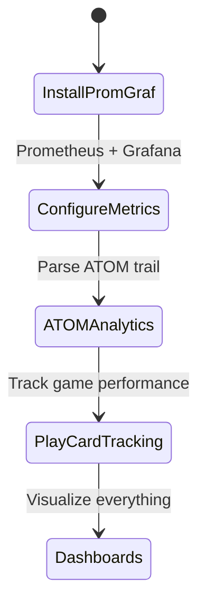
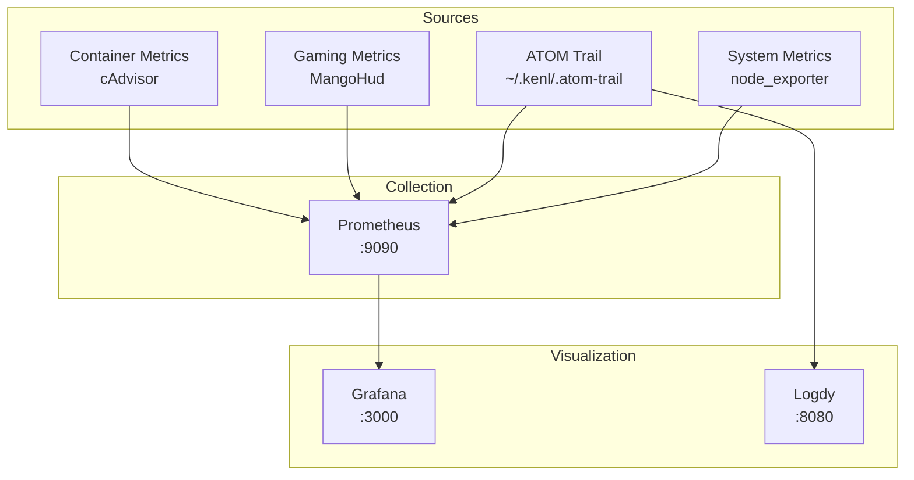

# KENL4: Monitoring & Observability

**Icon:** 📊 | **Color:** Yellow | **Status:** Beta

System performance tracking, ATOM trail analytics, Play Card metrics, and observability dashboards.

## Quick Start

```bash
# Setup monitoring stack
cd ~/kenl/KENL4-monitoring
./setup-monitoring.sh

# View ATOM trail analytics
atom-analytics --summary

# Switch to monitoring context
cd ~/kenl/KENL5-facades
./switch-kenl.sh monitoring
```

**What changes:**



| Before | After |
|--------|-------|
| No visibility into system performance | Real-time metrics |
| Manual ATOM trail analysis | Automated analytics |
| No Play Card performance tracking | FPS/frame time graphs |

---

## Features

- 📈 **Prometheus Metrics**: System, gaming, container metrics
- 📊 **Grafana Dashboards**: Pre-built dashboards for Bazzite
- 🔍 **ATOM Trail Analytics**: Query and visualize ATOM operations
- 🎮 **Play Card Performance Tracking**: FPS, frame time, GPU usage per config
- 📝 **Logdy Integration**: Log analysis and visualization
- 🚨 **Alerting**: Proactive notifications for issues

---

## Directory Structure

```
KENL4-monitoring/
├── prometheus/              # Prometheus configuration
│   ├── prometheus.yml       # Main config
│   ├── rules/               # Alert rules
│   └── exporters/           # Custom exporters
├── grafana/                 # Grafana dashboards
│   ├── dashboards/          # Pre-built dashboards
│   │   ├── bazzite-system.json
│   │   ├── gaming-performance.json
│   │   ├── atom-trail.json
│   │   └── play-cards.json
│   └── provisioning/        # Auto-provisioning configs
├── logdy/                   # Logdy log viewer
│   └── config.yaml
├── atom-trail-analytics/    # ATOM trail analysis tools
│   ├── atom-to-metrics.sh   # Convert ATOM trail to metrics
│   ├── queries/             # Common analytics queries
│   └── reports/             # Generated reports
├── play-card-tracking/      # Play Card performance tracking
│   ├── track-session.sh     # Track gaming session
│   ├── export-metrics.sh    # Export to Prometheus
│   └── compare.sh           # Compare Play Card performance
└── setup-monitoring.sh      # Main setup script
```

---

## Monitoring Stack

### Architecture



### Installation

```bash
# Install monitoring stack
./setup-monitoring.sh

# What it installs:
# - Prometheus (distrobox container)
# - Grafana (distrobox container)
# - node_exporter (system metrics)
# - cAdvisor (container metrics)
# - Logdy (log viewer)
# - ATOM trail analytics tools
```

**Services:**
- **Prometheus**: http://localhost:9090
- **Grafana**: http://localhost:3000 (admin/admin)
- **Logdy**: http://localhost:8080
- **node_exporter**: http://localhost:9100/metrics

---

## Dashboards

### 1. Bazzite System Dashboard

**File:** `grafana/dashboards/bazzite-system.json`

**Metrics:**
- CPU usage (per core)
- Memory usage (host + containers)
- Disk I/O (NVMe, SATA, external)
- Network traffic
- rpm-ostree deployment info
- GPU utilization (NVIDIA/AMD)

**Screenshot:**
```
┌──────────────────────────────────────┐
│ CPU: 15% │ RAM: 8.2/32GB │ GPU: 45% │
├──────────────────────────────────────┤
│ [████░░░░░░] CPU 1-8                │
│ [███████░░░] Memory                 │
│ [█████░░░░░] GPU VRAM (4.1/12GB)    │
├──────────────────────────────────────┤
│ Deployment: bazzite:41.20251110.0   │
│ Uptime: 3 days, 14 hours            │
└──────────────────────────────────────┘
```

### 2. Gaming Performance Dashboard

**File:** `grafana/dashboards/gaming-performance.json`

**Metrics:**
- FPS (avg, 1% low, 0.1% low)
- Frame time (ms)
- GPU usage + temperature
- CPU usage per game
- VRAM usage
- Proton version correlation

**Per-game breakdown:**
```
Game: Halo Infinite (Play Card: halo-ge918)
├─ FPS avg: 118 (target: 144)
├─ 1% low: 95 FPS
├─ Frame time: 8.5ms avg
├─ GPU: 87% (72°C)
└─ Proton: GE-Proton 9-18
```

### 3. ATOM Trail Dashboard

**File:** `grafana/dashboards/atom-trail.json`

**Visualizations:**
- Operations over time (by type)
- Most frequent operations
- Error rate
- Recovery events
- Operation duration

**Example queries:**
```
# Operations per day
count_over_time({job="atom_trail"}[1d])

# Error rate
sum(rate(atom_errors_total[5m])) / sum(rate(atom_operations_total[5m]))

# Recovery time
histogram_quantile(0.95, rate(atom_recovery_duration_seconds_bucket[5m]))
```

### 4. Play Card Performance Comparison

**File:** `grafana/dashboards/play-cards.json`

**Comparisons:**
- Before/after Proton version change
- Different launch options
- NVIDIA vs AMD performance
- Native vs Proton

**Example:**
```
Halo Infinite: GE-Proton 9-18 vs 9-19
├─ 9-18: 118 FPS avg, 8.5ms frame time
├─ 9-19: 125 FPS avg, 8.0ms frame time
└─ Winner: 9-19 (+5.9% FPS, -5.9% frame time)
```

---

## ATOM Trail Analytics

### Querying the ATOM Trail

```bash
# View all operations
atom-analytics --list

# Search by type
atom-analytics --search DEPLOY

# Search by date
atom-analytics --since 2025-11-01

# Generate summary report
atom-analytics --summary > report.txt
```

### Converting to Prometheus Metrics

```bash
cd ~/kenl/KENL4-monitoring/atom-trail-analytics

# Convert ATOM trail to metrics
./atom-to-metrics.sh

# Metrics exported to:
# http://localhost:9091/metrics
```

**Metrics exported:**
```
# HELP atom_operations_total Total ATOM operations by type
# TYPE atom_operations_total counter
atom_operations_total{type="DEPLOY"} 47
atom_operations_total{type="CONFIG"} 152
atom_operations_total{type="SAGE"} 23

# HELP atom_recovery_events_total Total recovery events
# TYPE atom_recovery_events_total counter
atom_recovery_events_total 3

# HELP atom_operation_duration_seconds Operation duration
# TYPE atom_operation_duration_seconds histogram
atom_operation_duration_seconds_bucket{type="DEPLOY",le="1"} 12
atom_operation_duration_seconds_bucket{type="DEPLOY",le="5"} 35
```

---

## Play Card Performance Tracking

### Tracking a Gaming Session

```bash
cd ~/kenl/KENL4-monitoring/play-card-tracking

# Start tracking (auto-detects MangoHud)
./track-session.sh "Halo Infinite" halo-ge918.yaml

# Play game...
# MangoHud metrics automatically collected

# Stop tracking (Ctrl+C or game exit)
# Metrics saved to: ~/.kenl/play-card-metrics/halo-ge918-20251110.json
```

**Collected metrics:**
```json
{
  "playcard": "halo-ge918.yaml",
  "game": "Halo Infinite",
  "timestamp": "2025-11-10T15:30:00Z",
  "duration_minutes": 120,
  "metrics": {
    "fps_avg": 118.4,
    "fps_1_percent_low": 95.2,
    "fps_0_1_percent_low": 87.6,
    "frame_time_avg_ms": 8.45,
    "gpu_usage_avg": 87,
    "gpu_temp_avg": 72,
    "cpu_usage_avg": 45,
    "vram_usage_avg_gb": 4.1
  },
  "proton_version": "GE-Proton 9-18"
}
```

### Comparing Play Cards

```bash
# Compare two Play Card sessions
./compare.sh halo-ge918-20251110.json halo-ge919-20251111.json

# Output:
# ┌─────────────────────────────────────────┐
# │ Halo Infinite Performance Comparison    │
# ├─────────────────────────────────────────┤
# │ Metric          │ GE-918  │ GE-919  │ Δ  │
# ├─────────────────────────────────────────┤
# │ FPS avg         │ 118.4   │ 125.1   │+6% │
# │ 1% low          │ 95.2    │ 98.7    │+4% │
# │ Frame time (ms) │ 8.45    │ 8.00    │-5% │
# │ GPU usage       │ 87%     │ 89%     │+2% │
# └─────────────────────────────────────────┘
```

### Exporting to Prometheus

```bash
# Export all Play Card metrics to Prometheus
./export-metrics.sh

# Creates time-series metrics:
# playcard_fps_avg{game="Halo Infinite", proton="GE-9-18"} 118.4
# playcard_frame_time_ms{game="Halo Infinite", proton="GE-9-18"} 8.45
```

---

## Logdy Log Viewer

**Logdy** is a web-based log viewer for real-time log analysis.

### Setup

```bash
# Install Logdy
cd ~/kenl/KENL4-monitoring/logdy

# Run Logdy
logdy web --port 8080 ~/.kenl/.atom-trail

# Open browser: http://localhost:8080
```

### Features

- **Real-time tailing**: Watch ATOM trail live
- **Filtering**: Regex, keyword, date range
- **Highlighting**: Color-code by operation type
- **Export**: Save filtered logs as JSON/CSV

**Example filters:**
```
# Show only DEPLOY operations
/ATOM-DEPLOY-/

# Show errors
/ERROR|FAIL/

# Show last 7 days
since:7d

# Combine filters
/DEPLOY/ since:7d
```

---

## Alerting

### Prometheus Alert Rules

**File:** `prometheus/rules/alerts.yml`

```yaml
groups:
  - name: system
    rules:
      - alert: HighCPUUsage
        expr: 100 - (avg by (instance) (irate(node_cpu_seconds_total{mode="idle"}[5m])) * 100) > 80
        for: 5m
        annotations:
          summary: "High CPU usage detected"

      - alert: LowDiskSpace
        expr: (node_filesystem_avail_bytes / node_filesystem_size_bytes) * 100 < 10
        for: 5m
        annotations:
          summary: "Less than 10% disk space remaining"

  - name: gaming
    rules:
      - alert: LowFPS
        expr: playcard_fps_avg < 30
        for: 1m
        annotations:
          summary: "Game FPS dropped below 30"

  - name: atom
    rules:
      - alert: ATOMRecoveryEvent
        expr: increase(atom_recovery_events_total[1h]) > 0
        annotations:
          summary: "ATOM recovery event occurred"
```

### Notification Channels

Configure in Grafana:
- **Email**: Send to admin@example.com
- **Discord**: Webhook to #monitoring channel
- **Matrix**: Send to @user:matrix.org

---

## MangoHud Integration

### Enabling Metric Export

**Edit** `~/.config/MangoHud/MangoHud.conf`:

```ini
[mangohud]
fps_limit=0
vsync=0
fps_sampling_period=1000

# Export metrics
output_folder=/home/user/.kenl/play-card-metrics
autostart_log=1
log_duration=0  # Infinite
log_interval=1000  # 1 second

# Metrics to log
cpu_stats
gpu_stats
ram
vram
fps
frametime
```

**Result:** MangoHud creates CSV files that `track-session.sh` automatically parses.

---

## AI Integration Levels

(See also: [AI-INTEGRATION-GUIDE.md](../AI-INTEGRATION-GUIDE.md))

### KENL4 AI Usage: 🟧 Recommended

**What AI helps with:**
- Query optimization (PromQL)
- Dashboard creation (Grafana JSON)
- Alert rule tuning
- Performance analysis
- Anomaly detection

**Example AI workflow:**
```
User: "Create a Grafana dashboard showing FPS over time per game"

AI: "I'll create a Grafana dashboard JSON with a time-series panel:

{
  "panels": [
    {
      "title": "FPS by Game",
      "targets": [
        {
          "expr": "playcard_fps_avg{game=~\"$game\"}"
        }
      ]
    }
  ]
}

Save this to grafana/dashboards/fps-per-game.json"
```

---

## Dependencies

**Requires:**
- **KENL1** (framework): ATOM trail for analytics
- **KENL3** (dev): Distrobox for Prometheus/Grafana containers

**Used by:**
- **KENL2** (gaming): Play Card performance tracking
- **KENL10** (backup): Monitoring backup job success rates

**Optional:**
- **KENL11** (media): Monitor Radarr/Sonarr/qBittorrent metrics

---

## Common Workflows

### 1. Initial Monitoring Setup

```bash
# Install monitoring stack
./setup-monitoring.sh

# Access Grafana
xdg-open http://localhost:3000

# Login: admin/admin
# Change password
# Import pre-built dashboards
```

### 2. Track Play Card Performance

```bash
# Before playing
cd ~/kenl/KENL4-monitoring/play-card-tracking
./track-session.sh "Elden Ring" elden-ring-ge918.yaml

# Play game for 2 hours

# Stop tracking
# Metrics automatically saved

# Compare with previous session
./compare.sh elden-ring-ge918-20251109.json elden-ring-ge918-20251110.json
```

### 3. Analyze ATOM Trail

```bash
# Generate weekly report
atom-analytics --since 7d --summary > weekly-report.txt

# Search for deployments
atom-analytics --search DEPLOY

# View recovery events
atom-analytics --search SAGE | grep recovery
```

### 4. Create Custom Dashboard

```bash
# Use AI to generate dashboard JSON
claude code

# Prompt:
# "Create a Grafana dashboard showing:
# 1. CPU usage per distrobox container
# 2. GPU temperature
# 3. FPS for the last 3 gaming sessions"

# AI generates JSON
# Save to grafana/dashboards/custom.json

# Reload Grafana to see new dashboard
```

---

## Troubleshooting

### Prometheus not starting

```bash
# Check config syntax
promtool check config prometheus/prometheus.yml

# Check logs
journalctl -u prometheus -f
```

### Grafana dashboards not loading

```bash
# Check provisioning directory permissions
chmod -R 755 grafana/dashboards/

# Restart Grafana
systemctl restart grafana
```

### MangoHud metrics not appearing

```bash
# Verify MangoHud installed
mangohud --version

# Check config file exists
ls ~/.config/MangoHud/MangoHud.conf

# Test with simple game
mangohud glxgears
```

### ATOM trail analytics empty

```bash
# Check ATOM trail exists
ls -lh ~/.kenl/.atom-trail

# Verify ATOM framework installed
which atom

# Generate test operation
atom STATUS "Test operation for monitoring"
```

---

## Navigation

- **← [Root README](../README.md)**: Overview of all KENL modules
- **→ [KENL1: Framework](../KENL1-framework/README.md)**: ATOM trail source
- **→ [KENL2: Gaming](../KENL2-gaming/README.md)**: Play Card performance
- **→ [KENL3: Dev](../KENL3-dev/README.md)**: Development dashboards

---

**Status**: Beta | **Icon**: 📊 | **AI Level**: 🟧 Recommended
