# KENL7: Learning - Tutorials & Walkthroughs

**Version:** 1.0.0
**Target Platform:** Bazzite & Linux
**Status:** Production Ready
**Focus:** Curated tutorials for common admin/management tasks

---

## Overview

KENL7 is your **learning hub** for tasks that don't have great Bazzite-specific or gaming-centric documentation. Instead of searching Stack Overflow for hours, find curated tutorials, walkthroughs, and examples here.

**Topics covered:**
- 📚 GitHub workflows & git fundamentals
- 🔧 rpm-ostree & Bazzite system management
- 🔐 GPG & SSH key management
- 💾 Backup & recovery strategies
- 🐧 Common Linux admin tasks
- 🎮 Gaming-specific configurations
- 🔒 Security best practices
- 📊 Monitoring & diagnostics

---

## Quick Navigation

| Topic | Description | Link |
|-------|-------------|------|
| **GitHub** | Git basics, workflows, PR creation | [↓ GitHub](#github-workflows) |
| **rpm-ostree** | Bazzite management, rebasing, rollback | [↓ Bazzite](#rpm-ostree--bazzite-management) |
| **GPG Keys** | Encryption, key management, vault integration | [↓ GPG](#gpg-key-management) |
| **SSH Keys** | Generate, deploy, agent management | [↓ SSH](#ssh-key-management) |
| **Backups** | Strategies, tools, automation | [↓ Backup](#backup--recovery) |
| **Containers** | Distrobox, Docker, management | [↓ Containers](#container-management) |
| **Monitoring** | System health, performance tracking | [↓ Monitoring](#system-monitoring) |
| **Gaming** | Proton, DXVK, performance tuning | [↓ Gaming](#gaming-configuration) |

---

## GitHub Workflows

### Git Basics

```bash
# First-time setup
git config --global user.name "Your Name"
git config --global user.email "you@example.com"
```

**What this does:**
| Command | Purpose | Stored in |
|---------|---------|-----------|
| `user.name` | Author name in commits | `~/.gitconfig` |
| `user.email` | Author email in commits | `~/.gitconfig` |

**Why:** Every commit needs an author. These settings apply globally to all repos.

---

### Creating a Pull Request

```bash
# 1. Create feature branch
git checkout -b feat/my-feature

# 2. Make changes, commit
git add .
git commit -m "feat: add awesome feature"

# 3. Push to remote
git push -u origin feat/my-feature
```

**What changes:**


**GitHub workflow:**
1. **Local**: Create branch, commit changes
2. **Push**: `git push -u origin feat/my-feature`
3. **GitHub**: Create PR from branch
4. **Review**: Team reviews code
5. **Merge**: PR merged to main

**Common mistakes:**
```diff
- git push origin main  # ❌ Pushes directly to main (often blocked)
+ git push -u origin feat/my-feature  # ✅ Pushes to feature branch

- git commit -m "stuff"  # ❌ Vague commit message
+ git commit -m "feat: add user authentication"  # ✅ Conventional Commits
```

**Tutorials:**
- [GitHub Flow](https://docs.github.com/en/get-started/quickstart/github-flow) (Official)
- [Conventional Commits](https://www.conventionalcommits.org/) (Standard)
- KENL example: [`CONTRIBUTING.md`](../CONTRIBUTING.md)

---

### Handling Merge Conflicts

```bash
# Pull latest main
git checkout main
git pull origin main

# Rebase your branch onto main
git checkout feat/my-feature
git rebase main
```

**Conflict resolution flow:**


**Conflict markers:**
```diff
<<<<<<< HEAD (your changes)
const version = "2.0.0";
=======
const version = "1.5.0";
>>>>>>> main (their changes)
```

**Resolution:**
```diff
- <<<<<<< HEAD
- const version = "2.0.0";
- =======
- const version = "1.5.0";
- >>>>>>> main
+ const version = "2.0.0";  # Keep your version (or merge both)
```

**Then:**
```bash
git add file.js
git rebase --continue
git push --force-with-lease origin feat/my-feature
```

**Why `--force-with-lease`:** Rewrites history safely (fails if someone else pushed).

---

## rpm-ostree & Bazzite Management

### Understanding rpm-ostree

**What is rpm-ostree?**
Bazzite uses an **immutable** base system:
- System packages managed by rpm-ostree (atomic updates)
- User apps installed via Flatpak or containers
- Rollback to previous version in <2 minutes


**Advantages:**
- ✅ Atomic updates (all or nothing)
- ✅ Instant rollback (boot previous deployment)
- ✅ No dependency hell
- ✅ Signed, verified packages

**Disadvantages:**
- ❌ Can't install system packages with `dnf/apt` directly
- ❌ Layered packages increase deployment size
- ❌ Some software requires containers (distrobox)

---

### Common rpm-ostree Operations

#### Check System Status

```bash
rpm-ostree status
```

**Output explained:**
```
State: idle
Deployments:
● bazzite:bazzite/stable/x86_64/desktop    ← Current (●)
      Version: 41.20251110.0 (2025-11-10)
      Commit: c682e1345...
    Diff: 12 added

  bazzite:bazzite/stable/x86_64/desktop    ← Rollback (no ●)
      Version: 40.20251001.0 (2025-10-01)
      Commit: 933e6ba...
```

| Symbol | Meaning |
|--------|---------|
| ● | Currently booted deployment |
| (none) | Available for rollback |
| `Diff: 12 added` | Layered packages (added to base) |

---

#### Update System

```bash
rpm-ostree upgrade
```

**What happens:**


```mermaid
sequenceDiagram
    participant User
    participant rpm-ostree
    participant Registry
    participant System

    User->>rpm-ostree: rpm-ostree upgrade
    rpm-ostree->>Registry: Check for updates
    Registry-->>rpm-ostree: New deployment available
    rpm-ostree->>rpm-ostree: Download deployment
    rpm-ostree->>System: Create new deployment
    rpm-ostree->>System: Keep current as rollback
    rpm-ostree-->>User: ✅ Reboot to activate

    Note over User,System: Current deployment stays active until reboot
```

**After upgrade:**
```diff
Deployments:
+ bazzite:stable 41.20251110.0 [pending - reboot required]
● bazzite:stable 40.20251001.0 [current]
- (old deployment removed)
```

---

#### Rollback to Previous Version

```bash
rpm-ostree rollback
```

**What changes:**
```
Before rollback:
● bazzite:stable 41.20251110.0 [current - has GPU driver bug]
  bazzite:stable 40.20251001.0 [rollback target]

After rollback:
  bazzite:stable 41.20251110.0 [available]
● bazzite:stable 40.20251001.0 [current - back to working]
```

**Why rollback:** If update breaks GPU driver, WiFi, or gaming, rollback to working state.

**KENL0 integration:**
```bash
kenl-switch 0
emergency-rollback  # KENL0 function: rollback + reboot automatically
```

---

#### Layer Additional Packages

```bash
# Install package to base system (use sparingly!)
rpm-ostree install <package>

# Example: Install development tools
rpm-ostree install gcc make
```

**What happens:**
```diff
Base deployment: 12,847 packages
+ Layered packages: gcc, make, binutils, glibc-devel (15 packages)
= Total deployment: 12,862 packages

Deployment size:
- Without layered: 4.2GB
+ With layered: 4.5GB (+300MB)
```

**Alternatives (preferred):**
| Method | Use case | Example |
|--------|----------|---------|
| **Flatpak** | GUI apps | `flatpak install org.mozilla.Firefox` |
| **Distrobox** | Dev tools | `distrobox enter ubuntu-dev`, then `apt install gcc` |
| **Homebrew** | CLI tools | `brew install gh` |
| **rpm-ostree layer** | System-level tools | `rpm-ostree install kernel-modules-extra` |

**Why avoid layering:** Increases deployment size, slows updates, breaks immutability.

---

### Bazzite-Specific Management

#### ujust Quick Actions

```bash
ujust
```

**Common recipes:**
```
┌────────────────────────────────────────────────────┐
│ Bazzite Quick Actions (ujust)                     │
├────────────────────────────────────────────────────┤
│ update                  Update system              │
│ rebase-stable           Rebase to stable           │
│ install-proton-ge       Install Proton GE          │
│ nvidia-cache-clear      Clear NVIDIA cache         │
│ setup-decky             Install Decky Loader       │
│ install-sunshine        Install game streaming     │
│ regenerate-grub         Regenerate GRUB config     │
└────────────────────────────────────────────────────┘
```

**KENL0 integration:**
```bash
kenl-switch 0
qa-ujust  # KENL0 wrapper: ujust with ATOM trail logging
```

---

## GPG Key Management

### What is GPG?

**GPG (GNU Privacy Guard):** Encryption tool for:
- 🔐 Encrypting files
- ✍️ Signing commits (GitHub verified badge)
- 🔑 Secure password management
- 📧 Email encryption

---

### Generate GPG Key

```bash
gpg --full-generate-key
```

**Interactive prompts:**
```
gpg (GnuPG) 2.4.3; Copyright (C) 2023 g10 Code GmbH

Please select what kind of key you want:
   (1) RSA and RSA
   (4) ECDSA and ECDH (default)
Your selection: 4

What keysize do you want? (256)
Requested keysize is 256 bits
Please specify how long the key should be valid.
         0 = key does not expire
      <n>  = key expires in n days
Key is valid for? (0) 0

Real name: Bazza
Email address: bazza@example.com
Comment: Gaming rig key

You selected this USER-ID:
    "Bazza (Gaming rig key) <bazza@example.com>"

Change (N)ame, (C)omment, (E)mail or (O)kay/(Q)uit? O
```

**What gets created:**
```
~/.gnupg/
├── pubring.kbx    # Public keys (can share)
├── secring.gpg    # Private keys (NEVER share!)
└── trustdb.gpg    # Trust database
```

**Key components:**
| Part | Purpose | Share? |
|------|---------|--------|
| **Public key** | Others use to encrypt messages to you | ✅ Yes |
| **Private key** | You use to decrypt messages | ❌ NEVER |
| **Fingerprint** | Unique ID (40 hex chars) | ✅ Yes |

---

### Export Public Key

```bash
# Get your key ID
gpg --list-secret-keys --keyid-format LONG

# Output:
sec   ed25519/ABC123DEF456 2025-11-10 [SC]
      1234567890ABCDEF1234567890ABCDEF12345678
uid           Bazza (Gaming rig key) <bazza@example.com>
```

**Key ID:** `ABC123DEF456` (after `ed25519/`)

```bash
# Export public key
gpg --armor --export ABC123DEF456 > public-key.asc
```

**public-key.asc content:**
```
-----BEGIN PGP PUBLIC KEY BLOCK-----

mQGNBGcwvHoBDAC7Q3... (base64 encoded)
-----END PGP PUBLIC KEY BLOCK-----
```

**Share with:**
- GitHub (for commit signing)
- Friends (for encrypted file sharing)
- Keyservers (public discovery)

---

### Sign Git Commits

```bash
# Configure git to use GPG
git config --global user.signingkey ABC123DEF456
git config --global commit.gpgsign true
```

**What changes:**
```diff
Before:
  commit abc123def
  Author: Bazza <bazza@example.com>
  Date:   2025-11-10

After:
  commit abc123def ✅ (verified)
  Author: Bazza <bazza@example.com>
  Date:   2025-11-10
  GPG Signature: ABC123DEF456
```

**GitHub integration:**
1. Copy public key: `gpg --armor --export ABC123DEF456`
2. GitHub Settings → SSH and GPG keys → New GPG key
3. Paste public key → Add
4. **Result:** GitHub shows "Verified" badge on commits

**Why sign commits:** Proves you wrote the code (not an impersonator).

---

### Encrypt Files

```bash
# Encrypt file
gpg --encrypt --recipient bazza@example.com secret.txt

# Result: secret.txt.gpg (binary)

# Decrypt file
gpg --decrypt secret.txt.gpg > secret.txt
```

**KENL8 integration:**
```bash
kenl-switch 8
encrypt-file secret.txt  # KENL8 wrapper, creates secret.txt.gpg
decrypt-file secret.txt.gpg  # Decrypts back to secret.txt
```

---

## SSH Key Management

### Generate SSH Key

```bash
ssh-keygen -t ed25519 -C "bazza@example.com"
```

**Prompts:**
```
Generating public/private ed25519 key pair.
Enter file in which to save the key (/home/bazza/.ssh/id_ed25519): [Enter]
Enter passphrase (empty for no passphrase): ********
Enter same passphrase again: ********

Your identification has been saved in /home/bazza/.ssh/id_ed25519
Your public key has been saved in /home/bazza/.ssh/id_ed25519.pub
```

**What gets created:**
```
~/.ssh/
├── id_ed25519      # Private key (NEVER share!)
├── id_ed25519.pub  # Public key (share this)
└── known_hosts     # Trusted server fingerprints
```

---

### Add SSH Key to GitHub

```bash
# Copy public key to clipboard
cat ~/.ssh/id_ed25519.pub
```

**Output:**
```
ssh-ed25519 AAAAC3NzaC1lZDI1NTE5AAAAIGq... bazza@example.com
```

**GitHub steps:**
1. GitHub Settings → SSH and GPG keys → New SSH key
2. Title: "Bazzite gaming rig"
3. Key: Paste `ssh-ed25519 AAAAC3...`
4. Add SSH key

**Test:**
```bash
ssh -T git@github.com
```

**Expected output:**
```
Hi Bazza! You've successfully authenticated, but GitHub does not provide shell access.
```

**Why SSH keys:** Password-less git push/pull, more secure than passwords.

---

### SSH Agent (auto-load keys)

```bash
# Start SSH agent
eval "$(ssh-agent -s)"

# Add key to agent
ssh-add ~/.ssh/id_ed25519
```

**What changes:**
```diff
Before:
  git push → Enter passphrase: ********  # Every time!

After:
  git push → (no passphrase prompt)  # Agent remembers
```

**Auto-start on boot:**
Add to `~/.bashrc`:
```bash
if [ -z "$SSH_AUTH_SOCK" ]; then
  eval "$(ssh-agent -s)"
  ssh-add ~/.ssh/id_ed25519 2>/dev/null
fi
```

---

## Backup & Recovery

### Backup Strategies


---

### KENL10 Snapshot

```bash
kenl-switch 10
snapshot-create "before-major-update"
```

**What gets backed up:**
```
Snapshot: before-major-update
├── ATOM trail (1,247 entries, 23MB)
├── Play Cards (23 files, 890KB)
├── KENL configs (89 files, 45MB)
├── System state (rpm-ostree status, flatpak list)
└── Manifest (JSON with timestamp, intent)

Total size: 2.3GB
Location: ~/.local/share/kenl-backups/snapshots/before-major-update/
```

**Recovery:**
```bash
snapshot-restore before-major-update
```

**What gets restored:**
- All KENL configurations
- ATOM trail (know what you were doing)
- Play Cards (game configs)
- System package list (for reinstall reference)

---

### rsync Backup

```bash
# Backup to external drive
rsync -av --delete ~/Documents/ /mnt/backup/documents/
```

**rsync flags:**
| Flag | Meaning |
|------|---------|
| `-a` | Archive mode (preserve permissions, timestamps) |
| `-v` | Verbose (show files) |
| `--delete` | Delete files in destination not in source |

**Visual:**
```mermaid
flowchart LR
    A[~/Documents/<br/>234GB] -->|rsync -av| B[/mnt/backup/documents/<br/>234GB]
    B -.->|Restore| A

    style A fill:#d0ebff,stroke:#228be6
    style B fill:#d3f9d8,stroke:#51cf66
```

**Automation (cron):**
```bash
# Backup daily at 2 AM
crontab -e
```

Add:
```
0 2 * * * rsync -av --delete ~/Documents/ /mnt/backup/documents/
```

---

## Container Management

### Distrobox Basics

**What is Distrobox?**
Containers for development without breaking immutable system.

```bash
# Create Ubuntu container
distrobox create --name ubuntu-dev --image ubuntu:24.04

# Enter container
distrobox enter ubuntu-dev
```

**What changes:**
```diff
Host system (Bazzite):
  rpm-ostree (immutable)
  Fedora packages

+ Container (ubuntu-dev):
  apt package manager
  Ubuntu packages
  Mutable filesystem
```

**Shared directories:**
| Path | Shared? | Why |
|------|---------|-----|
| `/home/` | ✅ Yes | Access your files |
| `/mnt/` | ✅ Yes | External drives |
| `/` | ❌ No | Container-specific |

**Example workflow:**
```bash
# Install Python tools in container (doesn't affect host)
distrobox enter ubuntu-dev
ubuntu-dev$ apt update
ubuntu-dev$ apt install python3-pip python3-venv
ubuntu-dev$ pip install torch numpy pandas

# Files saved to ~/code/ are accessible from host!
```

---

## System Monitoring

### Check Disk Space

```bash
df -h
```

**Output:**
```
Filesystem      Size  Used Avail Use% Mounted on
/dev/nvme0n1p3  698G  234G  464G  34% /
/dev/nvme0n1p1  512M   89M  423M  18% /boot/efi
/dev/sdb1       2.0T  1.2T  800G  60% /mnt/games
```

**Why it matters:**
- / fills up → rpm-ostree can't update
- /boot/efi fills up → can't boot new kernels

**KENL0 cleanup:**
```bash
kenl-switch 0
deep-clean  # Frees 15-30GB
```

---

### Monitor GPU

```bash
# NVIDIA
nvidia-smi

# AMD
radeontop
```

**NVIDIA output:**
```
+-----------------------------------------------------------------------------+
| NVIDIA-SMI 570.86.10    Driver Version: 570.86.10    CUDA Version: 12.6     |
|-------------------------------+----------------------+----------------------+
| GPU  Name        Persistence-M| Bus-Id        Disp.A | Volatile Uncorr. ECC |
|   0  NVIDIA GeForce RTX 3080   On   | 00000000:01:00.0  On |                  N/A |
| 45%   65C    P2    220W / 350W |   8234MiB / 10240MiB |     98%      Default |
+-------------------------------+----------------------+----------------------+
```

**Key metrics:**
| Metric | Value | Meaning |
|--------|-------|---------|
| **Temp** | 65C | GPU temperature |
| **Power** | 220W / 350W | Current / Max power |
| **Memory** | 8234MB / 10240MB | VRAM used / total |
| **Utilization** | 98% | GPU is maxed out (good for gaming!) |

---

## Gaming Configuration

### Proton Version Selection


---

### DXVK Configuration

**What is DXVK?** DirectX → Vulkan translation layer.

**Common settings (`~/.config/dxvk.conf`):**
```ini
# Enable HUD
d3d11.allowTearing = True

# Optimize for NVIDIA
dxgi.numBackBuffers = 3
dxgi.maxFrameLatency = 1

# Enable async shader compilation
dxvk.enableAsync = True
```

**KENL2 integration:**
```bash
kenl-switch 2
apply-playcard.sh game.yaml  # Automatically sets DXVK config
```

---

## Cheatsheets

See [`cheatsheets/`](./cheatsheets/) directory for quick reference:
- [`git-cheatsheet.md`](./cheatsheets/git-cheatsheet.md)
- [`rpm-ostree-cheatsheet.md`](./cheatsheets/rpm-ostree-cheatsheet.md)
- [`gpg-cheatsheet.md`](./cheatsheets/gpg-cheatsheet.md)
- [`ssh-cheatsheet.md`](./cheatsheets/ssh-cheatsheet.md)
- [`distrobox-cheatsheet.md`](./cheatsheets/distrobox-cheatsheet.md)

---

## External Resources

### Official Documentation
- **GitHub**: https://docs.github.com/
- **rpm-ostree**: https://coreos.github.io/rpm-ostree/
- **Bazzite**: https://docs.bazzite.gg/
- **GPG**: https://gnupg.org/documentation/
- **ProtonDB**: https://www.protondb.com/

### Community Guides
- **Universal Blue**: https://universal-blue.org/
- **Fedora Silverblue** (rpm-ostree base): https://docs.fedoraproject.org/en-US/fedora-silverblue/
- **Arch Wiki** (general Linux): https://wiki.archlinux.org/

---

## Directory Structure

```
KENL7-learning/
├── tutorials/                # Step-by-step guides
│   ├── github-workflow.md
│   ├── rpm-ostree-basics.md
│   ├── gpg-setup.md
│   └── ssh-setup.md
├── walkthroughs/             # Real-world scenarios
│   ├── dual-boot-setup.md
│   ├── gaming-optimization.md
│   └── backup-strategy.md
├── examples/                 # Runnable examples
│   ├── backup-script.sh
│   ├── git-hooks/
│   └── dxvk-configs/
├── cheatsheets/              # Quick references
│   ├── git-cheatsheet.md
│   ├── rpm-ostree-cheatsheet.md
│   └── gpg-cheatsheet.md
└── README.md                 # This file
```

---

## Contributing

Found a better tutorial? Have a Bazzite-specific tip? Contributions welcome!

See [CONTRIBUTING.md](../CONTRIBUTING.md) for guidelines.

---

## License

MIT License - See [../LICENSE](../LICENSE)

---

## Navigation

- **← [Root README](../README.md)** - Overview of all KENL modules
- **→ [KENL0: System](../KENL0-system/README.md)** - rpm-ostree operations
- **→ [KENL2: Gaming](../KENL2-gaming/README.md)** - Gaming configs
- **→ [KENL8: Security](../KENL8-security/README.md)** - GPG, encryption

---

**Status**: Production Ready | **Version**: 1.0.0 | **Focus**: Curated Learning Resources
