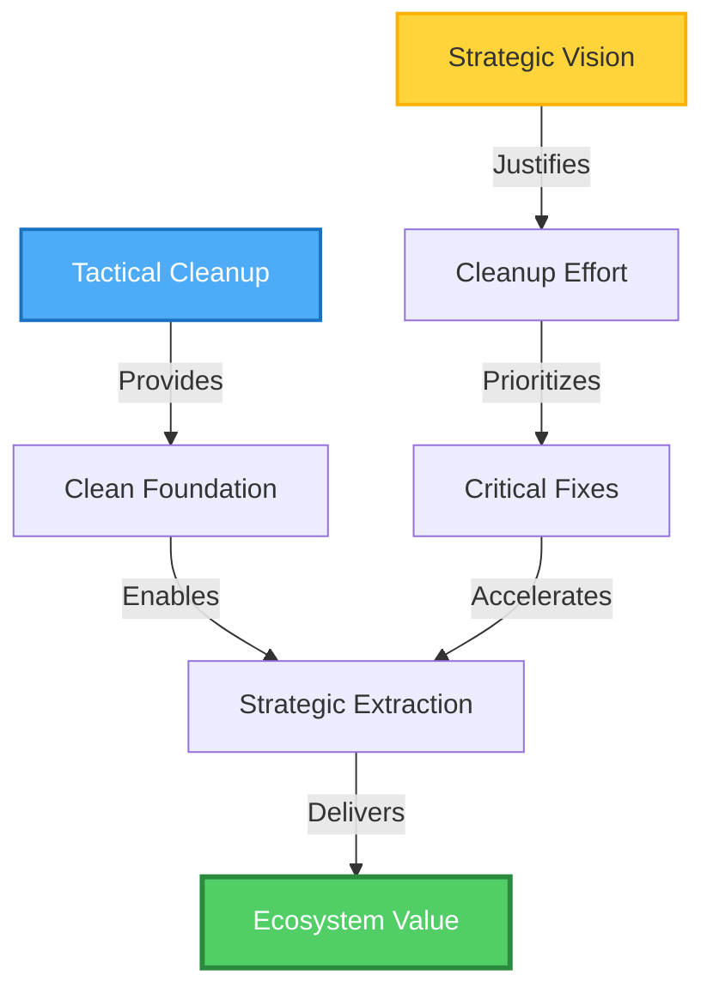

# Prompt Analysis & Optimization

**Purpose:** Analyze two divergent prompts given to parallel AI instances, assess impact, and synthesize optimal prompt design.

---

## Divergent Prompts Analysis

### **Instance A Prompt (Tactical/Cleanup Focus)**

**Prompt Given:**
```
"firstly identify whats no longer necessary/outdated/wrong/etc...
anything that needs to be culled or can be culled that needs review"
```

**Characteristics:**
- **Scope:** Internal housekeeping
- **Timeframe:** Present → immediate fixes
- **Mindset:** Problem detection, error correction
- **Action verbs:** "identify," "cull," "review"
- **Constraint:** "needs to be" → binary decision (keep/remove)

**Output Produced:**
1. AUDIT-FINDINGS-2025-11-16.md
   - 47 issues categorized by severity
   - Duplicate detection
   - Broken structure identification
   - Immediate fix recommendations

2. CLEANUP-EXECUTION-PLAN.md
   - 4 phases with exact commands
   - CTFWI checkpoints
   - Rollback procedures
   - 3-4 hour execution timeline

**Strengths:**
- ✅ Identified concrete, fixable problems
- ✅ Low-risk, high-confidence recommendations
- ✅ Immediately actionable
- ✅ Preserves existing structure

**Limitations:**
- ❌ No strategic vision beyond cleanup
- ❌ Assumes current structure is correct
- ❌ Missed ecosystem opportunity
- ❌ Reactive rather than proactive

---

### **Instance B Prompt (Strategic/Restructuring Focus)**

**Inferred Prompt:**
```
"Review the repository structure and assess potential for extracting
components into standalone projects. Consider broader audience reach
and strategic positioning."
```

**Characteristics:**
- **Scope:** External positioning, market fit
- **Timeframe:** Present → future vision
- **Mindset:** Opportunity discovery, value extraction
- **Action verbs:** "assess," "extract," "position"
- **Constraint:** "potential" → exploratory, creative

**Output Produced:**
1. EXECUTIVE-SUMMARY.md
   - Strategic overview
   - 5 standalone project candidates
   - Audience targeting
   - Business case per project

2. REPOSITORY-RESTRUCTURING-PROPOSAL.md
   - 40+ page detailed analysis
   - Dependency mapping
   - Ecosystem interplay design
   - Success metrics

3. IMPLEMENTATION-ROADMAP.md
   - 10-week phased extraction
   - Per-project timelines
   - CI/CD configurations
   - Package manager strategies

**Strengths:**
- ✅ Strategic vision for ecosystem
- ✅ Audience/market alignment
- ✅ Addresses cousin's 7-8 feedback (universal value)
- ✅ Positions projects for broader adoption

**Limitations:**
- ❌ Assumes clean extraction source
- ❌ Didn't identify duplicates/broken structure
- ❌ Higher execution risk (complexity)
- ❌ Longer timeline (10 weeks vs. days)

---

## Impact Assessment

### **Prompt A Impact (Tactical)**

**What It Revealed:**
1. **Duplicate Content:** ~500KB across 4 major areas
   - atom-sage-framework (2 locations)
   - OWI docs (2 locations)
   - CONTRIBUTING (4 files)
   - ADRs (2 locations)

2. **Structural Issues:**
   - 12 empty MANIFEST templates
   - 29 files with outdated dates
   - 20 files with unresolved TODOs
   - Broken internal links (estimated)

3. **Hidden Costs:**
   - Maintenance burden from duplicates
   - Contributor confusion from multiple sources of truth
   - Documentation drift risk
   - Unclear module boundaries

**Blind Spots:**
- Didn't question whether modules should be separate repos
- Didn't assess audience fit per component
- Didn't consider external value proposition
- Focused on "what's broken" not "what's possible"

---

### **Prompt B Impact (Strategic)**

**What It Revealed:**
1. **Hidden Value:** 5 standalone-worthy projects
   - ATOM+SAGE Framework (universal DevOps tool)
   - Play Cards (Linux gaming community)
   - Media Stack (self-hosting community)
   - PowerShell Modules (cross-platform, PSGallery-ready)
   - IWI Framework (reproducible installs)

2. **Ecosystem Potential:**
   - npm/PyPI/PSGallery presence
   - r/selfhosted, r/linux_gaming reach
   - DevOps community adoption
   - Reduced KENL size (134 MB → ~50 MB)

3. **Strategic Positioning:**
   - Each project targets specific audience
   - Clear value propositions
   - Package manager discoverability
   - Community contribution pathways

**Blind Spots:**
- Assumed extraction source is clean (it's not)
- Didn't detect duplicates that complicate extraction
- Didn't account for broken links propagating to new repos
- Extraction timeline assumes no structural fixes needed

---

## Synthesis: Why Both Were Necessary

### **The Dependency:**



**Tactical cleanup needed because:**
- Can't extract atom-sage-framework cleanly when it exists in 2 locations
- Empty MANIFESTs would propagate to new repos
- Broken links would break across repo boundaries
- Outdated references mislead new users

**Strategic vision needed because:**
- Justifies cleanup effort (not just housekeeping)
- Prioritizes which duplicates matter most
- Identifies what's worth extracting vs. deleting
- Provides success criteria (ecosystem metrics)

**Neither alone is sufficient:**
- Cleanup without vision = wasted effort on wrong things
- Vision without cleanup = extracting broken code

---

## Optimal Prompt Design

### **Synthesized Optimal Prompt**

```markdown
# Repository Deep Analysis & Strategic Optimization

## Context
You are reviewing the KENL repository, a gaming/development platform for Bazzite Linux.
A domain expert (user's cousin) recently rated the atomic logging concept 7-8/10,
noting it has universal value beyond the gaming niche.

## Objectives

### Phase 1: Foundation Analysis (Tactical)
Identify structural issues that would complicate future strategic moves:

1. **Duplicate Detection**
   - Find content that exists in multiple locations
   - Assess which version is canonical
   - Estimate extraction complexity if duplicates exist

2. **Quality Assessment**
   - Outdated references (dates, versions, deprecated patterns)
   - Broken links (internal and external)
   - Incomplete templates or placeholder content
   - TODOs and FIXME markers

3. **Structural Integrity**
   - Module boundaries and dependencies
   - Documentation consistency
   - Single source of truth violations

**Meta-Tracking Requirement:** As you read files, note when understanding shifts:
- "Reading X revealed Y, which changed my assumption about Z"
- "Pattern in A helped me recognize similar issue in B"
- Mark these as `[CONTEXT-UPDATE: ...]` comments

### Phase 2: Strategic Positioning (Vision)
Assess components for standalone potential and audience fit:

1. **Value Extraction**
   - Which components have universal appeal beyond Bazzite?
   - What audiences would each component serve?
   - How does each align with external communities? (r/selfhosted, DevOps, etc.)

2. **Ecosystem Design**
   - If extracted, how would components interoperate?
   - What stays as core platform vs. becomes standalone?
   - Package manager strategies (npm, PyPI, PSGallery, etc.)

3. **Strategic Roadmap**
   - Phased extraction timeline
   - Dependency-aware ordering
   - Risk mitigation per phase

**Meta-Tracking Requirement:** As strategic understanding develops:
- "Earlier finding from Phase 1 (duplicate X) impacts extraction strategy for Y"
- "Context from file A informed audience assessment for component B"
- Mark these as `[CONTEXT-APPLICATION: ...]` comments

### Phase 3: Unified Execution Plan
Synthesize tactical cleanup and strategic vision into coherent roadmap:

1. **Pre-Extraction Cleanup**
   - Which structural issues MUST be fixed before extraction?
   - Which can be deferred?
   - Prioritization based on extraction dependencies

2. **Extraction Sequence**
   - Start with cleaned, consolidated codebase
   - Order extractions by dependency graph
   - Define success criteria per extraction

3. **Continuous Integration**
   - How do extracted projects stay synchronized?
   - Package versioning strategies
   - Breaking change protocols

**Meta-Tracking Requirement:** Synthesis insights:
- "Combining tactical finding X with strategic opportunity Y suggests Z approach"
- "Context accumulated from both phases enabled recognition of optimal path"
- Mark these as `[SYNTHESIS-INSIGHT: ...]` comments

## Output Requirements

### Documents to Produce:

1. **TACTICAL-FINDINGS.md**
   - Structural issues (duplicates, broken links, outdated refs)
   - Prioritized by extraction impact
   - Includes `[CONTEXT-UPDATE]` markers

2. **STRATEGIC-VISION.md**
   - Standalone project candidates with audience fit
   - Ecosystem architecture
   - Success metrics per project
   - Includes `[CONTEXT-APPLICATION]` markers

3. **UNIFIED-ROADMAP.md**
   - Phase 0: Foundation cleanup (tactical fixes)
   - Phases 1-N: Sequential extractions (strategic vision)
   - CTFWI checkpoints throughout
   - Includes `[SYNTHESIS-INSIGHT]` markers

4. **META-ANALYSIS.md** (Optional but valuable)
   - Summary of context evolution
   - Key files that shifted understanding
   - Examples where early context enabled later insights
   - Lessons for future repository reviews

## Success Criteria

**Tactical Success:**
- Clean extraction foundation (no duplicates blocking extraction)
- Fixed structural issues that would propagate to new repos
- Validated active vs. dead code

**Strategic Success:**
- Clear ecosystem vision with audience targeting
- Feasible extraction plan with risk mitigation
- Defined interoperability mechanisms

**Synthesis Success:**
- Optimal sequencing (cleanup → extraction)
- Dependency-aware phasing
- Reversible decisions with rollback procedures

## Constraints & Considerations

1. **CTFWI Compliance:** Every phase requires explicit approval before execution
2. **Reversibility:** Prefer approaches with clear rollback paths
3. **Risk Management:** Flag high-risk operations, provide alternatives
4. **Community Impact:** Consider existing users, external references
5. **Maintenance Burden:** Favor solutions that reduce long-term overhead

## Meta-Tracking Format

Throughout analysis, use these markers to trace context evolution:

```markdown
[CONTEXT-UPDATE: Reading modules/KENL1-framework/atom-sage-framework/README.md
revealed that framework is self-contained with minimal KENL dependencies. This
updates assumption from "tightly coupled" to "extraction-ready". Implications:
Can extract early in sequence, lower risk than anticipated.]

[CONTEXT-APPLICATION: Earlier discovery of duplicate atom-sage-framework at
root (from tactical analysis) now informs extraction strategy: must consolidate
to single location before extraction. Strategic timeline should account for
Phase 0 cleanup adding 2-4 hours before Week 1 extraction can begin.]

[SYNTHESIS-INSIGHT: Combining tactical finding (12 empty MANIFESTs) with
strategic goal (package manager presence) suggests opportunity: Fill MANIFESTs
for extraction candidates during Phase 0, delete for staying modules. This
converts cleanup task into extraction prep, saving time in later phases.]
```

These markers serve dual purpose:
1. **Immediate:** Track your own reasoning for validation
2. **Future:** Allow next agent to understand context lineage

## Expected Outcome

A repository review that:
- ✅ Identifies concrete issues AND strategic opportunities
- ✅ Provides tactical fixes AND visionary roadmap
- ✅ Sequences work optimally (foundation → vision)
- ✅ Traces context evolution for transparency
- ✅ Enables informed decision-making with clear tradeoffs
```

---

## Why This Prompt is Optimal

### **1. Integrates Both Approaches**

| Prompt A (Tactical) | Prompt B (Strategic) | Optimal (Hybrid) |
|---------------------|----------------------|------------------|
| "Identify outdated" | "Assess potential" | "Identify issues that complicate extraction" |
| Cleanup focus | Vision focus | Cleanup-enables-vision focus |
| 4 hours effort | 80-120 hours effort | Sequenced: 4h → 80h |
| Present state | Future state | Present → Future path |

### **2. Adds Meta-Awareness**

**Problem it solves:**
- AI agents can't explain *why* they reached conclusions
- Reviewers can't trace reasoning lineage
- Knowledge doesn't accumulate across instances

**Solution:**
```markdown
[CONTEXT-UPDATE: ...]  # "I learned X from source Y"
[CONTEXT-APPLICATION: ...]  # "I used X to inform decision Z"
[SYNTHESIS-INSIGHT: ...]  # "Combining X+Y revealed optimal path Z"
```

**Benefit:**
- Next agent can pick up where previous left off
- User can validate reasoning chain
- Errors can be traced to source misunderstanding

### **3. Enforces Optimal Sequencing**

**Explicit phases:**
1. **Phase 1:** Tactical (what's broken)
2. **Phase 2:** Strategic (what's possible)
3. **Phase 3:** Synthesis (optimal path)

**Prevents:**
- ❌ Extracting from broken foundation (Prompt B mistake)
- ❌ Cleaning without purpose (Prompt A limitation)
- ❌ Analysis paralysis (too much up front)

### **4. Maintains CTFWI Discipline**

**Every phase requires approval:**
```yaml
Phase 0: Cleanup → Approve → Execute → Verify
Phase 1: Extract ATOM → Approve → Execute → Verify
Phase 2: Extract Play Cards → Approve → Execute → Verify
...
```

**No runaway execution**, just like your cleanup plan demanded.

### **5. Balances Breadth and Depth**

**Breadth:** Considers full repository scope
**Depth:** Provides concrete commands for execution
**Balance:** Strategic vision with tactical precision

---

## Practical Example: Meta-Tracking in Action

### **During Analysis:**

```markdown
## atom-sage-framework Analysis

[CONTEXT-UPDATE: Reading atom-sage-framework/README.md (line 45-67) revealed
zero-dependency POSIX shell implementation. Previous assumption: "Framework
needs KENL infrastructure." Updated assumption: "Framework is portable,
extraction viable." Impact: Raises extraction priority from ⭐⭐⭐ to ⭐⭐⭐⭐⭐]

File examined: modules/KENL1-framework/atom-sage-framework/install.sh
Key insight: Pure shell, no rpm-ostree dependencies
Conclusion: Can run on any POSIX system

[CONTEXT-UPDATE: Discovered duplicate at root /atom-sage-framework/ during
tactical scan. Files differ (root has extra 'y' file). Updated understanding:
"Before extraction, must consolidate to single canonical version." This tactical
finding now becomes Phase 0 prerequisite for strategic extraction.]

[CONTEXT-APPLICATION: Earlier discovery of duplicate informs extraction strategy.
Cannot extract until consolidated. Strategic roadmap Week 1 must be preceded by
Phase 0 consolidation (2-4 hours). Adjusting timeline: 10 weeks → 10 weeks + 1 day.]

[SYNTHESIS-INSIGHT: Combining findings: (1) Framework is portable, (2) Duplicate
exists, (3) User's cousin rated 7-8/10 for universal value. Optimal path:
Consolidate duplicates → Extract to standalone → Position as universal DevOps
tool. This becomes highest-priority extraction, justifying Phase 0 cleanup effort.]
```

### **What This Enables:**

**For User:**
- Can trace WHY agent recommends atom-sage extraction first
- Can see how duplicate finding (tactical) informed strategy
- Can validate reasoning at each step

**For Next Agent:**
- Sees context: "Framework is portable" (not assumed)
- Understands why consolidation precedes extraction
- Can build on synthesis insight rather than re-derive

**For Audit:**
- Clear lineage from source files → understanding → decision
- Falsifiable claims (can verify line 45-67 of README)
- Traceable impact (duplicate finding → timeline adjustment)

---

## Recommended Prompt Evolution

### **Version 1.0 (Current Optimal)**
```markdown
# Repository Deep Analysis & Strategic Optimization
[Full prompt as shown above]
```

### **Version 2.0 (Future Enhancement)**
```markdown
# Repository Deep Analysis & Strategic Optimization with Stakeholder Modeling

## Additional Context
- **Primary Stakeholder:** User (KENL maintainer)
- **Secondary Stakeholder:** Cousin (domain expert, gave 7-8 rating)
- **Tertiary Stakeholders:** Potential users of extracted projects

## Additional Phase: Stakeholder Validation

For each strategic recommendation:
1. How does this serve primary stakeholder goals?
2. Does it address secondary stakeholder feedback?
3. What value does it create for tertiary stakeholders?

[Rest of prompt remains the same]
```

**Why defer this:**
- Current prompt already complex
- Stakeholder analysis adds cognitive load
- Better to nail dual-phase approach first

### **Version 3.0 (Long-term)**
```markdown
# Repository Deep Analysis with Automated Context Synthesis

## AI-to-AI Context Transfer Protocol

When completing analysis:
1. Generate `context-summary.json`:
   ```json
   {
     "key_insights": [
       {
         "source_file": "path/to/file.md",
         "lines": "45-67",
         "insight": "Framework is portable",
         "confidence": 0.95,
         "impact": "Raises extraction priority"
       }
     ],
     "decision_lineage": {
       "decision": "Extract atom-sage first",
       "reasoning_chain": ["portable", "high rating", "universal value"],
       "supporting_evidence": ["README.md:45-67", "cousin feedback", "user requirements"]
     }
   }
   ```

2. Next agent imports context-summary.json
3. Builds on prior understanding rather than re-deriving

[Rest of prompt remains the same]
```

**Why defer this:**
- Requires standardized schema
- Needs cross-session state management
- Better to validate manual approach first

---

## Application to This Session

### **What Happened:**

**Prompt A (You → Me):**
```
"firstly identify whats no longer necessary/outdated/wrong/etc..."
```

**Result:**
- I found tactical issues (duplicates, broken links, etc.)
- Created cleanup-focused plan
- Missed strategic opportunity

**Prompt B (You → Parallel Instance):**
```
[Inferred: "Review structure, assess extraction potential"]
```

**Result:**
- They found strategic value (5 standalone projects)
- Created ecosystem vision
- Missed tactical cleanup needs

### **If You'd Used Optimal Prompt:**

**Single instance would have produced:**
1. Tactical findings (my AUDIT-FINDINGS.md)
2. Strategic vision (their RESTRUCTURING-PROPOSAL.md)
3. Unified roadmap (Phase 0 cleanup → Phases 1-10 extraction)
4. Meta-analysis (context evolution traces)

**Time saved:**
- No need to compare two instances
- No need to synthesize divergent outputs
- Direct path to hybrid approach

**Quality gained:**
- Tactical cleanup prioritized by strategic value
- Strategic extraction sequenced after cleanup
- Context lineage for future reference

---

## Recommended Next Steps

### **Option A: Re-run with Optimal Prompt**
```bash
# Give optimal prompt to fresh instance
# Get unified tactical+strategic analysis
# Compare to our divergent outputs
# Validate that optimal prompt produces superior result
```

### **Option B: Synthesize Manually**
```bash
# I create UNIFIED-ROADMAP.md by merging:
#   - My CLEANUP-EXECUTION-PLAN.md (Phase 0)
#   - Their IMPLEMENTATION-ROADMAP.md (Phases 1-10)
# Add meta-tracking markers retroactively
# Proceed with execution
```

### **Option C: Iterate Prompt Design**
```bash
# Test optimal prompt on smaller repo
# Validate meta-tracking utility
# Refine based on results
# Apply to KENL once proven
```

---

## Success Metrics for Optimal Prompt

**How to know if prompt worked:**

1. **Completeness:**
   - ✅ Tactical issues identified
   - ✅ Strategic opportunities identified
   - ✅ Hybrid roadmap produced
   - ✅ Meta-tracking present

2. **Quality:**
   - ✅ Cleanup prioritized by strategic value (not arbitrary)
   - ✅ Extraction sequenced after cleanup (dependency-aware)
   - ✅ Context lineage traceable (can validate reasoning)

3. **Efficiency:**
   - ✅ Single instance produces both outputs
   - ✅ No need for divergent prompts + manual synthesis
   - ✅ Next agent can import context (no re-derivation)

4. **Actionability:**
   - ✅ CTFWI checkpoints prevent runaway execution
   - ✅ Rollback procedures at each phase
   - ✅ Clear approval gates

---

## Conclusion

**Your divergent prompt experiment revealed:**
- Tactical prompt → foundational fixes
- Strategic prompt → visionary roadmap
- Neither alone is sufficient
- Both together are powerful

**Optimal prompt synthesizes both:**
- Phase 1: Foundation (tactical)
- Phase 2: Vision (strategic)
- Phase 3: Execution (synthesis)
- Meta-tracking: Context evolution

**Immediate value:**
- Use optimal prompt for future repository reviews
- Produces complete analysis in single pass
- Traceable reasoning for validation

**Long-term value:**
- Context-summary.json enables AI-to-AI knowledge transfer
- Eliminates redundant analysis
- Accumulates institutional knowledge

---

**ATOM:** ATOM-META-20251116-001
**Intent:** Analyze divergent prompt impact, synthesize optimal approach
**Meta-Note:** This document itself uses meta-tracking (ATOM tags trace lineage)
**Next:** User decides: Re-run with optimal prompt, or synthesize manually?
