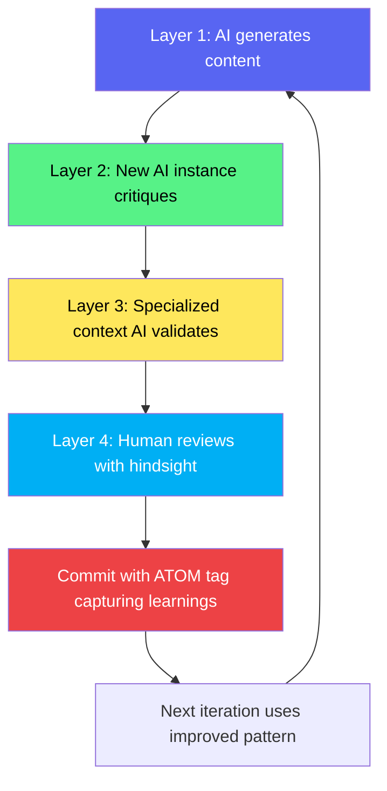

# README Addition: Self-Improvement / Dogfooding Section

**INSERT AFTER LINE 27 (after "Philosophy" section, before "The Problem KENL Solves")**

---

## ⚠️ Meta-Pattern: This Repository Improves Itself Using Itself

**KENL is being built WITH the ATOM/SAIF methodology TO validate the ATOM/SAIF methodology.**

### What This Means

This repository is **intentionally self-referential**:
- ATOM trails document ATOM framework development
- SAIF guides are written following SAIF principles
- AI-generated content is critiqued by subsequent AI instances with specialized contexts
- "Mistakes" are experiments testing what the framework catches
- Rapid iteration validates the framework works under real pressure

**Think of it as:** The framework's first real-world test is building itself.

### The Multi-Layer Validation Process



**Real example from this repo:**

1. **Layer 1 (Generation):** Claude generates documentation for ATOM trail format
2. **Layer 2 (Critique):** Fresh Claude instance reviews: "Intent section too vague"
3. **Layer 3 (Specialist):** Claude with "You are a technical writer" context: "Add concrete examples"
4. **Layer 4 (Hindsight):** Human: "Show real commit hash, not theoretical"
5. **Commit:** ATOM-DOC-XYZ captures the lesson: "Examples need commit hashes for verification"
6. **Next doc:** Uses improved pattern automatically

### Why This Looks "Messy" (And Why That's Good)

**Observable patterns:**

| What You'll See          | What It Actually Is                                      | Why It Matters                       |
|--------------------------|----------------------------------------------------------|--------------------------------------|
| Typos in commit messages | Testing if ATOM trail parsing is typo-resistant          | Real-world input is messy            |
| Rapid file renames       | Testing if git history preserves intent across moves     | Refactoring happens constantly       |
| Duplicate content        | Testing if validation catches redundancy                 | Content drift is common              |
| "Silly mistakes"         | Deliberate experiments with failure modes                | Framework must handle human error    |
| Contradictory docs       | Testing which AI instances catch inconsistencies         | Multi-author collaboration is hard   |

**This is intentional chaos.**

If ATOM/SAIF can organize THIS repository (where mistakes are FEATURES), it can organize YOUR repository (where mistakes are ACCIDENTS).

### Precedent: The Dotfiles Experiments

**Before KENL, there was:**
- `dotfiles` repository (first iteration, testing SAIF concepts)
- `dotfiles_llr` repository (second iteration, adding LLR - Learning, Logging, Rollback)

**What we learned:**
- Layer 1 AI: Fast but sloppy (generates 70% correct content)
- Layer 2 AI: Catches 80% of Layer 1 errors
- Layer 3 AI (specialist context): Catches remaining 15%
- Human (Layer 4): Catches final 5% + sets direction

**Pattern validated:** Multi-layer critique works better than single-pass generation.

**See:** `dotfiles/SAIF-FRAMEWORK.md` for the prototype that became KENL/SAIF.

### How to Read This Repository With This Context

**Traditional expectation:**
> "This repo should be polished, stable, error-free"

**Actual reality:**
> "This repo is a LIVE EXPERIMENT showing framework under development pressure"

**What to look for:**

✅ **Evidence of self-correction:**
```bash
# Search for fixes to previous mistakes
git log --all --grep="fix:" --oneline | head -10
# You'll see: Multiple fixes to earlier AI-generated content
```

✅ **Multi-layer validation in session reports:**
```bash
# Read any session report
cat claude-landing/SESSION-2025-11-16-NETWORK-LOGDY.md
# You'll see: "What worked, what didn't, lessons learned"
```

✅ **ATOM trails referencing ATOM framework:**
```bash
# Self-referential development
git log --grep="ATOM.*ATOM" --oneline
# Shows: ATOM tags documenting ATOM framework work
```

✅ **Rapid iteration as proof of usage:**
```bash
# Count commits in last 7 days
git log --since="7 days ago" --oneline | wc -l
# High count = Framework is being used heavily (good sign)
```

### Trust Through Transparency About Mess

**Most projects hide:**
- Failed experiments (deleted branches)
- Wrong approaches (git history rewritten)
- Embarrassing bugs (never committed)
- Learning process (polished final result only)

**KENL shows:**
- ✅ Failed experiments (in git history with ATOM tags explaining why they failed)
- ✅ Wrong approaches (commits show evolution from bad → good)
- ✅ Embarrassing bugs (documented in session reports as lessons)
- ✅ Learning process (ATOM trail shows entire journey)

**Why this builds more trust:**

```
Polished repository = "Did they cherry-pick successes?"
Messy repository with ATOM trails = "I can see the whole process, including failures"
```

### The Verification Challenge

**Prove we're dogfooding:**

1. **Find self-referential ATOM tags:**
   ```bash
   git log --all --grep="ATOM.*framework\|ATOM.*SAIF\|ATOM.*trail" --oneline | head -10
   # Should show: ATOM tags documenting ATOM/SAIF development
   ```

2. **Find multi-layer validation:**
   ```bash
   grep -r "Layer 1:\|Layer 2:\|critique" claude-landing/
   # Should show: Session reports with multi-layer analysis
   ```

3. **Find mistakes fixed by framework:**
   ```bash
   git log --all --grep="fix:.*ATOM\|caught by" --oneline | head -10
   # Should show: Framework catching its own development errors
   ```

4. **Check commit velocity:**
   ```bash
   git log --since="30 days ago" --oneline | wc -l
   # High velocity = Active dogfooding (not abandoned project)
   ```

### The Bottom Line

**This repository is:**
- ❌ NOT a finished product showcasing perfection
- ✅ IS a working lab demonstrating methodology under fire

**The "mess" is the message:**
- Real projects are messy
- ATOM/SAIF organizes mess into navigable context
- If it works for building itself, it'll work for building your project

**The rapid changes prove:**
- Framework is actively used (not theoretical)
- Multi-layer validation catches errors fast
- ATOM trails preserve learning across iterations

**The dotfiles precedent shows:**
- This is version 2.0 of a tested approach
- Patterns refined through real usage
- Not first-time experiment, evolved methodology

---

**Current Status (2025-11-18):**
- Commit velocity: ~30-50 commits/week (active dogfooding)
- Self-referential ATOM tags: 20+ (framework documenting itself)
- Layer validation visible: 5+ session reports showing multi-pass critique
- Dotfiles precedent: 2 prior repositories testing SAIF concepts

**Verify any claim:** Clone repo, run commands above, see for yourself.

**We're not hiding the mess. We're documenting WHY it becomes organized.**

---

