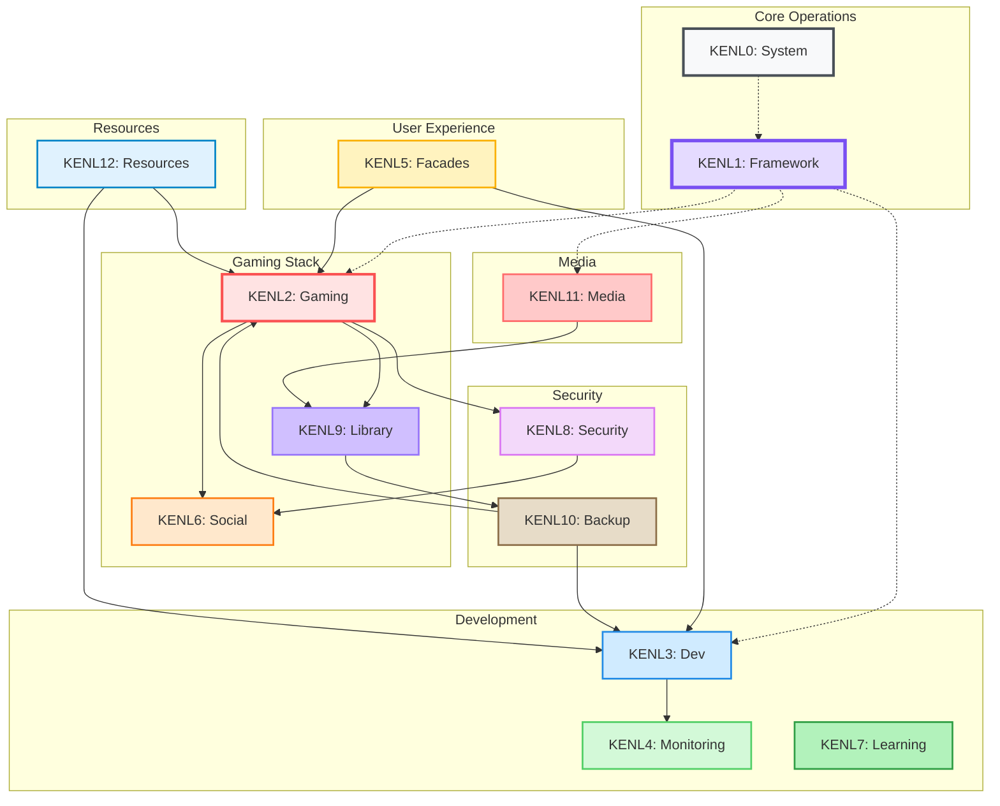

# modules/KENL

**Intent-Driven Gaming & Development on Bazzite Linux**

[](https://opensource.org/licenses/MIT)
[]()
[]()

> KENL transforms your Bazzite system into a self-documenting gaming and development platform with automatic crash recovery, shareable configurations, and complete audit trails.

---

## 🆘 Need Help with Windows 10 EOL or Surface Pro 4?

**If you're here for Windows support, start here:**

| You Need                  | Go Here                                                                                         |
|---------------------------|-------------------------------------------------------------------------------------------------|
| **End User Help**         | [START HERE - Human-Friendly Guide](./windows-support/surface-pro-4/START_HERE.md)              |
| **IT Support**            | [Quick Start Guide](./windows-support/surface-pro-4/QUICK_START_GUIDE.md)                       |
| **Request Help**          | [Windows Support Request](./.github/PULL_REQUEST_TEMPLATE/windows_support_request.md)           |
| **Windows Alternatives**  | [Linux Options for Windows 10 EOL](./windows-support/alternatives/README.md)                    |
| **All Documentation**     | [windows-support/](./windows-support/)                                                           |

---

## Why modules/KENL?

**Problem**: Gaming PCs are complex. When something breaks, you're left guessing what changed.

**Real Example**: Battlefield 6 wouldn't even launch on Windows. EA App auth errors, anti-cheat failures, 174ms network latency. After hours of troubleshooting: it works. But *how*? What fixed it? Can you do it again?

**Solution**: KENL captures *why* you did things, not just *what*. When BF6 breaks again (and it will), recovery is automatic because you documented the solution.


**Result**: 85% faster crash recovery, shareable gaming configs, complete audit trail.

---

## The KENL Builder Mentality

**"Putting the amazing work of Universal Blue / Bazzite teams into everyone's hands."**

Transform your Bazzite system into a self-documenting gaming and development platform.

KENL doesn't provide better tools - it provides **better access** to the excellent work already done. Through documentation, AI assistance, and shareable configurations, KENL ensures that what the Bazzite community has built is discoverable, understandable, and usable by everyone.

[](https://opensource.org/licenses/MIT)
[]()
[]()
[]()

### The Four Pillars

**KENL**
> A distrobox (devcontainer) that houses dedicated tooling for Gaming and Development on Cloud-Native OS.

**ATOM**
> An AI and Administrator logging system that captures the **Intent** behind each action, allowing Agents and Self-Propelled (no AI help) Users to resume tasking or rollback to any point.
>
> *See [`claude-landing/RECENT-WORK.md`](./claude-landing/RECENT-WORK.md) for ATOM operating example (CTFWI pattern documentation)*

**OWI** (*Operating-With-Intent*)
> A KENL deployment integrating paid- and offline-AI Agents, MCP Servers, and intelligent helpers with the work already done by Universal Blue / Bazzite. Reach your optimal operational state for any task (e.g., Playing X on Y with Z Hardware).
>
> Confirmed setups create **Play Cards** (Hardware Profiles + gaming configuration + Compat tools + Intelligent Networking workflows). Play Cards can be redacted, encrypted, and shared.
>
> *See [`claude-landing/TESTING-RESULTS.md`](./claude-landing/TESTING-RESULTS.md) for Play Card structure example*

**SAGE** (*System-Aware Guided Evolution*)
> Documentation system designed to deliver the information you require, when it is required, and in the form best suited to deliver it.
>
> *See [`claude-landing/`](./claude-landing/) for SAGE operating example (just-in-time orientation docs)*

### Technical Guarantees

**Elegant Integration**
- Distrobox containers isolate development tools (zero system-level dependencies)
- MCP servers communicate via JSON-RPC (no kernel modules, no system daemons)
- All KENL scripts are pure POSIX shell (no custom interpreters)

**Minimal Overhead**
- ATOM trail logging: ~0.1ms per operation (append-only file I/O)
- Play Cards: Static YAML files (read on demand, no background processes)
- Distrobox: Copy-on-write filesystem (shared binaries, minimal disk usage)

**Breaking-Change Proof**
- **Immutable Base OS**: Bazzite/Fedora Atomic uses rpm-ostree (system is read-only)
- **Layered Changes**: System modifications require explicit `rpm-ostree install` (with automatic rollback)
- **User-Space Only**: KENL operates in `~/.local` and `~/.config` (cannot taint OS)
- **Atomic Rollback**: Boot to previous system state via GRUB menu (single reboot)

*Every KENL operation includes rollback instructions. You can undo any change.*

---

## Quick Start

```bash
# Clone repository
git clone https://github.com/toolate28/kenl.git ~/.kenl

# Bootstrap environment
cd ~/.kenl && ./scripts/bootstrap.sh

# Explore modules (pick your context)
cd modules/KENL2-gaming    # For gaming setup
cd modules/KENL3-dev       # For development
cd modules/KENL0-system    # For system operations
```

**Then read the module README for your use case** (see table below).

---

## The KENL Ecosystem

KENL is **13 specialized modules** (KENL0-12) that work together on Bazzite:



---

## Module Navigation

| Module           | Purpose                    | Documentation                                         |
|------------------|----------------------------|-------------------------------------------------------|
| ⚙️ **KENL0**     | System operations          | [modules/KENL0-system/](./modules/KENL0-system/)      |
| ⚛️ **KENL1**     | Framework core (ATOM+SAGE) | [modules/KENL1-framework/](./modules/KENL1-framework/)|
| 🎮 **KENL2**     | Gaming & Play Cards        | [modules/KENL2-gaming/](./modules/KENL2-gaming/)      |
| 💻 **KENL3**     | Development                | [modules/KENL3-dev/](./modules/KENL3-dev/)            |
| 📊 **KENL4**     | Monitoring & metrics       | [modules/KENL4-monitoring/](./modules/KENL4-monitoring/)|
| 🎨 **KENL5**     | Theming & context          | [modules/KENL5-facades/](./modules/KENL5-facades/)    |
| 🌐 **KENL6**     | Social & sharing           | [modules/KENL6-social/](./modules/KENL6-social/)      |
| 🎓 **KENL7**     | Learning & tutorials       | [modules/KENL7-learning/](./modules/KENL7-learning/)  |
| 🔐 **KENL8**     | Security & encryption      | [modules/KENL8-security/](./modules/KENL8-security/)  |
| 📚 **KENL9**     | Library management         | [modules/KENL9-library/](./modules/KENL9-library/)    |
| 💾 **KENL10**    | Backups & snapshots        | [modules/KENL10-backup/](./modules/KENL10-backup/)    |
| 📺 **KENL11**    | Media server automation    | [modules/KENL11-media/](./modules/KENL11-media/)      |
| 🗂️ **KENL12**    | Resources & downloads      | [modules/KENL12-resources/](./modules/KENL12-resources/)|

**Pick the module that matches your task, then read its README.**

---

## Key Features

### 🔍 Everything is Traceable

Every operation creates an ATOM trail entry with full context:

```bash
ATOM-GAMING-20251112-001: BF6 failed to launch - EA App auth error
ATOM-RESEARCH-20251112-002: ProtonDB reports: Need Proton GE 9-20 + EAC fix
ATOM-CFG-20251112-003: Applied Proton GE 9-20, PROTON_EAC_RUNTIME=1
ATOM-TEST-20251112-004: BF6 launches successfully, 118 FPS @ 1080p
ATOM-NETWORK-20251112-005: Disabled Tailscale VPN (174ms → 6ms latency)
ATOM-PLAYCARD-20251112-006: Created bf6-amd-ryzen5-5600h-working.yaml
```

When something breaks, you know *exactly* what changed - and what fixed it.

### 📋 Play Cards = Shareable Gaming Configs

Document game configurations as YAML:

```yaml
game: Battlefield 6
hardware:
  cpu: AMD Ryzen 5 5600H
  gpu: AMD Radeon Vega (integrated)
  ram: 16GB
proton: GE-Proton 9-20
launch_options: "PROTON_EAC_RUNTIME=1 %command%"
compatibility:
  ea_app: "Requires login workaround (see notes)"
  anti_cheat: "Easy Anti-Cheat working with PROTON_EAC_RUNTIME"
network:
  tailscale_vpn: disabled  # Critical: 174ms → 6ms latency
  mtu: 1492
  avg_latency_ms: 6
performance:
  resolution: 1920x1080
  settings: medium
  fps_avg: 118
  fps_min: 95
  playability: excellent
issues_solved:
  - "Game wouldn't launch (EA App auth) - Fixed with Proton GE 9-20"
  - "High latency (174ms) - Fixed by disabling Tailscale VPN"
  - "Stuttering - Fixed with MTU optimization (1492)"
atom_trail: ATOM-PLAYCARD-20251112-006
```

Share with friends. They **skip the pain you went through** and get identical performance.

### ⚡ Rapid Crash Recovery

System crashes? KENL reconstructs what you were doing, why, and what to do next. **85% faster** than manual recovery (30-60 min → <10 min).

[See validation study →](./modules/KENL1-framework/docs/VALIDATION_COMPLETE.md)

### 🎨 Context Switching

Visual shell themes prevent mistakes:

```bash
🎮 KENL2 user@bazzite:~$    # Gaming context
💻 KENL3 user@bazzite:~$    # Dev context
⚙️ KENL0 user@bazzite:~$    # System ops (elevated)
```

---

## Real-World Scenarios

KENL includes complete "storyboards" for complex operations:

- 🔧 [RWS-01: BIOS/TPM Firmware Update](./case-studies/RWS-01-BIOS-TPM-UPDATE.md)
- 🪟 [RWS-02: Windows 11 Installation (wimboot)](./case-studies/RWS-02-WINDOWS11-WIMBOOT.md)
- 🖥️ [RWS-03: Dual-Boot Setup](./case-studies/RWS-03-DUAL-BOOT.md)
- 🚀 [RWS-04: Bazzite Rebase (40→41)](./case-studies/RWS-04-RPMOSTREE-REBASE.md)
- 🎮 [RWS-05: Battlefield 6 - Launch Issues to Optimal](./case-studies/RWS-05-BATTLEFIELD-6.md) **← New!**
- 🖥️ [RWS-06: Complete Dual-Boot Gaming Setup](./case-studies/RWS-06-COMPLETE-DUAL-BOOT-GAMING-SETUP.md)

---

## Repository Structure

```
kenl/
├── claude-landing/               # START HERE - AI agent orientation docs
│   ├── CURRENT-STATE.md          # Environment snapshot
│   ├── RECENT-WORK.md            # Session summaries (CTFWI examples)
│   ├── HARDWARE.md               # Hardware specs
│   ├── TESTING-RESULTS.md        # Validation results (Play Card examples)
│   ├── MIGRATION-PLAN.md         # Platform migration roadmaps
│   └── QUICK-REFERENCE.md        # Essential commands & paths
├── modules/                      # All KENL modules (0-12)
│   ├── KENL0-system/             # System operations
│   │   └── powershell/           # Windows PowerShell modules
│   ├── KENL1-framework/          # ATOM+SAGE+OWI core
│   ├── KENL2-gaming/             # Gaming configs & Play Cards
│   ├── KENL3-dev/                # Development environments
│   └── ... (KENL4-12)
├── governance/                   # ARCREF + ADR documents
│   ├── mcp-governance/           # ARCREF artifacts
│   └── 02-Decisions/             # ADR documents
├── windows-support/              # Windows 10 EOL & Surface Pro 4
│   ├── surface-pro-4/            # Troubleshooting guides
│   └── alternatives/             # Linux migration options
├── scripts/                      # Bootstrap & automation
├── CONTRIBUTING.md               # Contribution guidelines
└── README.md                     # This file
```

---

## Documentation

### Quick Start (New Users or AI Agents)
- [Claude Landing Zone](./claude-landing/) - **START HERE** for orientation
- [Current State](./claude-landing/CURRENT-STATE.md) - Environment snapshot
- [Recent Work](./claude-landing/RECENT-WORK.md) - Latest session summaries
- [Quick Reference](./claude-landing/QUICK-REFERENCE.md) - Essential commands

### Core Framework
- [ATOM+SAGE Framework](./modules/KENL1-framework/README.md) - Intent-driven operations
- [Getting Started Guide](./modules/KENL1-framework/docs/GETTING_STARTED.md)
- [Validation Study](./modules/KENL1-framework/docs/VALIDATION_COMPLETE.md)

### Gaming
- [Gaming Guide](./modules/KENL2-gaming/README.md) - Play Cards & Proton optimization
- [Bazza-DX One-Pager](./modules/KENL2-gaming/guides/bazza-dx-one-pager.md)
- [Gaming Configuration](./modules/KENL2-gaming/guides/gaming-config-framework.md)

### Development
- [Development Setup](./modules/KENL3-dev/README.md) - Distrobox environments
- [Claude Code Integration](./modules/KENL3-dev/claude-code-setup/claude-configuration-guide.md)

### Windows Support
- [Windows Alternatives Guide](./windows-support/alternatives/README.md) - Linux options for Windows 10 EOL
- [Surface Pro 4 Support](./windows-support/surface-pro-4/START_HERE.md)
- [Best 3 OS to Convert](./windows-support/alternatives/BEST_3_TO_CONVERT.md)

### Governance
- [ARCREF Template](./governance/mcp-governance/ARCREF_TEMPLATE.yaml) - Infrastructure decisions
- [ADR Template](./governance/02-Decisions/ADR_TEMPLATE.md) - Architectural decisions
- [CLAUDE.md](./CLAUDE.md) - Guidance for Claude Code

---

## Contributing

We welcome contributions! See [CONTRIBUTING.md](./CONTRIBUTING.md) for:

- Code style guidelines & formatting standards
- Commit message format (Conventional Commits)
- Pre-commit hooks and testing
- ARCREF + ADR requirements for architectural changes

---

## Support & Community

| Resource                  | Link                                                                  |
|---------------------------|-----------------------------------------------------------------------|
| **Report Issues**         | [GitHub Issues](https://github.com/toolate28/kenl/issues)             |
| **Discussions**           | [GitHub Discussions](https://github.com/toolate28/kenl/discussions)   |
| **Security Issues**       | [SECURITY.md](./SECURITY.md) - Report privately                       |
| **Windows Support**       | [Open Support Request](./.github/PULL_REQUEST_TEMPLATE/windows_support_request.md) |

---

## License

MIT License - see [LICENSE](./LICENSE) for details.

KENL is fully open source. Fork it, modify it, share it.

---

## Why "KENL"?

**Knowledge Enhanced Navigation Layer**

Every operation builds knowledge. Every knowledge entry enhances recovery. Every recovery strengthens the system.

---

**Status**: Production Ready | **Version**: 1.0.0 | **Platform**: Bazzite (Fedora Atomic)
**Last Updated**: 2025-11-12 | **Made with intent** by the Bazza-DX community 🎮💻🔐
