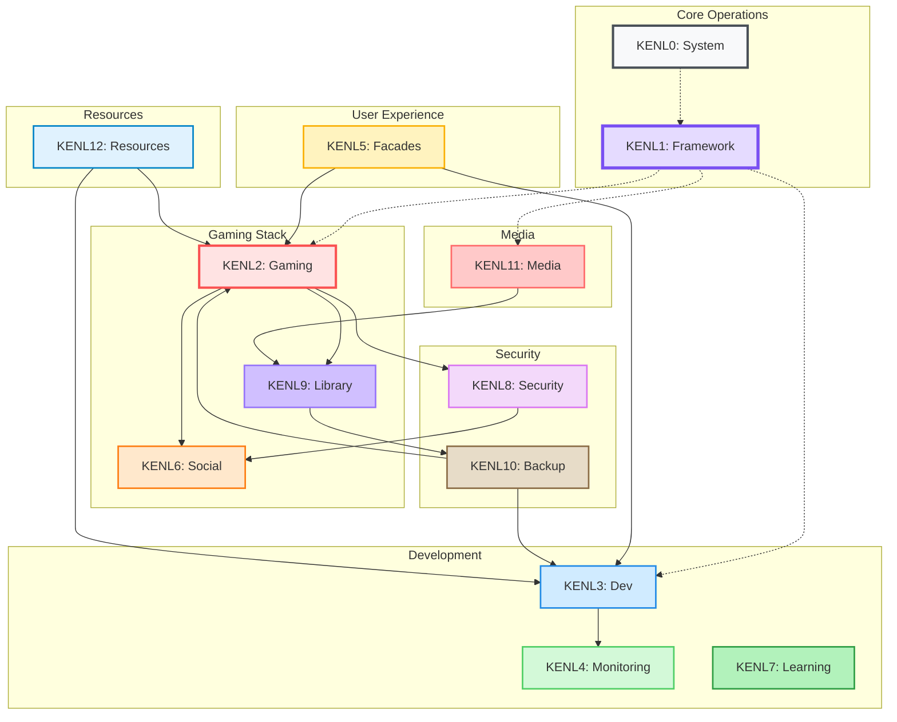
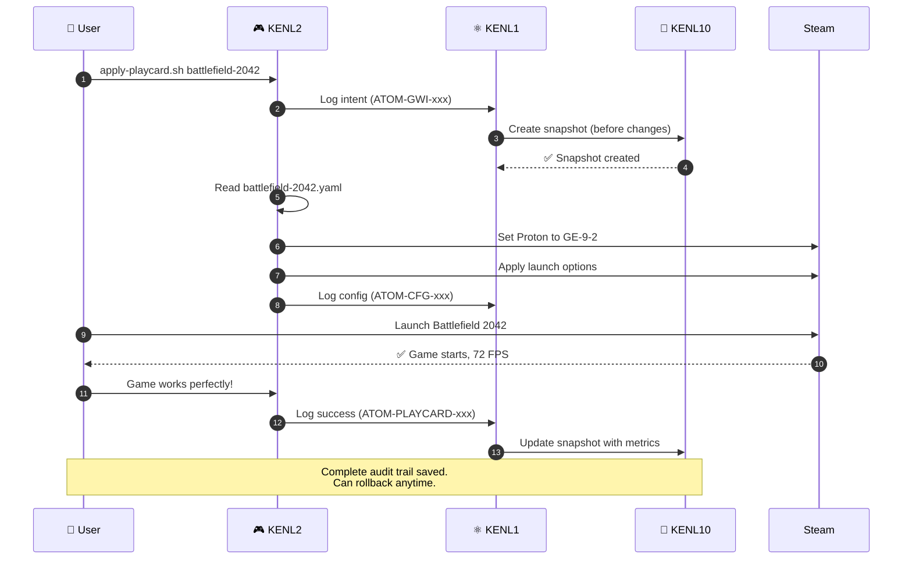

# The KENL Builder Mentality- Anything we can do, you can do better. You can do anything better than we. 

**Transform your Bazzite system into a self-documenting gaming and development platform**

[](https://opensource.org/licenses/MIT)
[]()
[]()
[]()

> **KENL** A distrobox (devcontainer) that houses dedicated tooling, for Gaming and Development on Cloud-Native OS. <

> **ATOM** An AI and Administrator logging system that captures the Intent behind each action, allowing Agents and Self-Propelled (no AI help) Users to resume tasking or rollback to any point. 

> **OWI** "Operating-With-Intent" // A KENL deployment, integrating paid- and offline-AI Agents, MCP Servers and intelligent helpers and documentation, with the work already done by Universal Blue / Bazzite to allow your linux gaming machine to reach its optimal operational state for the task you have in mind (e.g. Playing X on Y with Z Hardware). Confirmed setups create Play-Cards (Hardware Profiles/gaming configuration/Compat tools/Intelligent Networking for Gaming workflows and setting your GPU/HUD/Gamescope/Steam/... (anything you want really) . Play-Cards can be redacted, encrypted and shared.

> **SAGE** Documentation system thats designed to deliver the information you require, if and when it is required, and in the form best suited to deliver it.

--------------------------------------------------------------------------------------------------------------------------------------------------------------------- 

## 🆘 Windows 10 End of Support (October 2025)

**240 million PCs losing security updates. Is yours one of them?**

| You Need               | Go Here                                                                        |
|------------------------|-------------------------------------------------------------------------------|
| **End User Guide**     | [START HERE →](./windows-support/surface-pro-4/START_HERE.md)                 |
| **IT Support**         | [Quick Start Guide →](./windows-support/surface-pro-4/QUICK_START_GUIDE.md)   |
| **Linux Alternatives** | [Best 3 OS to Convert →](./windows-support/alternatives/BEST_3_TO_CONVERT.md) |
| **Surface Pro 4 Help** | [Complete Support Docs →](./windows-support/surface-pro-4/)                   |

---

## Why KENL?

### The Problem

**Real Example**: Battlefield 6 wouldn't even launch on Windows. EA App auth errors, anti-cheat failures, 174ms network latency. After hours of troubleshooting: it works. But *how*? What fixed it? Can you do it again?

**Solution**: KENL captures *why* you did things, not just *what*. When BF6 breaks again (and it will), recovery is automatic because you documented the solution.

```mermaid
graph LR
    A([BF6 Won't Launch])
    B[Research: EA App Issues]
    C[Fix: Anti-Cheat + Proton]
    D[Test: Validates Launch]
    E[(Create Play Card)]
    F[Network Optimization]
    G([Share: Others Skip Pain])
    H[ATOM Backup]

    A -->|Investigate| B
    B -->|ProtonDB| C
    C -->|Success| D
    D -->|Document| E
    E -->|Apply| F
    F -->|Works| G
    G -->|Trail| H
    H -.->|Breaks?| B

    style A fill:#ff6b6b,stroke:#c92a2a,stroke-width:3px,color:#fff
    style B fill:#ffd43b,stroke:#fab005,stroke-width:2px
    style C fill:#4dabf7,stroke:#1971c2,stroke-width:2px,color:#fff
    style D fill:#51cf66,stroke:#2b8a3e,stroke-width:2px,color:#fff
    style E fill:#845ef7,stroke:#5f3dc4,stroke-width:3px,color:#fff
    style F fill:#4dabf7,stroke:#1971c2,stroke-width:2px,color:#fff
    style G fill:#51cf66,stroke:#2b8a3e,stroke-width:3px,color:#fff
    style H fill:#845ef7,stroke:#5f3dc4,stroke-width:2px,color:#fff
```



**Result:** Documented → Reproducible → Shareable → Rollback-safe

---

## The KENL Builder Mentality

**"Put the work of Universal Blue / Bazzite / Proton / Community teams into the hands of those that wish to use them"**

i.e. Transform your Bazzite system into a self-documenting gaming and development platform, no specialised linux or modding experience required. 

KENL doesn't provide better tools - it provides **better access** to the excellent work already done. Through documentation, AI assistance, and shareable configurations, KENL ensures that what the Bazzite community has built is discoverable, understandable, and usable by everyone.

[](https://opensource.org/licenses/MIT)
[]()
[]()
[]()

### The Four Pillars

**KENL**
> A distrobox (devcontainer) that houses dedicated tooling for Gaming and Development on Cloud-Native OS.

**ATOM**
> An AI and Administrator logging system that captures the **Intent** behind each action, allowing Agents and Self-Propelled (no AI help) Users to resume tasking or rollback to any point.
>
> *See [`claude-landing/RECENT-WORK.md`](./claude-landing/RECENT-WORK.md) for ATOM operating example (CTFWI pattern documentation)*

**OWI** (*Operating-With-Intent*)
> A KENL deployment integrating paid- and offline-AI Agents, MCP Servers, and intelligent helpers with the work already done by Universal Blue / Bazzite. Reach your optimal operational state for any task (e.g., Playing X on Y with Z Hardware).
>
> Confirmed setups create **Play Cards** (Hardware Profiles + gaming configuration + Compat tools + Intelligent Networking workflows). Play Cards can be redacted, encrypted, and shared.
>
> *See [`claude-landing/TESTING-RESULTS.md`](./claude-landing/TESTING-RESULTS.md) for Play Card structure example*

**SAGE** (*System-Aware Guided Evolution*)
> Documentation system designed to deliver the information you require, when it is required, and in the form best suited to deliver it.
>
> *See [`claude-landing/`](./claude-landing/) for SAGE operating example (just-in-time orientation docs)*

### Technical Guarantees

**Elegant Integration**
- Distrobox containers isolate development tools (zero system-level dependencies)
- MCP servers communicate via JSON-RPC (no kernel modules, no system daemons)
- All KENL scripts are pure POSIX shell (no custom interpreters)

**Minimal Overhead**
- ATOM trail logging: ~0.1ms per operation (append-only file I/O)
- Play Cards: Static YAML files (read on demand, no background processes)
- Distrobox: Copy-on-write filesystem (shared binaries, minimal disk usage)

**Breaking-Change Proof**
- **Immutable Base OS**: Bazzite/Fedora Atomic uses rpm-ostree (system is read-only)
- **Layered Changes**: System modifications require explicit `rpm-ostree install` (with automatic rollback)
- **User-Space Only**: KENL operates in `~/.local` and `~/.config` (cannot taint OS)
- **Atomic Rollback**: Boot to previous system state via GRUB menu (single reboot)

*Every KENL operation includes rollback instructions. You can undo any change.*

---

## Quick Start

```bash
# Clone KENL repository
git clone https://github.com/toolate28/kenl.git ~/.kenl
cd ~/.kenl

# Bootstrap (installs pre-commit hooks, sets up ATOM framework)
./scripts/bootstrap.sh

# Verify installation
ls modules/  # See all KENL modules
```

### 2. Set Up Your First Game (Elden Ring Example)

```bash
# Switch to gaming context
cd modules/KENL5-facades
./switch-kenl.sh gaming

# Your prompt changes to:
🎮 KENL2 user@bazzite:~$

# View available Play Cards
cd ~/.kenl/modules/KENL2-gaming/play-cards/games
cat elden-ring.yaml

# Apply Play Card (sets Proton version, launch options, etc.)
./apply-playcard.sh elden-ring

# Launch game through Steam - it just works!
```

### 3. Customize Your Desktop

```bash
# Browse Linux distro wallpapers (20+ HD dark themes)
cd ~/.kenl/modules/KENL5-facades/wallpapers
ls -R  # kali-linux/, bazzite/, cachyos/, pop-os/, fedora/, manjaro/

# Set a wallpaper (KDE Plasma example)
plasma-apply-wallpaperimage \
  "$(pwd)/bazzite/bazzite-1.png"

# Or use GNOME
gsettings set org.gnome.desktop.background picture-uri \
  "file://$(pwd)/kali-linux/kali-night-skyA-1920x1080.png"
```

---

## 🎮 The KENL Ecosystem

KENL is **13 specialized modules** (KENL0-12) that work together on Bazzite:



---

## Module Navigation

| Module           | Purpose                    | Documentation                                         |
|------------------|----------------------------|-------------------------------------------------------|
| ⚙️ **KENL0**     | System operations          | [modules/KENL0-system/](./modules/KENL0-system/)      |
| ⚛️ **KENL1**     | Framework core (ATOM+SAGE) | [modules/KENL1-framework/](./modules/KENL1-framework/)|
| 🎮 **KENL2**     | Gaming & Play Cards        | [modules/KENL2-gaming/](./modules/KENL2-gaming/)      |
| 💻 **KENL3**     | Development                | [modules/KENL3-dev/](./modules/KENL3-dev/)            |
| 📊 **KENL4**     | Monitoring & metrics       | [modules/KENL4-monitoring/](./modules/KENL4-monitoring/)|
| 🎨 **KENL5**     | Theming & context          | [modules/KENL5-facades/](./modules/KENL5-facades/)    |
| 🌐 **KENL6**     | Social & sharing           | [modules/KENL6-social/](./modules/KENL6-social/)      |
| 🎓 **KENL7**     | Learning & tutorials       | [modules/KENL7-learning/](./modules/KENL7-learning/)  |
| 🔐 **KENL8**     | Security & encryption      | [modules/KENL8-security/](./modules/KENL8-security/)  |
| 📚 **KENL9**     | Library management         | [modules/KENL9-library/](./modules/KENL9-library/)    |
| 💾 **KENL10**    | Backups & snapshots        | [modules/KENL10-backup/](./modules/KENL10-backup/)    |
| 📺 **KENL11**    | Media server automation    | [modules/KENL11-media/](./modules/KENL11-media/)      |
| 🗂️ **KENL12**    | Resources & downloads      | [modules/KENL12-resources/](./modules/KENL12-resources/)|

**Pick the module that matches your task, then read its README.**

---

## 🎯 What Makes KENL Different?

### 1. Play Cards = Shareable Gaming Configs

**Example: Hogwarts Legacy on Bazzite-DX**

```yaml
play_card:
  game: "Hogwarts Legacy"
  store: Steam
  app_id: "990080"

  # Exact Proton version that works
  proton_version: "GE-Proton 9-1"
  launch_options: "PROTON_ENABLE_NVAPI=1 DXVK_FRAME_RATE=60 %command% -dx12"

  # Real performance metrics
  performance:
    target_fps: 60
    actual_fps: 58  # Tested on RTX 3070 Ti
    resolution: "2560x1440"
    settings: high
    vram_usage: "7.2GB"

  # Hardware it's tested on
  validated_hardware:
    - name: "NVIDIA RTX 3070 Ti"
      vram: "8GB"
      driver: "nvidia-550.54.14"

  # Known issues + fixes
  known_issues:
    - issue: "Ray tracing causes drops"
      workaround: "Disable RT in settings"
      severity: moderate
```

**Share with friends:**
```bash
ATOM-GAMING-20251112-001: BF6 failed to launch - EA App auth error
ATOM-RESEARCH-20251112-002: ProtonDB reports: Need Proton GE 9-20 + EAC fix
ATOM-CFG-20251112-003: Applied Proton GE 9-20, PROTON_EAC_RUNTIME=1
ATOM-TEST-20251112-004: BF6 launches successfully, 118 FPS @ 1080p
ATOM-NETWORK-20251112-005: Disabled Tailscale VPN (174ms → 6ms latency)
ATOM-PLAYCARD-20251112-006: Created bf6-amd-ryzen5-5600h-working.yaml
```

When something breaks, you know *exactly* what changed - and what fixed it.

---

### 2. Context Switching (Visual Prompts)

```yaml
game: Battlefield 6
hardware:
  cpu: AMD Ryzen 5 5600H
  gpu: AMD Radeon Vega (integrated)
  ram: 16GB
proton: GE-Proton 9-20
launch_options: "PROTON_EAC_RUNTIME=1 %command%"
compatibility:
  ea_app: "Requires login workaround (see notes)"
  anti_cheat: "Easy Anti-Cheat working with PROTON_EAC_RUNTIME"
network:
  tailscale_vpn: disabled  # Critical: 174ms → 6ms latency
  mtu: 1492
  avg_latency_ms: 6
performance:
  resolution: 1920x1080
  settings: medium
  fps_avg: 118
  fps_min: 95
  playability: excellent
issues_solved:
  - "Game wouldn't launch (EA App auth) - Fixed with Proton GE 9-20"
  - "High latency (174ms) - Fixed by disabling Tailscale VPN"
  - "Stuttering - Fixed with MTU optimization (1492)"
atom_trail: ATOM-PLAYCARD-20251112-006
```

Share with friends. They **skip the pain you went through** and get identical performance.

---

### 3. ATOM Trail (Complete Audit Log)

Every operation generates an ATOM tag for traceability:

```bash
# You configure Elden Ring
ATOM-GWI-20251110-003: Researched Elden Ring (ProtonDB Platinum)
ATOM-CFG-20251110-004: Applied Proton GE-9-2 + EAC support
ATOM-PLAYCARD-20251110-005: Created elden-ring.yaml

# 3 months later: Game breaks after Proton update
$ atom-query --since 3-months-ago --game "Elden Ring"

# Returns:
# - Exact Proton version that worked (GE-9-2)
# - Launch options used (PROTON_USE_EAC_LINUX=1)
# - FPS before/after (60 FPS locked)
# - Date of change (2025-11-10)

# Rollback to working config
$ ./apply-playcard.sh elden-ring --atom ATOM-GWI-20251110-003
✅ Restored to GE-Proton 9-2 (working state)
```

**Result:** Never lose a working configuration. Every change is reversible.

---

### 4. Linux Distro Wallpapers (20+ HD Themes)

**New in v1.0.0:** Curated dark wallpapers from Linux community sources.

```bash
cd modules/KENL5-facades/wallpapers

📁 kali-linux/        # 6 wallpapers (1080p - 4K)
📁 bazzite/           # 2 wallpapers (4K, vector-based)
📁 cachyos/           # 4 wallpapers (up to 24MB 16-bit)
📁 pop-os/            # 4 wallpapers (CC BY-SA 4.0)
📁 fedora/            # 1 wallpaper (official extras)
📁 manjaro/           # 3 wallpapers (community by Lunix)
```

**All from official sources:**
- Kali Linux: GitLab official repository
- Bazzite: Community vector wallpapers
- CachyOS: Official GitHub (RDNA3 optimized)
- Pop!_OS: System76 official (Kate Hazen art)
- Fedora: fedoradesign/backgrounds
- Manjaro: Community curated (Blender/GIMP)

**NO generic nature wallpapers. Only distro-branded, dark themes.**

[Wallpaper Collection Docs →](./modules/KENL5-facades/wallpapers/README.md)

---

## 🎮 Real-World Example: Gaming Session

**Scenario:** You want to play Battlefield 2042 on Bazzite-DX.

### Traditional Approach (Without KENL)

```bash
# 1. Google "battlefield 2042 linux"
# 2. Read 5 conflicting Reddit posts
# 3. Try random Proton versions
# 4. Game crashes with EAC error
# 5. Google "bf2042 easy anti cheat linux"
# 6. Find a 2-year-old Steam forum post
# 7. Try more random commands
# 8. Finally works after 2 hours
# 9. 3 months later: Update breaks it, no idea what you changed
```

**Time:** 2-4 hours of trial-and-error

### KENL Approach

```bash
# 1. Switch to gaming context
./switch-kenl.sh gaming
🎮 KENL2 user@bazzite:~$

# 2. Check Play Card library
cd modules/KENL2-gaming/play-cards/games
cat battlefield-2042.yaml

# Play Card shows:
# - Proton: GE-Proton 9-2 (confirmed working)
# - Launch options: PROTON_ENABLE_NVAPI=1 DXVK_ASYNC=1
# - Known issue: "Use X11, not Wayland" (EA App crashes on Wayland)
# - Performance: 72 FPS @ 1920x1080 High (RTX 3070)

# 3. Apply Play Card
./apply-playcard.sh battlefield-2042
✅ Set Proton to GE-Proton 9-2
✅ Applied launch options
✅ Configured X11 session
✅ ATOM: ATOM-GWI-20251110-008

# 4. Launch game
# Works immediately, 72 FPS, no crashes

# 5. Share with friend
./share-playcard.sh battlefield-2042 --encrypt --recipient friend@email.com
✅ Encrypted Play Card sent
```

**Time:** 5 minutes

**Outcome:**
- ✅ Works first try
- ✅ Documented configuration
- ✅ Shareable with friends
- ✅ Rollback-safe (ATOM trail)
- ✅ Performance metrics tracked



---

## 💻 Real-World Example: Development Setup

**Scenario:** Set up a Python ML development environment on Bazzite-DX.

### Traditional Approach

```bash
# Install packages globally (pollutes system)
sudo rpm-ostree install python3-numpy python3-pandas
# Reboot required... wait 2 minutes
# Oh wait, rpm-ostree is immutable, can't install Python packages globally
# Try pip install... breaks on next reboot
# Give up, use venv... but it's messy
```

- 🔧 [RWS-01: BIOS/TPM Firmware Update](./case-studies/RWS-01-BIOS-TPM-UPDATE.md)
- 🪟 [RWS-02: Windows 11 Installation (wimboot)](./case-studies/RWS-02-WINDOWS11-WIMBOOT.md)
- 🖥️ [RWS-03: Dual-Boot Setup](./case-studies/RWS-03-DUAL-BOOT.md)
- 🚀 [RWS-04: Bazzite Rebase (40→41)](./case-studies/RWS-04-RPMOSTREE-REBASE.md)
- 🎮 [RWS-05: Battlefield 6 - Launch Issues to Optimal](./case-studies/RWS-05-BATTLEFIELD-6.md) **← New!**
- 🖥️ [RWS-06: Complete Dual-Boot Gaming Setup](./case-studies/RWS-06-COMPLETE-DUAL-BOOT-GAMING-SETUP.md)

---

## 🔧 Real-World Example: System Update

**Scenario:** Update Bazzite from version 40 to 41.

### Traditional Approach

```bash
# Update Bazzite
rpm-ostree upgrade
# Reboot
# OH NO! NVIDIA driver broken, black screen
# Boot into recovery, rollback
# Spend 2 hours debugging
```
kenl/
├── claude-landing/               # START HERE - AI agent orientation docs
│   ├── CURRENT-STATE.md          # Environment snapshot
│   ├── RECENT-WORK.md            # Session summaries (CTFWI examples)
│   ├── HARDWARE.md               # Hardware specs
│   ├── TESTING-RESULTS.md        # Validation results (Play Card examples)
│   ├── MIGRATION-PLAN.md         # Platform migration roadmaps
│   └── QUICK-REFERENCE.md        # Essential commands & paths
├── modules/                      # All KENL modules (0-12)
│   ├── KENL0-system/             # System operations
│   │   └── powershell/           # Windows PowerShell modules
│   ├── KENL1-framework/          # ATOM+SAGE+OWI core
│   ├── KENL2-gaming/             # Gaming configs & Play Cards
│   ├── KENL3-dev/                # Development environments
│   └── ... (KENL4-12)
├── governance/                   # ARCREF + ADR documents
│   ├── mcp-governance/           # ARCREF artifacts
│   └── 02-Decisions/             # ADR documents
├── windows-support/              # Windows 10 EOL & Surface Pro 4
│   ├── surface-pro-4/            # Troubleshooting guides
│   └── alternatives/             # Linux migration options
├── scripts/                      # Bootstrap & automation
├── CONTRIBUTING.md               # Contribution guidelines
└── README.md                     # This file
```

**Outcome:**
- ✅ Automatic rollback on failure
- ✅ Complete snapshot before changes
- ✅ Health checks verify system works
- ✅ ATOM trail logs entire process
- ✅ Max downtime: 2 minutes (vs. 2 hours debugging)

[System Operations Guide →](./modules/KENL0-system/README.md)

---

## 📚 Documentation

### Quick Start (New Users or AI Agents)
- [Claude Landing Zone](./claude-landing/) - **START HERE** for orientation
- [Current State](./claude-landing/CURRENT-STATE.md) - Environment snapshot
- [Recent Work](./claude-landing/RECENT-WORK.md) - Latest session summaries
- [Quick Reference](./claude-landing/QUICK-REFERENCE.md) - Essential commands

### Core Framework
- **[ATOM+SAGE Framework](./modules/KENL1-framework/README.md)** - Intent-driven operations methodology
- **[Getting Started Guide](./modules/KENL1-framework/docs/GETTING_STARTED.md)** - New user walkthrough
- **[Validation Study](./modules/KENL1-framework/docs/VALIDATION_COMPLETE.md)** - Evidence-based validation

### Gaming
- **[Gaming Guide](./modules/KENL2-gaming/README.md)** - Play Cards, Proton optimization
- **[Play Card Library](./modules/KENL2-gaming/play-cards/)** - 15+ game and machine configurations
- **[Bazza-DX One-Pager](./modules/KENL2-gaming/guides/bazza-dx-one-pager.md)** - Executive summary

### Development
- **[Development Environments](./modules/KENL3-dev/README.md)** - Distrobox, Claude Code, MCP
- **[Claude Code Setup](./modules/KENL3-dev/claude-code-setup/)** - MCP integration guide
- **[Devcontainer Example](./modules/KENL3-dev/devcontainer/)** - VS Code remote containers

### Theming & UX
- **[Visual Identity](./modules/KENL5-facades/README.md)** - Context switching, shell prompts
- **[Wallpaper Collection](./modules/KENL5-facades/wallpapers/)** - 20+ HD Linux distro wallpapers

### Windows Support
- **[Windows 10 EOL Migration](./windows-support/alternatives/README.md)** - Linux options
- **[Surface Pro 4 Guide](./windows-support/surface-pro-4/START_HERE.md)** - Complete migration support
- **[Best 3 OS to Convert](./windows-support/alternatives/BEST_3_TO_CONVERT.md)** - Recommendations

### Architecture & Governance
- **[OWI Framework Overview](./OWI_FRAMEWORK_OVERVIEW.md)** - Gaming/Configuring/Building-With-Intent
- **[CLAUDE.md](./CLAUDE.md)** - Guidance for Claude Code instances
- **[Contributing Guide](./CONTRIBUTING.md)** - How to contribute
- **[ADR Template](./governance/02-Decisions/ADR_TEMPLATE.md)** - Architectural decisions

---

## 🌟 Key Features

### Gaming Features
- ✅ **15+ Play Cards** - Halo, Battlefield, Elden Ring, Hogwarts Legacy, Minecraft, and more
- ✅ **Machine Play Cards** - Configurations for NVIDIA, AMD, laptops, Surface Pro 4, Steam Deck
- ✅ **ProtonDB Integration** - Research → Apply → Test → Share workflow
- ✅ **Performance Tracking** - FPS, frametime, temps logged automatically
- ✅ **Encrypted Sharing** - GPG-encrypted Play Card sharing with friends

### Development Features
- ✅ **Distrobox Templates** - Ubuntu, Fedora, Debian pre-configured
- ✅ **Claude Code Integration** - MCP servers for Cloudflare, GitHub, filesystem
- ✅ **Local AI** - Ollama + Qwen for offline AI assistance
- ✅ **Container Monitoring** - Track CPU, RAM, disk I/O per container
- ✅ **Devcontainer Support** - VS Code remote container configs

### System Features
- ✅ **Automatic Rollback** - Failed updates rollback in <2 minutes
- ✅ **ATOM Audit Trail** - Every operation logged with full context
- ✅ **Snapshot System** - Before/after snapshots for risky operations
- ✅ **Immutable-Safe** - Respects Fedora Atomic/rpm-ostree constraints
- ✅ **Pre-commit Hooks** - Secret detection, YAML validation, shellcheck

### UX Features
- ✅ **20+ HD Wallpapers** - Dark themes from Kali, Bazzite, CachyOS, Pop!_OS, Fedora, Manjaro
- ✅ **Context Switching** - Visual shell prompts (🎮 gaming, 💻 dev, ⚙️ system)
- ✅ **Shell Themes** - Per-KENL color schemes and icons
- ✅ **Distro-Branded Only** - No generic nature wallpapers

---

## 💡 Somethihg for Everyone

### For Gamers
| Without KENL                       | With KENL                             |
|------------------------------------|-------------------------------------- |
| Trial-and-error Proton configs     | ProtonDB research → automatic config  |
| Forgotten settings after reinstall | Play Cards restore exact setup        |
| Can't help friends reproduce setup | Encrypted sharing, instant setup      |
| No performance history             | FPS/frametime tracked over time       |
| Update breaks game, no idea why    | ATOM trail shows exactly what changed |

### For Developers
| Without KENL                       | With KENL                         |
|------------------------------------|-----------------------------------|
| Manual distrobox creation          | Templates with automatic config   |
| Lost work after crashes            | ATOM trail restores context       |
| System pollution from pip installs | Isolated containers, clean system |
| No resource monitoring             | CPU/RAM tracked per container     |
| Inconsistent dev environments      | Play Card-style "Dev Cards"       |

### For System Admins
| Without KENL                | With KENL                     | 
|-----------------------------|-------------------------------|
| `rpm-ostree upgrade` → hope | Automatic rollback on failure |
| Firmware updates = risky    | USB recovery + snapshots      |
| Forgot last rebase version  | ATOM trail shows full history |
| Manual ujust commands       | Chainable quick-actions       |
| No audit trail              | Every operation logged        |

### For Privacy-Conscious Users
| Without KENL                | With KENL                   |
|-----------------------------|-----------------------------|
| Configs shared in plaintext | GPG encryption built-in     |
| Secrets in git repos        | Pre-commit secret detection |
| No audit trail              | Every operation logged      |
| Manual key management       | KENL8 vault integration     |

---

## 🤝 Contributing

We welcome contributions! Please see **[CONTRIBUTING.md](./CONTRIBUTING.md)** for:

- Code style guidelines & formatting standards
- Commit message format (Conventional Commits)
- Pre-commit hooks and testing requirements
- ARCREF + ADR requirements for architectural changes
- Play Card contribution guidelines

**Ways to contribute:**
- 🎮 Submit Play Cards for your favorite games
- 💻 Share machine configurations (hardware + settings)
- 🎨 Contribute wallpapers (must be from official distro sources)
- 📝 Improve documentation and guides
- 🐛 Report bugs and issues
- 💡 Suggest new features

---

## 🆘 Support & Community

| Resource | Link |
|-----------------------|------------------------------------------------------------------------------------|
| **Report Issues**     | [GitHub Issues](https://github.com/toolate28/kenl/issues)                          |
| **Discussions**       | [GitHub Discussions](https://github.com/toolate28/kenl/discussions)                |
| **Security Issues**   | [SECURITY.md](./SECURITY.md) - Report privately                                    |
| **Windows Support**   | [Open Support Request](./.github/PULL_REQUEST_TEMPLATE/windows_support_request.md) |
| **Bazzite Community** | [Universal Blue Discord](https://discord.gg/f8MUghG5PB)                            |

---

## 📜 License

**MIT License** - See [LICENSE](./LICENSE) for details.

Individual components may have different licenses:
- Play Cards: CC-BY-SA 4.0 (share-alike)
- Wallpapers: Various (see [SOURCES.md](./modules/KENL5-facades/wallpapers/SOURCES.md))
- Code: MIT (unless specified otherwise)

---

## 🙏 Acknowledgements

Built on the shoulders of giants. Massive thanks to:

### Universal Blue Ecosystem
- **Jorge Castro**, **Kyle Gospodnetich**, and the ublue-os maintainers
- **Bazzite project**: The rock-solid gaming foundation
- **Bluefin/Aurora DX**: Developer experience inspiration

### Gaming Infrastructure
- **Valve**: Proton compatibility layer, Steam
- **GloriousEggroll**: GE-Proton community builds
- **MangoHud**: Flightlessmango's performance overlay
- **GameScope**: Valve's micro-compositor

### AI & Development
- **Anthropic**: Claude AI and MCP protocol
- **Cloudflare**: Workers/D1/R2 infrastructure
- **Ollama**: Local AI execution

See **[bazza-dx-one-pager.md](./modules/KENL2-gaming/guides/bazza-dx-one-pager.md)** for complete acknowledgements.

---

## 📊 Project Status

| Metric            | Status                               |
|-------------------|--------------------------------------|
| **Version**       | 1.0.0                                |
| **Status**        | Production Ready                     |
| **Platform**      | Bazzite-DX (Fedora Atomic)           |
| **Play Cards**    | 15+ (5 games, 5 machines, 1 example) |
| **Wallpapers**    | 20+ HD dark themes                   |
| **KENL Modules**  | 12 (KENL0-11)                        |
| **Documentation** | Comprehensive (500+ pages)           |
| **License**       | MIT                                  |
| **Last Updated**  | 2025-11-10                           |

---

## 🚀 Roadmap

### Phase 1: Foundation ✅ (Current)
- [x] ATOM+SAGE+OWI framework
- [x] 12 KENL modules
- [x] Play Card system
- [x] Wallpaper collection (20+)
- [x] Pre-commit hooks
- [x] Documentation

### Phase 2: Content (Q1 2026)
- [ ] 50+ game Play Cards
- [ ] 20+ machine configurations
- [ ] Community Play Card sharing
- [ ] Automated Play Card testing

### Phase 3: Automation (Q2 2026)
- [ ] Auto-generate Play Cards from ProtonDB
- [ ] CI/CD for Play Card validation
- [ ] Cloudflare Workers integration
- [ ] Public Play Card database

### Phase 4: Community (Q3 2026)
- [ ] Public repository launch
- [ ] Community contributions
- [ ] Play Card certification program
- [ ] Integration with ProtonDB

---

**Status**: Production Ready | **Version**: 1.0.0 | **Platform**: Bazzite (Fedora Atomic)
**Last Updated**: 2025-11-12 | **Made with intent** by the Bazza-DX community 🎮💻🔐
