# The KENL Build Proect

**Intent-Driven Gaming & Development on Bazzite Linux**

[](https://opensource.org/licenses/MIT)
[]()
[]()

> KENL transforms your Bazzite system into a self-documenting gaming and development platform with automatic crash recovery, shareable configurations, and complete audit trails.

## 🆘 Need Help with Windows 10 EOL or Surface Pro 4?

**If you're here for Windows support, start here:**

| You Need                  | Go Here                                                                                         |
|---------------------------|-------------------------------------------------------------------------------------------------|
| **End User Help**         | [START HERE - Human-Friendly Guide](./windows-support/surface-pro-4/START_HERE.md)              |
| **IT Support**            | [Quick Start Guide](./windows-support/surface-pro-4/QUICK_START_GUIDE.md)                       |
| **Request Help**          | [Windows Support Request](./.github/PULL_REQUEST_TEMPLATE/windows_support_request.md)           |
| **Windows Alternatives**  | [Linux Options for Windows 10 EOL](./windows-support/alternatives/README.md)                    |
| **All Documentation**     | [windows-support/](./windows-support/)                                                          |

---

## Why KENL?

**Problem**: Gaming PCs are complex. When something breaks, you're left guessing what changed. 

    ```
    kenl/
    ├── modules/                      # All KENL modules (0-12)
    │   ├── KENL0-system/             # System operations
    │   ├── KENL1-framework/          # ATOM+SAGE+OWI core
    │   ├── KENL2-gaming/             # Gaming configs & Play Cards
    │   ├── KENL3-dev/                # Development environments
    │   └── ... (KENL4-12)
    ├── governance/                   # ARCREF + ADR documents
    │   ├── mcp-governance/           # ARCREF artifacts
    │   └── 02-Decisions/             # ADR documents
    ├── windows-support/              # Windows 10 EOL & Surface Pro 4
    │   ├── surface-pro-4/            # Troubleshooting guides
    │   └── alternatives/             # Linux migration options
    ├── scripts/                      # Bootstrap & automation
    ├── CONTRIBUTING.md               # Contribution guidelines
    └── README.md                     # This file
    ```
**Solution**: KENL captures *why* you did things, not just *what*. When something breaks, recovery is automatic.


**Result**: 85% faster crash recovery, shareable gaming configs, complete audit trail.

---

## The KENL Builds Ecosystem

KENL is **11 specialized modules** that work together on Bazzite:


---

## Quick Start

    ```bash
    # Clone repository
    git clone https://github.com/toolate28/kenl.git ~/.kenl

    # Bootstrap environment
    cd ~/.kenl && ./scripts/bootstrap.sh

    # Explore modules (pick your context)
    cd modules/KENL2-gaming    # For gaming setup
    cd modules/KENL3-dev       # For development
    cd modules/KENL0-system    # For system operations
    ```

### Quick Guide -> Detailed Docs (Agent- and User-facing) in module directories ###

| KENL Builds    |  Purpose           | You'll use this when...                              |  Documentation
|------------------------------------------------------------------------------------------------------------------------------------------------------|
| ⚙️ **KENL0**  | System operations  | Updating BIOS, rebasing Bazzite, managing rpm-ostree | [modules/KENL0-system/](./modules/KENL0-system/)        |
| ⚛️ **KENL1**  | Framework core     | Everything (automatic ATOM trail logging)            | [modules/KENL1-framework/](./modules/KENL1-framework/)   |
| 🎮 **KENL2**  | Gaming             | Playing games, optimizing Proton, sharing configs    | [modules/KENL2-gaming/](./modules/KENL2-gaming/)         |
| 💻 **KENL3**  | Development        | Coding, containers, building projects                | [modules/KENL3-dev/](./modules/KENL3-dev/)               |
| 📊 **KENL4**  | Monitoring         | Checking FPS, temps, system health                   | [modules/KENL4-monitoring/](./modules/KENL4-monitoring/) |
| 🎨 **KENL5**  | Theming            | Switching contexts, customizing shell prompts        | [modules/KENL5-facades/](./modules/KENL5-facades/)       |
| 🌐 **KENL6**  | Social gaming      | Sharing Play Cards with friends                      | [modules/KENL6-social/](./modules/KENL6-social/)         |
| 🎓 **KENL7**  | Learning           | Git, rpm-ostree, GPG tutorials                       | [modules/KENL7-learning/](./modules/KENL7-learning/)     |
| 🔐 **KENL8**  | Security           | Encrypting files, managing GPG keys                  | [modules/KENL8-security/](./modules/KENL8-security/)     |
| 📚 **KENL9**  | Library management | Shared Steam libraries (dual-boot), save sync        | [modules/KENL9-library/](./modules/KENL9-library/)       |
| 💾 **KENL10** | Backups            | Creating snapshots, restoring configs                | [modules/KENL10-backup/](./modules/KENL10-backup/)       |
| 📺 **KENL11** | Media server       | Automated torrenting, Radarr/Sonarr, Jellyfin        | [modules/KENL11-media/](./modules/KENL11-media/)         |
|------------------------------------------------------------------------------------------------------------------------------------------------------|

---

## What's Different About KENL Builds?

### 🔍 Everything is Traceable

Every operation creates an ATOM trail entry with full context:

    ```bash
    ATOM-GAMING-20251110-001: Researched Halo Infinite (ProtonDB Gold)
    ATOM-CFG-20251110-002: Configured Proton GE 9-18 + DXVK
    ATOM-PLAYCARD-20251110-003: Created play-card-halo-infinite.yaml
    ```

      > When something breaks, you know *exactly* what changed.

### 📋 Play Cards = Shareable Gaming Configs

Document game configurations as YAML:

    ```yaml
    game: Halo Infinite
    proton: GE-Proton 9-18
    launch_options: "PROTON_ENABLE_NVAPI=1 %command%"
    fps_1440p_ultra: 118
    ```

Share with friends. They get identical performance.

### ⚡ Rapid Crash Recovery

System crashes during firmware update? KENL Builds reconstructs:
- What you were doing (updating BIOS)
- Why you were doing it (security patch)
- What to do next (verify TPM settings)
- All from 147 characters of input

**Traditional**: 30-60 minutes of "what was I doing?"
**KENL**: 7 minutes, 100% context restored

[See validation study →](./KENL Builds1-framework/docs/VALIDATION_COMPLETE.md)

### 🎨 Context Switching

Visual shell themes to help prevent mistakes:

    ```bash
    🎮 KENL2 user@bazzite:~$    # Gaming context
    💻 KENL3 user@bazzite:~$    # Dev context
    ⚙️ KENL0 user@bazzite:~$    # System ops (elevated)
    ```
---

## Real-World Scenarios

Walkthrough "storyboards" for complex operations

  - 🖥️ [RWS-03: Dual-Boot Setup](./case-studies/RWS-03-DUAL-BOOT.md)
        - 🎮 [RWS-05: Halo Infinite Setup](./case-studies/RWS-05-HALO-INFINITE.md)
            - 🚀 [RWS-04: Bazzite Rebase (40→41)](./case-studies/RWS-04-RPMOSTREE-REBASE.md)
                - 🔧 [RWS-01: BIOS/TPM Firmware Update](./case-studies/RWS-01-BIOS-TPM-UPDATE.md)
                    - 🪟 [RWS-02: Windows 11 Installation (wimboot)](./case-studies/RWS-02-WINDOWS11-WIMBOOT.md)

**Why:** Isolates dev tools from gaming/system context, prevents command conflicts.

```bash
# Create new distrobox for project
create-devbox python-ml
```

**What changes:**


**Why:** Containerized environments prevent system pollution, each project gets clean deps.

```bash
# Monitor resource usage
kenl-monitor start
```

**What changes:**
| Metric    | Before  | After                         |
|-----------|---------|-------------------------------|
| CPU usage | Unknown | Real-time graph               |
| RAM usage | Unknown | Per-container breakdown       |
| Disk I/O  | Unknown | Read/write rates              |
| Network   | Unknown | Upload/download per container |

**Why:** KENL Builds4 monitoring tracks which containers consume resources, helps optimize.

---

### For System Admins

```bash
# Switch to system context (elevated privileges)
kenl-switch 0
```

**What changes:**
```diff
- bazza@bazzite:~$                    # Default shell (user)
+ ⚙️ KENL Builds0 bazza@bazzite:~$           # System context (elevated)

Loaded:
+ rpm-ostree shortcuts (os-status, os-update, os-rollback)
+ ujust integration (Bazzite quick actions)
+ Firmware update helpers
+ Chainable system operations (rebase-clean, update-verify)

Environment:
+ KENL Builds_PRIVILEGED=1                   # Enables sudo-required commands
+ ATOM_SYSTEM_OPS=1                   # All ops logged to system ATOM trail
```

**Why:** Visual reminder you're in privileged context, prevents accidental destructive commands in wrong shell.

```bash
# Check for Bazzite updates
os-check-updates
```

**What changes:**
```
Current:  bazzite:bazzite/stable/x86_64/desktop - 40.20251001.0
          ├─ Kernel: 6.11.3
          ├─ Mesa: 24.2.4
          └─ NVIDIA: 565.57.01

Available: bazzite:bazzite/stable/x86_64/desktop - 41.20251110.0 ⬆️
          ├─ Kernel: 6.12.1 (+security patches)
          ├─ Mesa: 24.3.0 (+5% Vulkan performance)
          └─ NVIDIA: 570.86.10 (+DLSS 3.5)

Changelog: 47 commits, 12 security fixes, 3 gaming improvements
```

**Why:** Shows *what* will change before you commit, helps decide if update is worth potential breakage.

```bash
# Rebase to latest with automatic rollback
rebase-safe bazzite-41-latest
```

**What changes:**


```mermaid
stateDiagram-v2
    [*] --> Snapshot: KENL Builds10 creates backup
    Snapshot --> Download: Fetch new deployment
    Download --> Reboot: Apply changes
    Reboot --> Verify: Boot into new system
    Verify --> Success: All checks pass ✅
    Verify --> Rollback: Failure detected ❌
    Success --> [*]
    Rollback --> Reboot2: rpm-ostree rollback
    Reboot2 --> Restored: Back to working state
    Restored --> [*]

    note right of Verify
        Checks:
        - System boots
        - Network works
        - GPU driver loaded
        - Steam starts
    end note
```

**Why:** If rebase breaks system (bad driver, kernel panic), automatic rollback restores previous working state in <2 minutes.

---

## Documentation

### Core Framework
  - [ATOM+SAGE Framework](./modules/KENL1-framework/README.md) - Intent-driven operations
  - [Getting Started Guide](./modules/KENL1-framework/docs/GETTING_STARTED.md)
  - [Validation Study](./modules/KENL1-framework/docs/VALIDATION_COMPLETE.md)

### Gaming
  - [Gaming Guide](./modules/KENL2-gaming/README.md) - Play Cards & Proton optimization
  - [Bazza-DX One-Pager](./modules/KENL2-gaming/guides/bazza-dx-one-pager.md)
  - [Gaming Configuration](./modules/KENL2-gaming/guides/gaming-config-framework.md)

    subgraph KENL1["⚛️ KENL Builds1-framework (ATOM Trail)"]
        D[Log intent]
        E[Validate with CTFWI]
        F[Execute operation]
        G[Record outcome]
    end

    subgraph Storage["💾 Storage"]
        H[(ATOM Trail<br/>~/.kenl/atom-trail/)]
        I[(Play Cards<br/>~/.kenl/play-cards/)]
        J[(Snapshots<br/>~/.kenl/snapshots/)]
    end

    subgraph Recovery["🔄 Recovery"]
        K[System crash]
        L[Read ATOM trail]
        M[Reconstruct context]
        N[Resume operations]
    end

    A -->|KENL2| D
    B -->|KENL3| D
    C -->|KENL0| D

### Windows Support
  - [Windows Alternatives Guide](./windows-support/alternatives/README.md) - Linux options for Windows 10 EOL
  - [Surface Pro 4 Support](./windows-support/surface-pro-4/START_HERE.md)
  - [Best 3 OS to Convert](./windows-support/alternatives/BEST_3_TO_CONVERT.md)

    G --> H
    G -.->|Gaming| I
    G -.->|Before changes| J

    K --> L
    L --> H
    H --> M
    M --> N
    N -.-> D

    style KENL Builds1 fill:#e5dbff,stroke:#7950f2
    style Storage fill:#d3f9d8,stroke:#51cf66
    style Recovery fill:#ffe3e3,stroke:#fa5252
```

### KENL Builds Dependency Graph


### Data Flow: Gaming Session


---

## Benefits for Bazzite Users  / New Linux Users / The Easily-excited hobbyist

|-----------------------------------------------------------------------------|       
|## 🎮 Gaming Enhancements                                                   
|-----------------------------------------------------------------------------|
| Trial-and-error Proton configs | ProtonDB research → automatic config       |
| Forgotten what worked          | Play Cards document exact setup            |
| Can't help friends             | Encrypted sharing, instant setup           |
| Lost configs after reinstall   | KENL Builds10 snapshots restore everything |
| No performance history         | KENL Builds4 tracks FPS/frametime over time|
|## 💻 Development
|-----------------------------------------------------------------------------|
| Manual distrobox creation      | Templates with automatic config            |
| Lost work after crashes        | ATOM trail restores context                |
| No resource monitoring         | KENL Builds4 tracks container CPU/RAM      |
| Inconsistent environments      | Play Card-style "Dev Cards"                |
|## 🔧 System Operations
|-----------------------------------------------------------------------------|
| `rpm-ostree upgrade` → hope    | Automatic rollback on failure              |
| Firmware updates = risky       | USB recovery drive + snapshot              |
| Forgot last rebase version     | ATOM trail shows full history              |
| Manual ujust commands          | Chainable quick-actions                    |
|## 🔐 Security & Privacy
|-----------------------------------------------------------------------------|
| Configs shared in plaintext    | GPG encryption built-in                    |
| Secrets in git repos           | Pre-commit secret detection                |
| No audit trail                 | Every operation logged                     |
| Manual key management          | KENL Builds8 vault integration             |
|-----------------------------------------------------------------------------|
---
### 🏗️ Architecture & Methodology

- **[OWI Framework Overview](./OWI_FRAMEWORK_OVERVIEW.md)**: Gaming/Configuring/Building-With-Intent
- **[CLAUDE.md](./CLAUDE.md)**: Guidance for Claude Code instances
- **[ADR Template](./02-Decisions/ADR_TEMPLATE.md)**: Architectural decisions

## Community & Support

- **Issues**: [GitHub Issues](https://github.com/toolate28/kenl/issues)
- **Discussions**: [GitHub Discussions](https://github.com/toolate28/kenl/discussions)
- **Matrix**: `#kenl:matrix.org` (coming soon)
- **Discord**: Bazzite Discord - #kenl channel (coming soon)

### Contributing: We welcome contributions! See [CONTRIBUTING.md](./CONTRIBUTING.md)

    - Code style guidelines & formatting standards
    - Commit message format (Conventional Commits)
     - Pre-commit hooks and testing
    - ARCREF + ADR requirements for architectural changes

---

## Support & Community

| Resource                  | Link                                                                               |
|---------------------------|------------------------------------------------------------------------------------|
| **Report Issues**         | [GitHub Issues](https://github.com/toolate28/kenl/issues)                          |
| **Discussions**           | [GitHub Discussions](https://github.com/toolate28/kenl/discussions)                |
| **Security Issues**       | [SECURITY.md](./SECURITY.md) - Report privately                                    |
| **Windows Support**       | [Open Support Request](./.github/PULL_REQUEST_TEMPLATE/windows_support_request.md) |
|----------------------------------------------------------------------------------------------------------------|

**Status**: Production Ready | **Version**: 1.0.0 | **Platform**: Bazzite (Fedora Atomic)
**Last Updated**: 2025-11-10 | **Made with intent** by the Bazza-DX community 🎮💻🔐
