# KENL Builds

**Intent-Driven Gaming & Development on Bazzite Linux**

[](https://opensource.org/licenses/MIT)
[]()
[]()

> KENL transforms your Bazzite system into a self-documenting gaming and development platform with automatic crash recovery, shareable configurations, and complete audit trails.

---

## 🆘 Need Help with Windows 10 EOL or Surface Pro 4?

**If you're here for Windows support, start here:**

| You Need                  | Go Here                                                                                         |
|---------------------------|-------------------------------------------------------------------------------------------------|
| **End User Help**         | [START HERE - Human-Friendly Guide](./windows-support/surface-pro-4/START_HERE.md)              |
| **IT Support**            | [Quick Start Guide](./windows-support/surface-pro-4/QUICK_START_GUIDE.md)                       |
| **Request Help**          | [Windows Support Request](./.github/PULL_REQUEST_TEMPLATE/windows_support_request.md)           |
| **Windows Alternatives**  | [Linux Options for Windows 10 EOL](./windows-support/alternatives/README.md)                    |
| **All Documentation**     | [windows-support/](./windows-support/)                                                           |

---

## Why KENL Builds?

**Problem**: Gaming PCs are complex. When something breaks, you're left guessing what changed.

**Solution**: KENL Builds captures *why* you did things, not just *what* you did. When Halo Infinite runs at 118 FPS, KENL Builds knows it's because of Proton GE 9-18 + GameMode + specific launch options. When something breaks, recovery is automatic.

```mermaid
graph LR
    A([🎮 Want to play Halo])  -->|Research| B{KENL finds ProtonDB<br/>gold rating}
    B -->|Configure| C[[KENL sets up<br/>Proton GE + DXVK]]
    C -->|Document| D[(KENL creates<br/>Play Card)]
    D -->|Share| E([🌐 Friend uses<br/>config instantly])
    E -->|Backup| F[💾 Config saved<br/>to ATOM trail]
    F -.->|Crash?| B

    style A fill:#ff6b6b,stroke:#c92a2a,stroke-width:3px,color:#fff
    style B fill:#ffd43b,stroke:#fab005,stroke-width:2px
    style C fill:#4dabf7,stroke:#1971c2,stroke-width:2px,color:#fff
    style D fill:#845ef7,stroke:#5f3dc4,stroke-width:2px,color:#fff
    style E fill:#51cf66,stroke:#2b8a3e,stroke-width:3px,color:#fff
    style F fill:#845ef7,stroke:#5f3dc4,stroke-width:2px,color:#fff
```



**Result**: 7-minute crash recovery, shareable gaming configs, complete audit trail.

---

## Quick Start

```bash
# Clone repository
git clone https://github.com/toolate28/kenl.git ~/.kenl

# Bootstrap environment
cd ~/.kenl && ./scripts/bootstrap.sh

# Explore modules (pick your context)
cd modules/KENL2-gaming    # For gaming setup
cd modules/KENL3-dev       # For development
cd modules/KENL0-system    # For system operations
```

**Then read the module README for your use case** (see table below).

---

## The KENL Builds Ecosystem

KENL is **11 specialized modules** that work together on Bazzite:

```mermaid
graph TB
    subgraph Core["🔧 Core Operations"]
        KENL0[⚙️ KENL0-system<br/>Privileged OS Tasks]
        KENL1[⚛️ KENL1-framework<br/>ATOM+SAGE+OWI]
    end

    subgraph Gaming["🎮 Gaming Stack"]
        KENL2[🎮 KENL2-gaming<br/>Play Cards & Proton]
        KENL6[🌐 KENL6-social<br/>Share Configs]
        KENL9[📚 KENL9-library<br/>Multi-OS Libraries]
    end

    subgraph Development["💻 Development"]
        KENL3[💻 KENL3-dev<br/>Distrobox Environments]
        KENL4[📊 KENL4-monitoring<br/>Performance Metrics]
        KENL7[🎓 KENL7-learning<br/>Tutorials & Guides]
    end

    subgraph Media["📺 Media & Streaming"]
        KENL11[📺 KENL11-media<br/>Seedbox & Automation]
    end

    subgraph UX["🎨 User Experience"]
        KENL5[🎨 KENL5-facades<br/>Visual Identity]
    end

    subgraph Security["🔐 Security & Backup"]
        KENL8[🔐 KENL8-security<br/>Encryption & GPG]
        KENL10[💾 KENL10-backup<br/>Intelligent Snapshots]
    end

    KENL Builds0 -.->|Manages| KENL Builds1
    KENL Builds1 -.->|Powers| KENL Builds2
    KENL Builds1 -.->|Powers| KENL Builds3
    KENL Builds1 -.->|Powers| KENL Builds11
    KENL Builds2 -->|Uses| KENL Builds9
    KENL Builds2 -->|Uses| KENL Builds8
    KENL Builds2 -->|Uses| KENL Builds6
    KENL Builds3 -->|Monitored by| KENL Builds4
    KENL Builds5 -->|Themes| KENL Builds2
    KENL Builds5 -->|Themes| KENL Builds3
    KENL Builds5 -->|Themes| KENL Builds9
    KENL Builds5 -->|Themes| KENL Builds11
    KENL Builds9 -->|Backed up by| KENL Builds10
    KENL Builds10 -->|Backs up| KENL Builds2
    KENL Builds10 -->|Backs up| KENL Builds3
    KENL Builds10 -->|Backs up| KENL Builds11
    KENL Builds8 -->|Secures| KENL Builds6
    KENL Builds8 -->|Secures| KENL Builds9
    KENL Builds8 -->|Secures| KENL Builds11
    KENL Builds11 -->|Uses| KENL Builds9

    style KENL Builds0 fill:#f8f9fa,stroke:#495057
    style KENL Builds1 fill:#e5dbff,stroke:#7950f2
    style KENL Builds2 fill:#ffe3e3,stroke:#fa5252
    style KENL Builds3 fill:#d0ebff,stroke:#228be6
    style KENL Builds4 fill:#d3f9d8,stroke:#51cf66
    style KENL Builds5 fill:#fff3bf,stroke:#fab005
    style KENL Builds6 fill:#ffe8cc,stroke:#fd7e14
    style KENL Builds7 fill:#b2f2bb,stroke:#2f9e44
    style KENL Builds8 fill:#f3d9fa,stroke:#da77f2
    style KENL Builds9 fill:#d0bfff,stroke:#9775fa
    style KENL Builds10 fill:#e7dcc8,stroke:#8b6d47
    style KENL Builds11 fill:#ffc9c9,stroke:#ff6b6b
```

### Quick Guide

| KENL Builds   |  Purpose           | You'll use this when...                              |
|---------------|--------------------|------------------------------------------------------|
| ⚙️ **KENL0**  | System operations  | Updating BIOS, rebasing Bazzite, managing rpm-ostree |
| ⚛️ **KENL1**  | Framework core     | Everything (automatic ATOM trail logging)            |
| 🎮 **KENL2**  | Gaming             | Playing games, optimizing Proton, sharing configs    |
| 💻 **KENL3**  | Development        | Coding, containers, building projects                |
| 📊 **KENL4**  | Monitoring         | Checking FPS, temps, system health                   |
| 🎨 **KENL5**  | Theming            | Switching contexts, customizing shell prompts        |
| 🌐 **KENL6**  | Social gaming      | Sharing Play Cards with friends                      |
| 🎓 **KENL7**  | Learning           | Git, rpm-ostree, GPG tutorials                       |
| 🔐 **KENL8**  | Security           | Encrypting files, managing GPG keys                  |
| 📚 **KENL9**  | Library management | Shared Steam libraries (dual-boot), save sync        |
| 💾 **KENL10** | Backups            | Creating snapshots, restoring configs                |
| 📺 **KENL11** | Media server       | Automated torrenting, Radarr/Sonarr, Jellyfin        |

---

## How It Works: Real User Journey

### Scenario: Setting Up Halo Infinite

**Traditional approach** (30-60 minutes of trial and error):
1. Search ProtonDB → try Proton 8.0 → doesn't work
2. Switch to Proton Experimental → crashes
3. Google "Halo Infinite Linux" → find Reddit post
4. Try 5 different launch options
5. Finally works with GE-Proton 9-18
6. Forget what you did, can't help your friend

**KENL approach** (7 minutes, fully documented):

```mermaid
sequenceDiagram
    participant User
    participant KENL Builds2 as 🎮 KENL Builds2-gaming
    participant ProtonDB
    participant KENL Builds8 as 🔐 KENL Builds8-security
    participant KENL Builds10 as 💾 KENL Builds10-backup

    User->>KENL2: "Setup Halo Infinite"
    KENL Builds2->>ProtonDB: Research compatibility
    ProtonDB-->>KENL2: Gold rating, GE-Proton 9-18
    KENL Builds2->>KENL2: Configure Proton + DXVK
    KENL Builds2->>User: Test game
    User->>KENL2: ✅ Works! 118 FPS
    KENL Builds2->>KENL2: Create Play Card
    KENL Builds2->>KENL10: Snapshot config
    KENL Builds10-->>User: ✅ Saved to ATOM trail

    Note over User,KENL10: Friend wants same setup

    User->>KENL8: Encrypt Play Card
    KENL Builds8->>KENL2: Share via Matrix
    KENL Builds2-->>User: Friend downloads & applies instantly
```



**The difference**:
- ✅ Every step documented automatically
- ✅ Exact configuration saved as "Play Card"
- ✅ Encrypted sharing with friends
- ✅ Automatic backup before changes
- ✅ If system crashes, restore in 7 minutes

---

## What's Different About KENL Builds?

### 🔍 Everything is Traceable

Every operation creates an ATOM trail entry with full context:

```bash
ATOM-GAMING-20251110-001: Researched Halo Infinite (ProtonDB Gold)
ATOM-CFG-20251110-002: Configured Proton GE 9-18 + DXVK
ATOM-PLAYCARD-20251110-003: Created play-card-halo-infinite.yaml
```

When something breaks, you know *exactly* what changed.

### 📋 Play Cards = Shareable Gaming Configs

Document game configurations as YAML:

```yaml
game: Halo Infinite
proton: GE-Proton 9-18
launch_options: "PROTON_ENABLE_NVAPI=1 %command%"
fps_1440p_ultra: 118
```

Share with friends. They get identical performance.

### ⚡ 7-Minute Crash Recovery

System crashes during firmware update? KENL Builds reconstructs:
- What you were doing (updating BIOS)
- Why you were doing it (security patch)
- What to do next (verify TPM settings)
- All from 147 characters of input

**Traditional**: 30-60 minutes of "what was I doing?"
**KENL**: 7 minutes, 100% context restored

[See validation study →](./KENL Builds1-framework/docs/VALIDATION_COMPLETE.md)

### 🎨 Context Switching

Visual shell themes prevent mistakes:

```bash
# Gaming context
🎮 KENL Builds2 bazza@bazzite:~$

# Development context
💻 KENL Builds3 bazza@bazzite:~$

# System operations (elevated)
⚙️ KENL Builds0 bazza@bazzite:~$
```

---

## Real-World Scenarios

KENL includes terminal "storyboards" showing complex operations:

### 🔧 [RWS-01: BIOS/TPM Firmware Update](./case-studies/RWS-01-BIOS-TPM-UPDATE.md)
High-risk operation with comprehensive safety:
- Hardware detection & compatibility check
- Automatic USB recovery drive creation
- KENL Builds10 snapshot before firmware flash
- Post-update verification

### 🪟 [RWS-02: Windows 11 Installation (wimboot)](./case-studies/RWS-02-WINDOWS11-WIMBOOT.md)
Research-driven dual-boot setup:
- wimboot vs Tiny11 comparison
- TPM 2.0 / Secureboot validation
- Automatic partition planning
- Official ISO download from Microsoft

### 🖥️ [RWS-03: Dual-Boot Setup](./case-studies/RWS-03-DUAL-BOOT.md)
Both scenarios covered:
- Linux-first → Add Windows
- Windows-first → Add Linux
- GRUB bootloader management
- Shared data partition for file exchange

### 🚀 [RWS-04: Bazzite Rebase (40→41)](./case-studies/RWS-04-RPMOSTREE-REBASE.md)
Safe system upgrades:
- Release comparison (kernel, drivers, Proton)
- Automatic rollback on failure
- Post-reboot verification
- Performance impact analysis (+5.3% FPS!)

### 🎮 [RWS-05: Halo Infinite Setup](./case-studies/RWS-05-HALO-INFINITE.md)
Complete gaming stack:
- ProtonDB compatibility research
- Proton GE vs Steam default comparison
- Full stack documentation (Proton→DXVK→Driver)
- Play Card creation & encrypted sharing

---

## Quick Start

### For Gamers

```bash
# Switch to gaming context
kenl-switch 2
```

**What changes:**
```diff
- bazza@bazzite:~$                    # Default shell
+ 🎮 KENL Builds2 bazza@bazzite:~$           # Gaming context

Loaded:
+ Proton optimization aliases
+ Steam compatibility functions
+ Play Card management commands
+ ProtonDB research tools
```

**Why:** Activates gaming-specific tools and creates ATOM trail entries for game configs.

```bash
# Setup a game (automatic research + config)
setup-game "Halo Infinite"
```

**What changes:**
```mermaid
graph LR
    A[No config] -->|Research ProtonDB| B[Gold rating found]
    B -->|Download GE-Proton| C[9-18 installed]
    C -->|Apply settings| D[Play Card created]
    D -->|Snapshot| E[ATOM-PLAYCARD-xxx]

  **ATOM-SEC**: AI security testing with forensic audit trails
  **ATOM-GOV**: MCP governance with policy-as-code
  **ATOM-EOL**: Windows 10 EOL migration framework

**Why:** Automates the trial-and-error process, documents working config in Play Card.

```bash
# Share your config with a friend
share-playcard halo-infinite.yaml friend@matrix.org
```

**What changes:**
| Before | After |
|--------|-------|
| Local Play Card only | Encrypted `.gpg` file created |
| No sharing capability | Sent via Matrix DM |
| Friend must recreate config | Friend applies instantly |

**Why:** GPG encryption ensures only intended recipient can use config, ATOM trail logs sharing event.

---

## Repository Structure

```

**What changes:**
```diff
- bazza@bazzite:~$                    # Default shell
+ 💻 KENL Builds3 bazza@bazzite:~$           # Development context

Loaded:
+ Distrobox management commands
+ Git workflow aliases (gst, gco, gp)
+ Container networking helpers
+ Development environment templates
kenl/
├── modules/                      # All KENL modules (0-12)
│   ├── KENL0-system/             # System operations
│   ├── KENL1-framework/          # ATOM+SAGE+OWI core
│   ├── KENL2-gaming/             # Gaming configs & Play Cards
│   ├── KENL3-dev/                # Development environments
│   └── ... (KENL4-12)
├── governance/                   # ARCREF + ADR documents
│   ├── mcp-governance/           # ARCREF artifacts
│   └── 02-Decisions/             # ADR documents
├── windows-support/              # Windows 10 EOL & Surface Pro 4
│   ├── surface-pro-4/            # Troubleshooting guides
│   └── alternatives/             # Linux migration options
├── scripts/                      # Bootstrap & automation
├── CONTRIBUTING.md               # Contribution guidelines
└── README.md                     # This file
```

**Why:** Isolates dev tools from gaming/system context, prevents command conflicts.

```bash
# Create new distrobox for project
create-devbox python-ml
```

**What changes:**


**Why:** Containerized environments prevent system pollution, each project gets clean deps.

```bash
# Monitor resource usage
kenl-monitor start
```

**What changes:**
| Metric    | Before  | After                         |
|-----------|---------|-------------------------------|
| CPU usage | Unknown | Real-time graph               |
| RAM usage | Unknown | Per-container breakdown       |
| Disk I/O  | Unknown | Read/write rates              |
| Network   | Unknown | Upload/download per container |

**Why:** KENL Builds4 monitoring tracks which containers consume resources, helps optimize.

---

### For System Admins

```bash
# Switch to system context (elevated privileges)
kenl-switch 0
```

**What changes:**
```diff
- bazza@bazzite:~$                    # Default shell (user)
+ ⚙️ KENL Builds0 bazza@bazzite:~$           # System context (elevated)

Loaded:
+ rpm-ostree shortcuts (os-status, os-update, os-rollback)
+ ujust integration (Bazzite quick actions)
+ Firmware update helpers
+ Chainable system operations (rebase-clean, update-verify)

Environment:
+ KENL Builds_PRIVILEGED=1                   # Enables sudo-required commands
+ ATOM_SYSTEM_OPS=1                   # All ops logged to system ATOM trail
```

**Why:** Visual reminder you're in privileged context, prevents accidental destructive commands in wrong shell.

```bash
# Check for Bazzite updates
os-check-updates
```

**What changes:**
```
Current:  bazzite:bazzite/stable/x86_64/desktop - 40.20251001.0
          ├─ Kernel: 6.11.3
          ├─ Mesa: 24.2.4
          └─ NVIDIA: 565.57.01

Available: bazzite:bazzite/stable/x86_64/desktop - 41.20251110.0 ⬆️
          ├─ Kernel: 6.12.1 (+security patches)
          ├─ Mesa: 24.3.0 (+5% Vulkan performance)
          └─ NVIDIA: 570.86.10 (+DLSS 3.5)

Changelog: 47 commits, 12 security fixes, 3 gaming improvements
```

**Why:** Shows *what* will change before you commit, helps decide if update is worth potential breakage.

```bash
# Rebase to latest with automatic rollback
rebase-safe bazzite-41-latest
```

**What changes:**


**Why:** If rebase breaks system (bad driver, kernel panic), automatic rollback restores previous working state in <2 minutes.

---

## Documentation

### How KENL Buildss Communicate

### Gaming
- [Gaming Guide](./modules/KENL2-gaming/README.md) - Play Cards & Proton optimization
- [Bazza-DX One-Pager](./modules/KENL2-gaming/guides/bazza-dx-one-pager.md)
- [Gaming Configuration](./modules/KENL2-gaming/guides/gaming-config-framework.md)

    subgraph KENL1["⚛️ KENL Builds1-framework (ATOM Trail)"]
        D[Log intent]
        E[Validate with CTFWI]
        F[Execute operation]
        G[Record outcome]
    end

    subgraph Storage["💾 Storage"]
        H[(ATOM Trail<br/>~/.kenl/atom-trail/)]
        I[(Play Cards<br/>~/.kenl/play-cards/)]
        J[(Snapshots<br/>~/.kenl/snapshots/)]
    end

    subgraph Recovery["🔄 Recovery"]
        K[System crash]
        L[Read ATOM trail]
        M[Reconstruct context]
        N[Resume operations]
    end

    A -->|KENL2| D
    B -->|KENL3| D
    C -->|KENL0| D

### Windows Support
- [Windows Alternatives Guide](./windows-support/alternatives/README.md) - Linux options for Windows 10 EOL
- [Surface Pro 4 Support](./windows-support/surface-pro-4/START_HERE.md)
- [Best 3 OS to Convert](./windows-support/alternatives/BEST_3_TO_CONVERT.md)

    G --> H
    G -.->|Gaming| I
    G -.->|Before changes| J

    K --> L
    L --> H
    H --> M
    M --> N
    N -.-> D

    style KENL Builds1 fill:#e5dbff,stroke:#7950f2
    style Storage fill:#d3f9d8,stroke:#51cf66
    style Recovery fill:#ffe3e3,stroke:#fa5252
```

### KENL Builds Dependency Graph


### Data Flow: Gaming Session

```mermaid
sequenceDiagram
    autonumber

    participant U as 👤 User
    participant K2 as 🎮 KENL Builds2
    participant K1 as ⚛️ KENL Builds1
    participant K8 as 🔐 KENL Builds8
    participant K10 as 💾 KENL Builds10
    participant K4 as 📊 KENL Builds4

    U->>K2: "Setup Elden Ring"
    K2->>K1: Log intent (ATOM-GAMING-xxx)
    K1->>K10: Create snapshot
    K10-->>K1: ✅ Snapshot ready

    K2->>K2: Research ProtonDB
    K2->>K1: Log config (ATOM-CFG-xxx)
    K2->>U: Apply Proton GE 9-20

    U->>K4: Start monitoring
    K4->>K4: Track FPS/temps

    U->>K2: Game running at 90 FPS
    K2->>K2: Create Play Card
    K2->>K1: Log success (ATOM-PLAYCARD-xxx)

    U->>K8: Encrypt Play Card
    K8-->>U: halo-infinite.yaml.gpg

    K4->>K1: Log metrics (ATOM-METRICS-xxx)
    K1->>K10: Update snapshot with metrics

    Note over U,K10: Complete audit trail:<br/>Research → Config → Test → Share
```



---

## Benefits for Bazzite Users  / New Linux Users / The Easily-excited hobbyist

|-----------------------------------------------------------------------------|       
|## 🎮 Gaming Enhancements                                                   
|-----------------------------------------------------------------------------|
| Trial-and-error Proton configs | ProtonDB research → automatic config       |
| Forgotten what worked          | Play Cards document exact setup            |
| Can't help friends             | Encrypted sharing, instant setup           |
| Lost configs after reinstall   | KENL Builds10 snapshots restore everything |
| No performance history         | KENL Builds4 tracks FPS/frametime over time|
|## 💻 Development
|-----------------------------------------------------------------------------|
| Manual distrobox creation      | Templates with automatic config            |
| Lost work after crashes        | ATOM trail restores context                |
| No resource monitoring         | KENL Builds4 tracks container CPU/RAM      |
| Inconsistent environments      | Play Card-style "Dev Cards"                |
|## 🔧 System Operations
|-----------------------------------------------------------------------------|
| `rpm-ostree upgrade` → hope    | Automatic rollback on failure              |
| Firmware updates = risky       | USB recovery drive + snapshot              |
| Forgot last rebase version     | ATOM trail shows full history              |
| Manual ujust commands          | Chainable quick-actions                    |
|## 🔐 Security & Privacy
|-----------------------------------------------------------------------------|
| Configs shared in plaintext    | GPG encryption built-in                    |
| Secrets in git repos           | Pre-commit secret detection                |
| No audit trail                 | Every operation logged                     |
| Manual key management          | KENL Builds8 vault integration             |
|-----------------------------------------------------------------------------|
---

## Learn More

### 📚 Documentation

- **[KENL0 - System Operations](./KENL Builds0-system/README.md)**: rpm-ostree, ujust, firmware updates
- **[KENL1 - Framework Core](./KENL Builds1-framework/README.md)**: ATOM+SAGE+OWI methodology
- **[KENL2 - Gaming](./KENL Builds2-gaming/README.md)**: Play Cards, Proton optimization
- **[KENL3 - Development](./KENL Builds3-dev/README.md)**: Distrobox environments
- **[KENL4 - Monitoring](./KENL Builds4-monitoring/README.md)**: Performance metrics
- **[KENL5 - Facades](./KENL Builds5-facades/README.md)**: Visual theming, context switching
- **[KENL6 - Social](./KENL Builds6-social/README.md)**: Sharing Play Cards
- **[KENL7 - Learning](./KENL Builds7-learning/README.md)**: Git, rpm-ostree, GPG tutorials
- **[KENL8 - Security](./KENL Builds8-security/README.md)**: Encryption, GPG, vaults
- **[KENL9 - Library](./KENL Builds9-library/README.md)**: Multi-OS game libraries, save sync
- **[KENL10 - Backup](./KENL Builds10-backup/README.md)**: Intelligent snapshots
- **[KENL11 - Media](./KENL Builds11-media/README.md)**: Seedbox, Radarr/Sonarr, Jellyfin automation

### 🧪 Real World Scenarios

- **[RWS-01: BIOS/TPM Update](./case-studies/RWS-01-BIOS-TPM-UPDATE.md)**
- **[RWS-02: Windows 11 (wimboot)](./case-studies/RWS-02-WINDOWS11-WIMBOOT.md)**
- **[RWS-03: Dual-Boot Setup](./case-studies/RWS-03-DUAL-BOOT.md)**
- **[RWS-04: Bazzite Rebase](./case-studies/RWS-04-RPMOSTREE-REBASE.md)**
- **[RWS-05: Halo Infinite](./case-studies/RWS-05-HALO-INFINITE.md)**

### 🏗️ Architecture & Methodology

- **[OWI Framework Overview](./OWI_FRAMEWORK_OVERVIEW.md)**: Gaming/Configuring/Building-With-Intent
- **[CLAUDE.md](./CLAUDE.md)**: Guidance for Claude Code instances
- **[ADR Template](./02-Decisions/ADR_TEMPLATE.md)**: Architectural decisions
### Windows 10 EOL / Surface Pro 4 Support
- **Need Help?**: [Open Windows Support Request](./.github/PULL_REQUEST_TEMPLATE/windows_support_request.md) - Just paste screenshots!
- **Documentation**: [windows-support/](./windows-support/) - Complete guides and troubleshooting
- **Quick Fixes**: [START_HERE.md](./windows-support/surface-pro-4/START_HERE.md) - Human-friendly guide

### General Support
- **Issues**: [GitHub Issues](https://github.com/toolate28/kenl/issues) for bugs and feature requests
- **Discussions**: [GitHub Discussions](https://github.com/toolate28/kenl/discussions) for questions
- **Pull Requests**: Contributions welcome! See [CONTRIBUTING.md](./CONTRIBUTING.md)
- **Security**: Report vulnerabilities per [SECURITY.md](./SECURITY.md)

---

## Community & Support

- **Issues**: [GitHub Issues](https://github.com/toolate28/kenl/issues)
- **Discussions**: [GitHub Discussions](https://github.com/toolate28/kenl/discussions)
- **Matrix**: `#kenl:matrix.org` (coming soon)
- **Discord**: Bazzite Discord - #kenl channel (coming soon)

### Contributing

We welcome contributions! See [CONTRIBUTING.md](./CONTRIBUTING.md) for:

- Code style guidelines & formatting standards
- Commit message format (Conventional Commits)
- Pre-commit hooks and testing
- ARCREF + ADR requirements for architectural changes

---

## Support & Community

| Resource                  | Link                                                                  |
|---------------------------|-----------------------------------------------------------------------|
| **Report Issues**         | [GitHub Issues](https://github.com/toolate28/kenl/issues)             |
| **Discussions**           | [GitHub Discussions](https://github.com/toolate28/kenl/discussions)   |
| **Security Issues**       | [SECURITY.md](./SECURITY.md) - Report privately                       |
| **Windows Support**       | [Open Support Request](./.github/PULL_REQUEST_TEMPLATE/windows_support_request.md) |

---

## License

MIT License - see [LICENSE](./LICENSE) for details.

KENL is fully open source. Fork it, modify it, share it.

---

## Why "KENL Builds"?

**Knowledge Enhanced Navigation Layer**

Every operation builds knowledge. Every knowledge entry enhances recovery. Every recovery strengthens the system.

It's also a play on "kernel" - KENL Builds sits between you and your system, making complex operations simple and safe.
### Windows Support (Start Here If You Need Help!)
| Resource | Link |
|----------|------|
| **🆘 Need Help?** | [Open Support Request](./.github/PULL_REQUEST_TEMPLATE/windows_support_request.md) |
| **📄 End User Guide** | [START_HERE.md](./windows-support/surface-pro-4/START_HERE.md) |
| **🔧 IT Support Guide** | [QUICK_START_GUIDE.md](./windows-support/surface-pro-4/QUICK_START_GUIDE.md) |
| **📚 All Windows Docs** | [windows-support/](./windows-support/) |
| **Domain Controller Issues** | [DOMAIN_CONTROLLER_TROUBLESHOOTING.md](./windows-support/surface-pro-4/DOMAIN_CONTROLLER_TROUBLESHOOTING.md) |
| **Windows 10 EOL Planning** | [WINDOWS_10_EOL_ISSUES.md](./windows-support/surface-pro-4/WINDOWS_10_EOL_ISSUES.md) |

### Developer Resources
| Resource | Link |
|----------|------|
| **ATOM+SAGE Framework** | [./atom-sage-framework/](./atom-sage-framework/) |
| **Getting Started** | [./atom-sage-framework/docs/GETTING_STARTED.md](./atom-sage-framework/docs/GETTING_STARTED.md) |
| **Validation Study** | [./atom-sage-framework/docs/VALIDATION_COMPLETE.md](./atom-sage-framework/docs/VALIDATION_COMPLETE.md) |
| **Contributing** | [CONTRIBUTING.md](./CONTRIBUTING.md) |
| **Governance Templates** | ARCREF: [mcp-governance/](./mcp-governance/) / ADR: [02-Decisions/](./02-Decisions/) |
| **Security Policy** | [SECURITY.md](./SECURITY.md) |
| **Issue Tracking** | [GitHub Issues](https://github.com/toolate28/kenl/issues) |

---

**Version**: 1.0.0
**Platform**: Bazzite (Fedora Atomic)
**Status**: Production Ready
**Last Updated**: 2025-11-10

---

**Status**: Production Ready | **Version**: 1.0.0 | **Platform**: Bazzite (Fedora Atomic)
**Last Updated**: 2025-11-10 | **Made with intent** by the Bazza-DX community 🎮💻🔐
