# The KENL Build Project

**Transform your Bazzite system into a self-documenting gaming and development platform**

[](https://opensource.org/licenses/MIT)
[]()
[]()
[]()

> **KENL** provides shareable gaming configurations, automatic crash recovery, and complete audit trails for Bazzite-DX. Every change is documented, every configuration is reproducible, and everything can be rolled back.

---

## 🆘 Windows 10 End of Support (October 2025)

**240 million PCs losing security updates. Is yours one of them?**

| You Need               | Go Here                                                                        |
|------------------------|-------------------------------------------------------------------------------|
| **End User Guide**     | [START HERE →](./windows-support/surface-pro-4/START_HERE.md)                 |
| **IT Support**         | [Quick Start Guide →](./windows-support/surface-pro-4/QUICK_START_GUIDE.md)   |
| **Linux Alternatives** | [Best 3 OS to Convert →](./windows-support/alternatives/BEST_3_TO_CONVERT.md) |
| **Surface Pro 4 Help** | [Complete Support Docs →](./windows-support/surface-pro-4/)                   |

---

## Why KENL?

### The Problem

**Traditional approach to Linux gaming:**
```bash
# You find a Reddit post from 2023...
$ export SOME_VARIABLE=1
$ steam  # Does it work? Who knows.

# 3 months later: What did I change? Why did it work?
# Game breaks after update: Which setting fixed it?
# Friend asks for help: "Uh... try this? Maybe?"
```

### The KENL Solution

```mermaid
graph LR
    A([Start: Play Halo])
    B{ProtonDB Check}
    C[Configure Proton GE]
    D[(Create Play Card)]
    E([Share Config])
    F[Backup to ATOM]

    A -->|Research| B
    B -->|Gold Rating| C
    C -->|Document| D
    D -->|Share| E
    E -->|Backup| F
    F -.->|Crash?| B

    style A fill:#ff6b6b,stroke:#c92a2a,stroke-width:3px,color:#fff
    style B fill:#ffd43b,stroke:#fab005,stroke-width:2px
    style C fill:#845ef7,stroke:#5f3dc4,stroke-width:2px,color:#fff
    style D fill:#4dabf7,stroke:#1971c2,stroke-width:2px,color:#fff
    style E fill:#51cf66,stroke:#2b8a3e,stroke-width:3px,color:#fff
    style F fill:#845ef7,stroke:#5f3dc4,stroke-width:2px,color:#fff
    ```

**Result:** Documented → Reproducible → Shareable → Rollback-safe

---

## 🚀 Quick Start

### 1. Install on Bazzite-DX

```bash
# Clone KENL repository
git clone https://github.com/toolate28/kenl.git ~/.kenl
cd ~/.kenl

# Bootstrap (installs pre-commit hooks, sets up ATOM framework)
./scripts/bootstrap.sh

# Verify installation
ls modules/  # See all KENL modules
```

### 2. Set Up Your First Game (Elden Ring Example)

```bash
# Switch to gaming context
cd modules/KENL5-facades
./switch-kenl.sh gaming

# Your prompt changes to:
🎮 KENL2 user@bazzite:~$

# View available Play Cards
cd ~/.kenl/modules/KENL2-gaming/play-cards/games
cat elden-ring.yaml

# Apply Play Card (sets Proton version, launch options, etc.)
./apply-playcard.sh elden-ring

# Launch game through Steam - it just works!
```

### 3. Customize Your Desktop

```bash
# Browse Linux distro wallpapers (20+ HD dark themes)
cd ~/.kenl/modules/KENL5-facades/wallpapers
ls -R  # kali-linux/, bazzite/, cachyos/, pop-os/, fedora/, manjaro/

# Set a wallpaper (KDE Plasma example)
plasma-apply-wallpaperimage \
  "$(pwd)/bazzite/bazzite-1.png"

# Or use GNOME
gsettings set org.gnome.desktop.background picture-uri \
  "file://$(pwd)/kali-linux/kali-night-skyA-1920x1080.png"
```

---

## 🎮 The KENL Ecosystem

KENL is **12 specialized modules** that work together on Bazzite-DX:


---

## 📋 KENL Module Quick Reference

| Module         | Purpose          | Use When...                                   | Docs                           |
|----------------|------------------|-----------------------------------------------|--------------------------------|
| ⚙️ **KENL0**  | System operations | Updating Bazzite, rebasing, firmware updates | [→](./modules/KENL0-system/)    |
| ⚛️ **KENL1**  | Framework core    | Everything (automatic ATOM logging)          | [→](./modules/KENL1-framework/) |
| 🎮 **KENL2**  | Gaming            | Playing games, creating Play Cards           | [→](./modules/KENL2-gaming/)    |
| 💻 **KENL3**  | Development       | Coding, distrobox, Claude Code               | [→](./modules/KENL3-dev/)       |
| 📊 **KENL4**  | Monitoring        | Tracking FPS, temps, performance             | [→](./modules/KENL4-monitoring/)|
| 🎨 **KENL5**  | Theming           | Switching contexts, wallpapers               | [→](./modules/KENL5-facades/)   |
| 🌐 **KENL6**  | Social            | Sharing Play Cards with friends              | [→](./modules/KENL6-social/)    |
| 🎓 **KENL7**  | Learning          | Git, rpm-ostree, GPG tutorials               | [→](./modules/KENL7-learning/)  |
| 🔐 **KENL8**  | Security          | GPG encryption, secret management            | [→](./modules/KENL8-security/)  |
| 📚 **KENL9**  | Library mgmt      | Shared Steam libraries, save sync            | [→](./modules/KENL9-library/)   |
| 💾 **KENL10** | Backups           | Snapshots, config restoration                | [→](./modules/KENL10-backup/)   |
| 📺 **KENL11** | Media server      | Torrents, Radarr/Sonarr, Jellyfin            | [→](./modules/KENL11-media/)    |

---

## 🎯 What Makes KENL Different?

### 1. Play Cards = Shareable Gaming Configs

**Example: Hogwarts Legacy on Bazzite-DX**

```yaml
play_card:
  game: "Hogwarts Legacy"
  store: Steam
  app_id: "990080"

  # Exact Proton version that works
  proton_version: "GE-Proton 9-1"
  launch_options: "PROTON_ENABLE_NVAPI=1 DXVK_FRAME_RATE=60 %command% -dx12"

  # Real performance metrics
  performance:
    target_fps: 60
    actual_fps: 58  # Tested on RTX 3070 Ti
    resolution: "2560x1440"
    settings: high
    vram_usage: "7.2GB"

  # Hardware it's tested on
  validated_hardware:
    - name: "NVIDIA RTX 3070 Ti"
      vram: "8GB"
      driver: "nvidia-550.54.14"

  # Known issues + fixes
  known_issues:
    - issue: "Ray tracing causes drops"
      workaround: "Disable RT in settings"
      severity: moderate
```

**Share with friends:**
```bash
# They download your Play Card
./apply-playcard.sh hogwarts-legacy

# They get IDENTICAL settings and performance
# No trial-and-error, no Reddit searching
```

**Available Play Cards (15+):**
- **Games:** Halo 3 ODST, Battlefield 2042, Hogwarts Legacy, Minecraft, Elden Ring
- **Machines:** NVIDIA Gaming PC, AMD Threadripper, Gaming Laptop, Surface Pro 4, Steam Deck OLED

[Browse all Play Cards →](./modules/KENL2-gaming/play-cards/)

---

### 2. Context Switching (Visual Prompts)

Prevent mistakes with context-aware shell prompts:

```bash
# Gaming context
🎮 KENL2 user@bazzite:~/games$ steam

# Development context
💻 KENL3 user@bazzite:~/code$ distrobox enter ubuntu-dev

# System administration (elevated)
⚙️ KENL0 user@bazzite:~$ rpm-ostree upgrade

# Switch contexts anytime
./switch-kenl.sh gaming  # → 🎮 KENL2
./switch-kenl.sh dev     # → 💻 KENL3
./switch-kenl.sh system  # → ⚙️ KENL0
```

**Why:** Visual reminder prevents running gaming commands in dev containers or `rm -rf` in the wrong directory.

[Context Switching Guide →](./modules/KENL5-facades/README.md)

---

### 3. ATOM Trail (Complete Audit Log)

Every operation generates an ATOM tag for traceability:

```bash
# You configure Elden Ring
ATOM-GWI-20251110-003: Researched Elden Ring (ProtonDB Platinum)
ATOM-CFG-20251110-004: Applied Proton GE-9-2 + EAC support
ATOM-PLAYCARD-20251110-005: Created elden-ring.yaml

# 3 months later: Game breaks after Proton update
$ atom-query --since 3-months-ago --game "Elden Ring"

# Returns:
# - Exact Proton version that worked (GE-9-2)
# - Launch options used (PROTON_USE_EAC_LINUX=1)
# - FPS before/after (60 FPS locked)
# - Date of change (2025-11-10)

# Rollback to working config
$ ./apply-playcard.sh elden-ring --atom ATOM-GWI-20251110-003
✅ Restored to GE-Proton 9-2 (working state)
```

**Result:** Never lose a working configuration. Every change is reversible.

---

### 4. Linux Distro Wallpapers (20+ HD Themes)

**New in v1.0.0:** Curated dark wallpapers from Linux community sources.

```bash
cd modules/KENL5-facades/wallpapers

📁 kali-linux/        # 6 wallpapers (1080p - 4K)
📁 bazzite/           # 2 wallpapers (4K, vector-based)
📁 cachyos/           # 4 wallpapers (up to 24MB 16-bit)
📁 pop-os/            # 4 wallpapers (CC BY-SA 4.0)
📁 fedora/            # 1 wallpaper (official extras)
📁 manjaro/           # 3 wallpapers (community by Lunix)
```

**All from official sources:**
- Kali Linux: GitLab official repository
- Bazzite: Community vector wallpapers
- CachyOS: Official GitHub (RDNA3 optimized)
- Pop!_OS: System76 official (Kate Hazen art)
- Fedora: fedoradesign/backgrounds
- Manjaro: Community curated (Blender/GIMP)

**NO generic nature wallpapers. Only distro-branded, dark themes.**

[Wallpaper Collection Docs →](./modules/KENL5-facades/wallpapers/README.md)

---

## 🎮 Real-World Example: Gaming Session

**Scenario:** You want to play Battlefield 2042 on Bazzite-DX.

### Traditional Approach (Without KENL)

```bash
# 1. Google "battlefield 2042 linux"
# 2. Read 5 conflicting Reddit posts
# 3. Try random Proton versions
# 4. Game crashes with EAC error
# 5. Google "bf2042 easy anti cheat linux"
# 6. Find a 2-year-old Steam forum post
# 7. Try more random commands
# 8. Finally works after 2 hours
# 9. 3 months later: Update breaks it, no idea what you changed
```

**Time:** 2-4 hours of trial-and-error

### KENL Approach

```bash
# 1. Switch to gaming context
./switch-kenl.sh gaming
🎮 KENL2 user@bazzite:~$

# 2. Check Play Card library
cd modules/KENL2-gaming/play-cards/games
cat battlefield-2042.yaml

# Play Card shows:
# - Proton: GE-Proton 9-2 (confirmed working)
# - Launch options: PROTON_ENABLE_NVAPI=1 DXVK_ASYNC=1
# - Known issue: "Use X11, not Wayland" (EA App crashes on Wayland)
# - Performance: 72 FPS @ 1920x1080 High (RTX 3070)

# 3. Apply Play Card
./apply-playcard.sh battlefield-2042
✅ Set Proton to GE-Proton 9-2
✅ Applied launch options
✅ Configured X11 session
✅ ATOM: ATOM-GWI-20251110-008

# 4. Launch game
# Works immediately, 72 FPS, no crashes

# 5. Share with friend
./share-playcard.sh battlefield-2042 --encrypt --recipient friend@email.com
✅ Encrypted Play Card sent
```

**Time:** 5 minutes

**Outcome:**
- ✅ Works first try
- ✅ Documented configuration
- ✅ Shareable with friends
- ✅ Rollback-safe (ATOM trail)
- ✅ Performance metrics tracked

```mermaid
sequenceDiagram
    autonumber

    participant U as 👤 User
    participant K2 as 🎮 KENL2
    participant K1 as ⚛️ KENL1
    participant K10 as 💾 KENL10
    participant S as Steam

    U->>K2: apply-playcard.sh battlefield-2042
    K2->>K1: Log intent (ATOM-GWI-xxx)
    K1->>K10: Create snapshot (before changes)
    K10-->>K1: ✅ Snapshot created

    K2->>K2: Read battlefield-2042.yaml
    K2->>S: Set Proton to GE-9-2
    K2->>S: Apply launch options
    K2->>K1: Log config (ATOM-CFG-xxx)

    U->>S: Launch Battlefield 2042
    S-->>U: ✅ Game starts, 72 FPS

    U->>K2: Game works perfectly!
    K2->>K1: Log success (ATOM-PLAYCARD-xxx)
    K1->>K10: Update snapshot with metrics

    Note over U,K10: Complete audit trail saved.<br/>Can rollback anytime.
```



---

## 💻 Real-World Example: Development Setup

**Scenario:** Set up a Python ML development environment on Bazzite-DX.

### Traditional Approach

```bash
# Install packages globally (pollutes system)
sudo rpm-ostree install python3-numpy python3-pandas
# Reboot required... wait 2 minutes
# Oh wait, rpm-ostree is immutable, can't install Python packages globally
# Try pip install... breaks on next reboot
# Give up, use venv... but it's messy
```

- 🔧 [RWS-01: BIOS/TPM Firmware Update](./case-studies/RWS-01-BIOS-TPM-UPDATE.md)
- 🪟 [RWS-02: Windows 11 Installation (wimboot)](./case-studies/RWS-02-WINDOWS11-WIMBOOT.md)
- 🖥️ [RWS-03: Dual-Boot Setup](./case-studies/RWS-03-DUAL-BOOT.md)
- 🚀 [RWS-04: Bazzite Rebase (40→41)](./case-studies/RWS-04-RPMOSTREE-REBASE.md)
- 🎮 [RWS-05: Halo Infinite Setup](./case-studies/RWS-05-HALO-INFINITE.md)
- 🖥️ [RWS-06: Complete Dual-Boot Gaming Setup](./case-studies/RWS-06-COMPLETE-DUAL-BOOT-GAMING-SETUP.md)

---

## 🔧 Real-World Example: System Update

**Scenario:** Update Bazzite from version 40 to 41.

### Traditional Approach

```bash
# Update Bazzite
rpm-ostree upgrade
# Reboot
# OH NO! NVIDIA driver broken, black screen
# Boot into recovery, rollback
# Spend 2 hours debugging
```

### KENL Approach

```bash
# 1. Switch to system context
./switch-kenl.sh system
⚙️ KENL0 user@bazzite:~$

# 2. Check available updates
os-check-updates

# Output:
# Current:  bazzite:40.20251001.0
# Available: bazzite:41.20251110.0 ⬆️
#
# Changes:
# - Kernel: 6.11.3 → 6.12.1 (security patches)
# - Mesa: 24.2.4 → 24.3.0 (+5% Vulkan perf)
# - NVIDIA: 565.57.01 → 570.86.10 (DLSS 3.5)
#
# Changelog: 47 commits, 12 security fixes

# 3. Create snapshot before upgrade
kenl-snapshot create "before-bazzite-41-upgrade"
✅ Snapshot: snapshot-20251110-001

# 4. Upgrade with automatic rollback on failure
os-upgrade-safe

# What happens:
# - Downloads new deployment
# - Reboots into new system
# - Runs health checks:
#   ✅ System boots
#   ✅ Network works
#   ✅ GPU driver loaded (nvidia-smi)
#   ✅ Steam starts
# - If ANY check fails → automatic rollback
# - If all pass → marks deployment as good

# If upgrade failed:
# [Automatic rollback happens]
# ❌ Health check failed: NVIDIA driver error
# ⏮️  Rolling back to bazzite:40.20251001.0
# 🔄 Rebooting...
# ✅ Back to working state (2 minutes downtime)
```

**Outcome:**
- ✅ Automatic rollback on failure
- ✅ Complete snapshot before changes
- ✅ Health checks verify system works
- ✅ ATOM trail logs entire process
- ✅ Max downtime: 2 minutes (vs. 2 hours debugging)

[System Operations Guide →](./modules/KENL0-system/README.md)

---

## 📚 Documentation

### Core Framework
- **[ATOM+SAGE Framework](./modules/KENL1-framework/README.md)** - Intent-driven operations methodology
- **[Getting Started Guide](./modules/KENL1-framework/docs/GETTING_STARTED.md)** - New user walkthrough
- **[Validation Study](./modules/KENL1-framework/docs/VALIDATION_COMPLETE.md)** - Evidence-based validation

### Gaming
- **[Gaming Guide](./modules/KENL2-gaming/README.md)** - Play Cards, Proton optimization
- **[Play Card Library](./modules/KENL2-gaming/play-cards/)** - 15+ game and machine configurations
- **[Bazza-DX One-Pager](./modules/KENL2-gaming/guides/bazza-dx-one-pager.md)** - Executive summary

### Development
- **[Development Environments](./modules/KENL3-dev/README.md)** - Distrobox, Claude Code, MCP
- **[Claude Code Setup](./modules/KENL3-dev/claude-code-setup/)** - MCP integration guide
- **[Devcontainer Example](./modules/KENL3-dev/devcontainer/)** - VS Code remote containers

### Theming & UX
- **[Visual Identity](./modules/KENL5-facades/README.md)** - Context switching, shell prompts
- **[Wallpaper Collection](./modules/KENL5-facades/wallpapers/)** - 20+ HD Linux distro wallpapers

### Windows Support
- **[Windows 10 EOL Migration](./windows-support/alternatives/README.md)** - Linux options
- **[Surface Pro 4 Guide](./windows-support/surface-pro-4/START_HERE.md)** - Complete migration support
- **[Best 3 OS to Convert](./windows-support/alternatives/BEST_3_TO_CONVERT.md)** - Recommendations

### Architecture & Governance
- **[OWI Framework Overview](./OWI_FRAMEWORK_OVERVIEW.md)** - Gaming/Configuring/Building-With-Intent
- **[CLAUDE.md](./CLAUDE.md)** - Guidance for Claude Code instances
- **[Contributing Guide](./CONTRIBUTING.md)** - How to contribute
- **[ADR Template](./governance/02-Decisions/ADR_TEMPLATE.md)** - Architectural decisions

---

## 🌟 Key Features

### Gaming Features
- ✅ **15+ Play Cards** - Halo, Battlefield, Elden Ring, Hogwarts Legacy, Minecraft, and more
- ✅ **Machine Play Cards** - Configurations for NVIDIA, AMD, laptops, Surface Pro 4, Steam Deck
- ✅ **ProtonDB Integration** - Research → Apply → Test → Share workflow
- ✅ **Performance Tracking** - FPS, frametime, temps logged automatically
- ✅ **Encrypted Sharing** - GPG-encrypted Play Card sharing with friends

### Development Features
- ✅ **Distrobox Templates** - Ubuntu, Fedora, Debian pre-configured
- ✅ **Claude Code Integration** - MCP servers for Cloudflare, GitHub, filesystem
- ✅ **Local AI** - Ollama + Qwen for offline AI assistance
- ✅ **Container Monitoring** - Track CPU, RAM, disk I/O per container
- ✅ **Devcontainer Support** - VS Code remote container configs

### System Features
- ✅ **Automatic Rollback** - Failed updates rollback in <2 minutes
- ✅ **ATOM Audit Trail** - Every operation logged with full context
- ✅ **Snapshot System** - Before/after snapshots for risky operations
- ✅ **Immutable-Safe** - Respects Fedora Atomic/rpm-ostree constraints
- ✅ **Pre-commit Hooks** - Secret detection, YAML validation, shellcheck

### UX Features
- ✅ **20+ HD Wallpapers** - Dark themes from Kali, Bazzite, CachyOS, Pop!_OS, Fedora, Manjaro
- ✅ **Context Switching** - Visual shell prompts (🎮 gaming, 💻 dev, ⚙️ system)
- ✅ **Shell Themes** - Per-KENL color schemes and icons
- ✅ **Distro-Branded Only** - No generic nature wallpapers

---

## 💡 Somethihg for Everyone

### For Gamers
| Without KENL                       | With KENL                             |
|------------------------------------|-------------------------------------- |
| Trial-and-error Proton configs     | ProtonDB research → automatic config  |
| Forgotten settings after reinstall | Play Cards restore exact setup        |
| Can't help friends reproduce setup | Encrypted sharing, instant setup      |
| No performance history             | FPS/frametime tracked over time       |
| Update breaks game, no idea why    | ATOM trail shows exactly what changed |

### For Developers
| Without KENL                       | With KENL                         |
|------------------------------------|-----------------------------------|
| Manual distrobox creation          | Templates with automatic config   |
| Lost work after crashes            | ATOM trail restores context       |
| System pollution from pip installs | Isolated containers, clean system |
| No resource monitoring             | CPU/RAM tracked per container     |
| Inconsistent dev environments      | Play Card-style "Dev Cards"       |

### For System Admins
| Without KENL                | With KENL                     | 
|-----------------------------|-------------------------------|
| `rpm-ostree upgrade` → hope | Automatic rollback on failure |
| Firmware updates = risky    | USB recovery + snapshots      |
| Forgot last rebase version  | ATOM trail shows full history |
| Manual ujust commands       | Chainable quick-actions       |
| No audit trail              | Every operation logged        |

### For Privacy-Conscious Users
| Without KENL                | With KENL                   |
|-----------------------------|-----------------------------|
| Configs shared in plaintext | GPG encryption built-in     |
| Secrets in git repos        | Pre-commit secret detection |
| No audit trail              | Every operation logged      |
| Manual key management       | KENL8 vault integration     |

---

## 🤝 Contributing

We welcome contributions! Please see **[CONTRIBUTING.md](./CONTRIBUTING.md)** for:

- Code style guidelines & formatting standards
- Commit message format (Conventional Commits)
- Pre-commit hooks and testing requirements
- ARCREF + ADR requirements for architectural changes
- Play Card contribution guidelines

**Ways to contribute:**
- 🎮 Submit Play Cards for your favorite games
- 💻 Share machine configurations (hardware + settings)
- 🎨 Contribute wallpapers (must be from official distro sources)
- 📝 Improve documentation and guides
- 🐛 Report bugs and issues
- 💡 Suggest new features

---

## 🆘 Support & Community

| Resource | Link |
|-----------------------|------------------------------------------------------------------------------------|
| **Report Issues**     | [GitHub Issues](https://github.com/toolate28/kenl/issues)                          |
| **Discussions**       | [GitHub Discussions](https://github.com/toolate28/kenl/discussions)                |
| **Security Issues**   | [SECURITY.md](./SECURITY.md) - Report privately                                    |
| **Windows Support**   | [Open Support Request](./.github/PULL_REQUEST_TEMPLATE/windows_support_request.md) |
| **Bazzite Community** | [Universal Blue Discord](https://discord.gg/f8MUghG5PB)                            |

---

## 📜 License

**MIT License** - See [LICENSE](./LICENSE) for details.

Individual components may have different licenses:
- Play Cards: CC-BY-SA 4.0 (share-alike)
- Wallpapers: Various (see [SOURCES.md](./modules/KENL5-facades/wallpapers/SOURCES.md))
- Code: MIT (unless specified otherwise)

---

## 🙏 Acknowledgements

Built on the shoulders of giants. Massive thanks to:

### Universal Blue Ecosystem
- **Jorge Castro**, **Kyle Gospodnetich**, and the ublue-os maintainers
- **Bazzite project**: The rock-solid gaming foundation
- **Bluefin/Aurora DX**: Developer experience inspiration

### Gaming Infrastructure
- **Valve**: Proton compatibility layer, Steam
- **GloriousEggroll**: GE-Proton community builds
- **MangoHud**: Flightlessmango's performance overlay
- **GameScope**: Valve's micro-compositor

### AI & Development
- **Anthropic**: Claude AI and MCP protocol
- **Cloudflare**: Workers/D1/R2 infrastructure
- **Ollama**: Local AI execution

See **[bazza-dx-one-pager.md](./modules/KENL2-gaming/guides/bazza-dx-one-pager.md)** for complete acknowledgements.

---

## 📊 Project Status

| Metric            | Status                               |
|-------------------|--------------------------------------|
| **Version**       | 1.0.0                                |
| **Status**        | Production Ready                     |
| **Platform**      | Bazzite-DX (Fedora Atomic)           |
| **Play Cards**    | 15+ (5 games, 5 machines, 1 example) |
| **Wallpapers**    | 20+ HD dark themes                   |
| **KENL Modules**  | 12 (KENL0-11)                        |
| **Documentation** | Comprehensive (500+ pages)           |
| **License**       | MIT                                  |
| **Last Updated**  | 2025-11-10                           |

---

## 🚀 Roadmap

### Phase 1: Foundation ✅ (Current)
- [x] ATOM+SAGE+OWI framework
- [x] 12 KENL modules
- [x] Play Card system
- [x] Wallpaper collection (20+)
- [x] Pre-commit hooks
- [x] Documentation

### Phase 2: Content (Q1 2026)
- [ ] 50+ game Play Cards
- [ ] 20+ machine configurations
- [ ] Community Play Card sharing
- [ ] Automated Play Card testing

### Phase 3: Automation (Q2 2026)
- [ ] Auto-generate Play Cards from ProtonDB
- [ ] CI/CD for Play Card validation
- [ ] Cloudflare Workers integration
- [ ] Public Play Card database

### Phase 4: Community (Q3 2026)
- [ ] Public repository launch
- [ ] Community contributions
- [ ] Play Card certification program
- [ ] Integration with ProtonDB

---

**Made with intent** 🎮💻🔐
**Status**: Production Ready | **Platform**: Bazzite-DX
**ATOM**: ATOM-DOC-20251110-019
