# modules/KENL

**Intent-Driven Gaming & Development on Bazzite Linux**

[](https://opensource.org/licenses/MIT)
[]()
[]()

> **KENL** transforms your Bazzite system into an intelligent, self-documenting gaming and development powerhouse. Every operation is traceable, every configuration is verified, and every crash is recoverable in minutes.

---

## 📖 modules/KENL Builders (kĕn'-əl bil'-dərz)

**_noun_** *plural*

1. **Technical Definition**: Practitioners of the modules/KENL methodology who construct intent-driven, self-documenting systems on immutable Linux distributions, primarily for gaming and development workflows.

2. **Colloquial Usage**: "Those weird people who can recover from a system crash in 7 minutes while everyone else is Googling error messages."

3. **Etymology**: Derived from "kernel builder" after removing the expectation of actual kernel compilation. modules/KENL Builders prefer their kernels pre-compiled and their systems immutable, thank you very much.

4. **Distinguishing Traits**:
   - Compulsively document *why* they did things, not just *what*
   - Get unreasonably excited about YAML files called "Play Cards"
   - Experience physical discomfort when someone runs `sudo rm -rf` without an ATOM trail entry
   - Can debate rpm-ostree vs traditional package management for hours
   - Secretly judge your FPS if you're not using GE-Proton

5. **In a Sentence**: "Ever since Jake became a modules/KENL Builder, he spends more time sharing gaming configs than actually gaming."

6. **Related Terms**: *kernel kiddie* (pejorative), *ATOM cultist* (affectionate), *that Linux gaming person* (exasperated Windows users)

---

## Why modules/KENL?

**Problem**: Modern gaming PCs are complex. Proton versions, DXVK settings, kernel parameters, GPU drivers - hundreds of variables affect performance. When something breaks, you're left guessing what changed.

**Solution**: modules/KENL captures *why* you did things, not just *what* you did. When Halo Infinite runs at 118 FPS, modules/KENL knows it's because of Proton GE 9-18 + GameMode + specific launch options. When something breaks, recovery is automatic.

**Result**: 7-minute crash recovery, shareable gaming configs, complete audit trail of your system.

---

## 🚀 System Resource Efficiency

### Why Bazzite + modules/KENL = Performance Win

**Immutable Foundation** (Fedora Atomic via rpm-ostree):
- ✅ **Read-only root**: System files never corrupted by accidental changes
- ✅ **Atomic updates**: All-or-nothing updates mean no broken half-updated state
- ✅ **Instant rollback**: Boot into previous working state in 30 seconds
- ✅ **Minimal disk writes**: System partitions mounted read-only, extending SSD lifespan

**ATOM Trail Efficiency**:
- ✅ **Lightweight logging**: Plain text audit trail (~1KB per operation)
- ✅ **No overhead**: ATOM entries written async, zero performance impact during gaming
- ✅ **Smart deduplication**: modules/KENL10 backups use deduplication (Borg/restic), saving 60-80% space
- ✅ **Containerized development**: Distrobox isolates build dependencies, keeping host clean

**Memory Footprint**:
```
Traditional Arch/Ubuntu Gaming Setup:
├─ System services:          ~450MB RAM
├─ Desktop environment:      ~600MB RAM
├─ Background processes:     ~300MB RAM
└─ Total baseline:          ~1.35GB RAM

Bazzite + modules/KENL Setup:
├─ System services:          ~380MB RAM  (rpm-ostree efficiency)
├─ Desktop environment:      ~520MB RAM  (KDE optimized for gaming)
├─ modules/KENL framework:           ~15MB RAM   (pure shell + ATOM trail)
├─ Background processes:     ~200MB RAM  (minimal, gaming-optimized)
└─ Total baseline:          ~1.12GB RAM  (230MB less!)

More RAM for games, VMs, or Chrome tabs!
```

**Gaming Performance**:
- ✅ **GameMode preinstalled**: CPU governor, GPU clocks optimized automatically
- ✅ **MangoHud built-in**: FPS overlay with zero configuration
- ✅ **Proton GE ready**: Community Proton builds one command away
- ✅ **No compile overhead**: Unlike Gentoo, zero time spent compiling packages

**Why This Configuration Works**:

1. **Immutable Base**: Can't break system accidentally → less time fixing, more time gaming
2. **Bazzite = Gaming-First**: Pre-configured Steam, Proton, GPU drivers out-of-box
3. **ATOM Trail**: Every config change logged → know exactly what breaks performance
4. **Distrobox Development**: Heavy development in containers → host stays pristine
5. **KENL Automation**: Scripts handle complexity → less manual tweaking, more consistency

**Real-World Impact**:
- 🎮 **Games launch faster**: No bloat, optimized services
- 💾 **SSD lives longer**: Read-only root, minimal writes
- 🔧 **Zero reinstalls**: Rollback instead of wipe-and-restore
- 📊 **Performance regression tracking**: ATOM trail shows when FPS dropped and why
- 🔐 **Security bonus**: Read-only root resistant to malware modifications

[See detailed benchmarks →](./modules/KENL4-monitoring/README.md#performance-metrics)

---

## The modules/KENL Ecosystem

KENL is a modular system of **12 specialized layers**:

```mermaid
graph TB
    subgraph Core["🔧 Core"]
        KENL0[⚙️ KENL0<br/>System]
        KENL1[⚛️ KENL1<br/>Framework]
    end

    subgraph Gaming["🎮 Gaming"]
        KENL2[🎮 KENL2<br/>Gaming]
        KENL6[🌐 KENL6<br/>Social]
        KENL9[📚 KENL9<br/>Library]
    end

    subgraph Dev["💻 Development"]
        KENL3[💻 KENL3<br/>Dev]
        KENL4[📊 KENL4<br/>Monitor]
        KENL7[🎓 KENL7<br/>Learning]
    end

    subgraph Security["🔐 Security"]
        KENL8[🔐 KENL8<br/>Security]
        KENL10[💾 KENL10<br/>Backup]
    end

    subgraph Media["📺 Media"]
        KENL11[📺 KENL11<br/>Media]
    end

    subgraph UX["🎨 UX"]
        KENL5[🎨 KENL5<br/>Facades]
    end

    subgraph Resources["📚 Resources"]
        KENL12[📚 KENL12<br/>Community]
    end

    KENL1 -.->|Powers| KENL2
    KENL1 -.->|Powers| KENL3
    KENL2 -->|Uses| KENL9
    KENL5 -->|Themes| KENL2
    KENL8 -->|Secures| KENL6
    KENL10 -->|Backs up| KENL2
```



### Quick Guide

| modules/KENL | Purpose | You'll use this when... |
|------|---------|-------------------------|
| ⚙️ **KENL0** | System operations | Updating BIOS, rebasing Bazzite, managing rpm-ostree |
| ⚛️ **KENL1** | Framework core | Everything (automatic ATOM trail logging) |
| 🎮 **KENL2** | Gaming | Playing games, optimizing Proton, sharing configs |
| 💻 **KENL3** | Development | Coding, containers, building projects |
| 📊 **KENL4** | Monitoring | Checking FPS, temps, system health |
| 🎨 **KENL5** | Theming | Switching contexts, customizing shell prompts |
| 🌐 **KENL6** | Social gaming | Sharing Play Cards with friends |
| 🎓 **KENL7** | Learning | Git, rpm-ostree, GPG tutorials |
| 🔐 **KENL8** | Security | Encrypting files, managing GPG keys |
| 📚 **KENL9** | Library management | Shared Steam libraries (dual-boot), save sync |
| 💾 **KENL10** | Backups | Creating snapshots, restoring configs |
| 📺 **KENL11** | Media server | Automated torrenting, Radarr/Sonarr, Jellyfin |
| 📚 **KENL12** | Community resources | CSS snippets, Bazzite links, distrobox guides |

[See full architecture diagrams →](./modules/KENL1-framework/README.md#architecture)

---

## What's Different About modules/KENL?

### 1. 🔍 Everything is Traceable

Every operation creates an **ATOM trail** entry:

```bash
ATOM-GAMING-20251110-001: Researched Halo Infinite compatibility (ProtonDB Gold)
ATOM-CFG-20251110-002: Configured Proton GE 9-18 + DXVK
ATOM-PLAYCARD-20251110-003: Created play-card-halo-infinite.yaml
ATOM-BACKUP-20251110-004: Snapshot before launch
```

**Why it matters**: When something breaks, you know *exactly* what changed and when.

### 2. 📋 Play Cards = Shareable Gaming Configs

```yaml
game: Halo Infinite
proton: GE-Proton 9-18
launch_options: "PROTON_ENABLE_NVAPI=1 %command%"
performance:
  fps_avg: 118
  fps_1_percent_low: 95
```

Share with friends. They apply it instantly. It just works.

### 3. ⚡ 7-Minute Crash Recovery

System exploded? modules/KENL's SAGE recovery reads your ATOM trail and rebuilds your exact configuration in minutes.

Traditional recovery: "Let me Google this error for 3 hours..."
KENL recovery: `atom-analytics --recovery` → done.

### 4. 🎨 Context Switching

```bash
./switch-kenl.sh gaming   # 🎮 Gaming mode
./switch-kenl.sh dev      # 💻 Dev mode with aliases
./switch-kenl.sh security # 🔐 Security tools loaded
```

Each context loads relevant aliases, functions, and visual themes.

### 5. 🔐 Security Built-In

- GPG encryption for Play Card sharing (KENL8)
- Encrypted cloud backups (KENL10 + Proton Drive)
- ATOM trail audit for compliance
- Immutable root = malware-resistant base

[See detailed examples →](./modules/KENL2-gaming/README.md#play-card-workflow)

---

## Real-World Scenarios

### 🔧 [RWS-01: BIOS/TPM Firmware Update](./case-studies/RWS-01-BIOS-TPM-UPDATE.md)
Update BIOS safely with rollback plan, Windows 11 TPM requirements

### 🪟 [RWS-02: Windows 11 Installation (wimboot)](./case-studies/RWS-02-WINDOWS11-WIMBOOT.md)
Install Windows 11 alongside Bazzite using wimboot

### 🖥️ [RWS-03: Dual-Boot Setup](./case-studies/RWS-03-DUAL-BOOT.md)
Set up Linux + Windows dual-boot with shared game libraries

### 🚀 [RWS-04: Bazzite Rebase (40→41)](./case-studies/RWS-04-RPMOSTREE-REBASE.md)
Safely rebase from Bazzite 40 to 41 with ATOM trail

### 🎮 [RWS-05: Halo Infinite Setup](./case-studies/RWS-05-HALO-INFINITE.md)
Complete gaming setup with Play Card creation and sharing

---

## Quick Start

### For Gamers

```bash
# 1. Install modules/KENL framework
cd modules/KENL1-framework/atom-sage-framework
./install.sh

# 2. Activate gaming module
cd ../../modules/KENL2-gaming
./activate.sh

# 3. Research game compatibility
./research-game.sh "Halo Infinite"

# 4. Create Play Card
./create-playcard.sh "Halo Infinite"

# 5. Apply configuration
./apply-playcard.sh play-cards/halo-infinite.yaml

# 6. Track performance
cd ../modules/KENL4-monitoring/play-card-tracking
./track-session.sh "Halo Infinite" ../../modules/KENL2-gaming/play-cards/halo-infinite.yaml
```

[Full gaming guide →](./modules/KENL2-gaming/README.md)

### For Developers

```bash
# 1. Install modules/KENL framework
cd modules/KENL1-framework/atom-sage-framework && ./install.sh

# 2. Setup development environment
cd ../../modules/KENL3-dev
./setup-devenv.sh ubuntu my-project

# 3. Enter container
distrobox enter my-project

# 4. Install tools
sudo apt install python3 nodejs npm

# 5. Switch to dev context
cd ../modules/KENL5-facades
./switch-kenl.sh dev
```

[Full development guide →](./modules/KENL3-dev/README.md)

### For System Admins

```bash
# 1. Install modules/KENL framework
cd modules/KENL1-framework/atom-sage-framework && ./install.sh

# 2. Create system snapshot before changes
cd ../../modules/KENL10-backup
./atom-snapshot.sh create before-update "Before system update"

# 3. Perform system operations
cd ../modules/KENL0-system
./quick-actions/update-verify.sh

# 4. If something breaks, rollback
rpm-ostree rollback --reboot
# OR restore modules/KENL snapshot
cd ../modules/KENL10-backup
./atom-snapshot.sh restore before-update
```

[Full system administration guide →](./modules/KENL0-system/README.md)

---

## Installation

### Prerequisites

- **OS**: Bazzite, Bazzite-DX, or any Fedora Atomic variant
- **Container runtime**: Podman or Docker (pre-installed on Bazzite)
- **Disk space**: 2GB for modules/KENL + containers, 50GB+ for gaming

### Install

```bash
# Clone repository
git clone https://github.com/your-org/kenl.git
cd kenl

# Install core framework
cd modules/KENL1-framework/atom-sage-framework
./install.sh

# Activate modules as needed
cd ../../modules/KENL2-gaming && ./activate.sh        # Gaming
cd ../modules/KENL3-dev && ./setup-devenv.sh ubuntu   # Development
cd ../modules/KENL4-monitoring && ./setup-monitoring.sh  # Monitoring
```

### First Steps

1. **Read the learning guide**: `cd modules/KENL7-learning && less README.md`
2. **Check cheatsheets**: `ls modules/KENL5-facades/cheatsheets/`
3. **View ATOM trail**: `atom-analytics --summary`
4. **Create first snapshot**: `cd modules/KENL10-backup && ./atom-snapshot.sh create initial "Initial system state"`

---

## Learn More

### 📚 Documentation

- **[KENL0 - System Operations](./modules/KENL0-system/README.md)**: rpm-ostree, ujust, firmware updates
- **[KENL1 - Framework Core](./modules/KENL1-framework/README.md)**: ATOM+SAGE+OWI methodology
- **[KENL2 - Gaming](./modules/KENL2-gaming/README.md)**: Play Cards, Proton optimization
- **[KENL3 - Development](./modules/KENL3-dev/README.md)**: Distrobox environments
- **[KENL4 - Monitoring](./modules/KENL4-monitoring/README.md)**: Performance metrics
- **[KENL5 - Facades](./modules/KENL5-facades/README.md)**: Visual theming, context switching
- **[KENL6 - Social](./modules/KENL6-social/README.md)**: Sharing Play Cards
- **[KENL7 - Learning](./modules/KENL7-learning/README.md)**: Git, rpm-ostree, GPG tutorials
- **[KENL8 - Security](./modules/KENL8-security/README.md)**: Encryption, GPG, vaults
- **[KENL9 - Library](./modules/KENL9-library/README.md)**: Multi-OS game libraries, save sync
- **[KENL10 - Backup](./modules/KENL10-backup/README.md)**: Intelligent snapshots
- **[KENL11 - Media](./modules/KENL11-media/README.md)**: Seedbox, Radarr/Sonarr, Jellyfin automation
- **[KENL12 - Resources](./modules/KENL12-resources/README.md)**: Community links, CSS snippets

### 🧪 Real World Scenarios

- **[RWS-01: BIOS/TPM Update](./case-studies/RWS-01-BIOS-TPM-UPDATE.md)**
- **[RWS-02: Windows 11 (wimboot)](./case-studies/RWS-02-WINDOWS11-WIMBOOT.md)**
- **[RWS-03: Dual-Boot Setup](./case-studies/RWS-03-DUAL-BOOT.md)**
- **[RWS-04: Bazzite Rebase](./case-studies/RWS-04-RPMOSTREE-REBASE.md)**
- **[RWS-05: Halo Infinite](./case-studies/RWS-05-HALO-INFINITE.md)**

### 🏗️ Architecture & Methodology

- **[OWI Framework Overview](./OWI_FRAMEWORK_OVERVIEW.md)**: Gaming/Configuring/Building-With-Intent
- **[CLAUDE.md](./CLAUDE.md)**: Guidance for Claude Code instances
- **[ADR Template](./governance/02-Decisions/ADR_TEMPLATE.md)**: Architectural decisions
- **[AI Integration Guide](./AI-INTEGRATION-GUIDE.md)**: Using AI with modules/KENLs

---

## Community & Support

- **[Universal Blue Forum](https://universal-blue.discourse.group/)**: Bazzite discussions
- **[Discord](https://discord.gg/f8MUghG5PB)**: Real-time help
- **[Reddit r/Bazzite](https://www.reddit.com/r/Bazzite/)**: Community
- **[Reddit r/linux_gaming](https://www.reddit.com/r/linux_gaming/)**: Linux gaming

### Contributing

We welcome contributions! See [CONTRIBUTING.md](./CONTRIBUTING.md) for:
- Branch naming conventions
- Commit message format (Conventional Commits)
- ARCREF + ADR requirements for architectural changes
- Pre-commit hook setup

### Security

Report vulnerabilities privately per [SECURITY.md](./SECURITY.md).

---

## License

MIT License - see [LICENSE](./LICENSE) for details.

**KENL is fully open source.** Fork it, modify it, share it.

---

## Why "KENL"?

**K**nowledge **E**nhanced **N**avigation **L**ayer

Every operation builds knowledge. Every knowledge entry enhances recovery. Every recovery strengthens the system.

It's also a play on "kernel" - modules/KENL sits between you and your system, making complex operations simple and safe.

---

**Version**: 1.0.0
**Platform**: Bazzite (Fedora Atomic)
**Status**: Production Ready
**Last Updated**: 2025-11-10

---

Made with intent by modules/KENL Builders everywhere 🎮💻🔐
