# KENL

**Intent-Driven Gaming & Development on Bazzite Linux**

[](https://opensource.org/licenses/MIT)
[]()
[]()

> KENL transforms your Bazzite system into a self-documenting gaming and development platform with automatic crash recovery, shareable configurations, and complete audit trails.

---

## Philosophy

**Core Belief:**

> "AI tools should enhance humans, not replace them. Documentation captures intent so humans remain authoritative, even when AI assists."

**KENL/SAIF exists because:**

- **Knowledge is expensive to acquire** - Years of expertise shouldn't walk out the door when someone quits
- **Intent matters more than actions** - "What" without "why" breaks when assumptions change
- **Transparency builds trust** - Customers/users deserve to know what AI generated and what humans reviewed
- **Reproducibility scales expertise** - Proven solutions should be shareable, not rediscovered every time
- **Confidentiality is real** - Not everything should be public. Multi-tier system protects customer privacy
- **Rollback is essential** - Changes should be reversible. Safety net enables experimentation

---

## The Problem KENL Solves

**HALO wouldn't launch.** EA App auth errors, anti-cheat failures, 174ms network latency. After hours of troubleshooting: *it works*. But how? What fixed it? Can you reproduce it?

**KENL captures the *why* behind every fix**, not just the *what*. If it breaks again, recovery takes minutes instead of hours - because you already documented the solution.

**Real example:** `ATOM-GAMING-001: HALO won't launch → ATOM-RESEARCH-002: ProtonDB suggests GE-Proton 9-20 → ATOM-CFG-003: Applied fix → ATOM-PLAYCARD-006: Created shareable config`

**Result:** Next time HALO breaks, recovery takes <10 minutes instead of hours. Share the Play Card - others skip your pain entirely.

---

## The KENL Builder Mentality

We stand on shoulders, not on toes. KENL doesn't provide better tools - it provides **better access** to the excellent work already done by the Respective Dev/Contributor communities[^1].

### Four Pillars

| Pillar    | Purpose                                      | Example                                                            |
|-----------|----------------------------------------------|--------------------------------------------------------------------|
| **KENL**  | Distrobox tooling for Gaming + Development   | Isolated dev containers, no system deps                            |
| **ATOM**  | Intent logging (the *why*, not just *what*)  | [`claude-landing/RECENT-WORK.md`](./claude-landing/RECENT-WORK.md) |
| **OWI**   | Operating-With-Intent (AI + MCP integration) | Play Cards: shareable game configs                                 |
| **SAGE**  | Just-in-time documentation                   | [`claude-landing/`](./claude-landing/) orientation docs            |

**Technical Guarantees:**
- **Elegant Integration:** Distrobox isolation • JSON-RPC MCP • Pure POSIX shell
- **Minimal Overhead:** ~0.1ms ATOM logging • Static YAML Play Cards • Copy-on-write filesystem
- **Breaking-Change Proof:** Immutable rpm-ostree base • User-space only (`~/.local`) • Atomic GRUB rollback

*Every KENL operation includes rollback instructions.*

#### Architecture Overview

```mermaid
graph TD
    User[👤 User] --> KENL[KENL Modules]

    KENL --> ATOM[🏷️ ATOM Trails]
    KENL --> OWI[🤖 OWI AI Integration]
    KENL --> SAGE[📚 SAGE Documentation]

    ATOM --> DB[(SQLite + Cloudflare D1)]
    OWI --> Claude[Claude via MCP]
    OWI --> Qwen[Qwen Local AI]
    SAGE --> Docs[Just-in-Time Docs]

    KENL --> Bazzite[🎮 Bazzite Immutable Base]
    Bazzite --> Fedora[Fedora Atomic + rpm-ostree]

    style KENL fill:#5865F2,color:#fff
    style ATOM fill:#57F287,color:#000
    style OWI fill:#FEE75C,color:#000
    style SAGE fill:#00AFF4,color:#fff
    style Bazzite fill:#ED4245,color:#fff
```



---

## Quick Start

```bash
# Clone and bootstrap
git clone https://github.com/toolate28/kenl.git ~/.kenl && cd ~/.kenl && ./scripts/bootstrap.sh

# Pick your entry point
cd modules/KENL2-gaming    # 🎮 Gaming configs & Play Cards
cd modules/KENL3-dev       # 💻 Development environments (Ollama/Qwen, MCP guides)
cd modules/KENL0-system    # ⚙️ System operations
cd claude-landing/         # 📍 AI agent orientation (START HERE for Claude Code)
```

---

## Modules

**14 specialized layers** (KENL0-13) that work together:

| Module | Purpose | Module | Purpose |
|--------|---------|--------|---------|
| [**KENL0** System](./modules/KENL0-system/) | rpm-ostree, firmware, PowerShell modules | [**KENL7** Learning](./modules/KENL7-learning/) | Guides, cheatsheets |
| [**KENL1** Framework](./modules/KENL1-framework/) | ATOM + SAGE core | [**KENL8** Security](./modules/KENL8-security/) | GPG, SSH, encryption |
| [**KENL2** Gaming](./modules/KENL2-gaming/) | Play Cards, Proton | [**KENL9** Library](./modules/KENL9-library/) | Game management |
| [**KENL3** Development](./modules/KENL3-dev/) | Distrobox, Claude Code, [Ollama/Qwen](./modules/KENL3-dev/guides/OLLAMA-QWEN-LOCAL-AI-SETUP.md), [MCP](./modules/KENL3-dev/guides/MCP-INTEGRATION-GUIDE.md) | [**KENL10** Backup](./modules/KENL10-backup/) | Snapshots, recovery |
| [**KENL4** Monitoring](./modules/KENL4-monitoring/) | Prometheus, Grafana, [ATOM DB](./modules/KENL4-monitoring/docs/ATOM-DATABASE-ARCHITECTURE.md) | [**KENL11** Media](./modules/KENL11-media/) | Streaming, Docker |
| [**KENL5** Facades](./modules/KENL5-facades/) | Visual themes, context | [**KENL12** Resources](./modules/KENL12-resources/) | Downloads, community |
| [**KENL6** Social](./modules/KENL6-social/) | Sharing, community | [**KENL13** IWI](./modules/KENL13-iwi/) | Intent-With-Insight |

**Each module has its own README** - navigate to `modules/KENLX-<name>/` and start there.

#### Module Stack

```mermaid
graph TB
    subgraph Gaming["🎮 Gaming Stack"]
        KENL2[KENL2 Gaming]
        KENL6[KENL6 Social]
        KENL9[KENL9 Library]
    end

    subgraph Development["💻 Development Stack"]
        KENL3[KENL3 Development]
        KENL7[KENL7 Learning]
        KENL8[KENL8 Security]
    end

    subgraph Operations["⚙️ Operations Stack"]
        KENL4[KENL4 Monitoring]
        KENL10[KENL10 Backup]
        KENL11[KENL11 Media]
    end

    subgraph Resources["📦 Resources Stack"]
        KENL5[KENL5 Facades]
        KENL12[KENL12 Resources]
        KENL13[KENL13 IWI]
    end

    subgraph Core["🔧 Core Framework"]
        KENL0[KENL0 System]
        KENL1[KENL1 Framework]
    end

    Gaming --> Core
    Development --> Core
    Operations --> Core
    Resources --> Core

    Core --> Immutable[Bazzite Immutable OS]

    style Core fill:#5865F2,color:#fff
    style Gaming fill:#ED4245,color:#fff
    style Development fill:#00AFF4,color:#fff
    style Operations fill:#57F287,color:#000
    style Resources fill:#FEE75C,color:#000
```



---

## What You Get

**🔍 Complete Audit Trails:** ATOM tags track every change with *why*, not just *what*. When crashes happen, you know exactly what broke and how to fix it (85% faster recovery[^2])

**📋 Shareable Play Cards:** Document game configs as YAML ([example config](./modules/KENL2-gaming/play-cards/games/battlefield-2042.yaml)). Share with friends - they skip your troubleshooting pain entirely.

**🎮 Linux Gaming Ready:** 89.7% of Windows games now run on Linux via Proton[^3], with 15,855+ games rated playable on ProtonDB and 21,694+ Deck Verified games.

**🤖 Local AI Integration:** Run Qwen models locally for zero-cost code assistance ([Ollama/Qwen setup guide](./modules/KENL3-dev/guides/OLLAMA-QWEN-LOCAL-AI-SETUP.md)). Integrate Claude with KENL tools via MCP ([MCP integration guide](./modules/KENL3-dev/guides/MCP-INTEGRATION-GUIDE.md)).

**🛡️ Security-First:** [ATOM database architecture](./modules/KENL4-monitoring/docs/ATOM-DATABASE-ARCHITECTURE.md) prevents malicious Play Cards with schema validation, AI safety scoring, and user approval gates.

**🎨 Visual Context Switching:** Shell themes prevent mistakes (`🎮 KENL2` for gaming, `💻 KENL3` for dev, `⚙️ KENL0` for system ops)

**🪟 Windows 10 EOL Support:** [Migration guides](./modules/KENL0-system/windows-support/) for 240M+ PCs affected by Oct 14, 2025 end of support[^4]

---

## Documentation

| Audience | Start Here | Description |
|----------|------------|-------------|
| **New Users** | [claude-landing/](./claude-landing/) | Current state, recent work, quick reference |
| **AI Agents** | [claude-landing/CURRENT-STATE.md](./claude-landing/CURRENT-STATE.md) | Environment snapshot + CTF flag validation |
| **Gamers** | [KENL2 Gaming](./modules/KENL2-gaming/) | Play Cards, Proton optimization |
| **Developers** | [KENL3 Dev](./modules/KENL3-dev/) | Distrobox, [Ollama/Qwen](./modules/KENL3-dev/guides/OLLAMA-QWEN-LOCAL-AI-SETUP.md), [MCP](./modules/KENL3-dev/guides/MCP-INTEGRATION-GUIDE.md) |
| **Windows Users** | [KENL0 Windows Support](./modules/KENL0-system/windows-support/) | EOL migration, dual-boot, Surface Pro 4 |
| **Contributors** | [CONTRIBUTING.md](./CONTRIBUTING.md) | Code style, ARCREF + ADR requirements |

**Real-World Scenarios:** [case-studies/](./case-studies/) - Complete storyboards (BIOS updates, dual-boot, troubleshooting)

**Standards & Guidelines:**
- [Visual Elements Standard](./VISUAL-ELEMENTS-STANDARD.md) - Professional presentation guidelines
- [Security Policy](./SECURITY.md) - Vulnerability reporting and disclosure
- [Code of Conduct](./CODE_OF_CONDUCT.md) - Community participation guidelines
- [Acknowledgments](./ACKNOWLEDGMENTS.md) - Third-party attribution and credits

---

## Key Features

### PowerShell Modules (Windows/Linux/macOS)

Cross-platform PowerShell modules for KENL operations:

```powershell
# Install KENL PowerShell modules
.\modules\KENL0-system\powershell\Install-KENL.ps1

# Test network latency
Import-Module KENL.Network
Test-KenlNetwork

# Platform detection
Import-Module KENL
Get-KenlPlatform
```

**PSGallery-ready** with module manifests (.psd1) for publication. See [PowerShell README](./modules/KENL0-system/powershell/README.md).

### ATOM Trail Database

Security-first audit trail system with:
- **Prevention Layer:** Schema validation, AI safety scoring, user approval
- **Execution Layer:** Sandboxed operations (Flatpak/Distrobox)
- **Audit Layer:** Cryptographic integrity (blockchain-style hashing)

```mermaid
sequenceDiagram
    participant User
    participant KENL
    participant Validator
    participant Qwen
    participant Sandbox
    participant DB

    User->>KENL: Apply Play Card
    KENL->>Validator: Validate schema
    Validator->>Validator: Check patterns (rm -rf, sudo, etc)

    alt Validation Failed
        Validator-->>User: ❌ Rejected: Dangerous pattern detected
    else Validation Passed
        Validator->>Qwen: Compute safety score
        Qwen-->>Validator: Score: 0.85 (GOOD)
        Validator->>User: ⚠️ Preview changes + safety score
        User->>KENL: Approve
        KENL->>Sandbox: Execute in Flatpak/Distrobox
        Sandbox-->>KENL: ✅ Success (exit code 0)
        KENL->>DB: Log ATOM trail with hash
        DB-->>User: ✅ ATOM-PLAYCARD-20251114-001
    end
```



See [ATOM Database Architecture](./modules/KENL4-monitoring/docs/ATOM-DATABASE-ARCHITECTURE.md) for complete design.

### Local AI (Ollama + Qwen)

Run AI models locally for 60% of KENL's token strategy (Claude 10%, Perplexity 30%, Qwen 60%):

- Zero API costs
- 100% privacy (code never leaves your machine)
- Offline capability
- Integration with VS Code (Continue.dev) and Claude Desktop (MCP)

See [Ollama/Qwen Setup Guide](./modules/KENL3-dev/guides/OLLAMA-QWEN-LOCAL-AI-SETUP.md).

### Model Context Protocol (MCP)

Enable Claude to interact with KENL tools directly:

- Custom KENL MCP server (rpm-ostree, ujust, ATOM trails)
- Cloudflare integration (Workers, KV, D1, R2)
- GitHub operations (issues, PRs, code search)
- Ollama delegation (offload simple tasks to local AI)

See [MCP Integration Guide](./modules/KENL3-dev/guides/MCP-INTEGRATION-GUIDE.md).

---

## Contributing & Support

**Contributions welcome!** See [CONTRIBUTING.md](./CONTRIBUTING.md) for guidelines (Conventional Commits, pre-commit hooks, ARCREF + ADR for architectural changes)

**Need help?** [GitHub Issues](https://github.com/toolate28/kenl/issues) • [Discussions](https://github.com/toolate28/kenl/discussions) • [Security](./SECURITY.md) (private reporting)

**License:** MIT - Fork it, modify it, share it. See [LICENSE](./LICENSE)

**Acknowledgments:** This project stands on the shoulders of giants. See [ACKNOWLEDGMENTS.md](./ACKNOWLEDGMENTS.md) for complete attribution of third-party projects and contributors.

---

## References & Citations

[^1]: See [ACKNOWLEDGMENTS.md](./ACKNOWLEDGMENTS.md) for comprehensive attribution of Bazzite, Universal Blue, Valve Proton, and all third-party projects that make KENL possible.

[^2]: Based on internal testing comparing recovery time with vs. without ATOM trail documentation. Formal validation study planned for future release.

[^3]: [Boiling Steam ProtonDB Analysis (2025)](https://boilingsteam.com/) - Community-verified compatibility data showing 89.7% of Windows titles launch on Linux, with 15,855+ games rated playable by at least two ProtonDB reports.

[^4]: [Microsoft Windows 10 Support Lifecycle](https://support.microsoft.com/en-us/windows/making-the-transition-to-a-new-era-of-computing-235e9399-a563-40f8-be4f-fbe109be74c8) - Windows 10 reaches end of support on October 14, 2025. Enterprise studies show ~240M devices still running Windows 10 as of mid-2025 (ControlUp endpoint telemetry).

---

**KENL** = **K**nowledge **E**nhanced **N**avigation **L**ayer

Every operation builds knowledge → Every knowledge entry enables recovery → Every recovery strengthens the system.

**Status**: Production | **Version**: 1.0.0 | **Platform**: Bazzite (Fedora Atomic) | **Made with intent** by Bazza-DX 🎮💻🔐
