# KENL

**Intent-Driven Gaming & Development on Bazzite Linux**

[](https://opensource.org/licenses/MIT)
[]()
[]()

> **KENL** transforms your Bazzite system into an intelligent, self-documenting gaming and development powerhouse. Every operation is traceable, every configuration is verified, and every crash is recoverable in minutes.

---

## Why KENL?

**Problem**: Modern gaming PCs are complex. Proton versions, DXVK settings, kernel parameters, GPU drivers - hundreds of variables affect performance. When something breaks, you're left guessing what changed.

**Solution**: KENL captures *why* you did things, not just *what* you did. When Halo Infinite runs at 118 FPS, KENL knows it's because of Proton GE 9-18 + GameMode + specific launch options. When something breaks, recovery is automatic.

```mermaid
graph LR
    A[🎮 Want to play Halo] -->|Research| B[KENL finds ProtonDB gold rating]
    B -->|Configure| C[KENL sets up Proton GE + DXVK]
    C -->|Document| D[KENL creates Play Card]
    D -->|Share| E[🌐 Friend uses same config instantly]
    E -->|Backup| F[💾 Config saved to ATOM trail]
    F -.->|Crash?| B

    style A fill:#ff6b6b
    style E fill:#51cf66
    style F fill:#845ef7
```



**Result**: 7-minute crash recovery, shareable gaming configs, complete audit trail of your system.

---

## The KENL Ecosystem

KENL is a modular system of **11 specialized layers** that work together seamlessly on Bazzite:


### Quick Guide

| KENL | Purpose | You'll use this when... |
|------|---------|-------------------------|
| ⚙️ **KENL0** | System operations | Updating BIOS, rebasing Bazzite, managing rpm-ostree |
| ⚛️ **KENL1** | Framework core | Everything (automatic ATOM trail logging) |
| 🎮 **KENL2** | Gaming | Playing games, optimizing Proton, sharing configs |
| 💻 **KENL3** | Development | Coding, containers, building projects |
| 📊 **KENL4** | Monitoring | Checking FPS, temps, system health |
| 🎨 **KENL5** | Theming | Switching contexts, customizing shell prompts |
| 🌐 **KENL6** | Social gaming | Sharing Play Cards with friends |
| 🎓 **KENL7** | Learning | Git, rpm-ostree, GPG tutorials |
| 🔐 **KENL8** | Security | Encrypting files, managing GPG keys |
| 📚 **KENL9** | Library management | Shared Steam libraries (dual-boot), save sync |
| 💾 **KENL10** | Backups | Creating snapshots, restoring configs |
| 📺 **KENL11** | Media server | Automated torrenting, Radarr/Sonarr, Jellyfin |

---

## How It Works: Real User Journey

### Scenario: Setting Up Halo Infinite

**Traditional approach** (30-60 minutes of trial and error):
1. Search ProtonDB → try Proton 8.0 → doesn't work
2. Switch to Proton Experimental → crashes
3. Google "Halo Infinite Linux" → find Reddit post
4. Try 5 different launch options
5. Finally works with GE-Proton 9-18
6. Forget what you did, can't help your friend

**KENL approach** (7 minutes, fully documented):

```mermaid
sequenceDiagram
    participant User
    participant KENL2 as 🎮 KENL2-gaming
    participant ProtonDB
    participant KENL8 as 🔐 KENL8-security
    participant KENL10 as 💾 KENL10-backup

    User->>KENL2: "Setup Halo Infinite"
    KENL2->>ProtonDB: Research compatibility
    ProtonDB-->>KENL2: Gold rating, GE-Proton 9-18
    KENL2->>KENL2: Configure Proton + DXVK
    KENL2->>User: Test game
    User->>KENL2: ✅ Works! 118 FPS
    KENL2->>KENL2: Create Play Card
    KENL2->>KENL10: Snapshot config
    KENL10-->>User: ✅ Saved to ATOM trail

    Note over User,KENL10: Friend wants same setup

    User->>KENL8: Encrypt Play Card
    KENL8->>KENL2: Share via Matrix
    KENL2-->>User: Friend downloads & applies instantly
```



**The difference**:
- ✅ Every step documented automatically
- ✅ Exact configuration saved as "Play Card"
- ✅ Encrypted sharing with friends
- ✅ Automatic backup before changes
- ✅ If system crashes, restore in 7 minutes

---

## What's Different About KENL?

### 1. 🔍 Everything is Traceable

Every operation creates an **ATOM trail** entry:

```bash
ATOM-GAMING-20251110-001: Researched Halo Infinite compatibility (ProtonDB Gold)
ATOM-CFG-20251110-002: Configured Proton GE 9-18 + DXVK
ATOM-PLAYCARD-20251110-003: Created play-card-halo-infinite.yaml
ATOM-BACKUP-20251110-004: Snapshot before launch
```

**Why it matters**: When something breaks, you know *exactly* what changed and when.

### 2. 📋 Play Cards = Shareable Gaming Configs

Instead of "my launch options", you get:

```yaml
game: Halo Infinite
verified: 2025-11-10
hardware:
  gpu: NVIDIA RTX 3080
  cpu: AMD Ryzen 7 5800X3D
configuration:
  proton: GE-Proton 9-18
  launch_options: "PROTON_ENABLE_NVAPI=1 %command%"
  dxvk_version: 2.3
performance:
  fps_1440p_ultra: 118
  frametime_99th: 12ms
```

Share with friends. They get *identical* performance. No guesswork.

### 3. ⚡ 7-Minute Crash Recovery

System crashes during firmware update? KENL reconstructs:
- What you were doing (updating BIOS)
- Why you were doing it (security patch)
- What to do next (verify TPM settings)
- All from 147 characters of input

**Traditional**: 30-60 minutes of "what was I doing?"
**KENL**: 7 minutes, 100% context restored

[See validation study →](./KENL1-framework/docs/VALIDATION_COMPLETE.md)

### 4. 🎨 Context Switching

Different shell themes for different tasks:

```bash
# Gaming context
🎮 KENL2 bazza@bazzite:~$

# Development context
💻 KENL3 bazza@bazzite:~$

# System operations (elevated)
⚙️ KENL0 bazza@bazzite:~$
```

Visual reminder of what you're doing. Prevents mistakes like running `sudo rm -rf` in the wrong directory.

### 5. 🔐 Security Built-In

- GPG encryption for shared configs
- Secret detection in pre-commit hooks
- Secure vault integration (Bitwarden/1Password)
- All sensitive operations logged to ATOM trail

---

## Real-World Scenarios

KENL includes terminal "storyboards" showing complex operations:

### 🔧 [RWS-01: BIOS/TPM Firmware Update](./case-studies/RWS-01-BIOS-TPM-UPDATE.md)
High-risk operation with comprehensive safety:
- Hardware detection & compatibility check
- Automatic USB recovery drive creation
- KENL10 snapshot before firmware flash
- Post-update verification

### 🪟 [RWS-02: Windows 11 Installation (wimboot)](./case-studies/RWS-02-WINDOWS11-WIMBOOT.md)
Research-driven dual-boot setup:
- wimboot vs Tiny11 comparison
- TPM 2.0 / Secureboot validation
- Automatic partition planning
- Official ISO download from Microsoft

### 🖥️ [RWS-03: Dual-Boot Setup](./case-studies/RWS-03-DUAL-BOOT.md)
Both scenarios covered:
- Linux-first → Add Windows
- Windows-first → Add Linux
- GRUB bootloader management
- Shared data partition for file exchange

### 🚀 [RWS-04: Bazzite Rebase (40→41)](./case-studies/RWS-04-RPMOSTREE-REBASE.md)
Safe system upgrades:
- Release comparison (kernel, drivers, Proton)
- Automatic rollback on failure
- Post-reboot verification
- Performance impact analysis (+5.3% FPS!)

### 🎮 [RWS-05: Halo Infinite Setup](./case-studies/RWS-05-HALO-INFINITE.md)
Complete gaming stack:
- ProtonDB compatibility research
- Proton GE vs Steam default comparison
- Full stack documentation (Proton→DXVK→Driver)
- Play Card creation & encrypted sharing

---

## Quick Start

### For Gamers

```bash
# Switch to gaming context
kenl-switch 2
```

**What changes:**
```diff
- bazza@bazzite:~$                    # Default shell
+ 🎮 KENL2 bazza@bazzite:~$           # Gaming context

Loaded:
+ Proton optimization aliases
+ Steam compatibility functions
+ Play Card management commands
+ ProtonDB research tools
```

**Why:** Activates gaming-specific tools and creates ATOM trail entries for game configs.

```bash
# Setup a game (automatic research + config)
setup-game "Halo Infinite"
```

**What changes:**


**Why:** Automates the trial-and-error process, documents working config in Play Card.

```bash
# Share your config with a friend
share-playcard halo-infinite.yaml friend@matrix.org
```

**What changes:**
| Before | After |
|--------|-------|
| Local Play Card only | Encrypted `.gpg` file created |
| No sharing capability | Sent via Matrix DM |
| Friend must recreate config | Friend applies instantly |

**Why:** GPG encryption ensures only intended recipient can use config, ATOM trail logs sharing event.

---

### For Developers

```bash
# Switch to dev context
kenl-switch 3
```

**What changes:**
```diff
- bazza@bazzite:~$                    # Default shell
+ 💻 KENL3 bazza@bazzite:~$           # Development context

Loaded:
+ Distrobox management commands
+ Git workflow aliases (gst, gco, gp)
+ Container networking helpers
+ Development environment templates
```

**Why:** Isolates dev tools from gaming/system context, prevents command conflicts.

```bash
# Create new distrobox for project
create-devbox python-ml
```

**What changes:**


**Why:** Containerized environments prevent system pollution, each project gets clean deps.

```bash
# Monitor resource usage
kenl-monitor start
```

**What changes:**
| Metric | Before | After |
|--------|--------|-------|
| CPU usage | Unknown | Real-time graph |
| RAM usage | Unknown | Per-container breakdown |
| Disk I/O | Unknown | Read/write rates |
| Network | Unknown | Upload/download per container |

**Why:** KENL4 monitoring tracks which containers consume resources, helps optimize.

---

### For System Admins

```bash
# Switch to system context (elevated privileges)
kenl-switch 0
```

**What changes:**
```diff
- bazza@bazzite:~$                    # Default shell (user)
+ ⚙️ KENL0 bazza@bazzite:~$           # System context (elevated)

Loaded:
+ rpm-ostree shortcuts (os-status, os-update, os-rollback)
+ ujust integration (Bazzite quick actions)
+ Firmware update helpers
+ Chainable system operations (rebase-clean, update-verify)

Environment:
+ KENL_PRIVILEGED=1                   # Enables sudo-required commands
+ ATOM_SYSTEM_OPS=1                   # All ops logged to system ATOM trail
```

**Why:** Visual reminder you're in privileged context, prevents accidental destructive commands in wrong shell.

```bash
# Check for Bazzite updates
os-check-updates
```

**What changes:**
```
Current:  bazzite:bazzite/stable/x86_64/desktop - 40.20251001.0
          ├─ Kernel: 6.11.3
          ├─ Mesa: 24.2.4
          └─ NVIDIA: 565.57.01

Available: bazzite:bazzite/stable/x86_64/desktop - 41.20251110.0 ⬆️
          ├─ Kernel: 6.12.1 (+security patches)
          ├─ Mesa: 24.3.0 (+5% Vulkan performance)
          └─ NVIDIA: 570.86.10 (+DLSS 3.5)

Changelog: 47 commits, 12 security fixes, 3 gaming improvements
```

**Why:** Shows *what* will change before you commit, helps decide if update is worth potential breakage.

```bash
# Rebase to latest with automatic rollback
rebase-safe bazzite-41-latest
```

**What changes:**


**Why:** If rebase breaks system (bad driver, kernel panic), automatic rollback restores previous working state in <2 minutes.

---

## Architecture Deep Dive

### How KENLs Communicate


### KENL Dependency Graph


### Data Flow: Gaming Session


---

## Benefits for Bazzite

### 🎮 Gaming Enhancements

| Without KENL | With KENL |
|--------------|-----------|
| Trial-and-error Proton configs | ProtonDB research → automatic config |
| Forgotten what worked | Play Cards document exact setup |
| Can't help friends | Encrypted sharing, instant setup |
| Lost configs after reinstall | KENL10 snapshots restore everything |
| No performance history | KENL4 tracks FPS/frametime over time |

### 💻 Development Workflow

| Without KENL | With KENL |
|--------------|-----------|
| Manual distrobox creation | Templates with automatic config |
| Lost work after crashes | ATOM trail restores context |
| No resource monitoring | KENL4 tracks container CPU/RAM |
| Inconsistent environments | Play Card-style "Dev Cards" |

### 🔧 System Operations

| Without KENL | With KENL |
|--------------|-----------|
| `rpm-ostree upgrade` → hope | Automatic rollback on failure |
| Firmware updates = risky | USB recovery drive + snapshot |
| Forgot last rebase version | ATOM trail shows full history |
| Manual ujust commands | Chainable quick-actions |

### 🔐 Security & Privacy

| Without KENL | With KENL |
|--------------|-----------|
| Configs shared in plaintext | GPG encryption built-in |
| Secrets in git repos | Pre-commit secret detection |
| No audit trail | Every operation logged |
| Manual key management | KENL8 vault integration |

---

## Installation

### Prerequisites

- **OS**: Bazzite (Fedora Atomic-based)
- **Shell**: Bash 4.0+
- **Optional**: GPG for encryption, Matrix/Discord for social features

### Install

```bash
# Clone repository
git clone https://github.com/toolate28/kenl.git ~/.kenl

# Run bootstrap
cd ~/.kenl
./scripts/bootstrap.sh

# Add to shell profile
echo 'source ~/.kenl/KENL5-facades/kenl-init.sh' >> ~/.bashrc

# Reload shell
exec bash

# Verify installation
kenl-version
```

### First Steps

```bash
# Switch to gaming context
kenl-switch 2

# Or development context
kenl-switch 3

# Or system operations context
kenl-switch 0

# View ATOM trail
atom-analytics --summary
```

---

## Learn More

### 📚 Documentation

- **[KENL0 - System Operations](./KENL0-system/README.md)**: rpm-ostree, ujust, firmware updates
- **[KENL1 - Framework Core](./KENL1-framework/README.md)**: ATOM+SAGE+OWI methodology
- **[KENL2 - Gaming](./KENL2-gaming/README.md)**: Play Cards, Proton optimization
- **[KENL3 - Development](./KENL3-dev/README.md)**: Distrobox environments
- **[KENL4 - Monitoring](./KENL4-monitoring/README.md)**: Performance metrics
- **[KENL5 - Facades](./KENL5-facades/README.md)**: Visual theming, context switching
- **[KENL6 - Social](./KENL6-social/README.md)**: Sharing Play Cards
- **[KENL7 - Learning](./KENL7-learning/README.md)**: Git, rpm-ostree, GPG tutorials
- **[KENL8 - Security](./KENL8-security/README.md)**: Encryption, GPG, vaults
- **[KENL9 - Library](./KENL9-library/README.md)**: Multi-OS game libraries, save sync
- **[KENL10 - Backup](./KENL10-backup/README.md)**: Intelligent snapshots
- **[KENL11 - Media](./KENL11-media/README.md)**: Seedbox, Radarr/Sonarr, Jellyfin automation

### 🧪 Real World Scenarios

- **[RWS-01: BIOS/TPM Update](./case-studies/RWS-01-BIOS-TPM-UPDATE.md)**
- **[RWS-02: Windows 11 (wimboot)](./case-studies/RWS-02-WINDOWS11-WIMBOOT.md)**
- **[RWS-03: Dual-Boot Setup](./case-studies/RWS-03-DUAL-BOOT.md)**
- **[RWS-04: Bazzite Rebase](./case-studies/RWS-04-RPMOSTREE-REBASE.md)**
- **[RWS-05: Halo Infinite](./case-studies/RWS-05-HALO-INFINITE.md)**

### 🏗️ Architecture & Methodology

- **[OWI Framework Overview](./OWI_FRAMEWORK_OVERVIEW.md)**: Gaming/Configuring/Building-With-Intent
- **[CLAUDE.md](./CLAUDE.md)**: Guidance for Claude Code instances
- **[ADR Template](./02-Decisions/ADR_TEMPLATE.md)**: Architectural decisions

---

## Community & Support

- **Issues**: [GitHub Issues](https://github.com/toolate28/kenl/issues)
- **Discussions**: [GitHub Discussions](https://github.com/toolate28/kenl/discussions)
- **Matrix**: `#kenl:matrix.org` (coming soon)
- **Discord**: Bazzite Discord - #kenl channel (coming soon)

### Contributing

We welcome contributions! See [CONTRIBUTING.md](./CONTRIBUTING.md) for:
- Code style guidelines
- Commit message format (Conventional Commits)
- PR checklist
- ARCREF + ADR requirements for architectural changes

### Security

Report vulnerabilities privately per [SECURITY.md](./SECURITY.md).

---

## License

MIT License - see [LICENSE](./LICENSE) for details.

**KENL is fully open source.** Fork it, modify it, share it.

---

## Why "KENL"?

**K**nowledge **E**nhanced **N**avigation **L**ayer

Every operation builds knowledge. Every knowledge entry enhances recovery. Every recovery strengthens the system.

It's also a play on "kernel" - KENL sits between you and your system, making complex operations simple and safe.

---

**Version**: 1.0.0
**Platform**: Bazzite (Fedora Atomic)
**Status**: Production Ready
**Last Updated**: 2025-11-10

---

Made with intent by the Bazza-DX community 🎮💻🔐
