# modules/KENL

**Intent-Driven Gaming & Development on Bazzite Linux**

[](https://opensource.org/licenses/MIT)
[]()
[]()

> KENL transforms your Bazzite system into a self-documenting gaming and development platform with automatic crash recovery, shareable configurations, and complete audit trails.

---

## 🆘 Need Help with Windows 10 EOL or Surface Pro 4?

**If you're here for Windows support, start here:**

| You Need                  | Go Here                                                                                         |
|---------------------------|-------------------------------------------------------------------------------------------------|
| **End User Help**         | [START HERE - Human-Friendly Guide](./windows-support/surface-pro-4/START_HERE.md)              |
| **IT Support**            | [Quick Start Guide](./windows-support/surface-pro-4/QUICK_START_GUIDE.md)                       |
| **Request Help**          | [Windows Support Request](./.github/PULL_REQUEST_TEMPLATE/windows_support_request.md)           |
| **Windows Alternatives**  | [Linux Options for Windows 10 EOL](./windows-support/alternatives/README.md)                    |
| **All Documentation**     | [windows-support/](./windows-support/)                                                           |

---

## Why modules/KENL?

**Problem**: Gaming PCs are complex. When something breaks, you're left guessing what changed.

**Solution**: KENL captures *why* you did things, not just *what*. When something breaks, recovery is automatic.

```mermaid
graph LR
    A([🎮 Want to play Halo])  -->|Research| B{KENL finds ProtonDB<br/>gold rating}
    B -->|Configure| C[[KENL sets up<br/>Proton GE + DXVK]]
    C -->|Document| D[(KENL creates<br/>Play Card)]
    D -->|Share| E([🌐 Friend uses<br/>config instantly])
    E -->|Backup| F[💾 Config saved<br/>to ATOM trail]
    F -.->|Crash?| B

    style A fill:#ff6b6b,stroke:#c92a2a,stroke-width:3px,color:#fff
    style B fill:#ffd43b,stroke:#fab005,stroke-width:2px
    style C fill:#4dabf7,stroke:#1971c2,stroke-width:2px,color:#fff
    style D fill:#845ef7,stroke:#5f3dc4,stroke-width:2px,color:#fff
    style E fill:#51cf66,stroke:#2b8a3e,stroke-width:3px,color:#fff
    style F fill:#845ef7,stroke:#5f3dc4,stroke-width:2px,color:#fff
```



**Result**: 85% faster crash recovery, shareable gaming configs, complete audit trail.

---

## Quick Start

```bash
# Clone repository
git clone https://github.com/toolate28/kenl.git ~/.kenl

# Bootstrap environment
cd ~/.kenl && ./scripts/bootstrap.sh

# Explore modules (pick your context)
cd modules/KENL2-gaming    # For gaming setup
cd modules/KENL3-dev       # For development
cd modules/KENL0-system    # For system operations
```

**Then read the module README for your use case** (see table below).

---

## The KENL Ecosystem

KENL is **11 specialized modules** that work together on Bazzite:

```mermaid
graph TB
    subgraph Core["🔧 Core Operations"]
        KENL0[⚙️ KENL0-system<br/>Privileged OS Tasks]
        KENL1[⚛️ KENL1-framework<br/>ATOM+SAGE+OWI]
    end

    subgraph Gaming["🎮 Gaming Stack"]
        KENL2[🎮 KENL2-gaming<br/>Play Cards & Proton]
        KENL6[🌐 KENL6-social<br/>Share Configs]
        KENL9[📚 KENL9-library<br/>Multi-OS Libraries]
    end

    subgraph Development["💻 Development"]
        KENL3[💻 KENL3-dev<br/>Distrobox Environments]
        KENL4[📊 KENL4-monitoring<br/>Performance Metrics]
        KENL7[🎓 KENL7-learning<br/>Tutorials & Guides]
    end

    subgraph Media["📺 Media & Streaming"]
        KENL11[📺 KENL11-media<br/>Seedbox & Automation]
    end

    subgraph UX["🎨 User Experience"]
        KENL5[🎨 KENL5-facades<br/>Visual Identity]
    end

    subgraph Security["🔐 Security & Backup"]
        KENL8[🔐 KENL8-security<br/>Encryption & GPG]
        KENL10[💾 KENL10-backup<br/>Intelligent Snapshots]
    end

    KENL0 -.->|Manages| KENL1
    KENL1 -.->|Powers| KENL2
    KENL1 -.->|Powers| KENL3
    KENL1 -.->|Powers| KENL11
    KENL2 -->|Uses| KENL9
    KENL2 -->|Uses| KENL8
    KENL2 -->|Uses| KENL6
    KENL3 -->|Monitored by| KENL4
    KENL5 -->|Themes| KENL2
    KENL5 -->|Themes| KENL3
    KENL5 -->|Themes| KENL9
    KENL5 -->|Themes| KENL11
    KENL9 -->|Backed up by| KENL10
    KENL10 -->|Backs up| KENL2
    KENL10 -->|Backs up| KENL3
    KENL10 -->|Backs up| KENL11
    KENL8 -->|Secures| KENL6
    KENL8 -->|Secures| KENL9
    KENL8 -->|Secures| KENL11
    KENL11 -->|Uses| KENL9

    style KENL0 fill:#f8f9fa,stroke:#495057,stroke-width:3px,color:#000
    style KENL1 fill:#e5dbff,stroke:#7950f2,stroke-width:4px,color:#000
    style KENL2 fill:#ffe3e3,stroke:#fa5252,stroke-width:3px,color:#000
    style KENL3 fill:#d0ebff,stroke:#228be6,stroke-width:2px,color:#000
    style KENL4 fill:#d3f9d8,stroke:#51cf66,stroke-width:2px,color:#000
    style KENL5 fill:#fff3bf,stroke:#fab005,stroke-width:2px,color:#000
    style KENL6 fill:#ffe8cc,stroke:#fd7e14,stroke-width:2px,color:#000
    style KENL7 fill:#b2f2bb,stroke:#2f9e44,stroke-width:2px,color:#000
    style KENL8 fill:#f3d9fa,stroke:#da77f2,stroke-width:2px,color:#000
    style KENL9 fill:#d0bfff,stroke:#9775fa,stroke-width:2px,color:#000
    style KENL10 fill:#e7dcc8,stroke:#8b6d47,stroke-width:2px,color:#000
    style KENL11 fill:#ffc9c9,stroke:#ff6b6b,stroke-width:2px,color:#000
```



---

## Module Navigation

| Module           | Purpose                    | Documentation                                         |
|------------------|----------------------------|-------------------------------------------------------|
| ⚙️ **KENL0**     | System operations          | [modules/KENL0-system/](./modules/KENL0-system/)      |
| ⚛️ **KENL1**     | Framework core (ATOM+SAGE) | [modules/KENL1-framework/](./modules/KENL1-framework/)|
| 🎮 **KENL2**     | Gaming & Play Cards        | [modules/KENL2-gaming/](./modules/KENL2-gaming/)      |
| 💻 **KENL3**     | Development                | [modules/KENL3-dev/](./modules/KENL3-dev/)            |
| 📊 **KENL4**     | Monitoring & metrics       | [modules/KENL4-monitoring/](./modules/KENL4-monitoring/)|
| 🎨 **KENL5**     | Theming & context          | [modules/KENL5-facades/](./modules/KENL5-facades/)    |
| 🌐 **KENL6**     | Social & sharing           | [modules/KENL6-social/](./modules/KENL6-social/)      |
| 🎓 **KENL7**     | Learning & tutorials       | [modules/KENL7-learning/](./modules/KENL7-learning/)  |
| 🔐 **KENL8**     | Security & encryption      | [modules/KENL8-security/](./modules/KENL8-security/)  |
| 📚 **KENL9**     | Library management         | [modules/KENL9-library/](./modules/KENL9-library/)    |
| 💾 **KENL10**    | Backups & snapshots        | [modules/KENL10-backup/](./modules/KENL10-backup/)    |
| 📺 **KENL11**    | Media server automation    | [modules/KENL11-media/](./modules/KENL11-media/)      |

**Pick the module that matches your task, then read its README.**

---

## Key Features

### 🔍 Everything is Traceable

Every operation creates an ATOM trail entry with full context:

```bash
ATOM-GAMING-20251110-001: Researched Halo Infinite (ProtonDB Gold)
ATOM-CFG-20251110-002: Configured Proton GE 9-18 + DXVK
ATOM-PLAYCARD-20251110-003: Created play-card-halo-infinite.yaml
```

When something breaks, you know *exactly* what changed.

### 📋 Play Cards = Shareable Gaming Configs

Document game configurations as YAML:

```yaml
game: Halo Infinite
proton: GE-Proton 9-18
launch_options: "PROTON_ENABLE_NVAPI=1 %command%"
fps_1440p_ultra: 118
```

Share with friends. They get identical performance.

### ⚡ Rapid Crash Recovery

System crashes? KENL reconstructs what you were doing, why, and what to do next. **85% faster** than manual recovery (30-60 min → <10 min).

[See validation study →](./modules/KENL1-framework/docs/VALIDATION_COMPLETE.md)

### 🎨 Context Switching

Visual shell themes prevent mistakes:

```bash
🎮 KENL2 user@bazzite:~$    # Gaming context
💻 KENL3 user@bazzite:~$    # Dev context
⚙️ KENL0 user@bazzite:~$    # System ops (elevated)
```

---

## Real-World Scenarios

KENL includes complete "storyboards" for complex operations:

- 🔧 [RWS-01: BIOS/TPM Firmware Update](./case-studies/RWS-01-BIOS-TPM-UPDATE.md)
- 🪟 [RWS-02: Windows 11 Installation (wimboot)](./case-studies/RWS-02-WINDOWS11-WIMBOOT.md)
- 🖥️ [RWS-03: Dual-Boot Setup](./case-studies/RWS-03-DUAL-BOOT.md)
- 🚀 [RWS-04: Bazzite Rebase (40→41)](./case-studies/RWS-04-RPMOSTREE-REBASE.md)
- 🎮 [RWS-05: Halo Infinite Setup](./case-studies/RWS-05-HALO-INFINITE.md)

---

## Repository Structure

```
kenl/
├── modules/                      # All KENL modules (0-12)
│   ├── KENL0-system/             # System operations
│   ├── KENL1-framework/          # ATOM+SAGE+OWI core
│   ├── KENL2-gaming/             # Gaming configs & Play Cards
│   ├── KENL3-dev/                # Development environments
│   └── ... (KENL4-12)
├── governance/                   # ARCREF + ADR documents
│   ├── mcp-governance/           # ARCREF artifacts
│   └── 02-Decisions/             # ADR documents
├── windows-support/              # Windows 10 EOL & Surface Pro 4
│   ├── surface-pro-4/            # Troubleshooting guides
│   └── alternatives/             # Linux migration options
├── scripts/                      # Bootstrap & automation
├── CONTRIBUTING.md               # Contribution guidelines
└── README.md                     # This file
```

---

## Documentation

### Core Framework
- [ATOM+SAGE Framework](./modules/KENL1-framework/README.md) - Intent-driven operations
- [Getting Started Guide](./modules/KENL1-framework/docs/GETTING_STARTED.md)
- [Validation Study](./modules/KENL1-framework/docs/VALIDATION_COMPLETE.md)

### Gaming
- [Gaming Guide](./modules/KENL2-gaming/README.md) - Play Cards & Proton optimization
- [Bazza-DX One-Pager](./modules/KENL2-gaming/guides/bazza-dx-one-pager.md)
- [Gaming Configuration](./modules/KENL2-gaming/guides/gaming-config-framework.md)

### Development
- [Development Setup](./modules/KENL3-dev/README.md) - Distrobox environments
- [Claude Code Integration](./modules/KENL3-dev/claude-code-setup/claude-configuration-guide.md)

### Windows Support
- [Windows Alternatives Guide](./windows-support/alternatives/README.md) - Linux options for Windows 10 EOL
- [Surface Pro 4 Support](./windows-support/surface-pro-4/START_HERE.md)
- [Best 3 OS to Convert](./windows-support/alternatives/BEST_3_TO_CONVERT.md)

### Governance
- [ARCREF Template](./governance/mcp-governance/ARCREF_TEMPLATE.yaml) - Infrastructure decisions
- [ADR Template](./governance/02-Decisions/ADR_TEMPLATE.md) - Architectural decisions
- [CLAUDE.md](./CLAUDE.md) - Guidance for Claude Code

---

## Contributing

We welcome contributions! See [CONTRIBUTING.md](./CONTRIBUTING.md) for:

- Code style guidelines & formatting standards
- Commit message format (Conventional Commits)
- Pre-commit hooks and testing
- ARCREF + ADR requirements for architectural changes

---

## Support & Community

| Resource                  | Link                                                                  |
|---------------------------|-----------------------------------------------------------------------|
| **Report Issues**         | [GitHub Issues](https://github.com/toolate28/kenl/issues)             |
| **Discussions**           | [GitHub Discussions](https://github.com/toolate28/kenl/discussions)   |
| **Security Issues**       | [SECURITY.md](./SECURITY.md) - Report privately                       |
| **Windows Support**       | [Open Support Request](./.github/PULL_REQUEST_TEMPLATE/windows_support_request.md) |

---

## License

MIT License - see [LICENSE](./LICENSE) for details.

KENL is fully open source. Fork it, modify it, share it.

---

## Why "KENL"?

**Knowledge Enhanced Navigation Layer**

Every operation builds knowledge. Every knowledge entry enhances recovery. Every recovery strengthens the system.

---

**Status**: Production Ready | **Version**: 1.0.0 | **Platform**: Bazzite (Fedora Atomic)
**Last Updated**: 2025-11-10 | **Made with intent** by the Bazza-DX community 🎮💻🔐
