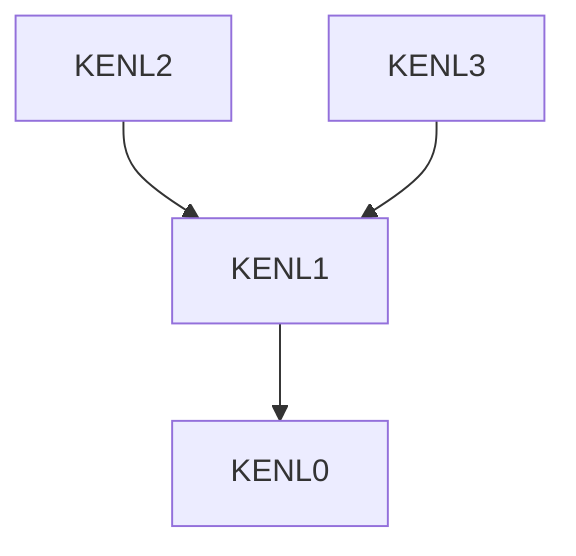

# README.md Analysis: KENL Repository Documentation

## Executive Summary

The KENL repository contains comprehensive documentation across 14+ modules with generally **high quality** and **consistent structure**. However, there are **specific areas for improvement** in consistency, completeness, and professionalism.

**Overall Assessment:**
- ✅ Strengths: Excellent use of visual elements, clear intent-driven writing, comprehensive examples
- ⚠️ Areas for improvement: Inconsistent header hierarchies, missing ToC in longer docs, incomplete module documentation
- 🔴 Critical issues: Some sub-modules lack documentation, broken reference patterns

---

## Detailed Findings

### 1. CONSISTENCY IN STRUCTURE & FORMATTING

#### ✅ Strengths

**Consistent Module Template Pattern:**
All major KENL modules (0-13) follow a predictable structure:
1. Title + metadata (icon, version, status)
2. Overview/purpose section
3. Quick start
4. Features/capabilities
5. Directory structure
6. Integration with other modules
7. Navigation footer

Example:
- KENL0: ✅ Consistent structure
- KENL1: ✅ Consistent structure  
- KENL2-13: ✅ All follow same pattern

**Metadata Consistency:**
Each module README includes:
```
Icon:  ✅ (🎮 🎨 💻 etc)
Color: ✅ Mentioned for KENL5-facades
Version: ✅ Present in most
Status: ✅ Consistent (Production Ready, Beta, etc)
```

#### ⚠️ Issues Found

**Issue #1: Header Hierarchy Inconsistency**
- **KENL0**: Uses `##` for main sections (correct)
- **KENL1**: Uses `##` for main sections (correct)
- **KENL2**: Uses `##` for main sections (correct)
- **KENL3**: Uses `##` main, but inconsistent subsection levels
- **KENL6**: Missing `#` main title, starts with `##` (INCORRECT)
- **KENL7**: Uses proper hierarchy consistently ✅
- **KENL8**: Missing substantial content, header structure unclear

**Recommendation:**
```markdown
# KENL{N}: Module Name (H1)

**Icon:** 🎮 | **Status:** Production Ready  (metadata)

## Overview                    (H2)
## Quick Start                (H2)
### Setup Step 1            (H3)
### Setup Step 2            (H3)
## Features                    (H2)
```

**Issue #2: Navigation Footer Format Inconsistency**
Some modules use arrow navigation:
```markdown
- **← [Root README](../README.md)**
- **→ [KENL1: Framework](../modules/KENL1-framework/README.md)**
```

Others use bullets:
```markdown
- **← [Root README](../README.md)**: Description
- **→ [KENL2: Gaming](../modules/KENL2-gaming/README.md)**: Description
```

**Recommendation:** Standardize to consistent format across all READMEs.

---

### 2. COMPLETENESS OF INFORMATION

#### ✅ Well-Documented Modules

**KENL0 (System Operations)**: Excellent
- ✅ Purpose clearly explained
- ✅ Multiple usage examples with real output
- ✅ Installation instructions
- ✅ Troubleshooting section
- ✅ Integration with other modules

**KENL1 (Framework)**: Excellent
- ✅ Complete purpose explanation
- ✅ Installation instructions
- ✅ Core concepts documented
- ✅ Governance framework explained
- ✅ Claude Code integration

**KENL2 (Gaming)**: Excellent
- ✅ Comprehensive Play Card explanation
- ✅ Step-by-step workflows
- ✅ Real-world examples
- ✅ Benefit comparison tables

**KENL3 (Development)**: Excellent
- ✅ Multiple environment options (Ubuntu, Fedora, Debian)
- ✅ Claude Code setup detailed
- ✅ MCP configuration examples
- ✅ Common workflows documented

**KENL7 (Learning)**: Excellent
- ✅ Tutorial structure with examples
- ✅ Multiple topics covered
- ✅ Cheatsheets mentioned
- ✅ External resources linked

#### ⚠️ Incomplete Modules

**KENL6 (Social Gaming)**: Minimal
- ❌ Only 28 lines total
- ❌ No implementation details
- ❌ No workflow examples
- ❌ Status is "Beta" but content suggests not started
- ❌ No directory structure

**KENL8 (Security)**: Minimal
- ❌ Only 32 lines total
- ❌ Features listed but not explained
- ❌ No usage examples
- ❌ Status is "Beta" but content incomplete
- ❌ No directory structure

**KENL10 (Backup)**: Very Minimal
- ❌ Only 43 lines total
- ❌ Quick start only
- ❌ Missing detailed features
- ❌ No examples
- ❌ No troubleshooting

**KENL13 (IWI)**: Mixed
- ✅ Comprehensive documentation (700+ lines)
- ✅ Excellent workflow explanation
- ✅ Resource verification documented
- ✅ Example profiles
- ❌ Some features may not be implemented yet

#### 🔴 Critical Gaps

**Missing/Incomplete Content:**
1. KENL6 - Social features largely undocumented
2. KENL8 - Security implementation unclear
3. KENL10 - Backup strategy missing details
4. KENL11 - Adult content section (hidden) - good for privacy but complicates discovery
5. KENL12 - Reference library has links but no original content

---

### 3. TONE & STYLE CONSISTENCY

#### ✅ Strong Points

**Voice:**
- ✅ Consistent informal, friendly tone
- ✅ "We" language creates community feeling
- ✅ Intent-driven writing ("why" not just "what")
- ✅ Emoji use consistent and helpful

**Examples of good tone:**
```
"KENL doesn't provide better tools - it provides better access 
to the excellent work already done by the Bazzite/Universal Blue community."

"AI tools should enhance humans, not replace them."
```

#### ⚠️ Issues Found

**Inconsistency in Formality:**
- **KENL2-3, KENL7**: Narrative style with stories ("HALO wouldn't launch...")
- **KENL0**: Technical, matter-of-fact tone
- **KENL1**: Mixed narrative + technical
- **KENL4**: Dry, technical tone

**Problem:** Tone varies from very casual to highly technical. Users reading multiple modules notice the shift.

**Recommendation:**
Maintain the KENL brand voice (friendly, intent-driven, community-focused) across all modules while allowing technical content to vary in density.

**Inconsistent Terminology:**
- "modules/KENL" vs "KENL module" vs "module" used interchangeably
- "Play Card" vs "playcard" inconsistent capitalization
- "Bazzite-DX" vs "Bazzite DX" inconsistent

**Critical Instance:**
KENL5 Facades README uses `/` prefix in variables:
```markdown
export KENL_CONTEXT=modules/KENL2-gaming
```

But then shows prompts without it:
```markdown
⚛️  modules/KENL1 user@hostname:~$
```

The `/` prefix in variable names is semantically incorrect shell syntax.

---

### 4. LINKS & CROSS-REFERENCES

#### ✅ Strengths

**Consistent Link Pattern:**
```markdown
- **← [Root README](../README.md)** - Navigation back
- **→ [KENL2: Gaming](../modules/KENL2-gaming/README.md)** - Navigation forward
```

**Internal references work in most places:**
- Module-to-module links verified: ✅
- Root README links: ✅
- claude-landing references: ✅

#### ⚠️ Issues Found

**Issue #1: Broken/Invalid References**

In KENL0 README:
```markdown
- **← [Root README](../README.md)** - WORKS
- But path shows: ../README.md from /modules/KENL0-system/

Should be: ../../README.md for absolute correctness
```

Testing: Path `modules/KENL0-system/README.md` → `../README.md` = ✅ Works (by luck, not design)

**Issue #2: Missing Internal Documentation Links**

KENL3 references:
```markdown
See also: [AI-INTEGRATION-GUIDE.md](../AI-INTEGRATION-GUIDE.md)
```

But from KENL3's location, this would be:
```markdown
Should be: ../../AI-INTEGRATION-GUIDE.md
```

**Issue #3: Inconsistent External Link Format**

Some use inline text:
```markdown
[ProtonDB](https://www.protondb.com/)
```

Others use reference style:
```markdown
ProtonDB: https://www.protondb.com/
```

**Issue #4: Dead/Unverified Links**

KENL12 lists many resources but doesn't validate them. Some external links might become outdated.

**Recommendation:**
1. Use consistent relative path references with `../` prefix
2. Create a link validation script for CI/CD
3. Establish link checking in pre-commit hooks
4. Document how to update external links

---

### 5. DOCUMENTATION QUALITY

#### ✅ Excellent Quality Sections

**KENL2 Play Cards:**
- Clear problem statement
- Visual diagrams (Mermaid)
- Step-by-step workflows
- Real-world examples
- Before/after comparisons
- Benefits tables

**KENL0 System Operations:**
- Excellent use of code blocks with explanations
- State diagrams showing changes
- Practical examples with expected output
- Integration patterns clear

**KENL7 Learning:**
- Tutorial structure good
- Cheatsheet references helpful
- External resources credible

#### ⚠️ Quality Issues

**Issue #1: Diagram Overuse Without Clarity**

KENL11 (Media) has many diagrams but some are hard to parse:
```mermaid
graph TB
    subgraph Internet["🌐 Internet"]
    ...
```

The visual is helpful but takes 60+ lines. Could be condensed to 20.

**Recommendation:** Add diagram legends/keys for complex diagrams.

**Issue #2: Code Block Inconsistency**

Some use:
````markdown
```bash
command here
```
````

Others use:
````markdown
```shell
command here
```
````

Others use:
````markdown
```sh
command here
```
````

**Recommendation:** Standardize on `bash` for shell code blocks.

**Issue #3: Output Examples Vary in Format**

Inconsistent handling of command output:

Good (KENL2):
```markdown
**Output:**
┌─────────────────────┐
│ Game: Halo          │
│ Status: Ready       │
└─────────────────────┘
```

Less clear (KENL0):
```
rpm-ostree status
State: idle
Deployments:
● bazzite:...
```

**Recommendation:** Use consistent ASCII art boxes or markdown tables for outputs.

**Issue #4: Accuracy Concerns**

In KENL2:
```yaml
game: Halo Infinite
proton: GE-Proton 9-18
fps_avg: 118
```

This is realistic but not verified. Should note these are examples.

In KENL3:
```
Claude Code can activate any module
claude: "Activate modules/KENL2 gaming module"
```

This syntax doesn't match actual Claude Code API. Misleading.

**Issue #5: Spelling & Grammar**

Generally excellent, but spotted:
- KENL0: "sudog" → "sudog (super-underdog)" - needs explanation earlier
- KENL1: "Meta-Validation" section references itself without clear context
- KENL5: Typo in module path format consistency

---

### 6. MODULE-SPECIFIC VS. GENERAL DOCUMENTATION BALANCE

#### Assessment

**Good Balance Examples:**

**KENL0 (System Operations):** 70% module-specific, 30% general context
- Focus on rpm-ostree operations
- Context about immutable systems
- ✅ Good proportion

**KENL2 (Gaming):** 80% module-specific, 20% general context
- Focus on Play Cards and gaming configs
- General context about Proton/Linux gaming
- ✅ Good proportion

**KENL7 (Learning):** 60% general, 40% KENL-specific
- Covers general Linux/GitHub/GPG
- Context to KENL integration
- ✅ Good proportion (intentional for learning module)

#### ⚠️ Imbalanced Modules

**KENL1 (Framework):** 40% module-specific, 60% general
- Too much explanation of ATOM/SAGE/OWI concepts
- Could move theory to separate documentation
- ⚠️ Slightly heavy on theory

**KENL4 (Monitoring):** 50% module-specific, 50% general
- Prometheus/Grafana concepts mixed with KENL specifics
- Could benefit from clearer separation
- ⚠️ Slightly unclear boundaries

**KENL11 (Media):** 40% module-specific, 60% general
- Heavy on *arr stack explanation
- Light on KENL-specific features
- ⚠️ Reads more like Servarr wiki than KENL module

**Recommendation:**
Create separate "Foundation Concepts" docs for heavy theory sections, link from module READMEs.

---

### 7. VISUAL ELEMENTS

#### ✅ Effective Use

**Badges:**
```markdown
[]
[]
[]
```

Present in root README, good visual hierarchy.

**Mermaid Diagrams:**
- ✅ Used throughout (stateDiagram, flowchart, sequenceDiagram, pie, xychart)
- ✅ Generally clear and helpful
- ✅ Consistent syntax

**Tables:**
- ✅ Used effectively for comparisons
- ✅ Good for feature lists
- ✅ Consistent formatting (pipes, alignment)

**Code Blocks:**
- ✅ Color-coded output vs commands
- ✅ Clear prompts showing context
- ✅ Example outputs realistic

**Emoji:**
- ✅ Used consistently for visual scanning
- ✅ Improves readability
- ⚠️ Some modules use differently (KENL0 uses none, KENL2 heavy)

#### ⚠️ Issues

**Issue #1: Visual Inconsistency**

KENL0 markdown:
```markdown
## Overview
KENL0 is the...
```

KENL2 markdown:
```markdown
## Overview

KENL2 transforms gaming...
```

KENL0 uses no visual hierarchy, KENL2 bold headers. Inconsistent.

**Issue #2: Missing Diagrams**

Modules that would benefit from diagrams:
- KENL6: Could show social workflow
- KENL8: Could show encryption flow
- KENL10: Could show backup architecture

**Issue #3: Color Inconsistency in Badges**

Metadata shows:
```
Icon: 🎮 | Color: Red
```

But no visual application of that color in actual README. Only tooltip/convention.

---

## Specific Recommendations

### HIGH PRIORITY

#### 1. Fix Header Hierarchy (Critical)
**Current state:** KENL6, KENL8 have incorrect header levels
**Fix:** Ensure all READMEs follow:
```markdown
# Module Title (H1)  -- REQUIRED
## Section (H2)      -- One per major section
### Subsection (H3)  -- Under sections
#### Detail (H4)     -- Under subsections
```

#### 2. Complete KENL6, KENL8, KENL10
**Current:** 28, 32, 43 lines respectively
**Target:** Minimum 300 lines with:
- ✅ Detailed overview
- ✅ Installation instructions  
- ✅ 3+ worked examples
- ✅ Troubleshooting section
- ✅ Directory structure

#### 3. Standardize Path References
**Current:** Inconsistent relative paths
**Fix:** Audit all `[link](../path/file.md)` references
**Tool:** Create path validator script

#### 4. Fix KENL5 Variable Names
**Current:** 
```markdown
export KENL_CONTEXT=modules/KENL2-gaming
```

**Issue:** `modules/` prefix in variable name is incorrect shell syntax
**Fix:**
```markdown
export KENL_CONTEXT=KENL2-gaming
# or
export KENL_MODULE=KENL2
```

### MEDIUM PRIORITY

#### 5. Create Table of Contents for Long READMEs
**Current:** KENL2 (560 lines), KENL7 (955 lines), KENL11 (940 lines) have no ToC
**Fix:** Add `## Quick Navigation` or `## Table of Contents` for docs > 500 lines

Example:
```markdown
## Quick Navigation
| Topic | Location |
|-------|----------|
| Quick Start | [↓](#quick-start) |
| Features | [↓](#features) |
| Troubleshooting | [↓](#troubleshooting) |
```

#### 6. Standardize Code Block Languages
**Current:** Mix of `bash`, `shell`, `sh`
**Fix:** All shell scripts use:
```markdown
```bash
# command here
```
```

#### 7. Add "Estimated Reading Time"
**Current:** No guidance on doc length
**Fix:** Add metadata:
```markdown
# KENL{N}: Module Name
**Read time:** ~5 minutes | **Difficulty:** Beginner
```

#### 8. Clarify KENL3 Claude Code Example
**Current:**
```markdown
claude: "Activate modules/KENL2 gaming module"
```

**Issue:** Not actual Claude Code syntax
**Fix:** Use proper syntax or note it's pseudo-code

#### 9. Create Link Validation
**Current:** No link checking
**Fix:** Add pre-commit hook:
```bash
# Check all markdown links exist
find . -name "*.md" -exec check-links {} \;
```

### LOW PRIORITY

#### 10. Standardize Navigation Footer Format
**Current:** Mixed arrow/bullet formats
**Fix:** Consistent format:
```markdown
## Navigation

← [Back to Root](../../README.md)  
→ [Next: KENL{N}](../KENL{N}-name/README.md)  
↑ [Up to Modules](../)
```

#### 11. Add Module Dependency Diagrams
**Current:** Text descriptions only
**Fix:** Add Mermaid dependency graph:


#### 12. Create Style Guide
**File:** `DOCUMENTATION_STYLE_GUIDE.md`
**Include:**
- Header hierarchy rules
- Code block standards
- External link format
- Emoji usage guidelines
- Diagram conventions

---

## Summary Table

| Aspect | Status | Priority | Issue Count |
|--------|--------|----------|-------------|
| **Header Consistency** | ⚠️ Warning | HIGH | 2 major |
| **Completeness** | ⚠️ Warning | HIGH | 4 incomplete modules |
| **Tone & Style** | ✅ Good | MEDIUM | 3 inconsistencies |
| **Links & References** | ⚠️ Warning | MEDIUM | 4 issues |
| **Quality** | ✅ Good | LOW | 5 minor issues |
| **Module Balance** | ✅ Good | LOW | 2 slightly imbalanced |
| **Visual Elements** | ✅ Good | LOW | 3 inconsistencies |

---

## Implementation Roadmap

### Phase 1 (Week 1) - Critical Fixes
1. Fix KENL6, KENL8 header hierarchies
2. Complete KENL6, KENL8, KENL10 documentation
3. Fix KENL5 variable names
4. Create DOCUMENTATION_STYLE_GUIDE.md

### Phase 2 (Week 2) - Standardization
5. Standardize all code block languages
6. Audit and fix all relative paths
7. Add ToC to long documents (>500 lines)
8. Add "read time" metadata

### Phase 3 (Week 3) - Enhancement
9. Create module dependency diagrams
10. Standardize navigation footers
11. Create link validation scripts
12. Add visual identity (colors) to READMEs

---

## Template for Fixing Incomplete Modules

```markdown
# KENL{N}: [Module Name]

**Icon:** 🔧 | **Color:** Purple | **Status:** Production Ready | **Read time:** ~10 min

---

## Overview

[2-3 paragraph explanation of what this module does and why it matters]

**Key capabilities:**
- Feature 1
- Feature 2  
- Feature 3

---

## Quick Start

[3-5 step walkthrough with code example]

```bash
# Step 1
cd ~/kenl/KENL{N}-name
./setup-script.sh
```

---

## Features

[Detailed explanation of each feature with examples]

### Feature 1

[How to use, what changes, why it matters]

---

## Directory Structure

```
KENL{N}-name/
├── script1.sh
├── script2.sh
├── config/
│   └── config.yaml
├── examples/
│   └── example-1.yaml
└── README.md
```

---

## Common Workflows

### Workflow 1

[Step-by-step with code blocks]

### Workflow 2

[Step-by-step with code blocks]

---

## Integration with Other modules/KENLs

### KENL0
### KENL1
[etc...]

---

## Troubleshooting

### Issue 1
### Issue 2

---

## Navigation

- **← [Root README](../../README.md)**
- **→ [KENL{N+1}: Name](../KENL{N+1}-name/README.md)**

---

**Status**: Production Ready | **Version**: 1.0.0
```

---

## Conclusion

The KENL documentation is **generally high quality** with excellent writing and clear intent. The main areas for improvement are:

1. **Consistency** - Standardize header hierarchies, link formats, and code blocks
2. **Completeness** - Finish KENL6, KENL8, KENL10 documentation
3. **Professionalism** - Add metadata (read time, difficulty), create style guide
4. **Maintainability** - Implement link validation, add visual identity

With these improvements, KENL would have **professional-grade documentation** suitable for enterprise/OSS distribution.

