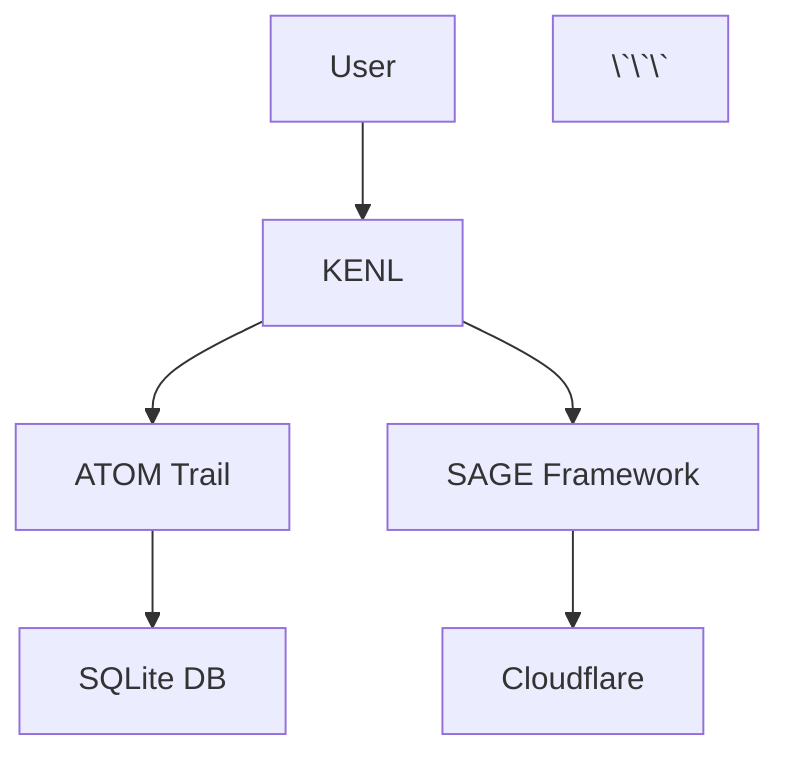

# KENL Visual Elements Standard

**Reproducible visual identity for documentation, terminal output, and AI-generated content.**

---

## Purpose

Maintain consistent, professional visual presentation across:
- README files and documentation
- Terminal output (bash scripts, PowerShell modules)
- AI-generated content (Claude Code, Qwen)
- Web interfaces (Play Card sharing, ATOM trail viewers)

**Design Principle:** "Clarity without clutter, personality without distraction."

---

## Color Palette

### Terminal ANSI Colors

```bash
# KENL Standard Color Variables (bash)
KENL_GREEN="\033[0;32m"    # Success, OK status
KENL_BLUE="\033[0;34m"     # Info, neutral messages
KENL_YELLOW="\033[1;33m"   # Warnings, attention needed
KENL_RED="\033[0;31m"      # Errors, critical issues
KENL_CYAN="\033[0;36m"     # Highlights, ATOM tags
KENL_MAGENTA="\033[0;35m"  # Module identifiers
KENL_BOLD="\033[1m"        # Emphasis
KENL_RESET="\033[0m"       # Reset to default
```

**PowerShell equivalent:**

```powershell
# KENL Standard Colors (PowerShell)
$KenlColors = @{
    Success = "Green"
    Info = "Cyan"
    Warning = "Yellow"
    Error = "Red"
    Highlight = "Magenta"
    Bold = "White"
}

# Usage
Write-Host "✅ Success" -ForegroundColor $KenlColors.Success
Write-Host "⚠️  Warning" -ForegroundColor $KenlColors.Warning
```

### Web/Documentation Hex Colors

```css
/* KENL Brand Colors */
--kenl-primary: #5865F2;      /* Discord-inspired blue (brand) */
--kenl-success: #57F287;      /* Bright green */
--kenl-warning: #FEE75C;      /* Soft yellow */
--kenl-danger: #ED4245;       /* Muted red */
--kenl-info: #00AFF4;         /* Bright cyan */
--kenl-gaming: #ED4245;       /* Gaming red */
--kenl-dev: #00AFF4;          /* Dev cyan */
--kenl-system: #5865F2;       /* System blue */

/* Backgrounds */
--kenl-bg-dark: #2C2F33;      /* Terminal background */
--kenl-bg-light: #FFFFFF;     /* Documentation background */
--kenl-bg-code: #23272A;      /* Code block background */
```

---

## Typography

### README Hierarchy

```markdown
# H1: Page Title (One per document)
## H2: Major Sections
### H3: Subsections
#### H4: Detailed Topics

**Bold** for emphasis
*Italic* for definitions or technical terms
`inline code` for commands, file paths, variable names
```

**Rules:**
- H1 title matches filename (e.g., `CLAUDE.md` → "# CLAUDE.md")
- H2 sections use sentence case ("Quick Start" not "Quick start")
- H3+ sections use title case for major topics
- No emoji in headers (except H1 if appropriate)

### Code Blocks

````markdown
```bash
# Bash scripts - always specify language
echo "Hello KENL"
```

```powershell
# PowerShell - always specify language
Write-Host "Hello KENL"
```

```yaml
# YAML configs - always specify language
game: "Halo MCC"
```
````

**Rules:**
- Always specify language (no bare ` ``` ` blocks)
- Standardize on: `bash`, `powershell`, `yaml`, `json`, `python`, `javascript`
- Include comments explaining complex commands
- Keep line length < 100 characters where possible

---

## Emoji Usage

### Standard Emoji Set

| Emoji | Meaning | Usage | Example |
|-------|---------|-------|---------|
| ✅ | Success, completed | Task completion, validation passed | `✅ Tests passed` |
| ❌ | Failure, error | Validation failed, operation rejected | `❌ Invalid Play Card` |
| ⚠️  | Warning | Non-critical issues, attention needed | `⚠️  Low safety score` |
| 🔍 | Search, validation | Scanning, analyzing | `🔍 Validating Play Card...` |
| ⚙️  | Configuration, system | System operations, settings | `⚙️  Applying config...` |
| 🎮 | Gaming | Gaming-related operations | `🎮 KENL2 Gaming` |
| 💻 | Development | Dev environments, code | `💻 KENL3 Development` |
| 🔐 | Security | Encryption, auth, permissions | `🔐 KENL8 Security` |
| 📦 | Package, install | Installation, dependencies | `📦 Installing Ollama...` |
| 🚀 | Launch, deploy | Starting services, deployments | `🚀 Launching game...` |
| 🔄 | Rollback, sync | Reverting changes, syncing | `🔄 Rolling back...` |
| 📋 | Documentation, logs | README files, ATOM trails | `📋 Preview changes` |
| 🏷️  | Tags, labels | ATOM tags, metadata | `🏷️  ATOM-CFG-001` |
| 🛡️  | Protection, safety | Security scores, validation | `🛡️  Safety Score: 0.85` |
| 💡 | Tip, suggestion | Helpful hints, recommendations | `💡 Tip: Use GE-Proton` |
| 🚩 | Flag, alert | Failed validation, mismatch | `🚩 FLAG MISMATCH` |
| 🏴 | New flag | Flag creation notification | `🏴 FLAG ADDED` |
| ⏸️  | Pause, wait | User input required | `⏸️  Confirm to proceed` |

**Rules:**
- **README headers:** No emoji in H2-H4 headers (cluttered)
- **Terminal output:** 1 emoji per line maximum
- **Documentation sections:** Emoji at start of section for clarity
- **Code comments:** No emoji (reduces readability in editors)

---

## Terminal Output Standards

### Status Messages

**Template:**

```bash
# Success
echo -e "${KENL_GREEN}✅ ${KENL_RESET}Operation completed successfully"

# Info
echo -e "${KENL_CYAN}🔍 ${KENL_RESET}Validating configuration..."

# Warning
echo -e "${KENL_YELLOW}⚠️  ${KENL_RESET}Low disk space detected"

# Error
echo -e "${KENL_RED}❌ ${KENL_RESET}Failed to connect to server"
```

**Output:**

```
✅ Operation completed successfully
🔍 Validating configuration...
⚠️  Low disk space detected
❌ Failed to connect to server
```

### Progress Indicators

```bash
# Simple spinner
echo -n "⚙️  Processing..."
for i in {1..10}; do
    echo -n "."
    sleep 0.5
done
echo " ✅ Done"

# Progress percentage
for i in {0..100..10}; do
    echo -ne "📦 Installing: $i%\r"
    sleep 0.5
done
echo -e "📦 Installing: 100% ✅"
```

### ATOM Trail Output

```bash
echo -e "${KENL_CYAN}🏷️  ${KENL_BOLD}ATOM-CFG-20251114-001${KENL_RESET}"
echo -e "   ${KENL_BLUE}Description:${KENL_RESET} Installed MangoHud for GPU monitoring"
echo -e "   ${KENL_BLUE}Timestamp:${KENL_RESET} 2025-11-14 14:32:05"
echo -e "   ${KENL_BLUE}Rollback:${KENL_RESET} sudo rpm-ostree uninstall mangohud"
```

**Output:**

```
🏷️  ATOM-CFG-20251114-001
   Description: Installed MangoHud for GPU monitoring
   Timestamp: 2025-11-14 14:32:05
   Rollback: sudo rpm-ostree uninstall mangohud
```

---

## Documentation Templates

### README Template (Module)

````markdown
# KENL{N}-{Module Name}

**{One-sentence description}**

---

## Purpose

{2-3 paragraphs explaining what this module does and why it exists}

---

## Features

- ✅ **Feature 1** - Description
- ✅ **Feature 2** - Description
- ✅ **Feature 3** - Description

---

## Quick Start

```bash
# Example usage
command --option value
```

---

## Installation

{Step-by-step installation instructions}

---

## Usage

### Basic Example

{Simple, copy-pasteable example}

### Advanced Example

{Complex example with explanations}

---

## Configuration

{How to configure this module}

---

## Troubleshooting

### Issue: {Common problem}

**Cause:** {Why it happens}

**Fix:**
```bash
# Solution command
```

---

## ATOM Trail

```
ATOM-{TYPE}-{YYYYMMDD}-{NNN}: {Description}
Intent: {Why this change was made}
Validation: {How to verify it works}
Rollback: {How to undo it}
```

---

**Last Updated**: {YYYY-MM-DD}
**Status**: {production | beta | alpha}
**Dependencies**: {List of dependencies}
````

### Guide Template

````markdown
---
title: {Guide Title}
date: {YYYY-MM-DD}
atom: ATOM-DOC-{YYYYMMDD}-{NNN}
classification: OWI-DOC
status: {production | beta | draft}
platform: {Bazzite | Linux | Windows | macOS}
---

# {Guide Title}

**{One-sentence description}**

---

## Prerequisites

1. {Requirement 1}
2. {Requirement 2}
3. {Requirement 3}

---

## Step-by-Step Instructions

### Step 1: {Action}

{Detailed explanation}

```bash
# Commands
```

**Expected output:**
```
{Example output}
```

### Step 2: {Next action}

{Continue...}

---

## Verification

{How to verify the setup works}

---

## Troubleshooting

{Common issues and fixes}

---

## Resources

- {Link 1}
- {Link 2}

---

**ATOM**: ATOM-DOC-{YYYYMMDD}-{NNN}
**Last Updated**: {YYYY-MM-DD}
**Tested On**: {Platform and version}
````

---

## Badge Standards

### README Badges

**Standard badges (all READMEs):**

```markdown
[](https://opensource.org/licenses/MIT)
[]()
[]()
```

**Optional badges:**

```markdown
[]()
[]()
[]()
```

**Color scheme:**
- **Green** (`brightgreen`, `green`): Success, passing, production
- **Yellow** (`yellow`, `orange`): Warnings, licenses, beta
- **Red** (`red`, `critical`): Errors, failing, deprecated
- **Blue** (`blue`, `blueviolet`): Info, version, platform

---

## Diagram Standards

### Mermaid for Architecture Diagrams

```markdown


**Rules:**
- Use Mermaid for simple diagrams (< 10 nodes)
- Use ASCII art for terminal-friendly diagrams
- Use linked images for complex diagrams (store in `docs/images/`)

### ASCII Art for Terminal Output

```
┌─────────────────────────────────────┐
│         KENL System Stack           │
├─────────────────────────────────────┤
│  KENL Modules (0-12)                │
│  ├─ ATOM Trail (Audit)              │
│  ├─ SAGE Framework (Docs)           │
│  └─ OWI (AI Integration)            │
├─────────────────────────────────────┤
│  Bazzite (Immutable Base)           │
│  └─ Fedora Atomic + rpm-ostree      │
└─────────────────────────────────────┘
```

**Tools:**
- https://textik.com/ - ASCII diagram generator
- https://asciiflow.com/ - Interactive ASCII drawing

---

## AI-Generated Content Markers

### Required Headers for AI Content

```markdown
<!-- AI-GENERATED: Claude Sonnet 4.5 (2025-11-14) -->
<!-- REVIEWED: Matthew Ruhnau (2025-11-14) -->

# Document Title

{AI-generated content}
```

**Rules:**
- **Disclose AI use** in first comment
- **Include review date** (human validation)
- **Mark unreviewed content** with `<!-- UNREVIEWED -->`
- **Use AI-assisted comments** in code:

```bash
#!/bin/bash
# AI-assisted: Claude generated initial scaffold
# Reviewed: Matthew Ruhnau (2025-11-14)

function validate_playcard() {
    # Implementation
}
```

---

## Link Formatting

### Internal Links (Relative)

```markdown
<!-- Good: Relative path -->
[KENL2 Gaming](./modules/KENL2-gaming/)
[Play Cards](../play-cards/halo-mcc.yaml)

<!-- Bad: Absolute path or GitHub URL -->
[KENL2](/home/user/kenl/modules/KENL2-gaming/)
[Play Cards](https://github.com/toolate28/kenl/blob/main/...)
```

### External Links (Descriptive Text)

```markdown
<!-- Good: Descriptive text -->
[ProtonDB Halo MCC Reports](https://www.protondb.com/app/976730)

<!-- Bad: Bare URL -->
https://www.protondb.com/app/976730
```

### Footnotes for Citations

```markdown
Gaming on Linux achieved 89.7% Windows game compatibility in 2025[^1].

[^1]: [Boiling Steam ProtonDB Analysis](https://boilingsteam.com/protondb-2025-analysis/)
```

---

## Reproducibility Checklist

Use this checklist when creating documentation or scripts:

```markdown
## Visual Elements Checklist

- [ ] Colors defined from KENL standard palette
- [ ] Emoji usage follows standard set (max 1 per line)
- [ ] Headers follow hierarchy (H1 → H2 → H3)
- [ ] Code blocks specify language (bash, powershell, yaml)
- [ ] Badges use standard format and colors
- [ ] Links are relative (internal) or descriptive (external)
- [ ] AI-generated content marked with headers
- [ ] ATOM tag format validated (ATOM-{TYPE}-{DATE}-{NUM})
- [ ] Terminal output uses status message templates
- [ ] README follows standard template structure
```

---

## Examples

### Example 1: Script Output (Good)

```bash
#!/bin/bash
# ~/.kenl/bin/apply-playcard.sh

KENL_GREEN="\033[0;32m"
KENL_CYAN="\033[0;36m"
KENL_RESET="\033[0m"

echo -e "${KENL_CYAN}🔍${KENL_RESET} Validating Play Card..."
echo -e "${KENL_GREEN}✅${KENL_RESET} Validation passed"
echo -e "${KENL_CYAN}🏷️  ${KENL_RESET}ATOM-PLAYCARD-20251114-001"
```

**Output:**
```
🔍 Validating Play Card...
✅ Validation passed
🏷️  ATOM-PLAYCARD-20251114-001
```

### Example 2: README Header (Good)

```markdown
# KENL2-Gaming

**Play Cards, Proton optimization, and gaming configurations for Bazzite Linux.**

[](https://opensource.org/licenses/MIT)
[]()
[]()
```

### Example 3: AI-Generated Guide (Good)

```markdown
---
title: Ollama Setup Guide
date: 2025-11-14
atom: ATOM-DOC-20251114-004
---

<!-- AI-GENERATED: Claude Sonnet 4.5 (2025-11-14) -->
<!-- REVIEWED: Matthew Ruhnau (2025-11-14) -->

# Ollama Setup Guide

{Content follows standard guide template...}
```

---

## ATOM Trail

```
ATOM-DOC-20251114-007: Created KENL Visual Elements Standard for reproducible professional presentation
Intent: Ensure consistency across documentation, terminal output, and AI-generated content
Validation: All new documentation should follow these standards
Rollback: N/A (documentation standard only)
Next: Apply standards to existing documentation, create linter for enforcement
```

---

**Last Updated**: 2025-11-14
**Status**: Production
**Usage**: Reference this document when creating or reviewing KENL documentation and code
