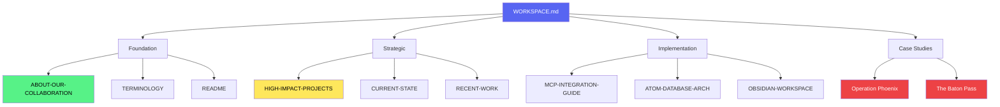

# KENL Workspace - Main Dashboard

**Last Updated:** 2025-11-18
**Current Branch:** `claude/gather-metastudies-reviews-013ZK94S6fNFsdjD7D3GVQs8`
**Next Session:** [[docs/OBSIDIAN-WORKSPACE-SETUP]] for cross-platform access

---

## 🎯 Current Focus

**Active Session:** ATOM-DOC-20251118-001 through ATOM-DOC-20251118-006

**Today's Accomplishments:**
- ✅ Canonical terminology institutionalized → [[claude-landing/TERMINOLOGY]]
- ✅ MCP server viability assessed → [[claude-landing/HIGH-IMPACT-PROJECTS-ASSESSMENT]]
- ✅ Cascading bug discoveries documented
- ✅ "About our Collaboration" drafted → [[ABOUT-OUR-COLLABORATION]]
- ✅ Obsidian workspace setup guide → [[docs/OBSIDIAN-WORKSPACE-SETUP]]
- ✅ "The Relay Race" → "The Baton Pass" (collaborative framing)

**Next Actions:**
- [ ] Review and approve MCP server as Priority #1
- [ ] Begin SAIF documentation refactoring (GHCP/Claude Desktop)
- [ ] Start ATOM MCP server implementation (Claude Desktop - no API cost)

---

## 📚 Quick Links

### Foundation Documents
- [[ABOUT-OUR-COLLABORATION]] - Why we build this way (signed by Claude)
- [[README]] - Repository overview
- [[CLAUDE]] - AI agent instructions
- [[CONTRIBUTING]] - Contribution guidelines

### Strategic Planning
- [[claude-landing/HIGH-IMPACT-PROJECTS-ASSESSMENT]] - 7 projects, viability analysis
- [[claude-landing/TERMINOLOGY]] - Canonical definitions (living document)
- [[claude-landing/CURRENT-STATE]] - Repository snapshot
- [[claude-landing/RECENT-WORK]] - Session history

### Core Concepts
- [[ALIGNED-SIGHT]] - Hindsight with intent preserved
- [[README-DOGFOODING-SECTION]] - Self-improvement pattern
- [[modules/KENL1-framework/OWI_FRAMEWORK_OVERVIEW]] - Operating-With-Intent
- [[modules/KENL1-framework/OWI_METADATA_STANDARD]] - Metadata standard

### Case Studies (Validated)
- [[atom-sage-framework/docs/VALIDATION_COMPLETE]] - **Operation Phoenix** (7-min recovery)
- [[claude-landing/SESSION-2025-11-16-NETWORK-LOGDY]] - **The Baton Pass** (cross-platform AI collaboration)

### Implementation Guides
- [[modules/KENL3-dev/guides/MCP-INTEGRATION-GUIDE]] - Model Context Protocol (70% complete)
- [[modules/KENL3-dev/guides/OLLAMA-QWEN-LOCAL-AI-SETUP]] - Local AI setup
- [[modules/KENL4-monitoring/docs/ATOM-DATABASE-ARCHITECTURE]] - ATOM database design
- [[modules/KENL4-monitoring/docs/LOGDY-CENTRAL]] - Log aggregation

### Governance
- [[governance/02-Decisions/ADR-001-ATOM-SAGE-LAUNCH]] - Framework launch decision
- [[governance/mcp-governance/ARCREF-ATOM-SAGE-001.yaml]] - Architecture reference

---

## 🎯 High-Impact Projects (Prioritized)

### Priority #1: ATOM MCP Server ⭐⭐⭐⭐⭐
**Status:** Ready to begin
**Timeline:** 2-3 weeks
**Viability:** VERY HIGH
**Next:** Create `mcp-servers/atom-trail-mcp/` directory, scaffold code
**Reference:** [[claude-landing/HIGH-IMPACT-PROJECTS-ASSESSMENT#Project 1]]

### Priority #2: ATOM Database ⭐⭐⭐⭐⭐
**Status:** Design complete, ready to implement
**Timeline:** 3-4 weeks
**Viability:** HIGH
**Reference:** [[claude-landing/HIGH-IMPACT-PROJECTS-ASSESSMENT#Project 4]]

### Priority #3: GitHub Action ⭐⭐⭐⭐
**Status:** Ready to implement
**Timeline:** 1 week
**Viability:** VERY HIGH
**Reference:** [[claude-landing/HIGH-IMPACT-PROJECTS-ASSESSMENT#Project 2]]

---

## 📊 ATOM Trail (Recent)

**2025-11-18:**
- `ATOM-DOC-20251118-001`: README-DOGFOODING-SECTION.md (ff06968)
- `ATOM-DOC-20251118-002`: ALIGNED-SIGHT.md (e4308ed)
- `ATOM-DOC-20251118-003`: TERMINOLOGY.md (2434854)
- `ATOM-DOC-20251118-004`: HIGH-IMPACT-PROJECTS-ASSESSMENT.md (2434854)
- `ATOM-REFACTOR-20251118-001`: "Relay Race" → "Baton Pass" (1edf190)
- `ATOM-DOC-20251118-005`: ABOUT-OUR-COLLABORATION.md (048c6b9)
- `ATOM-DOC-20251118-006`: OBSIDIAN-WORKSPACE-SETUP.md (current)

**Verification:**
```bash
git log --grep="ATOM-DOC-20251118" --oneline
# Shows: 6 major documents created today
```

---

## 🤝 Collaboration Status

### Current Session Platform
**Platform:** Claude Code (API)
**Credits Remaining:** ~40-50 AUD (estimate)
**Best Use:** Human-centered documentation (context-dependent)

### Next Session Options
**Option A: GitHub Copilot (GHCP)**
- Cost: Free (available)
- Best for: Technical refactoring, code scaffolding
- Task: SAIF documentation organization

**Option B: Claude Desktop**
- Cost: Free (Pro limits, no API)
- Best for: Sustained implementation work
- Task: ATOM MCP server implementation

### Handoff Pattern (The Baton Pass)
```
Claude Code (API):
  Strategic planning ✓
  Terminology ✓
  Collaboration doc ✓
  → WORKSPACE.md updated

GHCP (next):
  SAIF docs refactoring
  → Update WORKSPACE.md

Claude Desktop (after):
  MCP server implementation
  → Update WORKSPACE.md
```

---

## 🎓 Learning & Validation

### Validated Patterns
- ✅ **Operation Phoenix** - 7-min recovery (85% faster, 87% less input)
- ✅ **The Baton Pass** - Cross-platform AI collaboration (5.3x efficiency)
- ✅ **Dogfooding** - 288 commits in 30 days
- ✅ **Multi-layer validation** - AI Layer 1-6 + human hindsight
- ✅ **Meta-validation** - Framework recovered its own development

### Trust Model
**Level 1:** Observe - "I can see what the system does"
**Level 2:** Verify - "I can check claims against git history"
**Level 3:** Experience - "I used it and it worked for me"
**Level 4:** Integrate - "I trust it enough to build on it"

**Current Status:** Level 3 (experiencing validation through use)

---

## 📝 Templates

### Session Template
```markdown
---
title: Session YYYY-MM-DD
date: YYYY-MM-DD
atom: ATOM-SESSION-YYYYMMDD-001
status: in-progress
---

# Session YYYY-MM-DD

## Intent
What we're trying to accomplish

## Context
Previous: [[Session-YYYY-MM-DD-PREV]]
Current work: ...
Next: ...

## ATOM Trail
- ATOM-XXX-YYYYMMDD-001: First action

## Outcomes
- [ ] Objective 1
- [ ] Objective 2

## Next Session Handoff
What the next AI instance needs to know
```

### CTFWI Template
```markdown
## CTFWI Checkpoint

**Intent:** What we want to accomplish
**Expected:** What success looks like
**Operations:** What we'll do
**Validation:** How we'll verify
**Confirmation:** ✓ Facts were installed OR rollback
```

---

## 🔍 Quick Searches

### Find ATOM Tags
```bash
git log --grep="ATOM-" --oneline | head -20
```

### Find Case Studies
```bash
find . -name "*VALIDATION*.md" -o -name "*SESSION*.md"
```

### Find High-Priority Work
```bash
grep -r "⭐⭐⭐⭐⭐" --include="*.md" .
```

### Check Commit Velocity
```bash
git log --since="7 days ago" --oneline | wc -l
```

---

## 🎯 Decision Points

### Awaiting User Decision
1. **MCP Server Priority** - Approve as Priority #1? (Recommended: YES)
2. **SAIF Refactoring Scope** - Full refactor or incremental?
3. **Next Session Platform** - GHCP for refactoring or Claude Desktop for implementation?

### Strategic Questions
- Which standalone project to extract first? (Recommendation: ATOM Framework)
- Repository restructuring? (Proposal in HIGH-IMPACT-PROJECTS-ASSESSMENT)
- Timing for community launch? (After MCP server + GitHub Action)

---

## 💡 Key Insights

### Today's Breakthroughs
1. **Aligned-Sight** - User coined term for "hindsight with intent preserved"
2. **The Baton Pass** - Collaborative framing (not competitive)
3. **Trust via verification** - "I trust it because I can see it"
4. **Need-driven development** - "No fiscal decisions made" builds authenticity
5. **Inverted AI paradigm** - AI defines canonical terms, human validates

### Industry Context (2025)
- AI fragmentation crisis: $280K/year wasted per 100-engineer team
- MCP protocol just launched (Oct 2024): First-mover opportunity
- Trust problem: Everyone asks "Can we trust AI?" - we show HOW to verify
- Context loss: 45-60 min shift handoffs - we proved 7-min recovery

---

## 📖 For Next Session

### Context Handoff
**What was accomplished:**
- Terminology canonicalized with AI update authority
- High-impact projects assessed (7 projects, viability scored)
- Collaboration document explains WHY we build this way
- Cascading bug discovery examples documented
- Obsidian workspace setup guide created

**What's pending:**
- SAIF documentation refactoring (technical organization)
- MCP server implementation (2-3 weeks, Priority #1)
- Repository restructuring decision (if user approves)

**Key files to reference:**
- [[claude-landing/TERMINOLOGY]] - Living document, updateable by future AIs
- [[claude-landing/HIGH-IMPACT-PROJECTS-ASSESSMENT]] - Strategic roadmap
- [[ABOUT-OUR-COLLABORATION]] - Foundation, explains philosophy

---

## 🚀 Immediate Next Steps

**For User:**
1. Review [[ABOUT-OUR-COLLABORATION]] (foundation document)
2. Review [[claude-landing/HIGH-IMPACT-PROJECTS-ASSESSMENT]] (decide on Priority #1)
3. Set up Obsidian (optional) via [[docs/OBSIDIAN-WORKSPACE-SETUP]]
4. Choose next session platform (GHCP for refactoring OR Claude Desktop for implementation)

**For Next AI Instance:**
1. Read this WORKSPACE.md for full context
2. Check [[claude-landing/TERMINOLOGY]] for canonical definitions
3. Review user's decision on MCP server priority
4. Execute next task based on user's choice

---

## 🎨 Visual Map



---

**Last Updated:** 2025-11-18 (ATOM-DOC-20251118-006)
**Maintained By:** Human+AI collaboration
**Status:** Living document - update after each session
**Platform:** Obsidian-compatible markdown (cross-platform)

---

*"The baton is in your hands. May I continue?"*

**Quick access from any platform:**
```bash
# Desktop/Linux
obsidian://open?vault=kenl&file=WORKSPACE.md

# Command line
cd ~/kenl && vim WORKSPACE.md

# Git (always latest)
git pull && cat WORKSPACE.md
```
