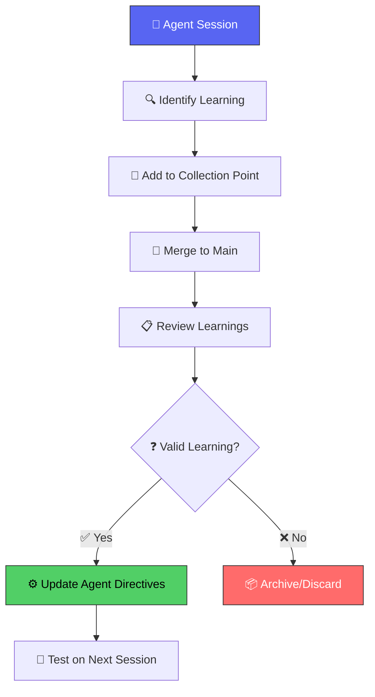

# Agent Learning Collection Point

**Purpose:** Central collection point for AI agent learnings to be ingested into the system after merge.

**For AI Agents:** Add your learnings here before session end. These will be reviewed and integrated into agent directives.

---

## 🔄 Learning Ingestion Protocol



---

## 📝 Pending Learnings (Pre-Merge)

### Learning #1: Table Formatting Drift

**Date:** 2025-11-26
**Reported By:** @toolate28
**Agent:** @copilot

**Issue:**
Table formatting standards defined in `claude-landing/MARKDOWN-TABLE-FORMATTING.md` are not being consistently followed despite being documented.

**Root Cause Analysis:**

1. **Standards exist but aren't referenced at decision point**
   - `MARKDOWN-TABLE-FORMATTING.md` is in `claude-landing/` but not linked from `.github/copilot-instructions.md`
   - Agents don't see the directive when creating tables

2. **No pre-commit validation for tables**
   - The document mentions "planned" validation script but it doesn't exist
   - No automated enforcement

3. **Pattern drift over time**
   - Initial tables may comply, but edits to existing tables don't re-check formatting
   - Each session starts fresh without checking recent drift

**Proposed Solution:**

1. **Add table formatting reference to agent instructions:**
   ```markdown
   # In .github/copilot-instructions.md, add:
   ## Markdown Table Standards
   Follow claude-landing/MARKDOWN-TABLE-FORMATTING.md strictly:
   - Longest string sets column width
   - If order-agnostic, put longest row FIRST
   - Pad ALL cells to match column width
   ```

2. **Create pre-commit validation script** (referenced but not implemented)

3. **Add table check to AI-AGENT-SYSTEM.md session start protocol**

**Status:** ⏳ Pending implementation

---

### Learning #2: Archive Candidate Files Accumulate

**Date:** 2025-11-26
**Reported By:** @toolate28
**Agent:** @copilot

**Issue:**
Files marked as "archive-candidate" in DOCUMENT-INDEX.md were not automatically moved to `.archive/`.

**Root Cause:**
- The index document identified files to archive but didn't trigger the action
- No automated or prompted archive workflow existed

**Solution Implemented:**
- Created `.archive/` directory structure: `audits/`, `planning/`, `sessions/`, `drafts/`
- Moved 15 archive-candidate files
- Updated `.archive/README.md` with manifest
- Updated `DOCUMENT-INDEX.md` to reflect new state

**Status:** ✅ Completed (2025-11-26)

---

## 📋 Learning Template

```markdown
### Learning #N: [Title]

**Date:** YYYY-MM-DD
**Reported By:** [username]
**Agent:** [agent-name]

**Issue:**
[Describe the problem observed]

**Root Cause Analysis:**
[Why did this happen? What was missing?]

**Proposed Solution:**
[Specific actionable steps]

**Status:** ⏳ Pending | ✅ Completed | ❌ Rejected
```

---

## 🔗 Integration Points

After merge, learnings should be integrated into:

| Learning Type       | Integration Target                   | Update Method      |
|---------------------|--------------------------------------|-------------------|
| Formatting drift    | `.github/copilot-instructions.md`    | Edit directive    |
| Process gaps        | `claude-landing/AI-AGENT-SYSTEM.md`  | Add to protocol   |
| Tool issues         | Module READMEs                       | Document workaround |
| Pattern recognition | `NAMING-CONVENTIONS.md`              | Add examples      |

---

## ✅ Post-Merge Checklist

- [ ] Review all pending learnings
- [ ] Update relevant agent directives
- [ ] Create validation scripts if needed
- [ ] Test changes in next session
- [ ] Archive completed learnings to `.archive/learnings/`

---

**ATOM:** ATOM-AGENT-20251126-001
**Maintained By:** AI Agent System
**Last Updated:** 2025-11-26
