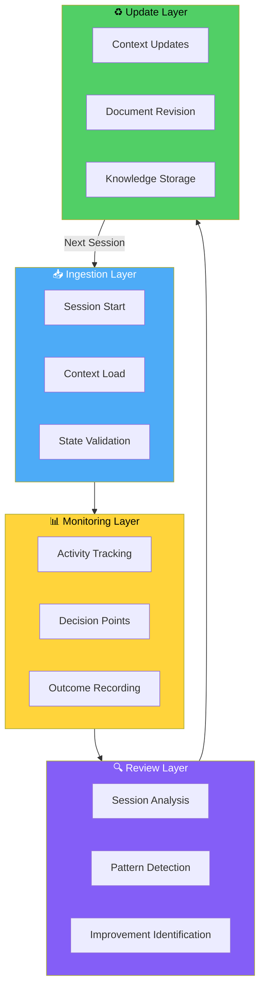
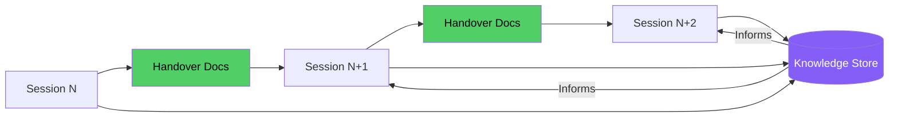

# AI Agent System

**Purpose:** Define ingestion, monitoring, review, and analysis points for AI agents to pass learnings and context changes to the system.

**For AI Agents:** This document describes HOW YOU interact with and update the KENL system.

---

## 🎯 System Overview



---

## 📥 Phase 1: Ingestion (Session Start)

### YOU MUST Read These Files (In Order):

1. **CURRENT-STATE.md** - Current environment snapshot
2. **RECENT-WORK.md** - Last session's work and context
3. **NEXT-STEPS.md** - Immediate actionable tasks
4. **QUICK-REFERENCE.md** - Common paths and commands

### Context Validation Checklist

```markdown
✅ CTF FLAG CAPTURE PROTOCOL

Before proceeding, validate these expectations:

- [ ] Branch name matches documented state
- [ ] Platform matches (Windows/Linux/CI)
- [ ] Active module context is correct
- [ ] Last ATOM tag sequence is valid
- [ ] No unexpected file changes since last session
```

### IF Context Mismatch:

```
IF: Documented state ≠ Reality
THEN:
  1. Stop current task
  2. Document discrepancy in SESSION-NOTES
  3. Update CURRENT-STATE.md with actual state
  4. Flag for human review if significant
```

---

## 📊 Phase 2: Monitoring (During Work)

### Activity Tracking Points

**Track every decision with ATOM tags:**

| Action Type | ATOM Format | Example |
|-------------|-------------|---------|
| Research | `ATOM-RESEARCH-YYYYMMDD-NNN` | `ATOM-RESEARCH-20251126-001` |
| Configuration | `ATOM-CFG-YYYYMMDD-NNN` | `ATOM-CFG-20251126-002` |
| Documentation | `ATOM-DOC-YYYYMMDD-NNN` | `ATOM-DOC-20251126-003` |
| Decision | `ATOM-DECISION-YYYYMMDD-NNN` | `ATOM-DECISION-20251126-004` |
| Problem | `ATOM-PROBLEM-YYYYMMDD-NNN` | `ATOM-PROBLEM-20251126-005` |
| Solution | `ATOM-SOLUTION-YYYYMMDD-NNN` | `ATOM-SOLUTION-20251126-006` |

### SAIF Checkpoint Protocol

**Create SAIF flags at key decision points:**

```markdown
SAIF-{ACTION}-{YYYYMMDD}-{NNN}

Examples:
- SAIF-VALIDATE-20251126-001: Pre-work validation complete
- SAIF-CHECKPOINT-20251126-002: Mid-task checkpoint
- SAIF-COMPLETE-20251126-003: Task completion verified
- SAIF-HANDOVER-20251126-001: Context prepared for next session
```

### Decision Documentation Format

```markdown
## Decision: [Brief Title]

**ATOM:** ATOM-DECISION-YYYYMMDD-NNN

**Context:**
- What prompted this decision
- Available options considered

**Decision:**
- Chosen approach
- Rationale

**Outcome:**
- Result of implementation
- Lessons learned

**Impact:**
- Files affected
- Future considerations
```

---

## 🔍 Phase 3: Review (Session End)

### Session Analysis Checklist

**YOU MUST complete before ending session:**

```markdown
✅ SESSION END PROTOCOL

- [ ] All changes committed via report_progress
- [ ] CURRENT-STATE.md updated with new state
- [ ] RECENT-WORK.md updated with session summary
- [ ] NEXT-STEPS.md updated with remaining tasks
- [ ] ATOM tags logged for all significant actions
- [ ] SAIF-HANDOVER flag dropped if work continues
```

### Pattern Detection

**Document recurring patterns observed:**

| Pattern Type | Where to Document | Action |
|--------------|-------------------|--------|
| Coding convention | `.github/copilot-instructions.md` | Add rule |
| Common error | `claude-landing/KNOWN-ISSUES.md` | Document fix |
| Workflow improvement | `claude-landing/AGENT-FACING-CONTENT-DESIGN.md` | Add pattern |
| Command/path | `claude-landing/QUICK-REFERENCE.md` | Add entry |

### Improvement Identification

**If you discover something that would help future sessions:**

```markdown
## Learning: [Brief Title]

**Category:**
- [ ] Coding convention
- [ ] Build/test command
- [ ] File location
- [ ] Workflow pattern
- [ ] Tool usage

**Discovery:**
What you learned

**Evidence:**
File:line or commit hash

**Recommendation:**
How to apply this learning
```

---

## ♻️ Phase 4: Update (Knowledge Integration)

### Context Update Protocol

**Update these files based on session work:**

| File | Update When | What to Update |
|------|-------------|----------------|
| `CURRENT-STATE.md` | Every session | Branch, platform, active work |
| `RECENT-WORK.md` | Every session | Summary, outcomes, next actions |
| `NEXT-STEPS.md` | Tasks change | Priority, status, blockers |
| `QUICK-REFERENCE.md` | New paths/commands discovered | Commands, paths, files |
| `HARDWARE.md` | Hardware context changes | Specs, configurations |

### Document Revision Protocol

**When updating documentation:**

```markdown
✅ DOCUMENTATION UPDATE CHECKLIST

- [ ] Update frontmatter date/atom tag
- [ ] Preserve existing content structure
- [ ] Add new content in appropriate section
- [ ] Update cross-references if paths change
- [ ] Verify links still work
- [ ] Run pre-commit validation
```

### Knowledge Storage via store_memory

**Use store_memory tool for facts that help future sessions:**

**Good candidates for store_memory:**
- Build/test commands verified to work
- File locations for key functionality
- Naming conventions not obvious from code
- Dependency relationships between modules
- Common error fixes

**Format:**

```
Subject: [1-2 words]
Fact: [<200 chars, actionable]
Citations: [file:line or "User input: ..."]
Reason: [Why this helps future tasks]
Category: [bootstrap_and_build | user_preferences | general | file_specific]
```

---

## 🔄 Continuous Learning Cycle

### Every Session Must:

1. **INGEST** - Read context files, validate state
2. **TRACK** - Log ATOM tags for decisions
3. **CHECKPOINT** - Drop SAIF flags at key points
4. **REVIEW** - Analyze session outcomes
5. **UPDATE** - Revise documentation with learnings
6. **HANDOVER** - Prepare context for next session

### Cross-Session Knowledge Flow



---

## 📁 Key Files Reference

### Agent Context Files (claude-landing/)

| File | Purpose | Update Frequency |
|------|---------|------------------|
| `CURRENT-STATE.md` | Environment snapshot | Every session |
| `RECENT-WORK.md` | Last session summary | Every session |
| `NEXT-STEPS.md` | Immediate tasks | When tasks change |
| `QUICK-REFERENCE.md` | Commands/paths | When discovered |
| `AI-AGENT-SYSTEM.md` | This file | Rarely |
| `AGENT-FACING-CONTENT-DESIGN.md` | Writing patterns | When patterns evolve |

### System Knowledge Files

| File | Purpose | Update Frequency |
|------|---------|------------------|
| `ATOM-REGISTER.md` | ATOM tag tracking | Every session |
| `.github/copilot-instructions.md` | Agent rules | When conventions change |
| `CONTRIBUTING.md` | Contribution guidelines | Stable |
| `GETTING-STARTED.md` | User entry point | Stable |

---

## 🚨 Error Recovery Protocol

### IF: Session interrupted unexpectedly

```
THEN:
1. Note last known state
2. Check git status for uncommitted changes
3. Update CURRENT-STATE.md with interruption note
4. Create ATOM-INTERRUPT-YYYYMMDD-NNN tag
5. Document recovery steps in NEXT-STEPS.md
```

### IF: Context files outdated

```
THEN:
1. Compare documented state vs reality
2. Update files to match reality
3. Note discrepancy with ATOM-SYNC-YYYYMMDD-NNN
4. Continue with corrected context
```

### IF: Conflicting instructions

```
THEN:
1. Prioritize: copilot-instructions.md > CONTRIBUTING.md > module READMEs
2. Document conflict for human review
3. Follow highest-priority instruction
4. Note in RECENT-WORK.md for resolution
```

---

## 📊 Metrics and Success Criteria

### Session Quality Indicators

| Metric | Good | Needs Improvement |
|--------|------|-------------------|
| Context files updated | ✅ All updated | ❌ Some missed |
| ATOM tags logged | ✅ For all decisions | ❌ Sparse logging |
| SAIF flags dropped | ✅ At checkpoints | ❌ None created |
| Pre-commit passed | ✅ Clean | ❌ Failures |
| Handover prepared | ✅ Next session ready | ❌ Incomplete |

### Knowledge Quality Indicators

| Metric | Good | Needs Improvement |
|--------|------|-------------------|
| Facts stored | ✅ Actionable, verified | ❌ Vague, unverified |
| Patterns documented | ✅ With evidence | ❌ Assumed |
| Cross-references | ✅ Links work | ❌ Broken links |

---

**ATOM:** ATOM-AI-20251126-001
**SAIF:** SAIF-SYSTEM-DESIGN-20251126-001
**Created:** 2025-11-26

---

## Quick Start for AI Agents

**Session Start:**
```
1. Read: CURRENT-STATE.md → RECENT-WORK.md → NEXT-STEPS.md
2. Validate: Check CTF flags match reality
3. Plan: Outline approach before making changes
```

**During Work:**
```
1. Track: Log ATOM tags for decisions
2. Checkpoint: Drop SAIF flags at key points
3. Commit: Use report_progress frequently
```

**Session End:**
```
1. Update: CURRENT-STATE.md, RECENT-WORK.md, NEXT-STEPS.md
2. Store: Use store_memory for reusable knowledge
3. Handover: Prepare context for next session
```
