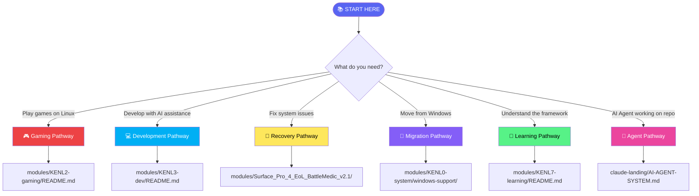

# KENL Documentation Pathways

**Purpose:** Navigate directly to exactly what you need. No scrolling required - each pathway leads to specific outcomes.

---

## 🧭 Choose Your Pathway



---

## 🎮 Gaming Pathway

**Goal:** Play games on Linux with optimized configurations

| Step | Document | Outcome |
|------|----------|---------|
| 1 | [KENL2 Gaming README](../modules/KENL2-gaming/README.md) | Understand Play Cards system |
| 2 | [Hardware Profiles](../modules/KENL2-gaming/configs/hardware-profiles/README.md) | Match your hardware |
| 3 | [Anti-Cheat Guide](../modules/KENL2-gaming/guides/anti-cheat-compatibility-guide.md) | Check game compatibility |
| 4 | [Example Play Card](../modules/KENL2-gaming/play-cards/games/) | See configuration format |
| 5 | [Create Your Card](../modules/KENL2-gaming/create-playcard.sh) | Generate for your game |

**Quick Commands:**
```bash
# Research a game
./modules/KENL2-gaming/research-game.sh "Game Name"

# Create a Play Card
./modules/KENL2-gaming/create-playcard.sh "Game Name"

# Apply a Play Card
./modules/KENL2-gaming/apply-playcard.sh game-name.yaml
```

**Next:** After gaming setup → [Development Pathway](#-development-pathway) for AI assistance

---

## 💻 Development Pathway

**Goal:** AI-assisted development with full traceability

| Step | Document | Outcome |
|------|----------|---------|
| 1 | [KENL3 Dev README](../modules/KENL3-dev/README.md) | Understand dev environment |
| 2 | [Ollama/Qwen Setup](../modules/KENL3-dev/guides/OLLAMA-QWEN-LOCAL-AI-SETUP.md) | Local AI running |
| 3 | [MCP Integration](../modules/KENL3-dev/guides/MCP-INTEGRATION-GUIDE.md) | Claude tool access |
| 4 | [Claude Code Setup](../modules/KENL3-dev/claude-code-setup/claude-configuration-guide.md) | IDE integration |
| 5 | [Distrobox Cheatsheet](../modules/KENL7-learning/cheatsheets/distrobox-cheatsheet.md) | Container commands |

**Quick Commands:**
```bash
# Create development container
distrobox create -n kenl-dev -i ubuntu:24.04

# Enter container
distrobox enter kenl-dev

# Install Ollama
curl -fsSL https://ollama.com/install.sh | sh
ollama pull qwen2.5:14b
```

**Next:** After dev setup → [AI Integration Guide](../AI-INTEGRATION-GUIDE.md) for per-module AI usage

---

## 🔧 Recovery Pathway

**Goal:** Fix system issues with automated diagnostics

| Step | Document | Outcome |
|------|----------|---------|
| 1 | [BattleMedic Manual](../modules/Surface_Pro_4_EoL_BattleMedic_v2.1/BattleMedic-Complete-Manual.md) | Understand recovery system |
| 2 | [Decision Tree](../modules/Surface_Pro_4_EoL_BattleMedic_v2.1/BattleMedic_v2.1/01_DECISION_TREE.md) | Choose recovery path |
| 3 | [Requirements](../modules/Surface_Pro_4_EoL_BattleMedic_v2.1/BattleMedic_v2.1/02_REQUIREMENTS_CHECKLIST.md) | Gather what you need |
| 4 | [Step-by-Step](../modules/Surface_Pro_4_EoL_BattleMedic_v2.1/BattleMedic_v2.1/03_STEP_BY_STEP_RECOVERY.md) | Execute recovery |
| 5 | [Testing Guide](../modules/Surface_Pro_4_EoL_BattleMedic_v2.1/Testing-Verification-Guide.md) | Verify success |

**Recovery Paths:**
- [Path A: Normal Boot](../modules/Surface_Pro_4_EoL_BattleMedic_v2.1/BattleMedic_v2.1/PATH_A_NORMAL_BOOT.md)
- [Path B: Safe Mode](../modules/Surface_Pro_4_EoL_BattleMedic_v2.1/BattleMedic_v2.1/PATH_B_SAFE_MODE.md)
- [Path C: WinRE Offline](../modules/Surface_Pro_4_EoL_BattleMedic_v2.1/BattleMedic_v2.1/PATH_C_WINRE_OFFLINE.md)
- [Path D: Recovery Media](../modules/Surface_Pro_4_EoL_BattleMedic_v2.1/BattleMedic_v2.1/PATH_D_RECOVERY_MEDIA.md)

**Quick Reference:**
- [Quick Reference Card](../modules/Surface_Pro_4_EoL_BattleMedic_v2.1/QuickReference-A4.md)

---

## 🚀 Migration Pathway

**Goal:** Migrate from Windows to Linux safely

| Step | Document | Outcome |
|------|----------|---------|
| 1 | [KENL0 System README](../modules/KENL0-system/README.md) | Understand system layer |
| 2 | [Windows Support](../modules/KENL0-system/windows-support/) | Windows tools available |
| 3 | [Partition Workflow](../scripts/windows-partition-scripts/WORKFLOW_DIAGRAM.md) | Partitioning plan |
| 4 | [Bazzite Download](../scripts/BAZZITE_ISO_DOWNLOAD.md) | Get installation media |
| 5 | [IWI Installation](../BAZZITE-DX-IWI-INSTALLATION-SAIF.md) | Install with intent |

**Partition Scripts:**
```powershell
# Step 1: Prepare disk (Windows)
.\scripts\STEP1-WINDOWS-WIPE-DISK1.ps1

# Step 2: Create partitions (Windows)
.\scripts\STEP2-WINDOWS-PARTITION-DISK1.ps1

# Step 3: Verify (Windows)
.\scripts\STEP3-WINDOWS-MOUNT-CHECK.ps1
```

**Post-Installation:**
- [rpm-ostree Cheatsheet](../modules/KENL7-learning/cheatsheets/rpm-ostree-cheatsheet.md)
- [Post-Rebase Guide](../case-studies/RWS-04-RPMOSTREE-REBASE.md)

---

## 📖 Learning Pathway

**Goal:** Understand the KENL framework and tools

| Step | Document | Outcome |
|------|----------|---------|
| 1 | [KENL7 Learning README](../modules/KENL7-learning/README.md) | Learning resources overview |
| 2 | [SAGE Obsidian Walkthrough](../modules/KENL7-learning/guides/SAGE-OBSIDIAN-WALKTHROUGH.md) | Obsidian vault setup |
| 3 | [OWI Framework](../OWI_FRAMEWORK_OVERVIEW.md) | Understand methodology |
| 4 | [ATOM/SAGE Framework](../atom-sage-framework/README.md) | Core framework |
| 5 | [Case Studies](../case-studies/) | Real-world examples |

**Cheatsheets:**
- [Git](../modules/KENL7-learning/cheatsheets/git-cheatsheet.md)
- [GPG](../modules/KENL7-learning/cheatsheets/gpg-cheatsheet.md)
- [SSH](../modules/KENL7-learning/cheatsheets/ssh-cheatsheet.md)
- [Distrobox](../modules/KENL7-learning/cheatsheets/distrobox-cheatsheet.md)
- [rpm-ostree](../modules/KENL7-learning/cheatsheets/rpm-ostree-cheatsheet.md)

**Case Studies:**
- [HALO Infinite Setup](../case-studies/RWS-05-HALO-INFINITE.md)
- [Dual-Boot Gaming](../case-studies/RWS-06-COMPLETE-DUAL-BOOT-GAMING-SETUP.md)
- [BIOS/TPM Update](../case-studies/RWS-01-BIOS-TPM-UPDATE.md)

---

## 🤖 Agent Pathway

**Goal:** AI Agent working on KENL repository

| Step | Document | Outcome |
|------|----------|---------|
| 1 | [AI Agent System](./AI-AGENT-SYSTEM.md) | Understand agent framework |
| 2 | [CURRENT-STATE.md](./CURRENT-STATE.md) | Current environment |
| 3 | [RECENT-WORK.md](./RECENT-WORK.md) | Last session context |
| 4 | [NEXT-STEPS.md](./NEXT-STEPS.md) | Immediate tasks |
| 5 | [QUICK-REFERENCE.md](./QUICK-REFERENCE.md) | Commands and paths |

**Agent-Specific Resources:**
- [Agent-Facing Content Design](./AGENT-FACING-CONTENT-DESIGN.md)
- [Copilot Instructions](../.github/copilot-instructions.md)
- [Markdown Table Formatting](./MARKDOWN-TABLE-FORMATTING.md)
- [CLI Formatting Standards](./CLI-FORMATTING-STANDARDS.md)

**Protocol:**
```
1. INGEST: Read context files in order
2. VALIDATE: Check CTF flags match reality
3. WORK: Log ATOM tags for decisions
4. CHECKPOINT: Drop SAIF flags
5. HANDOVER: Update context files
```

---

## 📁 Module Quick Reference

| Module | Purpose | Entry Point |
|--------|---------|-------------|
| KENL0 | System operations | [README](../modules/KENL0-system/README.md) |
| KENL1 | Framework core | [README](../modules/KENL1-framework/README.md) |
| KENL2 | Gaming | [README](../modules/KENL2-gaming/README.md) |
| KENL3 | Development | [README](../modules/KENL3-dev/README.md) |
| KENL4 | Monitoring | [README](../modules/KENL4-monitoring/README.md) |
| KENL5 | Facades | [README](../modules/KENL5-facades/README.md) |
| KENL6 | Social | [README](../modules/KENL6-social/README.md) |
| KENL7 | Learning | [README](../modules/KENL7-learning/README.md) |
| KENL8 | Security | [README](../modules/KENL8-security/README.md) |
| KENL9 | Library | [README](../modules/KENL9-library/README.md) |
| KENL10 | Backup | [README](../modules/KENL10-backup/README.md) |
| KENL11 | Media | [README](../modules/KENL11-media/README.md) |
| KENL12 | Resources | [README](../modules/KENL12-resources/README.md) |
| KENL13 | IWI | [README](../modules/KENL13-iwi/README.md) |
| BattleMedic | Recovery | [Manual](../modules/Surface_Pro_4_EoL_BattleMedic_v2.1/BattleMedic-Complete-Manual.md) |

---

## 🔗 Cross-Pathway Links

**From Gaming to Development:**
- Need AI for game research? → [MCP Integration](../modules/KENL3-dev/guides/MCP-INTEGRATION-GUIDE.md)
- Want to create tools? → [KENL3 Dev](../modules/KENL3-dev/README.md)

**From Development to Gaming:**
- Built a game tool? → [Play Cards](../modules/KENL2-gaming/README.md)
- Need to test on Linux? → [Gaming Pathway](#-gaming-pathway)

**From Recovery to Migration:**
- Fixed Windows issues? → [Migration Pathway](#-migration-pathway)
- Want permanent solution? → [Dual-Boot Setup](../case-studies/RWS-03-DUAL-BOOT.md)

**From Migration to Development:**
- Linux installed? → [Development Pathway](#-development-pathway)
- Need AI assistance? → [Ollama Setup](../modules/KENL3-dev/guides/OLLAMA-QWEN-LOCAL-AI-SETUP.md)

---

## 📊 Documentation Categories

### User-Facing (Humans)

| Category | Location | Examples |
|----------|----------|----------|
| Getting Started | Root | `GETTING-STARTED.md`, `README.md` |
| Guides | Module `/guides/` | MCP, Ollama, Anti-cheat |
| Cheatsheets | `KENL7-learning/cheatsheets/` | Git, GPG, SSH |
| Case Studies | `case-studies/` | RWS-01 through RWS-06 |
| Reference | `docs/` | Standards, architecture |

### Agent-Facing (AI)

| Category | Location | Examples |
|----------|----------|----------|
| Context | `claude-landing/` | CURRENT-STATE, RECENT-WORK |
| Instructions | `.github/` | copilot-instructions.md |
| Patterns | `claude-landing/` | AGENT-FACING-CONTENT-DESIGN |
| System | `claude-landing/` | AI-AGENT-SYSTEM.md |

### Governance

| Category | Location | Examples |
|----------|----------|----------|
| Decisions | `governance/02-Decisions/` | ADR documents |
| MCP Governance | `governance/mcp-governance/` | ARCREF artifacts |
| Standards | Root | CONTRIBUTING, SECURITY |

---

**ATOM:** ATOM-DOC-20251126-004
**Created:** 2025-11-26
