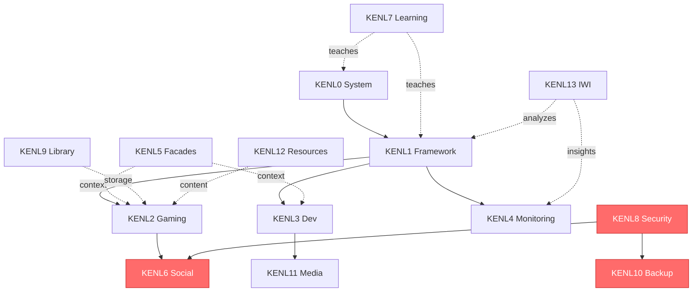

# KENL Module Content Review

**Comprehensive assessment of content completeness, quality, and optimization opportunities across all 14 KENL modules**

---

## Review Methodology

### Assessment Criteria

1. **Content Depth** - File count, documentation completeness
2. **Documentation Quality** - README clarity, examples, troubleshooting
3. **SAIF Alignment** - ATOM trail usage, intent documentation, rollback procedures
4. **GitHub Integration** - Opportunities for Copilot enhancement, MCP integration
5. **Actionability** - Scripts, tools, automation available

### Rating Scale

- 🟢 **Excellent** (90-100%) - Rich content, comprehensive docs, ready for production
- 🟡 **Good** (70-89%) - Solid foundation, minor enhancements needed
- 🟠 **Moderate** (50-69%) - Basic content present, significant gaps
- 🔴 **Sparse** (<50%) - Minimal content, major development needed

---

## Module-by-Module Assessment

### KENL0: System Operations

**Status:** 🟢 Excellent
**File Count:** 29 files
**Documentation:** Comprehensive README (16,523 bytes)

#### Current Content
✅ PowerShell modules (KENL.psm1, KENL.Network.psm1)
✅ Installation scripts
✅ System functions library
✅ Aliases for common operations
✅ Quick action scripts
✅ ujust integration folder
✅ Windows support documentation

#### Strengths
- Cross-platform PowerShell modules
- Network diagnostics (Test-KenlNetwork)
- Platform detection (Get-KenlPlatform)
- Well-structured with module manifests

#### Identified Gaps
⚠️ Missing GitHub integration examples
⚠️ No Copilot prompts for system operations
⚠️ Limited rpm-ostree troubleshooting guide

#### Enhancement Opportunities
- [ ] Add GitHub Actions for PowerShell module testing
- [ ] Create Copilot prompts for common system operations
- [ ] Add rpm-ostree decision tree (troubleshooting)
- [ ] Create ATOM-tagged system operation examples
- [ ] Add ujust recipe documentation

#### Copilot Integration Potential: 🟡 Medium
**Use Cases:**
- Explain complex rpm-ostree operations
- Generate ujust recipes from user intent
- Troubleshoot system issues via log analysis

---

### KENL1: Framework Core

**Status:** 🟢 Excellent
**File Count:** 44 files
**Documentation:** Comprehensive (18,832 bytes OWI overview)

#### Current Content
✅ ATOM framework documentation
✅ SAGE methodology
✅ OWI metadata standard
✅ MCP governance artifacts
✅ Case studies
✅ Scripts for framework operations
✅ atom-sage-framework implementation

#### Strengths
- Complete methodology documentation
- MCP governance templates
- Case study examples
- ATOM trail architecture defined

#### Identified Gaps
⚠️ No interactive ATOM trail viewer
⚠️ Limited framework testing examples
⚠️ No SAGE pattern analysis dashboard

#### Enhancement Opportunities
- [ ] Create interactive ATOM trail viewer (web-based)
- [ ] Add framework unit tests
- [ ] Build SAGE pattern analysis dashboard
- [ ] Create Copilot prompts for ATOM tag generation
- [ ] Add more real-world case studies

#### Copilot Integration Potential: 🟢 High
**Use Cases:**
- Automatic ATOM tag generation from commits
- Intent extraction from code changes
- Recovery recommendation from trail analysis
- CTFWI validation automation

---

### KENL2: Gaming Configurations

**Status:** 🟢 Excellent
**File Count:** 37 files
**Documentation:** Strong (16,688 bytes)

#### Current Content
✅ Play Cards for multiple games
✅ Machine configurations
✅ Proton optimization guides
✅ Gaming-specific documentation
✅ Launch options templates

#### Strengths
- Rich Play Card examples
- Hardware-specific configurations
- ProtonDB integration knowledge
- Performance benchmarking templates

#### Identified Gaps
⚠️ No automated Play Card generation tool
⚠️ Limited anti-cheat compatibility database
⚠️ No Play Card validation workflow

#### Enhancement Opportunities
- [ ] Create Play Card generator (Copilot-assisted)
- [ ] Build anti-cheat compatibility database (MCP integration)
- [ ] Add GitHub Actions for Play Card validation
- [ ] Create community Play Card submission workflow
- [ ] Add performance comparison tool

#### Copilot Integration Potential: 🟢 High
**Use Cases:**
- Generate Play Cards from user hardware
- Research ProtonDB compatibility
- Suggest optimal Proton versions
- Create launch options from game requirements

---

### KENL3: Development Environments

**Status:** 🟢 Excellent
**File Count:** 14 files
**Documentation:** Very comprehensive (11,505 bytes + guides)

#### Current Content
✅ Distrobox configurations
✅ Claude Code setup guide
✅ MCP integration guide (comprehensive)
✅ Ollama/Qwen local AI guide (comprehensive)
✅ Devcontainer examples
✅ Setup automation scripts

#### Strengths
- Best-in-class MCP integration documentation
- Complete local AI setup guide
- Devcontainer configurations
- System-specific documentation templates

#### Identified Gaps
⚠️ No VSCode/Claude Code workspace settings tracked
⚠️ Limited container troubleshooting guide
⚠️ No automated environment testing

#### Enhancement Opportunities
- [ ] Add .vscode/settings.json with Copilot config
- [ ] Create container health check scripts
- [ ] Build environment validation workflow
- [ ] Add more devcontainer examples
- [ ] Create KENL MCP server (as outlined in GitHub activation plan)

#### Copilot Integration Potential: 🟢 Exceptional
**Use Cases:**
- Environment setup automation
- Dependency resolution
- MCP server configuration
- Code generation with ATOM tagging

---

### KENL4: Monitoring & Analytics

**Status:** 🟡 Good
**File Count:** 7 files
**Documentation:** Strong (14,906 bytes)

#### Current Content
✅ ATOM trail analytics
✅ Database architecture documentation
✅ Monitoring concepts

#### Strengths
- Well-documented ATOM database architecture
- Security-first design
- Analytics framework defined

#### Identified Gaps
⚠️ No actual monitoring dashboards
⚠️ Missing Prometheus/Grafana configurations
⚠️ No real-time ATOM trail viewer
⚠️ Limited metric collection scripts

#### Enhancement Opportunities
- [ ] Create Grafana dashboard templates
- [ ] Add Prometheus exporters
- [ ] Build real-time ATOM trail web viewer
- [ ] Add metric collection automation
- [ ] Create anomaly detection scripts

#### Copilot Integration Potential: 🟡 Medium
**Use Cases:**
- Metric analysis and interpretation
- Anomaly detection prompts
- Dashboard configuration generation
- Alert rule creation

---

### KENL5: Facades & Theming

**Status:** 🟡 Good
**File Count:** 18 files
**Documentation:** Solid (14,057 bytes)

#### Current Content
✅ Cheatsheets
✅ Wallpapers (Kali, CachyOS)
✅ Context switching system
✅ Visual identity documentation

#### Strengths
- Context switching automation
- Visual consistency maintained
- Multiple wallpaper collections

#### Identified Gaps
⚠️ Limited theme customization tools
⚠️ No automated theme generation
⚠️ Missing font configurations

#### Enhancement Opportunities
- [ ] Create theme generator tool
- [ ] Add more wallpaper collections
- [ ] Build context-aware prompt customization
- [ ] Add terminal color scheme management
- [ ] Create visual identity assets

#### Copilot Integration Potential: 🔴 Low
**Use Cases:**
- Generate cheatsheets from commands
- Create context descriptions
- Suggest visual improvements

---

### KENL6: Social & Community

**Status:** 🔴 Sparse
**File Count:** 3 files
**Documentation:** Minimal (646 bytes)

#### Current Content
✅ Basic README
✅ Share Play Card script (stub)
⚠️ MANIFEST only

#### Strengths
- Clear vision documented
- Dependencies identified

#### Critical Gaps
❌ No actual social features implemented
❌ No Matrix/Discord integration
❌ No LFG matchmaking system
❌ No community leaderboards
❌ No gaming profile system

#### Enhancement Opportunities (Priority: HIGH)
- [ ] Implement Play Card sharing (encrypted)
- [ ] Add Discord webhook integration
- [ ] Create Matrix bot for Play Card sharing
- [ ] Build LFG matchmaking prototype
- [ ] Add community leaderboard system
- [ ] Create gaming profile templates

#### Copilot Integration Potential: 🟡 Medium
**Use Cases:**
- Generate Play Card descriptions
- Create Discord/Matrix bot logic
- Build matchmaking algorithms
- Format community posts

#### Recommended Action: MAJOR DEVELOPMENT NEEDED
This module requires significant implementation work to match the vision described in README.

---

### KENL7: Learning & Guides

**Status:** 🟢 Excellent
**File Count:** 13 files
**Documentation:** Very strong (22,278 bytes)

#### Current Content
✅ Comprehensive guides
✅ Cheatsheets
✅ Obsidian templates
✅ SAGE walkthrough

#### Strengths
- Rich learning resources
- Obsidian integration for knowledge management
- Well-structured guide hierarchy
- SAGE methodology walkthrough

#### Identified Gaps
⚠️ No interactive tutorials
⚠️ Limited video content references
⚠️ No gamification/progress tracking

#### Enhancement Opportunities
- [ ] Create interactive tutorials (web-based)
- [ ] Add video tutorial references
- [ ] Build learning path recommendations
- [ ] Add progress tracking system
- [ ] Create quiz/assessment tools

#### Copilot Integration Potential: 🟢 High
**Use Cases:**
- Generate learning materials
- Create concept explanations
- Build interactive examples
- Suggest learning paths

---

### KENL8: Security & Privacy

**Status:** 🔴 Sparse
**File Count:** 3 files
**Documentation:** Minimal (724 bytes)

#### Current Content
✅ Basic README
✅ GPG encryption script (basic)
⚠️ MANIFEST only

#### Strengths
- Clear security focus
- GPG integration started

#### Critical Gaps
❌ No actual vault integration
❌ Missing secret rotation automation
❌ No TOTP 2FA management
❌ Limited GPG key management
❌ No security audit tools

#### Enhancement Opportunities (Priority: HIGH)
- [ ] Implement HashiCorp Vault integration
- [ ] Add secret rotation automation
- [ ] Create TOTP 2FA manager
- [ ] Build GPG key management UI/CLI
- [ ] Add security audit scripts
- [ ] Create encrypted backup integration (KENL10)
- [ ] Add password manager integration

#### Copilot Integration Potential: 🟠 Medium (with caution)
**Use Cases:**
- Generate secure configuration templates
- Explain security concepts
- Review security settings
- Suggest security improvements

**Warning:** Security code requires extra validation - AI suggestions must be carefully reviewed.

#### Recommended Action: MAJOR DEVELOPMENT NEEDED
Critical for KENL6 (Play Card sharing) and KENL10 (encrypted backups).

---

### KENL9: Game Library Management

**Status:** 🟢 Excellent
**File Count:** 2 files (but rich README: 22,053 bytes)
**Documentation:** Very comprehensive

#### Current Content
✅ Comprehensive storage architecture
✅ Multi-drive management strategy
✅ Steam library integration
✅ NTFS cross-compatibility documentation

#### Strengths
- Excellent storage architecture documentation
- Cross-platform considerations
- Performance optimization strategies
- Benchmark data included

#### Identified Gaps
⚠️ No actual management scripts
⚠️ Limited automation for library moves
⚠️ No storage health monitoring

#### Enhancement Opportunities
- [ ] Create library management scripts
- [ ] Add automated library migration tool
- [ ] Build storage health monitoring
- [ ] Create deduplication tool
- [ ] Add compression optimization

#### Copilot Integration Potential: 🟡 Medium
**Use Cases:**
- Calculate optimal storage layouts
- Generate migration scripts
- Analyze storage patterns
- Suggest optimization strategies

---

### KENL10: Backup & Recovery

**Status:** 🔴 Sparse
**File Count:** 3 files
**Documentation:** Minimal (952 bytes)

#### Current Content
✅ Basic README with clear vision
✅ ATOM snapshot script (basic)
⚠️ MANIFEST only

#### Strengths
- ATOM-aware backup concept is innovative
- Clear feature list
- Dependencies identified (KENL8)

#### Critical Gaps
❌ No actual cloud sync implementation
❌ Missing deduplication
❌ No encrypted backup implementation
❌ Limited disaster recovery tooling
❌ No backup validation/verification

#### Enhancement Opportunities (Priority: HIGH)
- [ ] Implement cloud sync (S3, B2, Nextcloud)
- [ ] Add deduplication (rsync, restic, borg)
- [ ] Create encrypted backup integration (KENL8)
- [ ] Build disaster recovery wizard
- [ ] Add backup validation automation
- [ ] Create restore testing framework
- [ ] Add Play Card versioning

#### Copilot Integration Potential: 🟡 Medium
**Use Cases:**
- Generate backup scripts
- Calculate storage requirements
- Suggest backup strategies
- Create recovery procedures

#### Recommended Action: HIGH PRIORITY DEVELOPMENT
Essential for production KENL usage - backups are critical.

---

### KENL11: Media Streaming

**Status:** 🟡 Good
**File Count:** 3 files (+ docker-compose)
**Documentation:** Strong (26,282 bytes)

#### Current Content
✅ Comprehensive README
✅ Docker Compose configurations
✅ Media server architecture
✅ Arr stack integration

#### Strengths
- Detailed media server setup
- Docker Compose configurations present
- Integration with Jellyfin, Sonarr, Radarr, etc.

#### Identified Gaps
⚠️ No actual docker-compose files visible
⚠️ Limited troubleshooting guides
⚠️ No monitoring integration

#### Enhancement Opportunities
- [ ] Add complete docker-compose examples
- [ ] Create media server monitoring dashboard
- [ ] Add automated quality profile setup
- [ ] Build indexer configuration wizard
- [ ] Create backup scripts for media metadata

#### Copilot Integration Potential: 🟢 High
**Use Cases:**
- Generate docker-compose configurations
- Troubleshoot media server issues
- Optimize quality profiles
- Create indexer configurations

---

### KENL12: Resources & Downloads

**Status:** 🟠 Moderate
**File Count:** 8 files
**Documentation:** Solid (16,362 bytes)

#### Current Content
✅ Comprehensive README
✅ Download management strategy
✅ RSS feed integration
⚠️ Limited actual implementations

#### Strengths
- Clear resource organization strategy
- RSS feed system planned
- Integration with other modules

#### Identified Gaps
⚠️ No automated download tools
⚠️ Limited RSS feed configurations
⚠️ No resource catalog implementation

#### Enhancement Opportunities
- [ ] Create automated download scripts
- [ ] Add RSS feed manager
- [ ] Build resource catalog/database
- [ ] Add torrent management integration
- [ ] Create resource validation tools

#### Copilot Integration Potential: 🟡 Medium
**Use Cases:**
- Generate download scripts
- Create RSS feed filters
- Organize resource catalogs
- Suggest resource sources

---

### KENL13: IWI (Intent-With-Insight)

**Status:** 🟡 Good
**File Count:** 4 files
**Documentation:** Strong (19,073 bytes)

#### Current Content
✅ Comprehensive README
✅ IWI concept well-documented
✅ Example resources
✅ Binary tools directory

#### Strengths
- Innovative Intent-With-Insight methodology
- Clear examples and resources
- Integration with ATOM/SAGE framework

#### Identified Gaps
⚠️ No actual insight engine implementation
⚠️ Limited automation tools
⚠️ No feedback loop implementation

#### Enhancement Opportunities
- [ ] Implement insight engine
- [ ] Add pattern recognition automation
- [ ] Create feedback loop system
- [ ] Build recommendation engine
- [ ] Add machine learning integration

#### Copilot Integration Potential: 🟢 High
**Use Cases:**
- Analyze user patterns
- Generate insights from ATOM trails
- Recommend optimizations
- Predict user needs

---

## Summary: Content Depth by Module

### Tier 1: Excellent (Production Ready) 🟢
- **KENL0** - System Operations
- **KENL1** - Framework Core
- **KENL2** - Gaming Configurations
- **KENL3** - Development Environments
- **KENL7** - Learning & Guides
- **KENL9** - Game Library Management

### Tier 2: Good (Minor Enhancements Needed) 🟡
- **KENL4** - Monitoring & Analytics
- **KENL5** - Facades & Theming
- **KENL11** - Media Streaming
- **KENL13** - IWI (Intent-With-Insight)

### Tier 3: Moderate (Significant Development Needed) 🟠
- **KENL12** - Resources & Downloads

### Tier 4: Sparse (Major Development Required) 🔴
- **KENL6** - Social & Community
- **KENL8** - Security & Privacy
- **KENL10** - Backup & Recovery

---

## Priority Recommendations

### Immediate Actions (Week 1-2)

#### 1. Complete KENL8 (Security) - CRITICAL
**Why:** Required dependency for KENL6 and KENL10
**Tasks:**
- Implement GPG key management
- Add encryption/decryption workflows
- Create secret management integration

#### 2. Complete KENL10 (Backup) - HIGH PRIORITY
**Why:** Essential for production usage, disaster recovery
**Tasks:**
- Implement cloud sync (Cloudflare R2 recommended)
- Add deduplication
- Create restore testing framework

#### 3. Enhance KENL6 (Social) - MEDIUM PRIORITY
**Why:** Community engagement and Play Card sharing
**Tasks:**
- Implement Play Card sharing
- Add Discord/Matrix integration
- Create basic community features

### Short-Term Enhancements (Week 3-4)

#### 4. GitHub Integration (All Modules)
**Tasks:**
- Add Copilot-specific instructions per module
- Create GitHub Actions for validation
- Implement ATOM logging in workflows

#### 5. MCP Server Development (KENL3)
**Tasks:**
- Build KENL MCP server
- Expose ATOM, Play Card, and system operations
- Integrate with Claude Code

### Medium-Term Goals (Month 2-3)

#### 6. Monitoring Dashboards (KENL4)
**Tasks:**
- Create Grafana dashboards
- Add real-time ATOM viewer
- Implement metric collection

#### 7. Resource Automation (KENL12)
**Tasks:**
- Build download automation
- Create RSS feed manager
- Add resource catalog

---

## Copilot Integration Priority Matrix

| Module | Integration Potential | Priority | Effort | ROI |
|--------|----------------------|----------|--------|-----|
| KENL1 | 🟢 High | High | Medium | Very High |
| KENL2 | 🟢 High | High | Medium | High |
| KENL3 | 🟢 Exceptional | Critical | High | Exceptional |
| KENL7 | 🟢 High | Medium | Low | High |
| KENL13 | 🟢 High | Medium | High | High |
| KENL4 | 🟡 Medium | Medium | Medium | Medium |
| KENL6 | 🟡 Medium | High | High | Medium |
| KENL8 | 🟠 Medium (caution) | High | Medium | High |
| KENL9 | 🟡 Medium | Low | Low | Medium |
| KENL11 | 🟢 High | Low | Medium | Medium |
| KENL12 | 🟡 Medium | Low | Low | Low |
| KENL0 | 🟡 Medium | Low | Low | Low |
| KENL5 | 🔴 Low | Low | Low | Low |
| KENL10 | 🟡 Medium | High | Medium | Medium |

---

## Recommended Development Approach

### Phase 1: Critical Infrastructure (Weeks 1-2)
Focus on modules required by others:
1. **KENL8** (Security) - Blocks KENL6 and KENL10
2. **KENL10** (Backup) - Essential for safety
3. **GitHub Integration** - Cross-cutting concern

### Phase 2: High-Value Features (Weeks 3-4)
Add features with high user impact:
1. **KENL6** (Social) - Community engagement
2. **KENL3** (MCP Server) - AI integration
3. **KENL4** (Dashboards) - Visibility

### Phase 3: Enhancement & Polish (Weeks 5-8)
Improve existing good modules:
1. **KENL11** (Media) - Complete implementations
2. **KENL12** (Resources) - Automation
3. **KENL13** (IWI) - Insight engine

### Phase 4: Community & Documentation (Weeks 9-12)
Prepare for broader adoption:
1. GitHub Pages documentation site
2. Video tutorials
3. Community contribution guides
4. Example projects and case studies

---

## Approval Request

### Scope of Work Proposed

**Tier 1: Critical (Request Approval)**
- [ ] Complete KENL8 (Security) implementation
- [ ] Complete KENL10 (Backup) implementation
- [ ] Enhance KENL6 (Social) to functional state
- [ ] Create KENL MCP server

**Tier 2: High Value (Request Approval)**
- [ ] Add Copilot instructions to all modules
- [ ] Create GitHub Actions for ATOM logging
- [ ] Build monitoring dashboards (KENL4)
- [ ] Complete GitHub integration plan

**Tier 3: Enhancements (Can proceed)**
- [ ] Add missing documentation
- [ ] Create troubleshooting guides
- [ ] Enhance existing features
- [ ] Add examples and templates

**Question for User:**
Should we proceed with Tier 1 (critical modules) or focus on Tier 2 (GitHub integration) first?

---

## Appendix: Module Dependency Graph

**Legend:**
- Solid lines: Hard dependencies
- Dashed lines: Soft dependencies / relationships
- Red highlighting: Critical gaps requiring immediate attention

---

**Document ID:** ATOM-DOC-20251116-002
**Version:** 1.0.0
**Status:** In Progress - Awaiting Scope Approval
**Next Action:** User decision on priority focus
