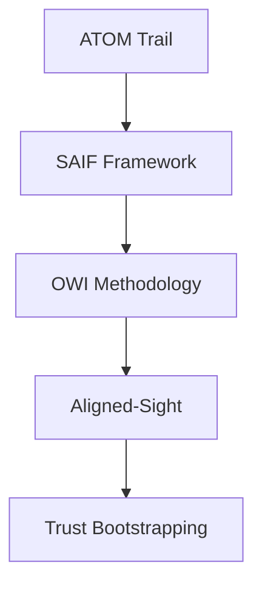

# Obsidian as Main Working Document - Cross-Platform Setup

**Purpose:** Use Obsidian as the primary documentation and collaboration workspace for KENL, accessible across all platforms.

**Why Obsidian:**
- ✅ Plain markdown files (git-friendly, future-proof)
- ✅ Cross-platform (Windows, Linux, macOS, iOS, Android)
- ✅ Bidirectional links (connect ideas across documents)
- ✅ Graph view (visualize knowledge relationships)
- ✅ Offline-first (no cloud dependency)
- ✅ Plugin ecosystem (extend functionality)
- ✅ Git integration (version control built-in)

---

## Quick Start

### 1. Install Obsidian

**Linux (Bazzite/Fedora):**
```bash
# Option A: Flatpak (recommended for immutable OS)
flatpak install flathub md.obsidian.Obsidian

# Option B: AppImage (if Flatpak unavailable)
wget https://github.com/obsidianmd/obsidian-releases/releases/download/v1.5.3/Obsidian-1.5.3.AppImage
chmod +x Obsidian-1.5.3.AppImage
./Obsidian-1.5.3.AppImage
```

**Windows:**
```powershell
# Download installer from https://obsidian.md
# Or via winget:
winget install Obsidian.Obsidian
```

**macOS:**
```bash
brew install --cask obsidian
```

**Mobile (iOS/Android):**
- Download from App Store / Google Play
- Free for personal use

### 2. Create Vault from KENL Repository

**Point Obsidian to your KENL git repository:**

```bash
# Obsidian → Open folder as vault → Select:
/home/user/kenl
```

**IMPORTANT:** Obsidian uses plain markdown files. Your existing KENL docs are ALREADY compatible.

---

## Recommended Vault Structure

### Core Workspace Files

**Main Working Document:** Create at vault root:

```markdown
# File: /home/user/kenl/WORKSPACE.md

# KENL Workspace - Main Dashboard

**Last Updated:** [[CURRENT-STATE]]
**Current Session:** [[SESSION-2025-11-18]]
**Next Actions:** [[TODO]]

## Quick Links

### Active Work
- [[ABOUT-OUR-COLLABORATION]] - Foundation document
- [[HIGH-IMPACT-PROJECTS-ASSESSMENT]] - Strategic planning
- [[TERMINOLOGY]] - Canonical definitions

### Case Studies
- [[VALIDATION_COMPLETE]] - Operation Phoenix
- [[SESSION-2025-11-16-NETWORK-LOGDY]] - The Baton Pass

### Framework Docs
- [[OWI_FRAMEWORK_OVERVIEW]]
- [[ALIGNED-SIGHT]]
- [[README-DOGFOODING-SECTION]]

### Implementation
- [[MCP-INTEGRATION-GUIDE]]
- [[ATOM-DATABASE-ARCHITECTURE]]

## Today's Focus

- [ ] Review MCP server viability
- [ ] Plan SAIF documentation refactoring
- [ ] Prepare handoff for next session

## ATOM Trail

Recent tags:
- ATOM-DOC-20251118-005: About our collaboration
- ATOM-DOC-20251118-004: High-impact projects
- ATOM-DOC-20251118-003: Terminology
```

**Daily Notes:** Enable daily notes plugin for session tracking.

---

## Essential Plugins

### Core Plugins (Built-in)

**1. Daily Notes**
```yaml
# Settings → Daily notes
Template: templates/session-template.md
New file location: claude-landing/
Format: YYYY-MM-DD
```

**2. Graph View**
```yaml
# View → Open graph view
Filter: path:claude-landing OR path:atom-sage-framework
```

**3. Backlinks**
```yaml
# Shows all references to current document
Useful for tracing ATOM tag usage
```

### Community Plugins (Recommended)

**1. Git Integration**
```bash
# Install: Settings → Community plugins → Browse → "Git"
# Auto-commit on save
# Pull on startup
# Push on close
```

**Configuration:**
```yaml
Auto-commit: true
Commit message: "vault backup: {{date}}"
Auto-pull: On startup
Auto-push: On close
```

**2. Dataview**
```bash
# Query documents like a database
# Install: Settings → Community plugins → "Dataview"
```

**Example queries:**
````markdown
# All ATOM tags from last 7 days
```dataview
TABLE file.ctime as Created, classification
FROM "claude-landing"
WHERE contains(file.name, "ATOM")
  AND file.ctime > date(today) - dur(7 days)
SORT file.ctime DESC
```

# High-priority projects
```dataview
TABLE status, priority
FROM "docs"
WHERE contains(file.content, "*****")
```
````

**3. Templater**
```bash
# Advanced templates with variables
# Install: Settings → Community plugins → "Templater"
```

**Session Template:**
```markdown
---
title: Session {{date:YYYY-MM-DD}}
date: {{date}}
atom: ATOM-SESSION-{{date:YYYYMMDD}}-001
status: in-progress
---

# Session {{date:YYYY-MM-DD}}

## Intent
What we're trying to accomplish today

## Context
[[Previous Session]] → Current work → Next session

## ATOM Trail
- ATOM-XXX-{{date:YYYYMMDD}}-001: First action

## Outcomes
- [ ] Objective 1
- [ ] Objective 2

## Next Session Handoff
What the next AI instance needs to know
```

**4. Kanban**
```bash
# Visual task boards
# Install: Settings → Community plugins → "Kanban"
```

**5. Mind Map**
```bash
# Visual concept mapping
# Install: Settings → Community plugins → "Mind Map"
```

---

## Cross-Platform Sync

### Option 1: Git Sync (Recommended)

**Setup:**
```bash
# 1. Enable Git plugin in Obsidian
# 2. Configure auto-commit/push
# 3. Access from any device via git clone

# On new device:
git clone https://github.com/toolate28/kenl.git ~/kenl
# Open ~/kenl in Obsidian
```

**Pros:**
- ✅ Free
- ✅ Version history
- ✅ Works with existing KENL workflow
- ✅ No cloud dependency

**Cons:**
- ⚠️ Manual sync on mobile (use Working Copy app on iOS)

### Option 2: Obsidian Sync (Paid)

**$10/month for official sync**

**Pros:**
- ✅ Automatic across all devices
- ✅ End-to-end encrypted
- ✅ Version history included
- ✅ Mobile seamless

**Cons:**
- ❌ Costs money
- ❌ Less control than git

### Option 3: Third-Party Sync (Dropbox/OneDrive)

**Free tier available**

**Setup:**
```bash
# Symlink vault to cloud folder
ln -s ~/kenl ~/Dropbox/kenl

# Or create vault directly in cloud folder
```

**Pros:**
- ✅ Free (limited storage)
- ✅ Automatic sync

**Cons:**
- ⚠️ Potential conflicts with git
- ⚠️ Privacy concerns

---

## Recommended Workflow

### Morning Session Start

1. **Open Obsidian** → WORKSPACE.md
2. **Check daily note** (auto-created)
3. **Review ATOM trail** from previous session
4. **Set intent** for today

### During Work

1. **Link actively** - `[[Document Name]]` creates bidirectional links
2. **Tag ATOM entries** - `#ATOM-DOC-20251118-006`
3. **Use templates** - Ctrl+T for session template
4. **Query with Dataview** - Find related work instantly

### Evening Session Close

1. **Update WORKSPACE.md** with progress
2. **Commit to git** (Git plugin auto-commits)
3. **Note next session handoff** in daily note
4. **Review graph view** - See knowledge connections

---

## KENL-Specific Configuration

### Custom CSS Snippets

**Create:** `/.obsidian/snippets/kenl-theme.css`

```css
/* ATOM tag highlighting */
.cm-tag {
  color: #ff6b6b;
  font-weight: bold;
}

/* Callout styles for CTFWI */
.callout[data-callout="ctfwi"] {
  background-color: rgba(88, 101, 242, 0.1);
  border-left: 4px solid #5865f2;
}

/* Intent/Expected/Validation pattern */
.cm-intent { color: #51cf66; }
.cm-expected { color: #ffd43b; }
.cm-validation { color: #339af0; }
```

### Hotkeys

**Settings → Hotkeys:**
```yaml
Daily note: Ctrl+D
Quick switcher: Ctrl+O
Search: Ctrl+Shift+F
Graph view: Ctrl+G
Command palette: Ctrl+P
```

### Templates Location

**Create:** `/templates/` directory

**Templates:**
- `session-template.md` - For daily sessions
- `atom-tag-template.md` - For ATOM trail entries
- `case-study-template.md` - For validation studies
- `project-proposal-template.md` - For new projects

---

## Mobile Setup

### iOS (Working Copy + Obsidian)

**1. Install apps:**
- Obsidian (App Store)
- Working Copy (App Store - git client)

**2. Clone repository in Working Copy:**
```
Settings → Repositories → + → Clone repository
URL: https://github.com/toolate28/kenl.git
```

**3. Link to Obsidian:**
```
Obsidian → Open vault from Working Copy → Select kenl
```

**4. Sync workflow:**
```
Working Copy: Pull changes
Obsidian: Edit documents
Working Copy: Commit + Push
```

### Android (Termux + Obsidian)

**1. Install apps:**
- Obsidian (Google Play)
- Termux (F-Droid)

**2. Clone in Termux:**
```bash
pkg install git
cd ~/storage/shared
git clone https://github.com/toolate28/kenl.git
```

**3. Link to Obsidian:**
```
Obsidian → Open folder as vault → /storage/emulated/0/kenl
```

---

## Advanced Features

### Graph View Filtering

**Show only ATOM trail:**
```
path:claude-landing AND tag:#ATOM
```

**Show only framework docs:**
```
path:atom-sage-framework OR path:modules/KENL1-framework
```

**Show only case studies:**
```
path:case-studies OR tag:#validation
```

### Dataview Dashboards

**Create:** `DASHBOARD.md`

````markdown
# KENL Dashboard

## Recent ATOM Tags
```dataview
TABLE atom as "ATOM Tag", date as "Date", status
FROM "claude-landing"
WHERE atom
SORT date DESC
LIMIT 10
```

## Active Projects
```dataview
TASK
FROM "docs" OR "claude-landing"
WHERE !completed
```

## Validation Studies
```dataview
TABLE metrics, status
FROM "atom-sage-framework/docs"
WHERE contains(file.name, "VALIDATION")
```
````

### Mermaid Diagrams (Native Support)

Obsidian renders Mermaid natively. Example:



---

## Handoff to GHCP/Claude Desktop

### Obsidian on All Platforms

**Current setup works with:**
- ✅ Claude Code (this session - API)
- ✅ GitHub Copilot (VS Code with GHCP)
- ✅ Claude Desktop (no API cost)
- ✅ Mobile (Obsidian app)

**The Baton Pass pattern:**
```
1. Claude Code (API): Strategic planning, documentation → WORKSPACE.md
2. GHCP (VS Code): Code implementation → Link from WORKSPACE.md
3. Claude Desktop: Review, refinement → Update WORKSPACE.md
4. Mobile: Quick notes, on-the-go edits → Sync via git
```

### WORKSPACE.md as Central Hub

All AI instances and platforms reference `WORKSPACE.md`:

```markdown
# Current Session Status
Platform: Claude Desktop
Task: MCP server implementation
Reference: [[HIGH-IMPACT-PROJECTS-ASSESSMENT]]
ATOM: ATOM-CODE-20251119-001

## Handoff from Claude Code (API)
- ✅ Strategic planning complete
- ✅ Terminology canonicalized
- ✅ Collaboration document drafted
- → Next: Begin MCP implementation

## For GitHub Copilot
- Context: See [[TERMINOLOGY]]
- Codebase: /modules/KENL3-dev/mcp-servers/
- Goal: Scaffold ATOM MCP server

## For Next Claude Desktop Session
- Review: Implementation progress
- Validate: CTFWI checkpoints
- Update: HIGH-IMPACT-PROJECTS-ASSESSMENT.md
```

---

## Best Practices

### 1. Link Everything

```markdown
# Instead of:
See the terminology document for definitions

# Do this:
See [[TERMINOLOGY]] for canonical definitions
```

### 2. Use Tags Consistently

```markdown
#ATOM-DOC-20251118-006
#case-study/operation-phoenix
#framework/saif
#priority/high
```

### 3. Daily Notes for Sessions

```markdown
# Each AI session gets a daily note
claude-landing/2025-11-18.md
claude-landing/2025-11-19.md
```

### 4. Template Reuse

```markdown
# Don't write from scratch
# Use Templater: Ctrl+T → Select template
```

### 5. Graph View for Discovery

```markdown
# Lost track of a concept?
# Graph view shows all connections
# Click nodes to navigate
```

---

## Troubleshooting

### Obsidian Not Finding Links

**Problem:** `[[Document]]` doesn't autocomplete

**Fix:**
```yaml
Settings → Files & Links → Detect all file extensions: ON
Settings → Files & Links → New link format: Relative path
```

### Git Conflicts

**Problem:** Merge conflicts from multiple devices

**Fix:**
```bash
# In vault root
git pull --rebase
# Resolve conflicts
git add .
git rebase --continue
```

### Mobile Sync Issues

**Problem:** Working Copy not syncing

**Fix:**
```
Working Copy → Repository → Settings → Sync → Manual pull/push
Obsidian: Close and reopen vault
```

---

## CTFWI Checkpoints

**After setup:**
- [ ] Obsidian installed on all platforms (Windows, Linux, mobile)
- [ ] KENL repository opened as vault
- [ ] Git plugin configured (auto-commit/push)
- [ ] Daily notes enabled
- [ ] WORKSPACE.md created and linked
- [ ] Templates created
- [ ] Mobile sync tested (if using mobile)
- [ ] Can navigate via `[[links]]` successfully
- [ ] Graph view shows document connections

**Verification:**
```bash
# Check git integration working
cd ~/kenl
git log --oneline -5
# Should show Obsidian commits: "vault backup: ..."

# Check mobile sync (if using)
# Edit WORKSPACE.md on mobile → Pull on desktop → See changes
```

---

## Next Steps

1. **Install Obsidian** on primary platform
2. **Open KENL as vault**
3. **Create WORKSPACE.md** as central hub
4. **Enable Git plugin** for auto-sync
5. **Test on mobile** (optional)
6. **Start using daily notes** for sessions

---

**ATOM:** ATOM-DOC-20251118-006
**Intent:** Enable Obsidian as cross-platform main working document
**Status:** Production-ready
**Platforms:** Windows, Linux (Bazzite), macOS, iOS, Android

**Related:**
- [[ABOUT-OUR-COLLABORATION]] - Why we work this way
- [[HIGH-IMPACT-PROJECTS-ASSESSMENT]] - What we're building
- [[TERMINOLOGY]] - Canonical definitions

---

*"The baton is in your hands. May I continue?"*
— Cross-platform, always accessible, forever yours.
