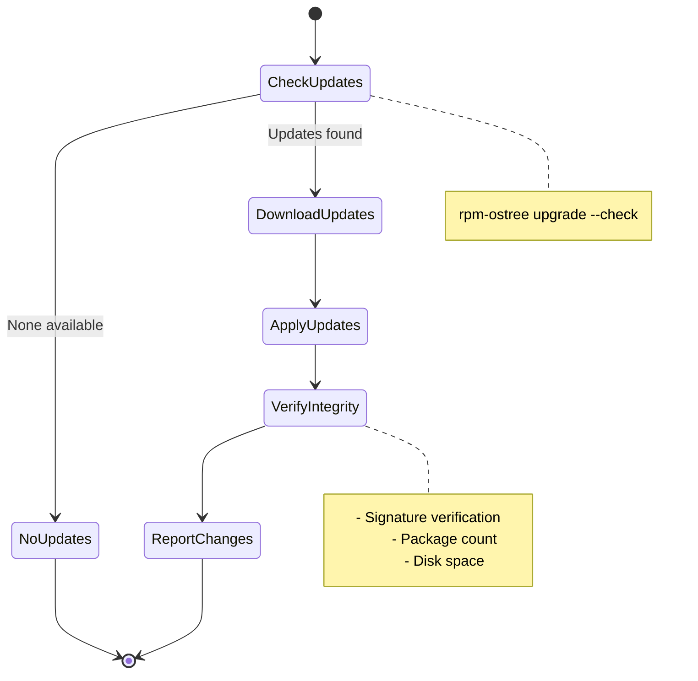
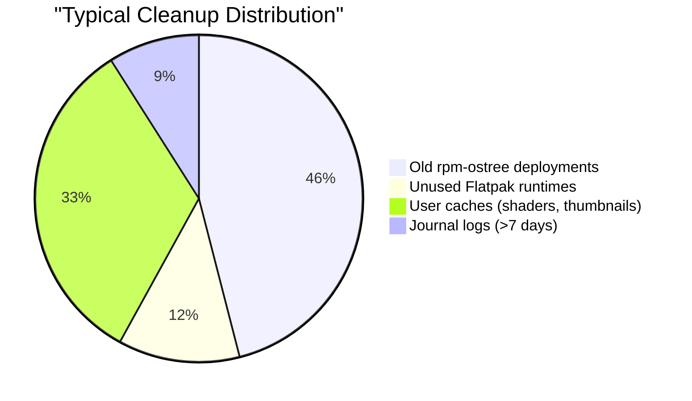

# modules/KENL0: System Operations ("sudog" layer)

**Version:** 1.0.0
**Target Platform:** Bazzite (rpm-ostree) - Immutable Linux
**Status:** Production Ready
**Privilege Level:** Elevated (requires sudo for some operations)

---

## Overview

KENL0 is the **"sudog" (super-underdog) layer** that handles privileged systemwide operations on immutable Linux systems (Bazzite/Fedora Atomic). It provides:

- ⚙️ **Chainable system operations** (rebase + clean, update + verify)
- 🔒 **Safe elevated privileges** via sudoers configuration
- 📋 **ATOM trail logging** for all systemwide changes
- 🎯 **CTFWI validation** before dangerous operations
- 🔄 **Automatic rollback points** with rpm-ostree
- 🚀 **ujust integration** for Bazzite-specific operations
- ⚡ **OS-specific aliases/functions** optimized for Bazzite

---

## Why modules/KENL0?

Other modules/KENLs operate in **user-space** (respecting immutability). modules/KENL0 is the **only modules/KENL** that can:
- Modify system packages (rpm-ostree)
- Rebase to different OS versions
- Manage systemwide services
- Execute privileged operations safely

It's the "sudog" - the foundation that enables systemwide changes while maintaining ATOM trail audit logging.

---

## Quick Actions (Chained Operations)

### Update + Verify

```bash
cd ~/kenl/KENL0-system/quick-actions
./update-verify.sh
```

**What changes:**


**System state:**
| Before | After |
|--------|-------|
| Deployment: 40.20251001.0 | Deployment: 41.20251110.0 |
| Pending updates: Yes | Pending updates: No |
| ATOM trail: 147 entries | ATOM trail: 148 entries (+ATOM-SYSTEM-xxx) |

**Why:** Chains verification step after update to ensure system integrity. ATOM trail logs entire operation for recovery.

---

### Rebase + Clean

```bash
cd ~/kenl/KENL0-system/quick-actions
./rebase-clean.sh stable
```

**What changes:**


```mermaid
flowchart TD
    A[Current: bazzite-40] --> B{Choose target}
    B -->|stable| C[bazzite:stable/x86_64]
    B -->|testing| D[bazzite:testing/x86_64]
    B -->|latest| E[bazzite:unstable/x86_64]

    C --> F[Download new deployment]
    D --> F
    E --> F

    F --> G[Keep current as rollback]
    G --> H[Delete old deployments]
    H --> I[Verify integrity]
    I --> J[✅ Ready to reboot]

    style A fill:#ffe3e3
    style J fill:#d3f9d8
```

**Deployments before:**
```
● bazzite:bazzite/stable/x86_64/desktop
      Version: 40.20251001.0 (2025-10-01) [current]

  bazzite:bazzite/stable/x86_64/desktop
      Version: 40.20250915.0 (2025-09-15) [rollback]

  bazzite:bazzite/stable/x86_64/desktop
      Version: 40.20250901.0 (2025-09-01) [old]
```

**Deployments after:**
```
  bazzite:bazzite/stable/x86_64/desktop
      Version: 41.20251110.0 (2025-11-10) [pending - reboot to activate]

● bazzite:bazzite/stable/x86_64/desktop
      Version: 40.20251001.0 (2025-10-01) [current - kept as rollback]
```

**Why:** Rebasing changes the OS channel (stable↔testing↔latest). Cleaning prevents disk bloat. Automatic rollback point saves current working state.

---

## ujust Integration

Bazzite uses `ujust` for system management. modules/KENL0 wraps it with ATOM trail logging:

```bash
cd ~/kenl/KENL0-system/ujust-integration
./ujust-atom.sh --choose
```

**What changes:**

```
┌────────────────────────────────────────────────────────────┐
│ ujust (Bazzite Quick Actions) - ATOM Trail Enabled        │
├────────────────────────────────────────────────────────────┤
│  1) update               - Update system                   │
│  2) rebase-stable        - Rebase to stable                │
│  3) rebase-testing       - Rebase to testing               │
│  4) install-brew         - Install Homebrew                │
│  5) setup-gaming         - Configure gaming optimizations  │
│  6) install-proton-ge    - Install latest Proton GE        │
│  7) nvidia-cache-clear   - Clear NVIDIA shader cache       │
│  8) install-sunshine     - Install game streaming          │
│  9) regenerate-grub      - Regenerate GRUB config          │
│ 10) ujust-help           - Show all ujust recipes          │
└────────────────────────────────────────────────────────────┘

Select (1-10): 6
```

**Execution flow:**

```mermaid
sequenceDiagram
    participant User
    participant ujust-atom
    participant modules/KENL1
    participant ujust
    participant System

    User->>ujust-atom: Select "install-proton-ge"
    ujust-atom->>KENL1: Create ATOM-UJUST-20251110-001
    ujust-atom->>ujust: ujust install-proton-ge
    ujust->>System: Download Proton GE 9-18
    System->>ujust: ✅ Installed to ~/.steam/
    ujust-->>ujust-atom: Success
    ujust-atom->>KENL1: Log success to ATOM trail
    ujust-atom-->>User: ✅ Proton GE 9-18 ready
```


**ATOM trail entry created:**
```bash
ATOM-UJUST-20251110-001.log
├─ Timestamp: 2025-11-10T14:32:01Z
├─ Operation: install-proton-ge
├─ Intent: Install latest Proton GE for better game compatibility
├─ Command: ujust install-proton-ge
├─ Exit code: 0 (success)
├─ Duration: 45s
└─ Changes:
   └─ Downloaded: ~/.steam/compatibilitytools.d/GE-Proton9-18/
```

**Why:** Every ujust operation is logged to ATOM trail. If Proton GE breaks a game, you know exactly when it was installed and can correlate with game issues.

---

## Aliases (Bazzite-Optimized)

```bash
# Load Bazzite aliases
source ~/kenl/KENL0-system/aliases/bazzite-aliases.sh

# rpm-ostree shortcuts
os-status          # rpm-ostree status
os-update          # rpm-ostree upgrade
os-rollback        # rpm-ostree rollback
os-clean           # Cleanup old deployments

# Flatpak shortcuts
fpl                # flatpak list
fpi <app>          # flatpak install
fpup               # flatpak update

# Distrobox shortcuts
dbl                # distrobox list
dbe <name>         # distrobox enter

# Gaming
proton-list        # List installed Proton versions
steam-logs         # View Steam logs

# Quick actions
qa-update          # Chained update + verify
qa-rebase          # Chained rebase + clean
qa-ujust           # ujust menu
```

---

## Functions (Advanced)

```bash
# Load system functions
source ~/kenl/KENL0-system/functions/system-functions.sh
```

### full-update

```bash
full-update
```

**What changes:**


```mermaid
graph TD
    A[full-update] --> B[rpm-ostree upgrade]
    A --> C[flatpak update -y]
    A --> D[Update distrobox containers]

    B --> B1[System packages updated]
    C --> C1[All flatpaks updated]
    D --> D1[apt update in Ubuntu containers]
    D --> D2[dnf update in Fedora containers]

    B1 --> E[✅ Complete system updated]
    C1 --> E
    D1 --> E
    D2 --> E

    style A fill:#e5dbff,stroke:#7950f2
    style E fill:#d3f9d8,stroke:#51cf66
```

**Updates performed:**
| Layer | Command | Typical result |
|-------|---------|----------------|
| **Base OS** | `rpm-ostree upgrade` | 15-40 packages |
| **Flatpaks** | `flatpak update -y` | 5-20 apps/runtimes |
| **Containers** | `apt/dnf update` in each | 20-100 packages per container |

**Why:** One command updates entire stack. ATOM trail logs each layer separately for granular recovery.

---

### deep-clean

```bash
deep-clean
```

**What changes:**
```diff
Before:
Disk usage: /var = 45GB
- Old deployments: 12GB (3 versions)
- Flatpak unused: 3.2GB (old runtimes)
- User cache: 8.5GB (thumbnails, shaders)
- Journal logs: 2.1GB (90 days)

After:
Disk usage: /var = 19.2GB (-25.8GB freed!)
+ Old deployments: 4GB (kept 2 versions only)
+ Flatpak unused: 0GB (cleaned)
+ User cache: 0.5GB (cleaned)
+ Journal logs: 0.2GB (kept 7 days)
```

**Cleanup targets:**


**Why:** Immutable systems accumulate deployments over time. deep-clean prevents /var partition from filling up.

---

### safe-rebase

```bash
safe-rebase testing
```

**What changes:**


```mermaid
sequenceDiagram
    participant User
    participant safe-rebase
    participant modules/KENL10
    participant rpm-ostree

    User->>safe-rebase: safe-rebase testing
    safe-rebase->>User: ⚠️ This will change OS channel. Continue? [y/N]
    User->>safe-rebase: y
    safe-rebase->>KENL10: Create snapshot
    modules/KENL10-->>safe-rebase: ✅ Snapshot created
    safe-rebase->>rpm-ostree: rpm-ostree rebase bazzite:testing/x86_64
    rpm-ostree-->>safe-rebase: ✅ Rebase complete
    safe-rebase->>User: ✅ Reboot to activate (rollback available)
```

**Confirmation prompt:**
```
⚠️  REBASE CONFIRMATION ⚠️

Current:  bazzite:stable/x86_64 (40.20251001.0)
Target:   bazzite:testing/x86_64 (41.20251110.0)

Changes:
  • Kernel: 6.11.3 → 6.12.1
  • Mesa: 24.2.4 → 24.3.0-rc2
  • NVIDIA: 565.57.01 → 570.86.10-beta

⚠️  Testing channel may have bugs!

Snapshot will be created before rebase.
Rollback available if issues occur.

Continue? [y/N]:
```

**Why:** Rebasing to testing/unstable is risky. safe-rebase creates snapshot + shows changes + asks confirmation.

---

### update-gaming

```bash
update-gaming
```

**What changes:**
| Component | Before | After |
|-----------|--------|-------|
| **Proton GE** | 9-15 | 9-18 (latest) |
| **Steam** | Flatpak 1.0.0.78 | Flatpak 1.0.0.79 |
| **Lutris** | Flatpak 0.5.16 | Flatpak 0.5.17 |
| **GameMode** | 1.8.0 | 1.8.1 |
| **MangoHud** | 0.7.1 | 0.7.2 |

**Why:** Gaming stack updates separately from OS. This function updates all gaming tools in one command.

---

### health-check

```bash
health-check
```

**Output:**
```
🔍 modules/KENL0 System Health Check

[✅] rpm-ostree status: Healthy
    • Deployment: 41.20251110.0 (latest)
    • Signatures: Valid
    • Pending updates: None

[✅] Disk space: Healthy
    • /var: 19.2GB / 50GB (38% used)
    • /home: 234GB / 900GB (26% used)

[✅] Flatpaks: Healthy
    • Installed: 27 apps
    • Updates available: 0

[⚠️] Distrobox: Warning
    • Container "ubuntu-dev": Not used in 45 days
    • Consider removing to free 8.2GB

[✅] Gaming stack: Healthy
    • Proton GE: 9-18 (latest)
    • Steam: Running
    • GPU driver: 570.86.10 (loaded)

[✅] ATOM trail: Healthy
    • Entries: 1,247
    • Size: 23MB
    • Oldest: 2025-09-15
```

**Why:** Quick health overview before major operations. Catches issues like low disk space before they cause failures.

---

## ATOM Trail Integration

All modules/KENL0 operations are logged:

```bash
# System operation with ATOM trail
./system-atom.sh update "Monthly system update" "rpm-ostree upgrade"

# Creates ATOM-SYSTEM-20251109-001

# View system ATOM trail
ls ~/.config/atom-sage/trail/ATOM-SYSTEM-*
cat ~/.config/atom-sage/trail/ATOM-SYSTEM-20251109-001.log
```

---

## Sudoers Configuration

For passwordless operations (optional, requires root):

```bash
# Validate sudoers file
sudo visudo -c -f ~/kenl/KENL0-system/sudoers.d/kenl0-system

# Install (BE CAREFUL!)
sudo cp ~/kenl/KENL0-system/sudoers.d/kenl0-system /etc/sudoers.d/
sudo chmod 0440 /etc/sudoers.d/kenl0-system

# Allows passwordless:
# - rpm-ostree status (read-only)
# - systemctl status (read-only)
# - journalctl (read-only)
#
# Requires password:
# - rpm-ostree upgrade/rebase/install
# - systemctl reboot/poweroff
```

**Security Note**: Only install if you understand the implications!

---

## CTFWI Validation

"Checked The Flags, What Intent?" - pre-flight checks before dangerous operations:

```bash
# Example: Rebase operation
./system-atom.sh rebase "Rebase to testing" "rpm-ostree rebase ..."

# CTFWI validates:
# ✅ rpm-ostree available
# ✅ Rollback point will be created
# ✅ Target version exists
# ✅ Sufficient disk space
# ✅ No pending operations
#
# Prompts for confirmation before executing
```

---

## Directory Structure

```
KENL0-system/
├── system-atom.sh              # Core ATOM trail wrapper
├── quick-actions/              # Chained operations
│   ├── update-verify.sh        # Update + verify
│   ├── rebase-clean.sh         # Rebase + clean
│   └── rollback-restore.sh     # (TODO)
├── ujust-integration/          # Bazzite ujust wrappers
│   └── ujust-atom.sh           # ATOM-logged ujust
├── rpm-ostree-ops/             # rpm-ostree specific (TODO)
├── sudoers.d/                  # Safe sudoers config
│   └── kenl0-system            # Sudoers file
├── aliases/                    # OS-specific aliases
│   └── bazzite-aliases.sh      # Bazzite-optimized
├── functions/                  # Advanced functions
│   └── system-functions.sh     # Bazzite system functions
└── README.md                   # This file
```

---

## Integration with Other modules/KENLs

KENL0 is the **only modules/KENL with elevated privileges**. Other modules/KENLs call modules/KENL0 for system operations:

```
┌─────────────────────────────────────────┐
│  modules/KENL2 Gaming: "Update Proton-GE"       │
│  └─→ Calls modules/KENL0: ujust install-proton  │
│      └─→ ATOM trail: ATOM-SYSTEM-*      │
└─────────────────────────────────────────┘

┌─────────────────────────────────────────┐
│  modules/KENL3 Dev: "Install dev tools"         │
│  └─→ Calls modules/KENL0: rpm-ostree install    │
│      └─→ ATOM trail: ATOM-SYSTEM-*      │
└─────────────────────────────────────────┘
```

---

## modules/KENL5 Facades Integration

Switch to system operations context:

```bash
cd ~/kenl/KENL5-facades
./switch-kenl.sh system

# Prompt changes to:
⚙️  modules/KENL0 user@bazzite:~$

# Aliases and functions loaded automatically!
qa-update          # Quick action available
os-status          # Alias available
full-update        # Function available
```

---

## Safety Features

1. **ATOM Trail**: Every operation logged
2. **CTFWI Validation**: Pre-flight checks before dangerous ops
3. **Automatic Rollback Points**: rpm-ostree creates rollback automatically
4. **Confirmation Prompts**: Asks before executing
5. **Immutable-Safe**: Respects rpm-ostree constraints

---

## Example Workflow

```bash
# Morning: Check for updates
./switch-kenl.sh system
⚙️  modules/KENL0 user@bazzite:~$ check-updates

# Updates available! Run update + verify
⚙️  modules/KENL0 user@bazzite:~$ qa-update
# → Creates ATOM-SYSTEM-20251109-001
# → Updates system
# → Verifies integrity
# ✅ Complete!

# Reboot to activate
⚙️  modules/KENL0 user@bazzite:~$ sudo systemctl reboot

# After reboot: Verify
⚙️  modules/KENL0 user@bazzite:~$ os-status
✅ New deployment active!

# View ATOM trail
⚙️  modules/KENL0 user@bazzite:~$ cat ~/.config/atom-sage/trail/ATOM-SYSTEM-20251109-001.log
```

---

## License

MIT License - See [../modules/KENL1-framework/LICENSE](../modules/KENL1-framework/LICENSE)

---

## Navigation

- **← [Root README](../README.md)** - Overview of all modules/KENL modules
- **→ [KENL1: Framework](../modules/KENL1-framework/README.md)** - Core ATOM+SAGE+OWI
- **→ [KENL5: Facades](../modules/KENL5-facades/README.md)** - Context switching

---

**Status**: Production Ready | **Version**: 1.0.0 | **Platform**: Bazzite (rpm-ostree) | **Privilege**: Elevated
