# Best 3 Linux Distros to Convert To (From Windows)

**Skip the research. These three cover 95% of Windows refugees.**

[← Back to Windows Alternatives](./README.md)

## TL;DR Decision Tree

```mermaid
graph TD
    A[Why are you leaving Windows?] -->|Windows 10 EOL| B{What do you use PC for?}
    A -->|Just hate Windows| C{How tech-savvy?}

    B -->|Gaming 90%+ of time| D[🎮 Bazzite-DX]
    B -->|General use| E{Want cutting-edge or stable?}
    B -->|Work/Office| F[💼 Zorin OS]

    C -->|"Just make it work"| G[🟢 Linux Mint]
    C -->|"I like to tinker"| H[Kubuntu]

    E -->|Stable, boring, works| G
    E -->|Latest features, polished| F

    D -.->|See also| I[Gaming guide]
    F -.->|See also| J[Business guide]
    G -.->|See also| K[Beginner guide]
```



## The 3 Best (And Why)

### 1. 🟢 Linux Mint - For 80% of People

**[Full details →](./linux-mint.md)**

```
┌─────────────────────────────────────────────────────────────────┐
│ Best For:                                                        │
│ ✅ First-time Linux users                                       │
│ ✅ "I just want it to work" mentality                           │
│ ✅ Older hardware (2010+ PCs)                                   │
│ ✅ People who hate change                                       │
│ ✅ Grandparents, parents, non-tech users                        │
│                                                                  │
│ Pros:                                                            │
│ • Easiest transition from Windows                               │
│ • Huge community = every question answered                      │
│ • Rock solid (never breaks)                                     │
│ • Looks like Windows 7/10 hybrid                                │
│ • Complete out of box (codecs, fonts, etc.)                     │
│                                                                  │
│ Cons:                                                            │
│ • Not cutting-edge (conservative updates)                       │
│ • Looks dated (Windows 7-ish, not 11)                           │
│ • Gaming not optimized (but works)                              │
│                                                                  │
│ Perfect Quote:                                                   │
│ "Linux Mint is what Windows should have been."                  │
└─────────────────────────────────────────────────────────────────┘
```

**When to choose Mint:**
- ✅ You want the safest, easiest transition
- ✅ You value stability over latest features
- ✅ You're installing for non-tech-savvy family
- ✅ You just want Windows annoyances to stop

**When NOT to choose Mint:**
- ❌ You want Windows 11 aesthetic
- ❌ You game competitively (use Bazzite)
- ❌ You want cutting-edge features day one

---

### 2. 💼 Zorin OS - For People Who Want Better Windows

**[Full details →](./zorin-os.md)**

```
┌─────────────────────────────────────────────────────────────────┐
│ Best For:                                                        │
│ ✅ Windows users who want Windows IMPROVED                      │
│ ✅ Business/professional use                                     │
│ ✅ People who appreciate good design                            │
│ ✅ Those willing to pay $39 for polish (or use free Core)      │
│                                                                  │
│ Pros:                                                            │
│ • Most polished Linux desktop                                   │
│ • Layout switcher (Win 11, Win 10, macOS, Ubuntu)              │
│ • Business-ready (Active Directory, VPN, RDP built-in)         │
│ • Windows app support pre-configured (Pro)                      │
│ • Long-term support (5 years)                                   │
│                                                                  │
│ Cons:                                                            │
│ • Pro version costs $39 (Core is free)                          │
│ • Not as customizable as Kubuntu                                │
│ • Gaming not optimized (better than Mint though)                │
│                                                                  │
│ Perfect Quote:                                                   │
│ "Windows, but made by people who care about users."             │
└─────────────────────────────────────────────────────────────────┘
```

**When to choose Zorin:**
- ✅ You want Windows 11 looks without Microsoft
- ✅ You're using for work/business
- ✅ You value polish and professional appearance
- ✅ You don't mind $39 for Pro features (or use Core free)

**When NOT to choose Zorin:**
- ❌ You want absolute maximum customization (use Kubuntu)
- ❌ You're gaming-focused (use Bazzite)
- ❌ You refuse to pay anything (use Mint or Zorin Core free)

---

### 3. 🎮 Bazzite-DX - For Gamers

**[Full details →](../../modules/KENL2-gaming/README.md)**

```
┌─────────────────────────────────────────────────────────────────┐
│ Best For:                                                        │
│ ✅ Gaming is 50%+ of your PC usage                              │
│ ✅ Steam Deck-like experience on PC                             │
│ ✅ Maximum gaming performance                                   │
│ ✅ "I want Windows for games ONLY"                              │
│                                                                  │
│ Pros:                                                            │
│ • Gaming-optimized (Proton, GameMode, MangoHud built-in)       │
│ • Steam Deck UI mode (Big Picture on steroids)                 │
│ • Rolling updates (always latest drivers)                       │
│ • Immutable (can't break system, easy rollback)                │
│ • Based on Fedora (cutting-edge but stable)                    │
│                                                                  │
│ Cons:                                                            │
│ • Steeper learning curve than Mint/Zorin                        │
│ • Not for general-purpose computing (CAN do it, not optimized) │
│ • Anti-cheat games still don't work (Valorant, etc.)           │
│                                                                  │
│ Perfect Quote:                                                   │
│ "What if your PC was a Steam Deck?"                             │
└─────────────────────────────────────────────────────────────────┘
```

**When to choose Bazzite:**
- ✅ Gaming is primary use case
- ✅ You want Steam Deck experience
- ✅ You're okay with slightly more complexity
- ✅ You want maximum FPS and performance

**When NOT to choose Bazzite:**
- ❌ You barely game (use Mint or Zorin)
- ❌ You want simplest transition (use Mint)
- ❌ You play competitive anti-cheat games only

---

## Side-by-Side Comparison

| Feature | Linux Mint | Zorin OS | Bazzite-DX |
|---------|------------|----------|------------|
| **Ease of use** | 🟢 Easiest | 🟢 Very easy | 🟡 Moderate |
| **Looks like** | Windows 7/10 | Windows 11/10 | Steam Deck |
| **Gaming** | 🟡 Moderate | 🟡 Good | 🟢 Best |
| **Stability** | 🟢 Rock solid | 🟢 Very stable | 🟢 Stable |
| **Hardware support** | 🟢 Excellent | 🟢 Excellent | 🟢 Excellent |
| **Community size** | 🟢 Huge | 🟡 Large | 🟡 Growing |
| **Update frequency** | 🟡 Conservative | 🟡 Moderate | 🟢 Rolling |
| **For beginners** | 🟢 Perfect | 🟢 Great | 🟡 Okay |
| **For gamers** | 🟡 Okay | 🟡 Good | 🟢 Perfect |
| **For business** | 🟡 Good | 🟢 Excellent | 🔴 No |
| **Cost** | Free | Free/$39 Pro | Free |
| **Support length** | 5 years | 5 years | Rolling |

## Use Case Recommendations

### "I just want Windows to stop annoying me"
→ **Linux Mint**
- Familiar interface
- Everything works
- Never breaks
- Huge community support

### "I want Windows 11 looks without Microsoft"
→ **Zorin OS**
- Looks like Windows 11
- Polished and professional
- Multiple layouts
- Business features

### "I game and want maximum FPS"
→ **Bazzite-DX**
- Gaming-optimized kernel
- Latest drivers
- Steam Deck UI
- Play Cards for configs

### "I'm migrating 100 office PCs"
→ **Zorin OS Pro**
- Active Directory support
- Professional appearance
- Paid support available
- Predictable updates

### "I'm installing for my grandparent"
→ **Linux Mint**
- Simplest to use
- Never breaks
- Huge community for support
- Familiar Windows layout

### "I'm a developer who games occasionally"
→ **Zorin OS** or **Linux Mint**
- Zorin if you want polish + Pro features
- Mint if you want maximum stability
- Both have good dev tools

### "I stream on Twitch and play competitive games"
→ **Stick with Windows** (sadly)
- Anti-cheat doesn't work on Linux (yet)
- OBS works, but some capture cards don't
- OR dual-boot: Bazzite for single-player, Windows for competitive

## Installation Roadmap

### Phase 1: Test Drive (No Risk)
1. Pick one of the 3 above
2. Download ISO
3. Create bootable USB ([guide here](../surface-pro-4/QUICK_START_GUIDE.md))
4. Boot from USB (doesn't touch Windows)
5. Use it for a day or two

### Phase 2: Dual-Boot (Low Risk)
1. Shrink Windows partition (50GB for Linux)
2. Install chosen distro alongside Windows
3. Choose OS at boot
4. Use Linux for a month, keep Windows as backup

### Phase 3: Full Migration (Committed)
1. Backup Windows files
2. Replace Windows with Linux
3. Enjoy life without forced updates

## Common Questions

**Q: Can I switch between these later?**
A: Yes, easily. Your /home folder (files) can be preserved.

**Q: What if I pick wrong?**
A: Try them all with live USB. No commitment needed.

**Q: Can I run Windows apps?**
A: Some (via Wine), but use native Linux alternatives when possible. See [terminology guide](./WINDOWS_SCHMINDOWS.md).

**Q: What about gaming?**
A: Mint/Zorin: 60-70% of Steam games work
Bazzite: 80-90% of Steam games work
Both: Anti-cheat multiplayer games mostly don't work

**Q: Will I need to use terminal?**
A: Mint/Zorin: Rarely or never
Bazzite: Occasionally (for gaming tweaks)

**Q: What about Microsoft Office?**
A: LibreOffice opens .docx/.xlsx files perfectly. Or use Office 365 web version.

## Final Recommendation

**If unsure, start with Linux Mint.**

It's the safest bet, has the largest community, and you can always switch to Zorin or Bazzite later if you want specific features.

**Process:**
1. Download Linux Mint ISO
2. Create bootable USB
3. Try it live (doesn't touch Windows)
4. If you like it, install alongside Windows (dual-boot)
5. Use for 1 month
6. If happy, remove Windows partition (reclaim space)

**Still unsure?** Try all 3 with live USB. Each boots from USB without installing.

---

**Part of:** [Windows Alternatives Guide](./README.md)
**Next Steps:**
- [Windows vs Linux Terminology](./WINDOWS_SCHMINDOWS.md) - Visual guide to differences
- [Creating Bootable USB](../surface-pro-4/QUICK_START_GUIDE.md) - Step-by-step
- [Gaming on Linux](../../modules/KENL2-gaming/README.md) - Full gaming guide
