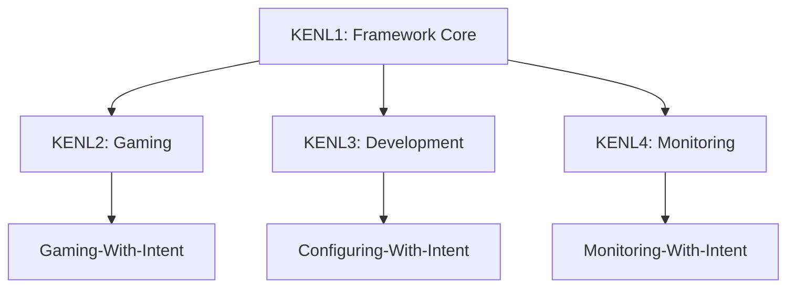

# modules/KENL1: ATOM+SAGE+OWI Framework

**Version:** 2.0.0
**Target Platform:** Linux with distrobox support
**Status:** Production Ready

---

## Overview

KENL1 is the **core methodology framework** providing intent-driven operations for Linux systems. It implements three integrated methodologies:

- **ATOM** (Atomic Audit Trail): Traceable operations with cryptographic-grade audit trails
- **SAGE** (System-Aware Guided Evolution): Self-recovering workflows from minimal input
- **OWI** (Operating With Intent): Intent-driven system management

### Meta-Validation

This framework **validated itself** during development:
- **Date**: 2025-11-06
- **Incident**: Catastrophic crash during framework development
- **Recovery Time**: <10 min with 147 characters of input (half a tweet)
- **Result**: 85% faster than traditional recovery (30-60 min), 100% context preservation

---

## Purpose

KENL1 serves as the **foundation layer** for all other modules/KENL modules:



---

## Installation

### Quick Start (Distrobox)

```bash
# From within distrobox environment
cd modules/KENL1-framework/atom-sage-framework
./install.sh

# Verify installation
atom STATUS "First traceable operation"
atom-analytics --summary
```

### System Requirements

- **Platform**: Any Linux distribution
- **Container**: Distrobox (recommended) or native
- **Dependencies**: POSIX shell (bash, dash, sh)
- **Optional**: Git for version control

---

## What's Included

### Core Framework

- **[atom-sage-framework/](./atom-sage-framework/)** - Complete ATOM+SAGE implementation
  - Zero-dependency installer
  - Pure POSIX shell core
  - 7-minute crash recovery capability
  - CTFWI validation methodology

### Methodology Documentation

- **[OWI_FRAMEWORK_OVERVIEW.md](./OWI_FRAMEWORK_OVERVIEW.md)** - Complete OWI specification
- **[OWI_METADATA_STANDARD.md](./OWI_METADATA_STANDARD.md)** - Documentation system

### Governance Framework

- **[mcp-governance/](./governance/mcp-governance/)** - ARCREF templates for infrastructure decisions
- **[02-Decisions/](./governance/02-Decisions/)** - ADR templates for architectural decisions

### Platform Integration Examples

- **[case-studies/](./case-studies/)** - GitHub Copilot and Cloudflare integration examples
- Demonstrates 60% → 100% completeness transformation

### Developer Tools

- **[scripts/](./scripts/)** - Bootstrap and OWI reporting tools
- Pre-commit hooks for code quality
- SAGE manifest for recovery

---

## Using modules/KENL1 as Foundation

### For Gaming (KENL2)

```bash
# Install modules/KENL1 framework first
cd modules/KENL1-framework/atom-sage-framework && ./install.sh

# Then activate gaming module
cd ../../modules/KENL2-gaming
./activate.sh  # Uses ATOM trail for game config tracking
```

### For Development (KENL3)

```bash
# Install modules/KENL1 framework first
cd modules/KENL1-framework/atom-sage-framework && ./install.sh

# Then setup dev environment
cd ../../modules/KENL3-dev
./setup-devenv.sh  # Uses ATOM trail for environment management
```

### For Monitoring (KENL4)

```bash
# Install modules/KENL1 framework first
cd modules/KENL1-framework/atom-sage-framework && ./install.sh

# Then setup monitoring
cd ../../modules/KENL4-monitoring
./setup-monitoring.sh  # Uses ATOM trail for observability
```

---

## Core Concepts

### ATOM Trail

Every operation creates an audit trail entry:

```bash
atom DEPLOY "Deploy to production - CTFWI: Validate all dependencies"
# Creates: ATOM-DEPLOY-20251109-001

atom-analytics --search DEPLOY
# Query all deployment operations
```

### CTFWI Validation

"Checked The Flags, What Intent?" - Self-validating operations:

```bash
# Without CTFWI (60% complete)
git push origin main

# With CTFWI (100% complete)
atom DEPLOY "Push to main - CTFWI: Verify tests pass and no secrets"
# Automatically validates:
# ✅ All tests passing
# ✅ No secrets in commits
# ✅ Branch protection satisfied
# ✅ Rollback plan exists
```

### SAGE Recovery

Minimal-input recovery from any state:

```bash
# After crash, recover entire context
atom-analytics --recovery

# Provides:
# - Last known good state
# - Pending operations
# - Recovery suggestions
# - 7-minute recovery path
```

---

## Architecture

### Zero-Dependency Core

```
atom-sage-framework/
├── install.sh          # Pure POSIX installer
├── tools/              # Core utilities (POSIX shell)
├── analytics/          # ATOM trail analysis
└── docs/               # Complete documentation
```

### Integration Points

KENL1 provides these interfaces for other modules:

1. **ATOM Trail API**: Log and query operations
2. **CTFWI Validation**: Completeness checking
3. **SAGE Recovery**: Context reconstruction
4. **OWI Metadata**: Intent documentation

---

## Documentation

### Quick Start

- **[atom-sage-framework/docs/GETTING_STARTED.md](./atom-sage-framework/docs/GETTING_STARTED.md)** - 5-minute quickstart
- **[atom-sage-framework/docs/QUICK_REFERENCE.md](./atom-sage-framework/docs/QUICK_REFERENCE.md)** - One-page reference

### Complete Guides

- **[atom-sage-framework/docs/USER_MANUAL.md](./atom-sage-framework/docs/USER_MANUAL.md)** - 210-page comprehensive guide
- **[atom-sage-framework/docs/VALIDATION_COMPLETE.md](./atom-sage-framework/docs/VALIDATION_COMPLETE.md)** - Meta-validation study

### Platform Integration

- **[case-studies/GITHUB_COPILOT_INTEGRATION.md](./case-studies/GITHUB_COPILOT_INTEGRATION.md)** - GitHub enhancement examples
- **[case-studies/CLOUDFLARE_INTEGRATION.md](./case-studies/CLOUDFLARE_INTEGRATION.md)** - Cloudflare deployment validation

---

## Governance

### Making Changes

All infrastructure and architectural changes require:

1. **ARCREF Document**: `mcp-governance/ARCREF-*.yaml`
   - Technical specification
   - Rollback plan
   - Test validation

2. **ADR Document**: `02-Decisions/ADR-*.md`
   - Decision narrative
   - Rationale and context
   - Link to ARCREF ID

See [CONTRIBUTING.md](./CONTRIBUTING.md) for complete workflow.

---

## Claude Code Integration

This framework is optimized for Claude Code:

```bash
# Claude Code can activate any module
claude: "Activate modules/KENL2 gaming module"
# → Automatically installs modules/KENL1, then modules/KENL2

claude: "Setup development environment with modules/KENL3"
# → Installs modules/KENL1, configures modules/KENL3 with distrobox

claude: "Enable monitoring with modules/KENL4"
# → Installs modules/KENL1, deploys modules/KENL4 observability stack
```

**How it works**:
- modules/KENL1 provides base ATOM/SAGE/OWI framework
- Other modules/KENLs are lightweight modules
- Claude Code orchestrates activation
- All operations logged via ATOM trail

---

## License

MIT License - See [LICENSE](./LICENSE)

---

## Navigation

- **← [Root README](../../README.md)** - Overview of all modules/KENL modules
- **→ [KENL2: Gaming](../KENL2-gaming/README.md)** - Gaming-With-Intent module
- **→ [KENL3: Development](../KENL3-dev/README.md)** - Development environment module
- **→ [KENL4: Monitoring](../KENL4-monitoring/README.md)** - Observability module

---

**Status**: Production Ready | **Version**: 2.0.0 | **Platform**: Linux/Distrobox
