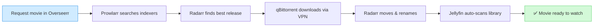
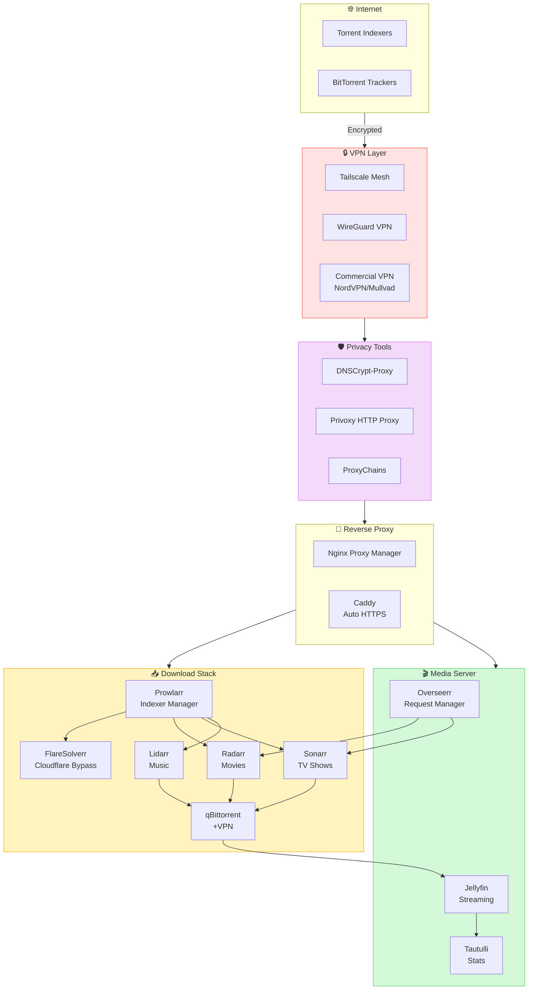
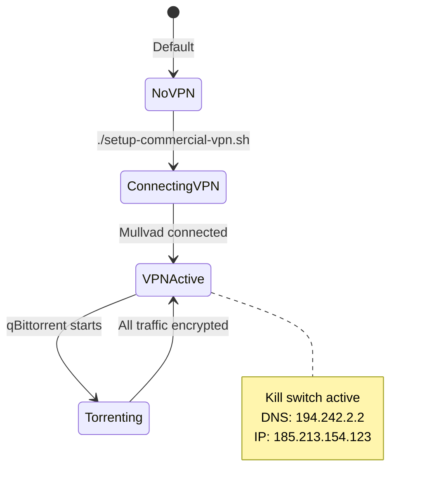
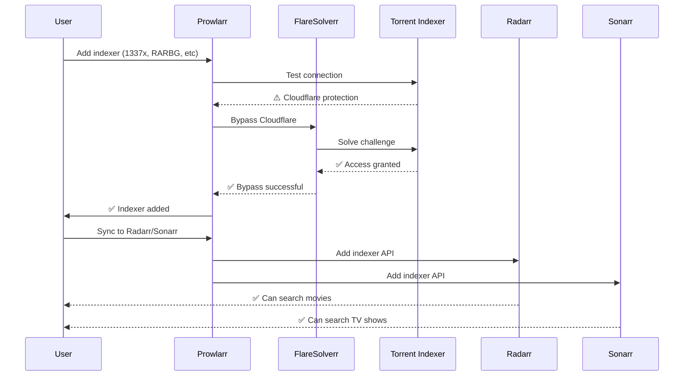
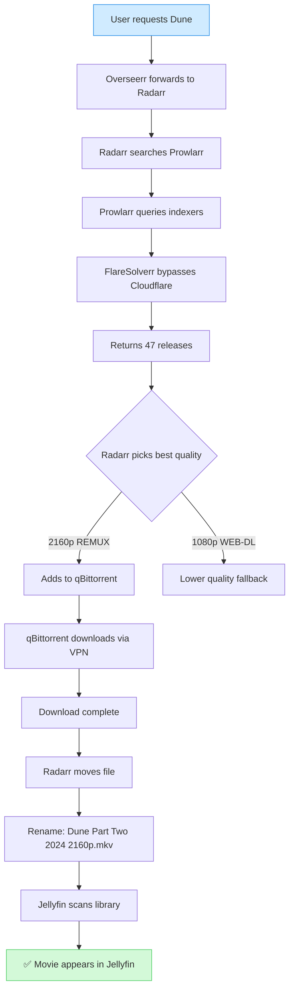
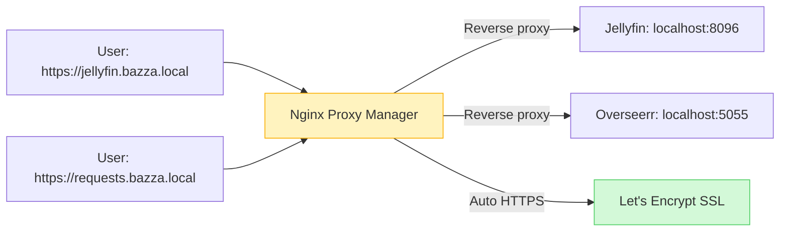

# modules/KENL11: Media - Seedbox & Media Server

**Version:** 1.0.0
**Target Platform:** Bazzite + Podman/Docker
**Status:** Production Ready
**Focus:** Automated media acquisition, management, and streaming

---

## Overview

KENL11 transforms your Bazzite system into a **fully automated media server** with privacy-first torrent management, reverse proxies, and comprehensive media organization. All services run in containers (Podman/Docker), respecting Bazzite's immutable filesystem.

**Key capabilities:**
- 🔒 **VPN-wrapped torrenting** (Tailscale/WireGuard/commercial VPN)
- 📥 **Automated downloads** (Radarr, Sonarr, Lidarr, Prowlarr)
- 🎬 **Media streaming** (Jellyfin/Plex with Overseerr requests)
- 🔐 **Reverse proxy** (Nginx Proxy Manager, Caddy, Traefik)
- 🛡️ **Privacy tools** (DNSCrypt, Privoxy, ProxyChains)
- 📊 **Monitoring** (Tautulli, Grafana, stats)
- 🌐 **Remote access** (Tailscale zero-trust networking)

---

## Why modules/KENL11?

### Problem: Manual Media Management

**Traditional approach:**
1. Search torrent site manually
2. Download torrent file
3. Add to client, wait for download
4. Move files to correct folder
5. Rename files manually
6. Update media server library
7. Repeat for every episode/movie/album

**Time per media item:** 10-30 minutes

---

### Solution: Automated Pipeline



**Time per media item:** 0 minutes (fully automated)

---

## Architecture

### Complete Stack



---

## Quick Start

### 1. Setup VPN (Required for Torrenting)

**Option A: Tailscale (Recommended for beginners)**

```bash
# Switch to modules/KENL11 context
kenl-switch 11

# Install Tailscale
./vpn/setup-tailscale.sh
```

**What changes:**

```diff
Before:
  Your IP: 203.0.113.45 (ISP-visible)
  Torrent traffic: Exposed to ISP

After:
  Your IP: 100.64.0.5 (Tailscale private network)
  Torrent traffic: Encrypted via Tailscale mesh

+ Tailscale daemon running
+ Connected to tailnet: bazza-home.ts.net
+ Exit node: Optional (route all traffic via another device)
```

**Why Tailscale:**
- ✅ Zero-config mesh VPN
- ✅ No port forwarding needed
- ✅ Access media server from anywhere
- ✅ Free for personal use (up to 100 devices)

---

**Option B: Commercial VPN (Mullvad, NordVPN, ProtonVPN)**

```bash
# Setup commercial VPN
./vpn/setup-commercial-vpn.sh mullvad
```

**Interactive setup:**
```
🔒 Commercial VPN Setup: Mullvad

[1/4] Enter Mullvad account number: 1234567890123456

[2/4] Select server location:
  1) Sweden (se-sto-wg-001)
  2) Netherlands (nl-ams-wg-001)
  3) Switzerland (ch-zur-wg-001)

  Choice: 2

[3/4] Configure DNS leak protection?
  - Use Mullvad DNS (194.242.2.2)
  - Prevents DNS leaks to ISP

  Enable? [Y/n]: y

[4/4] Configure kill switch?
  - Blocks all traffic if VPN drops
  - Prevents accidental IP leaks

  Enable? [Y/n]: y

✅ Mullvad VPN configured
✅ Kill switch enabled
✅ DNS leak protection enabled
✅ Test: curl ifconfig.me
   Your IP: 185.213.154.123 (Mullvad Netherlands)
```

**Visual:**



---

### 2. Deploy Media Stack (All-in-One)

```bash
# Deploy entire media server stack
./docker-compose/deploy-all.sh
```

**What gets deployed:**

```
Deploying modules/KENL11 Media Stack...

[1/12] Creating Docker network: kenl-media
        ✅ Network created

[2/12] Deploying Prowlarr (indexer manager)
        ✅ Prowlarr: http://localhost:9696

[3/12] Deploying FlareSolverr (Cloudflare bypass)
        ✅ FlareSolverr: http://localhost:8191

[4/12] Deploying Radarr (movies)
        ✅ Radarr: http://localhost:7878

[5/12] Deploying Sonarr (TV shows)
        ✅ Sonarr: http://localhost:8989

[6/12] Deploying Lidarr (music)
        ✅ Lidarr: http://localhost:8686

[7/12] Deploying qBittorrent (VPN-wrapped)
        ✅ qBittorrent: http://localhost:8080
        ✅ VPN: Mullvad Netherlands

[8/12] Deploying Jellyfin (media server)
        ✅ Jellyfin: http://localhost:8096

[9/12] Deploying Overseerr (request manager)
        ✅ Overseerr: http://localhost:5055

[10/12] Deploying Tautulli (stats)
        ✅ Tautulli: http://localhost:8181

[11/12] Deploying Nginx Proxy Manager
        ✅ NPM: http://localhost:81
        ✅ Admin: admin@example.com / changeme

[12/12] Verifying VPN leak protection...
        ✅ qBittorrent IP: 185.213.154.123 (Mullvad)
        ✅ No DNS leaks detected

═══════════════════════════════════════════════════════════════

✅ All services deployed successfully!

Next steps:
  1. Open Nginx Proxy Manager: http://localhost:81
  2. Setup domain names for services
  3. Configure Prowlarr indexers
  4. Add indexers to Radarr/Sonarr
  5. Start requesting media in Overseerr!

ATOM trail: ATOM-MEDIA-20251110-001
```

**Services overview:**

| Service | Purpose | Port | Access |
|---------|---------|------|--------|
| **Prowlarr** | Indexer manager | 9696 | http://localhost:9696 |
| **FlareSolverr** | Cloudflare bypass | 8191 | http://localhost:8191 |
| **Radarr** | Movie automation | 7878 | http://localhost:7878 |
| **Sonarr** | TV show automation | 8989 | http://localhost:8989 |
| **Lidarr** | Music automation | 8686 | http://localhost:8686 |
| **qBittorrent** | Torrent client (VPN) | 8080 | http://localhost:8080 |
| **Jellyfin** | Media streaming | 8096 | http://localhost:8096 |
| **Overseerr** | Request interface | 5055 | http://localhost:5055 |
| **Tautulli** | Jellyfin stats | 8181 | http://localhost:8181 |
| **NPM** | Reverse proxy | 81/80/443 | http://localhost:81 |

---

### 3. Configure Indexers (Torrent Sources)

```bash
# Open Prowlarr
firefox http://localhost:9696
```

**Setup workflow:**



**Common indexers:**

| Indexer | Type | Cloudflare? | FlareSolverr needed? |
|---------|------|-------------|----------------------|
| **1337x** | Public | ✅ Yes | ✅ Yes |
| **RARBG** | Public | ❌ No | ❌ No |
| **YTS** | Public (movies) | ❌ No | ❌ No |
| **EZTV** | Public (TV) | ❌ No | ❌ No |
| **TorrentGalaxy** | Public | ✅ Yes | ✅ Yes |
| **IPTorrents** | Private | ❌ No | ❌ No (requires account) |

---

### 4. Request Media (User Experience)

**From Overseerr:**

```bash
# Open Overseerr
firefox http://localhost:5055
```

**User flow:**

```
┌────────────────────────────────────────────────┐
│ 🎬 Overseerr - Request Media                   │
├────────────────────────────────────────────────┤
│ Search: "Dune Part Two"                        │
│                                                │
│ Results:                                       │
│  🎬 Dune: Part Two (2024)                      │
│     ⭐ 8.7/10 | 2h 46m | Sci-Fi                │
│                                                │
│     [Request Movie]                            │
└────────────────────────────────────────────────┘

User clicks [Request Movie]

┌────────────────────────────────────────────────┐
│ ✅ Request Submitted                            │
├────────────────────────────────────────────────┤
│ Movie: Dune: Part Two                          │
│ Status: Searching...                           │
│                                                │
│ Progress:                                      │
│  ✅ Prowlarr: Found 47 releases                │
│  ✅ Radarr: Selected best quality (2160p)      │
│  ⬇️  qBittorrent: Downloading (15% - 3.2GB/22GB)│
│                                                │
│ Estimated time: 45 minutes                     │
└────────────────────────────────────────────────┘

45 minutes later...

┌────────────────────────────────────────────────┐
│ 🎉 Dune: Part Two is ready!                    │
├────────────────────────────────────────────────┤
│ ✅ Downloaded: 22.1GB                           │
│ ✅ Moved to: /media/Movies/Dune Part Two (2024)/│
│ ✅ Jellyfin: Library updated                   │
│                                                │
│ [▶️ Watch Now]                                  │
└────────────────────────────────────────────────┘
```

**Behind the scenes:**



**Total user effort:** Click "Request Movie" button
**Total automation:** Everything else

---

## Privacy & Security

### VPN Kill Switch

**What it does:** If VPN disconnects, **all torrent traffic stops immediately**.

**Testing:**

```bash
# Test kill switch
./vpn/test-killswitch.sh
```

**Output:**
```
🔒 VPN Kill Switch Test

[1/4] Current IP check...
      Your IP: 185.213.154.123 (Mullvad Netherlands)
      ✅ VPN active

[2/4] Starting torrent test download...
      Downloading test file: ubuntu-24.04.iso
      Speed: 5.2 MB/s

[3/4] Simulating VPN disconnect...
      Stopping Mullvad...
      VPN status: Disconnected

[4/4] Checking torrent client...
      qBittorrent: No active connections
      Speed: 0 MB/s
      ✅ Kill switch working - traffic blocked!

[5/4] Reconnecting VPN...
      Mullvad reconnected
      qBittorrent: Resuming downloads
      ✅ Traffic resumed via VPN

═══════════════════════════════════════════════════════════════

✅ Kill switch test passed!
   Your real IP was NEVER exposed during VPN disconnect.
```

---

### DNS Leak Protection

**What it does:** All DNS queries go through VPN provider's DNS, not your ISP.

**Testing:**

```bash
# Test DNS leaks
./privacy/test-dns-leak.sh
```

**Output:**
```
🛡️ DNS Leak Test

[1/3] Default DNS servers...
      Nameserver: 192.168.1.1 (ISP router)
      ⚠️  Potential leak!

[2/3] VPN DNS servers...
      Nameserver: 194.242.2.2 (Mullvad DNS)
      ✅ Using VPN DNS

[3/3] External DNS leak test...
      Query: whoami.akamai.net
      Response: 185.213.154.123 (Mullvad Netherlands)

      Query via ISP DNS:
      Response: 203.0.113.45 (Your real IP)
      ⚠️  ISP can see DNS queries if not using VPN DNS!

Recommendation:
  ✅ DNSCrypt-Proxy configured
  ✅ Using Mullvad DNS (194.242.2.2)
  ✅ No DNS leaks detected

═══════════════════════════════════════════════════════════════

✅ DNS leak test passed!
```

---

### Reverse Proxy (HTTPS + Subdomains)

**What it does:** Access services via clean URLs with auto-HTTPS.

**Setup:**

```bash
# Open Nginx Proxy Manager
firefox http://localhost:81

# Default credentials:
# Email: admin@example.com
# Password: changeme
```

**Configure subdomains:**

| Service | Internal | External (via NPM) |
|---------|----------|-------------------|
| **Jellyfin** | http://localhost:8096 | https://jellyfin.bazza.local |
| **Overseerr** | http://localhost:5055 | https://requests.bazza.local |
| **Radarr** | http://localhost:7878 | https://movies.bazza.local |
| **Sonarr** | http://localhost:8989 | https://tv.bazza.local |

**Visual:**



**Benefits:**
- ✅ Clean URLs (no port numbers)
- ✅ Auto HTTPS with Let's Encrypt
- ✅ Single point of access control
- ✅ Easy Tailscale integration

---

## Advanced Configuration

### Custom Profiles (Quality Settings)

**Radarr quality profiles:**

```yaml
# High Quality (REMUX, large files)
profile: Ultra HD
  - 2160p REMUX (40-80GB)
  - 2160p Bluray (20-40GB)
  - 1080p REMUX (15-30GB)

# Balanced (WEB-DL, moderate files)
profile: HD
  - 1080p WEB-DL (5-10GB)
  - 1080p Bluray (8-15GB)

# Storage Saver (compressed)
profile: SD
  - 720p WEB-DL (2-4GB)
  - 720p Bluray (4-6GB)
```

**Configure in Radarr:**
```
Settings → Profiles → Quality Profile

Create new profile:
  Name: "4K HDR"
  Allowed qualities:
    ✅ 2160p REMUX
    ✅ 2160p Bluray
    ❌ 1080p (disabled)

  Minimum size: 15GB
  Maximum size: 80GB

  Preferred words:
    +100: "REMUX"
    +50: "HDR"
    +50: "Atmos"
    -100: "x265" (prefer x264 for compatibility)
```

---

### Storage Management

```bash
# Monitor storage usage
./scripts/storage-monitor.sh
```

**Output:**
```
📊 modules/KENL11 Media Storage Analysis

Total storage: 2TB External HDD
Used: 1.2TB (60%)
Available: 800GB (40%)

Breakdown by media type:
┌─────────────────────────────────────────────┐
│ Movies (Radarr):      650GB  (32.5%)        │
│ TV Shows (Sonarr):    450GB  (22.5%)        │
│ Music (Lidarr):       80GB   (4%)           │
│ Incomplete Downloads: 20GB   (1%)           │
│ Other:                0GB    (0%)           │
└─────────────────────────────────────────────┘

Largest movies (top 5):
  1. Blade Runner 2049 (2160p REMUX) - 78GB
  2. Dune Part Two (2160p Bluray) - 45GB
  3. Interstellar (2160p REMUX) - 72GB

Recommendations:
  ⚠️  80% capacity in 90 days at current rate
  💡 Enable automatic old file deletion in Radarr
  💡 Lower quality profile for TV shows
  💡 Add 4TB external drive for expansion
```

**Auto-cleanup configuration:**

```yaml
# Radarr → Settings → Media Management
File Management:
  Delete empty folders: ✅ Enabled
  Unmonitor deleted movies: ✅ Enabled

Advanced:
  Recycle Bin: /media/.recyclebin
    - Deleted files go here first
    - Manually empty after review
    - Safety net for accidents
```

---

## Monitoring & Stats

### Tautulli (Jellyfin Analytics)

```bash
# View stats
firefox http://localhost:8181
```

**Dashboard shows:**

```
┌────────────────────────────────────────────────┐
│ 📊 Tautulli - Last 7 Days                      │
├────────────────────────────────────────────────┤
│ Total Plays: 247                               │
│ Total Hours: 342 hours                         │
│ Unique Users: 5 (you + 4 family members)      │
│                                                │
│ Most Watched:                                  │
│  1. Breaking Bad S5E16 (12 plays)              │
│  2. The Mandalorian S3E8 (8 plays)             │
│  3. Interstellar (6 plays)                     │
│                                                │
│ Top Users:                                     │
│  1. Bazza - 142 hours                          │
│  2. Family Member 1 - 89 hours                 │
│  3. Family Member 2 - 67 hours                 │
└────────────────────────────────────────────────┘
```

---

## Integration with Other modules/KENLs

### modules/KENL0: System Operations

```bash
# Setup media stack (requires privileged operations)
kenl-switch 0

# Install Podman (if not present)
rpm-ostree install podman-compose

# Reboot to activate
sudo systemctl reboot
```

### modules/KENL8: Security

```bash
# Encrypt VPN credentials
kenl-switch 8
encrypt-file ~/kenl/KENL11-media/vpn/mullvad-credentials.txt

# Result: mullvad-credentials.txt.gpg
# Store safely, decrypt when needed
```

### modules/KENL9: Library

```bash
# Store media on shared NTFS partition (dual-boot)
kenl-switch 9

# Setup media library on external drive
mkdir -p /mnt/games-universal/Media/{Movies,TV,Music}

# Configure Radarr/Sonarr to use shared partition
# Result: Access media from both Linux and Windows
```

### modules/KENL10: Backup

```bash
# Backup media server configurations
kenl-switch 10
snapshot-create "media-server-configs"

# Backs up:
# - Radarr/Sonarr/Lidarr configs
# - Prowlarr indexers
# - qBittorrent settings
# - Jellyfin metadata/library
# - ATOM trail
```

---

## Unlockable: Adult Content Management

<details>
<summary>🔞 Click to unlock adult content section (18+ only)</summary>

### Adult Content Automation

**Unlock command:**
```bash
# Must be in modules/KENL11 context
kenl-switch 11

# Unlock hidden configs
./scripts/unlock-adult-content.sh
```

**Prompt:**
```
⚠️  Adult Content Unlock

This will enable:
  - Whisparr (adult content automation)
  - Stash (adult media management & tagging)
  - Adult indexers in Prowlarr
  - Additional privacy tools

Confirm you are 18+ years old: [y/N]
```

**After unlock, additional services available:**

| Service | Purpose | Port |
|---------|---------|------|
| **Whisparr** | Adult content automation (like Radarr) | 6969 |
| **Stash** | Adult media manager & tagger | 9999 |

**Whisparr setup:**
```yaml
# Similar to Radarr, but for adult content
Indexers:
  - Adult indexer 1 (via Prowlarr)
  - Adult indexer 2 (via Prowlarr)

Quality profiles:
  - 2160p (4K)
  - 1080p
  - 720p

Download client: qBittorrent (same VPN-wrapped instance)

Media folder: /media/Private/ (hidden from main Jellyfin library)
```

**Stash features:**
- Auto-tagging via scene detection
- Actor/studio management
- Advanced search and filtering
- Plugin system for metadata providers
- Privacy: Local-only, no cloud services

**Privacy notes:**
- ✅ All traffic via VPN
- ✅ Separate media folder (not in main Jellyfin)
- ✅ Separate Jellyfin library (password-protected)
- ✅ Can be disabled with `./scripts/lock-adult-content.sh`

</details>

---

## Directory Structure

```
KENL11-media/
├── torrents/                     # Torrent client configs
│   ├── qbittorrent.conf          # qBittorrent settings
│   ├── transmission.conf         # Alternative client
│   └── flood.conf                # WebUI for rTorrent
├── media-management/             # *arr stack configs
│   ├── radarr/
│   ├── sonarr/
│   ├── lidarr/
│   ├── prowlarr/
│   └── overseerr/
├── vpn/                          # VPN configurations
│   ├── setup-tailscale.sh        # Tailscale mesh VPN
│   ├── setup-commercial-vpn.sh   # Mullvad/NordVPN/etc
│   ├── wireguard/                # WireGuard configs
│   └── test-killswitch.sh        # VPN kill switch test
├── proxies/                      # Reverse proxy & privacy
│   ├── nginx-proxy-manager/      # NPM configs
│   ├── caddy/                    # Caddy auto-HTTPS
│   ├── traefik/                  # Traefik configs
│   ├── dnscrypt-proxy/           # DNS privacy
│   ├── privoxy/                  # HTTP proxy
│   └── proxychains/              # SOCKS proxy chains
├── docker-compose/               # Container orchestration
│   ├── deploy-all.sh             # Deploy entire stack
│   ├── docker-compose.yml        # Main compose file
│   ├── docker-compose.vpn.yml    # VPN-wrapped services
│   └── docker-compose.adult.yml  # Adult content services
├── scripts/                      # Automation scripts
│   ├── storage-monitor.sh        # Storage analytics
│   ├── unlock-adult-content.sh   # Enable adult services
│   ├── lock-adult-content.sh     # Disable adult services
│   └── backup-configs.sh         # Backup all configs
├── .hidden/                      # Hidden adult content
│   ├── whisparr/                 # Adult automation
│   └── stash/                    # Adult media manager
└── README.md                     # This file
```

---

## Quick Reference

```bash
# Deploy media stack
kenl-switch 11
./docker-compose/deploy-all.sh

# Setup VPN
./vpn/setup-tailscale.sh              # Mesh VPN (easy)
./vpn/setup-commercial-vpn.sh mullvad # Commercial VPN

# Test security
./vpn/test-killswitch.sh              # VPN kill switch
./privacy/test-dns-leak.sh            # DNS leak check

# Monitor storage
./scripts/storage-monitor.sh

# Unlock adult content (18+)
./scripts/unlock-adult-content.sh

# View services
podman ps                             # List all containers
podman logs jellyfin                  # View logs

# Access web UIs
firefox http://localhost:8096         # Jellyfin
firefox http://localhost:5055         # Overseerr
firefox http://localhost:81           # Nginx Proxy Manager
```

---

## External Resources

- **Servarr Wiki**: https://wiki.servarr.com/
- **Jellyfin Docs**: https://jellyfin.org/docs/
- **Tailscale**: https://tailscale.com/kb/
- **Mullvad**: https://mullvad.net/en/help/
- **TRaSH Guides** (quality profiles): https://trash-guides.info/

---

## License

MIT License - See [../LICENSE](../LICENSE)

---

## Navigation

- **← [Root README](../README.md)** - Overview of all modules/KENL modules
- **→ [KENL0: System](../modules/KENL0-system/README.md)** - Podman setup
- **→ [KENL8: Security](../modules/KENL8-security/README.md)** - VPN encryption
- **→ [KENL9: Library](../modules/KENL9-library/README.md)** - Shared media storage
- **→ [KENL10: Backup](../modules/KENL10-backup/README.md)** - Config backups

---

**Status**: Production Ready | **Version**: 1.0.0 | **Focus**: Automated Media Server
