# modules/KENL2: Gaming - Play Cards & Proton Optimization

**Version:** 1.0.0
**Target Platform:** Bazzite - Gaming with Intent (GWI)
**Status:** Production Ready
**Focus:** Shareable, verified gaming configurations

---

## Overview

KENL2 transforms gaming on Linux from trial-and-error into **evidence-based configuration**. Every game setup is:

- 🎮 **Researched** via ProtonDB integration
- 📋 **Documented** as a Play Card (YAML)
- ✅ **Verified** with performance metrics
- 🔐 **Shareable** via encrypted files
- 💾 **Backed up** to ATOM trail

---

## What is a Play Card?

A **Play Card** is a shareable, verified gaming configuration:

```yaml
game: Halo Infinite
verified: 2025-11-10
protondb_rating: Gold
hardware:
  gpu: NVIDIA RTX 3080
  cpu: AMD Ryzen 7 5800X3D
  ram: 32GB DDR4-3600
configuration:
  proton: GE-Proton 9-18
  launch_options: "PROTON_ENABLE_NVAPI=1 %command%"
  dxvk_version: 2.3
  gamemode: true
  mangohud: true
performance:
  resolution: 2560x1440
  settings: Ultra
  fps_avg: 118
  fps_1_percent: 95
  frametime_99th: 12ms
verified_by: bazza@bazzite-deck
shared: true
```

**Why Play Cards matter:**
- Your friend uses **identical config** → **identical performance**
- No more "it works for me" - configs are hardware-specific
- ATOM trail tracks when config was applied
- Encrypted sharing via modules/KENL8

---

## Quick Start

### Research a Game

```bash
cd ~/kenl/KENL2-gaming
./research-game.sh "Elden Ring"
```

**What changes:**


**Output:**
```
┌─────────────────────────────────────────────────────────────┐
│ 🎮 Elden Ring - Compatibility Research                      │
├─────────────────────────────────────────────────────────────┤
│ ProtonDB Rating: Platinum (9.2/10)                          │
│ Verified Reports: 1,247                                     │
│                                                              │
│ Recommended Configuration:                                  │
│   • Proton: GE-Proton 9-20                                  │
│   • Launch options: PROTON_ENABLE_NVAPI=1 %command%         │
│   • DXVK: 2.3 (default with GE-Proton)                      │
│   • GameMode: Enabled                                       │
│   • MangoHud: Optional                                      │
│                                                              │
│ Common Issues:                                              │
│   ⚠️  EAC may require additional setup                       │
│   ✅ HDR works with gamescope                                │
│   ✅ Controller support: Native                              │
│                                                              │
│ Hardware Requirements:                                      │
│   • GPU: GTX 1060 minimum, RTX 3060+ recommended            │
│   • RAM: 12GB minimum, 16GB+ recommended                    │
│   • VRAM: 4GB minimum, 8GB+ for Ultra settings              │
└─────────────────────────────────────────────────────────────┘
```

**Why:** ProtonDB aggregates thousands of user reports. Research before setup saves hours of troubleshooting.

---

### Create a Play Card

```bash
./create-playcard.sh "Halo Infinite"
```

**What changes:**


```mermaid
flowchart TD
    A[create-playcard.sh] --> B{Game installed?}
    B -->|No| C[Error: Install game first]
    B -->|Yes| D[Detect current config]

    D --> E[Read Steam appmanifest]
    E --> F[Detect Proton version]
    F --> G[Read launch options]
    G --> H[Prompt for performance metrics]

    H --> I[User enters FPS data]
    I --> J[Detect hardware specs]
    J --> K[Generate YAML]
    K --> L[Save to play-cards/]
    L --> M[Create ATOM trail entry]

    M --> N[✅ Play Card created]

    style A fill:#e5dbff,stroke:#7950f2
    style N fill:#d3f9d8,stroke:#51cf66
```

**Interactive prompts:**
```
🎮 Creating Play Card: Halo Infinite

[1/5] Detected configuration:
      Proton: GE-Proton 9-18
      Launch options: PROTON_ENABLE_NVAPI=1 %command%
      ✅ Looks correct

[2/5] Hardware detection:
      GPU: NVIDIA GeForce RTX 3080 (detected)
      CPU: AMD Ryzen 7 5800X3D (detected)
      RAM: 32GB (detected)
      ✅ Auto-detected

[3/5] Performance metrics:
      Enter average FPS: 118
      Enter 1% low FPS: 95
      Enter resolution: 2560x1440
      Enter graphics settings: Ultra
      ✅ Recorded

[4/5] Verification:
      Mark as verified? [y/N]: y
      ✅ Play Card will be marked verified

[5/5] Sharing:
      Allow public sharing? [y/N]: y
      ✅ Play Card can be shared

✅ Play Card created: play-cards/halo-infinite.yaml
📝 ATOM trail: ATOM-PLAYCARD-20251110-001
```

**Result:**
| Before | After |
|--------|-------|
| No documentation | `play-cards/halo-infinite.yaml` created |
| Config knowledge in head | Config saved as YAML |
| Can't help friends | Can share encrypted Play Card |
| Lost after reinstall | modules/KENL10 backup includes Play Card |

**Why:** Play Cards document **exactly** what works. Future you (or friends) apply identical config instantly.

---

### Share a Play Card

```bash
./share-playcard.sh halo-infinite.yaml friend@matrix.org
```

**What changes:**


```mermaid
sequenceDiagram
    participant User
    participant modules/KENL2
    participant modules/KENL8
    participant Matrix
    participant Friend

    User->>KENL2: share-playcard.sh halo-infinite.yaml friend@matrix.org
    modules/KENL2->>KENL8: Encrypt with GPG
    modules/KENL8-->>KENL2: halo-infinite.yaml.gpg
    modules/KENL2->>Matrix: Send encrypted file + public key
    Matrix->>Friend: Message received
    Friend->>Matrix: Download file
    Friend->>KENL8: Decrypt with GPG
    modules/KENL8-->>Friend: halo-infinite.yaml (plaintext)
    Friend->>KENL2: Apply Play Card
    modules/KENL2-->>Friend: ✅ Same config, same performance
```

**Encryption flow:**
```diff
Original Play Card:
  halo-infinite.yaml (1.2KB, plaintext)
  Contains: Hardware specs, Proton version, launch options

+ Encrypted with GPG:
  halo-infinite.yaml.gpg (2.1KB, encrypted)
  Only recipient's key can decrypt

+ Sent via Matrix:
  Recipient receives encrypted file + your public key
  Recipient decrypts with their private key

= Security:
  ✅ End-to-end encrypted
  ✅ Only intended recipient can read
  ✅ ATOM trail logs sharing event
```

**Why:** GPG encryption prevents random people from using your Play Card. Share configs with friends securely.

---

### Apply a Play Card

```bash
./apply-playcard.sh play-cards/elden-ring.yaml
```

**What changes:**


**Hardware validation:**
```
⚠️  Hardware Compatibility Check

Play Card Hardware:
  GPU: NVIDIA RTX 3080
  CPU: AMD Ryzen 7 5800X3D
  RAM: 32GB

Your Hardware:
  GPU: NVIDIA RTX 3070 ⚠️  (Different)
  CPU: AMD Ryzen 7 5800X3D ✅
  RAM: 32GB ✅

Expected Performance Impact:
  • RTX 3080 → RTX 3070: ~15% FPS reduction
  • Play Card reports 118 FPS @ 1440p Ultra
  • Your expected FPS: ~100 FPS @ 1440p Ultra

Continue with Play Card? [y/N]:
```

**Configuration applied:**
| Setting | Before | After | Source |
|---------|--------|-------|--------|
| **Proton** | 8.0-5 (default) | GE-Proton 9-20 | Play Card |
| **Launch options** | (empty) | `PROTON_ENABLE_NVAPI=1 %command%` | Play Card |
| **GameMode** | Disabled | Enabled | Play Card |
| **MangoHud** | Disabled | Enabled | Play Card |

**Why:** Applying Play Cards is one command. No manual Steam settings, no guessing launch options.

---

## Compatibility Tracking

```bash
cd ~/kenl/KENL2-gaming/compat-tracking
./track-compatibility.sh "Cyberpunk 2077"
```

**What changes:**
```
Tracking: Cyberpunk 2077

[Research Phase]
✅ ProtonDB: Platinum (9.1/10)
✅ 2,341 reports analyzed
✅ Best Proton: GE-Proton 9-20
✅ Common issues: DLSS requires latest driver

[Hardware Check]
✅ Your GPU: RTX 3080 (capable of Ray Tracing)
✅ Your VRAM: 10GB (sufficient for RT High)
⚠️  Your CPU: Ryzen 7 5800X3D (may bottleneck at 1080p)

[Recommendation]
Resolution: 1440p or 4K (GPU-bound, better CPU utilization)
Settings: Ultra + Ray Tracing Medium
DLSS: Quality mode
Expected FPS: 80-90 (1440p), 50-60 (4K)

Save recommendation as Play Card template? [y/N]: y
✅ Saved to: play-cards/cyberpunk-2077-template.yaml
```

**Why:** Compatibility tracking combines ProtonDB research + hardware analysis. Predict performance before installing.

---

## Performance Comparison

```bash
./compare-configs.sh halo-infinite-ge918.yaml halo-infinite-experimental.yaml
```

**Output:**
```
📊 Configuration Comparison: Halo Infinite

┌────────────────────────────────────────────────────────────────┐
│ Metric          │ GE-Proton 9-18 │ Experimental │ Difference  │
├────────────────────────────────────────────────────────────────┤
│ Average FPS     │ 118            │ 110          │ -8 (-6.8%)  │
│ 1% Low FPS      │ 95             │ 85           │ -10 (-10.5%)│
│ Frametime 99th  │ 12ms           │ 14ms         │ +2ms        │
│ Shader Compile  │ Fast           │ Slow         │ ⚠️           │
│ DLSS Support    │ ✅             │ ✅           │ -           │
│ HDR             │ ✅             │ ⚠️  Buggy     │ ⚠️           │
└────────────────────────────────────────────────────────────────┘

Recommendation: GE-Proton 9-18 (+8 FPS, better frametimes)

Create Play Card from winner? [y/N]: y
✅ Created: play-cards/halo-infinite.yaml (GE-Proton 9-18)
```

**Visual comparison:**


**Why:** A/B testing different Proton versions with data. Pick configuration based on metrics, not guesswork.

---

## Directory Structure

```
KENL2-gaming/
├── play-cards/                      # Verified gaming configs
│   ├── halo-infinite.yaml           # Example Play Card
│   ├── elden-ring.yaml
│   └── cyberpunk-2077.yaml
├── compat-tracking/                 # Compatibility research
│   ├── track-compatibility.sh       # Research + hardware check
│   └── protondb-query.sh            # ProtonDB API wrapper
├── configs/                         # Game-specific settings
│   ├── proton-ge/                   # Proton GE configs
│   ├── launch-options/              # Launch option templates
│   └── shader-caches/               # (TODO) Shared shader caches
├── guides/                          # Gaming documentation
│   ├── bazza-dx-one-pager.md        # Project overview
│   └── gaming-config-*.md           # Various guides
├── windows-eol-migration/           # Win10 EOL migration
│   └── assessment-framework.yaml    # Migration planning
├── research-game.sh                 # ProtonDB research tool
├── create-playcard.sh               # Generate Play Cards
├── share-playcard.sh                # Encrypted sharing
├── apply-playcard.sh                # Apply configurations
├── compare-configs.sh               # A/B testing
└── README.md                        # This file
```

---

## Integration with Other modules/KENLs

### modules/KENL0: System Operations
```bash
# Install Proton GE via modules/KENL0 (privileged)
kenl-switch 0
qa-ujust install-proton-ge

# ATOM trail: ATOM-UJUST-20251110-001
# Result: GE-Proton 9-20 installed to ~/.steam/
```

### modules/KENL8: Security
```bash
# Encrypt Play Card before sharing
kenl-switch 8
encrypt-file play-cards/halo-infinite.yaml

# Result: halo-infinite.yaml.gpg (2.1KB)
```

### modules/KENL10: Backup
```bash
# Backup all Play Cards
kenl-switch 10
snapshot-create "before-proton-update"

# Includes: All Play Cards + Steam configs + ATOM trail
```

---

## Real-World Workflow

```mermaid
flowchart TD
    A[New game purchased] --> B[Research compatibility]
    B --> C{ProtonDB rating?}
    C -->|Gold/Platinum| D[Apply recommended config]
    C -->|Silver/Bronze| E[Experimental setup needed]

    D --> F[Test game]
    E --> F

    F --> G{Works well?}
    G -->|Yes| H[Create Play Card]
    G -->|No| I[Try different Proton]

    I --> F

    H --> J[Benchmark performance]
    J --> K[Add metrics to Play Card]
    K --> L[Mark as verified]

    L --> M{Share with friends?}
    M -->|Yes| N[Encrypt + send]
    M -->|No| O[Keep local]

    N --> P[ATOM trail logged]
    O --> P

    P --> Q[KENL10 backup]
    Q --> R[✅ Complete]

    style A fill:#ffe3e3
    style R fill:#d3f9d8
```



---

## Example: Setting Up a New Game

```bash
# Step 1: Research
🎮 modules/KENL2 $ research-game.sh "Starfield"

ProtonDB: Gold (8.7/10)
Recommended: GE-Proton 9-20
Issues: None reported for RTX 3080

# Step 2: Install game (via Steam GUI)

# Step 3: Create Play Card template
🎮 modules/KENL2 $ create-playcard.sh "Starfield"

[1/5] Config detected: GE-Proton 9-20 ✅
[2/5] Hardware detected: RTX 3080, Ryzen 7 5800X3D ✅
[3/5] Enter FPS: 90
[4/5] Verify? y
[5/5] Share? y

✅ play-cards/starfield.yaml

# Step 4: Backup before major changes
🎮 modules/KENL2 $ kenl-switch 10
💾 modules/KENL10 $ snapshot-create "starfield-working-config"

✅ Snapshot includes Play Card

# Step 5: Share with friend
🎮 modules/KENL2 $ kenl-switch 8
🔐 modules/KENL8 $ encrypt-file play-cards/starfield.yaml
🎮 modules/KENL2 $ matrix-send starfield.yaml.gpg @friend:matrix.org

Friend applies:
🎮 modules/KENL2 $ apply-playcard.sh starfield.yaml
✅ Same FPS, same settings!
```

---

## Benefits for Bazzite Gamers

| Traditional Approach | modules/KENL2 Approach |
|---------------------|----------------|
| Google "game Linux" | ProtonDB research built-in |
| Try 5 Proton versions | Recommended version from data |
| Forget launch options | Saved in Play Card |
| Can't reproduce setup | YAML file = exact config |
| Friend asks "how?" | Send encrypted Play Card |
| Reinstall = start over | Apply Play Card in 30 seconds |
| No performance tracking | Metrics in ATOM trail |

---

## License

MIT License - See [../LICENSE](../LICENSE)

---

## Navigation

- **← [Root README](../README.md)** - Overview of all modules/KENL modules
- **→ [KENL1: Framework](../modules/KENL1-framework/README.md)** - ATOM+SAGE+OWI core
- **→ [KENL6: Social](../modules/KENL6-social/README.md)** - Share Play Cards
- **→ [KENL8: Security](../modules/KENL8-security/README.md)** - Encryption

---

**Status**: Production Ready | **Version**: 1.0.0 | **Platform**: Bazzite Gaming | **Focus**: Play Cards
