# modules/KENL3: Development Environments

**Icon:** 💻 | **Color:** Green | **Status:** Production Ready

Containerized development environments with distrobox, Claude Code integration, MCP servers, and local AI.

## Quick Start

```bash
# Setup development environment
cd ~/kenl/KENL3-dev
./setup-devenv.sh ubuntu  # or fedora, debian

# Switch to dev context
cd ~/kenl/KENL5-facades
./switch-kenl.sh dev
```

**What changes:**


| Before | After |
|--------|-------|
| Host-only development | Isolated dev containers |
| No AI assistance | Claude Code + Local AI |
| Manual configuration | ATOM-tracked setups |

---

## Features

- 🐧 **Distrobox Environments**: Ubuntu 24.04, Fedora 41, Debian stable
- 🤖 **Claude Code Integration**: MCP servers, custom prompts
- 🧠 **Local AI**: Ollama with Qwen 2.5 models
- 📦 **Devcontainers**: VS Code/Claude Code `.devcontainer` configs
- 🔌 **MCP Servers**: Cloudflare, filesystem, GitHub integrations
- 📚 **System Documentation**: Project-specific docs and context

---

## Directory Structure

```
KENL3-dev/
├── distrobox-envs/        # Distrobox environment configs
│   ├── ubuntu24-dev.ini   # Ubuntu 24.04 LTS
│   ├── fedora41-dev.ini   # Fedora 41
│   └── debian-stable.ini  # Debian stable
├── devcontainer/          # Devcontainer configurations
│   └── bazzite-example/   # Example Bazzite devcontainer
├── claude-code-setup/     # Claude Code configuration
│   └── claude-configuration-guide.md
├── mcp-configs/           # MCP server configurations
│   ├── cloudflare.json    # Cloudflare MCP
│   ├── filesystem.json    # Local filesystem MCP
│   └── github.json        # GitHub MCP
├── local-ai/              # Local AI setup (Ollama + Qwen)
│   ├── install-ollama.sh
│   ├── models/            # Qwen model configs
│   └── prompts/           # Custom prompts
├── system-docs/           # System-specific documentation
│   └── .kenl/             # modules/KENL system context docs
└── setup-devenv.sh        # Main setup script
```

---

## Development Environments

### Ubuntu 24.04 LTS (Recommended)

```bash
# Create Ubuntu dev environment
./setup-devenv.sh ubuntu

# What it installs:
# - Python 3.12 + pip + venv
# - Node.js 20 LTS + npm
# - Git, curl, wget, build-essential
# - Docker CLI (for docker-compose)
# - Claude Code CLI
# - ATOM framework integration
```

**Use for:**
- Python projects (Django, Flask, FastAPI)
- Node.js/TypeScript development
- General-purpose development
- Claude Code primary environment

### Fedora 41 (Cutting Edge)

```bash
# Create Fedora dev environment
./setup-devenv.sh fedora

# What it installs:
# - Latest Podman, buildah, skopeo
# - Rust toolchain (rustc, cargo)
# - Go 1.21+
# - Development tools (gcc, clang, cmake)
```

**Use for:**
- Container development
- Rust/Go projects
- System programming
- Testing latest tools

### Debian Stable (Ultra Stable)

```bash
# Create Debian dev environment
./setup-devenv.sh debian

# What it installs:
# - Long-term stable packages
# - Conservative toolchain
# - Minimal dependencies
```

**Use for:**
- Production-like environments
- Long-term projects
- Security-sensitive work

---

## Claude Code Integration

### Initial Setup

```bash
cd ~/kenl/KENL3-dev/claude-code-setup

# Install Claude Code CLI
curl -fsSL https://claude.ai/install.sh | sh

# Configure MCP servers
cp mcp-configs/*.json ~/.config/claude/
```

**What changes:**

```diff
~/.config/claude/
+ ├── mcp-servers.json    # MCP server registry
+ ├── prompts/            # Custom prompts
+ └── settings.json       # Claude Code settings
```

### MCP Server Configuration

**Cloudflare MCP** (`mcp-configs/cloudflare.json`):
```json
{
  "mcpServers": {
    "cloudflare": {
      "command": "npx",
      "args": ["-y", "@cloudflare/mcp-server-cloudflare"],
      "env": {
        "CLOUDFLARE_API_TOKEN": "${CLOUDFLARE_API_TOKEN}",
        "CLOUDFLARE_ACCOUNT_ID": "${CLOUDFLARE_ACCOUNT_ID}"
      }
    }
  }
}
```

**GitHub MCP** (`mcp-configs/github.json`):
```json
{
  "mcpServers": {
    "github": {
      "command": "npx",
      "args": ["-y", "@modelcontextprotocol/server-github"],
      "env": {
        "GITHUB_PERSONAL_ACCESS_TOKEN": "${GITHUB_TOKEN}"
      }
    }
  }
}
```

**Filesystem MCP** (`mcp-configs/filesystem.json`):
```json
{
  "mcpServers": {
    "filesystem": {
      "command": "npx",
      "args": ["-y", "@modelcontextprotocol/server-filesystem", "/home/user"],
      "env": {}
    }
  }
}
```

---

## Local AI Setup (Ollama + Qwen)

### Installation

```bash
cd ~/kenl/KENL3-dev/local-ai
./install-ollama.sh

# Download Qwen 2.5 models
ollama pull qwen2.5:7b       # 7B model (4GB RAM)
ollama pull qwen2.5:14b      # 14B model (8GB RAM)
ollama pull qwen2.5-coder:7b # Code-specialized
```

**Storage location:** `/mnt/claude-ai/ollama` (external drive, modules/KENL9)

**What changes:**



```mermaid
flowchart LR
    A[Install Ollama] --> B[Download Qwen models]
    B --> C[Configure API endpoint]
    C --> D[Integrate with Claude Code]
    D --> E[✅ Local AI ready]
```

### Model Selection

| Model | Size | RAM | Use Case |
|-------|------|-----|----------|
| qwen2.5:7b | 4.7GB | 8GB | General assistance |
| qwen2.5:14b | 8.6GB | 16GB | Complex reasoning |
| qwen2.5-coder:7b | 4.7GB | 8GB | Code generation |
| qwen2.5:32b | 19GB | 32GB | Maximum capability |

### Usage Example

```bash
# Direct Ollama usage
ollama run qwen2.5-coder:7b

# Via API (for Claude Code integration)
curl http://localhost:11434/api/generate -d '{
  "model": "qwen2.5-coder:7b",
  "prompt": "Write a Python function to parse YAML",
  "stream": false
}'
```

---

## Distrobox Workflows

### Creating Named Environments

```bash
# Create project-specific environment
distrobox create \
  --name bazza-dev \
  --image docker.io/library/ubuntu:24.04 \
  --home ~/distrobox/bazza-dev \
  --init

# Enter environment
distrobox enter bazza-dev

# Inside container, install modules/KENL framework
cd ~/kenl/KENL1-framework/atom-sage-framework
./install.sh
```

### Exporting Applications

```bash
# Export VS Code from container to host
distrobox-export --app code

# Now "code" command works from host, runs in container
# Icon appears in application menu
```

### Sharing Directories

```bash
# Host directories auto-mounted in container:
# - $HOME → /home/user
# - /mnt → /mnt (game libraries, AI data)
# - /var/home → /var/home

# Containers can access all modules/KENL modules directly!
```

---

## Devcontainer Configurations

### Bazzite Development Container

See `devcontainer/bazzite-example/.devcontainer.json`:

```json
{
  "name": "Bazzite Development",
  "image": "ghcr.io/ublue-os/bazzite-arch:latest",
  "features": {
    "ghcr.io/devcontainers/features/common-utils:2": {},
    "ghcr.io/devcontainers/features/git:1": {}
  },
  "postCreateCommand": "bash .devcontainer/post-create.sh",
  "customizations": {
    "vscode": {
      "extensions": [
        "anthropics.claude-code",
        "ms-python.python",
        "ms-vscode.cpptools"
      ]
    }
  }
}
```

**Post-create script** (`post-create.sh`):
- Installs modules/KENL1 framework
- Configures ATOM trail
- Sets up MCP servers
- Installs local AI (optional)

---

## System Documentation

The `system-docs/.kenl/` directory contains **host-specific documentation**:

- **`host-system-issues.md`**: Known hardware/software issues
- **`gpu-hang-warning.md`**: NVIDIA GPU hang workarounds
- **`REBASE_EXPECTATIONS.md`**: rpm-ostree rebase guide
- **`CURRENT_VS_POST_REBASE.md`**: Version comparison

**These docs travel with backups** (KENL10) for disaster recovery context!

---

## AI Integration Levels

(See also: [AI-INTEGRATION-GUIDE.md](../AI-INTEGRATION-GUIDE.md))

### modules/KENL3 AI Usage: 🟩 Maximum Help

**What AI helps with:**
- Code generation and refactoring
- Debugging and error resolution
- Documentation writing
- Test creation
- Dependency management
- Architecture design

**Recommended AI stack:**
1. **Claude Code** (primary): Real-time coding assistance
2. **Qwen 2.5 Coder** (local): Privacy-sensitive code, offline work
3. **Perplexity** (research): API documentation, library selection

**Example workflow:**
```bash
# Start Claude Code in dev environment
distrobox enter bazza-dev
cd ~/projects/my-app

claude code .

# Claude can now:
# - Access project via filesystem MCP
# - Query GitHub repos via GitHub MCP
# - Deploy to Cloudflare via Cloudflare MCP
# - Use local Qwen for code completion
```

---

## Dependencies

**Requires:**
- **KENL0** (system): Podman/distrobox installation
- **KENL1** (framework): ATOM trail for environment tracking

**Used by:**
- **KENL2** (gaming): Play Card creation (research + AI)
- **KENL4** (monitoring): Dashboard development
- **KENL11** (media): Docker compose configuration

---

## Common Workflows

### 1. Create New Project Environment

```bash
# Create and enter environment
./setup-devenv.sh ubuntu my-project

# Install modules/KENL framework
cd ~/kenl/KENL1-framework/atom-sage-framework && ./install.sh

# Track environment creation
atom CONFIG "Created dev environment for my-project" "distrobox create my-project"
```

### 2. Set Up Claude Code with MCP

```bash
# Copy MCP configs
cp mcp-configs/*.json ~/.config/claude/

# Set environment variables
echo 'export CLOUDFLARE_API_TOKEN="..."' >> ~/.bashrc
echo 'export GITHUB_TOKEN="..."' >> ~/.bashrc
source ~/.bashrc

# Test MCP servers
claude mcp list
```

### 3. Install Local AI for Offline Development

```bash
# Install Ollama
cd local-ai && ./install-ollama.sh

# Download code model
ollama pull qwen2.5-coder:7b

# Test
ollama run qwen2.5-coder:7b "Write a hello world in Rust"
```

### 4. Export Container App to Host

```bash
# Inside container, install app
sudo apt install code

# Export to host
distrobox-export --app code

# Now "code" works from host launcher!
```

---

## Troubleshooting

### distrobox: command not found

```bash
# Install on Bazzite
rpm-ostree install distrobox
systemctl reboot

# Or use toolbox (pre-installed)
toolbox create bazza-dev
toolbox enter bazza-dev
```

### MCP server not found

```bash
# Ensure Node.js available
node --version  # Should be 18+

# Install MCP server manually
npm install -g @cloudflare/mcp-server-cloudflare

# Verify
which mcp-server-cloudflare
```

### Ollama models slow

```bash
# Check GPU usage
nvidia-smi  # For NVIDIA
radeontop   # For AMD

# Enable GPU passthrough in container
distrobox create \
  --nvidia  # For NVIDIA
  # OR
  --additional-flags "--device=/dev/dri" # For AMD
```

### Container can't access /mnt

```bash
# Ensure mounts configured
distrobox create \
  --additional-flags "--volume=/mnt:/mnt:rslave"
```

---

## Navigation

- **← [Root README](../README.md)**: Overview of all modules/KENL modules
- **→ [KENL1: Framework](../modules/KENL1-framework/README.md)**: Core ATOM/SAGE framework
- **→ [KENL4: Monitoring](../modules/KENL4-monitoring/README.md)**: Dashboard development
- **→ [AI Integration Guide](../AI-INTEGRATION-GUIDE.md)**: Complete AI setup guide

---

**Status**: Production Ready | **Icon**: 💻 | **AI Level**: 🟩 Maximum Help
