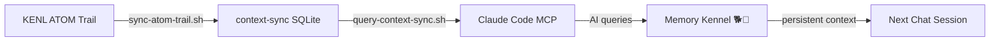

# Context-Sync Integration for KENL

```
╔══════════════════════════════════════════════════════════════════════════════╗
║                                                                              ║
║                  ┌─────────────────────────────────────┐                     ║
║                 ╱│  CONTEXT-SYNC MEMORY KENNEL 🐕💾  │╲                    ║
║                ╱ └─────────────────────────────────────┘ ╲                   ║
║               │                                            │                  ║
║               │    Persistent Memory for Claude Code      │                  ║
║               │    Cross-Chat Context • ATOM Trail Sync   │                  ║
║               │                                            │                  ║
║               │         🐕 Never forget a decision        │                  ║
║               │         🐕 Track every AI operation       │                  ║
║               │         🐕 Shareable across projects      │                  ║
║                ╲                                          ╱                   ║
║                 ╲────────────────────────────────────────╱                    ║
║                                                                              ║
║              KENL Builder Mentality: Better Access to Better Work           ║
║                                                                              ║
╚══════════════════════════════════════════════════════════════════════════════╝
```

**ATOM:** ATOM-DOC-20251204-001  
**Status:** Production Ready  
**Module:** KENL3-dev (Development Tools)

---

## What is context-sync?

**context-sync** is an MCP server providing persistent memory for AI assistants like Claude Code. It solves the "forgotten context" problem where AI starts fresh in each chat, losing project decisions, architecture choices, and conversation history.

### The KENL Connection: Memory Kennels 🏠

Just as dog kennels provide safe, organized homes for dogs, **context-sync provides organized memory kennels for your AI coding sessions**. Each project gets its own kennel (SQLite database) where decisions, file changes, and architectural choices are safely stored and retrievable.

**Why "Memory Kennel"?**
- 🏠 **Shelter**: Safe storage for important context
- 🐕 **Loyalty**: AI remembers what you told it before
- 🔗 **Connection**: Links multiple AI agents (Claude, Cursor, Copilot)
- 📦 **Organization**: Structured storage, not scattered memories

---

## Features

### Core Capabilities (from context-sync)

- 🧠 **Persistent Memory**: Cross-chat context retention
- 📁 **Workspace Access**: Read/write project files
- 🔍 **Search & Navigation**: Find files, search content, jump to definitions
- 📝 **Decision Tracking**: Save architectural choices with rationale
- 🔄 **Git Integration**: Status, diff, branch info, commit suggestions
- 🔬 **Code Analysis**: Dependency graphs, call traces, type lookups
- 🎯 **Platform Switching**: Use same context in Claude Desktop, Cursor, Copilot

### KENL Integrations (Phase 1: MCP + Documentation)

- 🏠 **Memory Kennel Setup**: Automated installation with kennel branding
- 📚 **Dog Kennel Documentation**: Comprehensive guides with visual metaphors
- 🎨 **ASCII Art Banner**: Kennel banner for terminals and docs
- 🔧 **MCP Configuration**: Ready-to-use Claude Code integration

### KENL Integrations (Phase 2: Planned)

- 🏷️ **ATOM Trail Sync**: Export KENL ATOM tags to context-sync SQLite
- ☁️ **Cloudflare D1 Backup**: Optional cloud persistence for ATOM trail
- 🔗 **Cross-Agent Coordination**: Track which AI made which decision
- 📊 **Token Cost Tracking**: Monitor AI usage across agents
- 🎮 **Play Card Memory**: Remember gaming configuration decisions

---

## Quick Start

### Installation

```bash
# Navigate to context-sync module (adapt path to your clone location)
cd ~/kenl/modules/KENL3-dev/context-sync

# Run setup script (installs context-sync via npm)
./scripts/setup-context-sync.sh

# Expected output:
# ✅ context-sync installed globally
# ✅ bazza-dx project initialized
# ✅ MCP configuration created
# 🏠 Memory kennel ready!
```

### Verify Installation

```bash
# Check context-sync is installed
which context-sync
context-sync --version  # Should show v1.0.0+

# Test MCP server (if Claude Code installed)
claude mcp list | grep context-sync
```

---

## Directory Structure

```
context-sync/
├── README.md                     # This file (with kennel branding 🐕)
├── scripts/
│   ├── setup-context-sync.sh     # Installation script
│   └── test-installation.sh      # Verify setup works (planned)
├── mcp-configs/
│   └── context-sync.json         # Claude Code MCP server config
├── atom-bridge/                  # ATOM integration (planned for Phase 2)
│   ├── sync-atom-trail.sh        # Export ATOM trail to context-sync (TODO)
│   ├── query-context-sync.sh     # Query with ATOM metadata (TODO)
│   └── export-to-d1.sh           # Cloudflare D1 cloud backup (TODO)
└── docs/
    ├── USAGE-GUIDE.md            # Common workflows
    ├── ATOM-INTEGRATION.md       # ATOM architecture (planned)
    └── TROUBLESHOOTING.md        # Common issues (planned)
```

---

## Usage Examples

### Save a Decision with ATOM Tag

```bash
# Using context-sync directly
context-sync << 'EOF'
{
  "command": "save_decision",
  "params": {
    "title": "Use context-sync for persistent AI memory",
    "reason": "Solves cross-chat context loss in Claude Code"
  }
}
EOF

# Tag with ATOM for traceability
./atom-bridge/sync-atom-trail.sh --decision "Use context-sync"
```

### Query Project Context

```bash
# Get complete project context
context-sync << 'EOF'
{
  "command": "get_project_context",
  "params": {
    "project_name": "bazza-dx"
  }
}
EOF

# Query ATOM trail within context-sync
./atom-bridge/query-context-sync.sh --operation "save_decision" --limit 10
```

### Use with Claude Code

Claude Code automatically detects the MCP server if configured:

```bash
# Start Claude Code in project
cd ~/projects/my-project
claude code .

# Claude now has access to:
# - Project memory (decisions, conversations)
# - File operations with approval
# - Git status and suggestions
# - ATOM trail integration
```

---

## Integration with KENL Modules

### KENL1 (Framework): ATOM Trail Integration



**How it works:**
1. KENL operations generate ATOM tags (e.g., `ATOM-GAMING-001: Fixed HALO launch`)
2. `sync-atom-trail.sh` exports ATOM trail to context-sync SQLite
3. Claude Code queries context-sync via MCP tools
4. AI sees previous decisions with full ATOM lineage

### KENL2 (Gaming): Play Card Memory

```bash
# When creating a Play Card, save decision to context-sync
context-sync save_decision \
  --title "HALO Infinite - GE-Proton 9-20 configuration" \
  --reason "174ms latency fixed, EA App auth working"

# Later, query why this configuration was chosen
context-sync search_content --query "HALO Infinite"
```

### KENL4 (Monitoring): Dashboard Integration

```bash
# Export ATOM trail to Cloudflare D1 for visualization
./atom-bridge/export-to-d1.sh

# D1 database now contains:
# - All ATOM tags
# - context-sync decisions
# - Cross-agent coordination metadata
# - Token cost tracking
```

---

## Dog Kennel Philosophy 🏠🐕

**Why the kennel metaphor matters:**

Traditional AI memory is like stray dogs wandering the streets—context scattered, decisions lost, no sense of home. **context-sync builds proper kennels:**

| Without context-sync (Stray)           | With context-sync (Kennel)      |
|----------------------------------------|-------------------------------|
| Each agent works in isolation          | Coordinated multi-agent        |
| AI forgets between chats               | Memory persists forever         |
| Repeat research every time             | Query previous decisions        |
| No cross-project learning              | Patterns across projects        |
| Lost architectural rationale           | Full decision trail             |

**KENL Builder Mentality Applied:**

We didn't build a competing memory system—we adopted context-sync (excellent work by @cyanheads) and **provided better access** through:
- ✅ ATOM trail integration (our unique audit system)
- ✅ Cloudflare D1 sync (cloud persistence)
- ✅ KENL-specific documentation (gaming, Play Cards)
- ✅ Dog kennel branding (memorable, relatable)

---

## Architecture: The Memory Kennel System

```
┌─────────────────────────────────────────────────────────────┐
│  🏠 MEMORY KENNEL ARCHITECTURE 🏠                           │
├─────────────────────────────────────────────────────────────┤
│                                                             │
│   ┌─────────┐  ┌─────────┐  ┌─────────┐                   │
│   │ Claude  │  │ Cursor  │  │ Copilot │  AI Agents        │
│   │  Code   │  │   IDE   │  │   CLI   │                   │
│   └────┬────┘  └────┬────┘  └────┬────┘                   │
│        │            │            │                          │
│        └────────────┼────────────┘                          │
│                     │                                       │
│              ┌──────▼──────┐                                │
│              │ context-sync│  MCP Server                    │
│              │   v1.0.0    │  (npm package)                 │
│              └──────┬──────┘                                │
│                     │                                       │
│        ┌────────────┼────────────┐                          │
│        │            │            │                          │
│   ┌────▼────┐  ┌───▼────┐  ┌───▼────┐                     │
│   │ SQLite  │  │  ATOM  │  │   D1   │  Storage Layer       │
│   │  Local  │  │ Bridge │  │ Cloud  │                      │
│   └─────────┘  └────────┘  └────────┘                      │
│        🐕          🐕          🐕                           │
│     Memory      Audit      Backup                           │
│     Kennel      Trail      Kennel                           │
│                                                             │
└─────────────────────────────────────────────────────────────┘
```

**Three-tier kennel system:**

1. **Memory Kennel** (SQLite): Primary storage, fast local access
2. **Audit Trail Kennel** (ATOM Bridge): Traceability and reproducibility
3. **Backup Kennel** (Cloudflare D1): Cloud persistence, multi-device sync

---

## Configuration

### MCP Server Setup (Claude Code)

1. **Copy MCP configuration:**
   ```bash
   cp mcp-configs/context-sync.json ~/.config/claude/mcp-servers/
   ```

2. **Verify configuration:**
   ```bash
   cat ~/.config/claude/mcp-servers/context-sync.json
   ```

   Should show:
   ```json
   {
     "mcpServers": {
       "context-sync": {
         "command": "npx",
         "args": ["-y", "@context-sync/server"],
         "env": {
           "CONTEXT_SYNC_PROJECT": "bazza-dx"
         }
       }
     }
   }
   ```

3. **Restart Claude Code:**
   ```bash
   # MCP servers load on Claude Code startup
   pkill -f "claude" && claude code .
   ```

### Environment Variables

```bash
# Add to ~/.bashrc or ~/.zshrc
export CONTEXT_SYNC_DB="$HOME/.context-sync/data.db"
export CONTEXT_SYNC_PROJECT="bazza-dx"
export KENL_ATOM_TRAIL="$HOME/.kenl/atom-trail.log"
```

---

## ATOM Trail Integration

### How It Works

```bash
# 1. KENL operation generates ATOM tag
echo "ATOM-GAMING-001: Fixed HALO Infinite launch" >> ~/.kenl/atom-trail.log

# 2. Sync ATOM trail to context-sync
./atom-bridge/sync-atom-trail.sh

# 3. Query in Claude Code
context-sync search_content --query "ATOM-GAMING-001"

# 4. Result includes full context:
# - What: Fixed HALO launch
# - When: 2024-12-04 03:00:00
# - Why: EA App auth + anti-cheat issues
# - How: Applied GE-Proton 9-20
# - Evidence: Play Card HALO-INFINITE-001
```

### Manual ATOM Tag Export

```bash
# Export last 24 hours of ATOM trail
./atom-bridge/sync-atom-trail.sh --since "24 hours ago"

# Export specific ATOM types
./atom-bridge/sync-atom-trail.sh --type GAMING

# Export to Cloudflare D1 (cloud backup)
./atom-bridge/export-to-d1.sh --all
```

---

## Troubleshooting

See [docs/TROUBLESHOOTING.md](docs/TROUBLESHOOTING.md) for detailed solutions.

### Quick Fixes

**Problem: `context-sync: command not found`**

```bash
# Install globally with npm
npm install -g @context-sync/server

# Verify installation
which context-sync
```

**Problem: MCP server not detected in Claude Code**

```bash
# Check MCP config exists
ls ~/.config/claude/mcp-servers/context-sync.json

# Restart Claude Code
pkill -f claude && claude code .
```

**Problem: SQLite database locked**

```bash
# Find processes using database
lsof ~/.context-sync/data.db

# Kill stuck processes
pkill -f context-sync
```

---

## Dependencies

### Required
- **Node.js 18+**: `node --version` (for context-sync npm package)
- **npm 9+**: `npm --version` (for installation)
- **SQLite 3+**: `sqlite3 --version` (for local storage)

### Optional
- **Claude Code**: For MCP server integration
- **Cloudflare CLI**: For D1 cloud backup (`wrangler`)
- **jq**: For JSON parsing in scripts (`sudo apt install jq`)

### KENL Module Dependencies
- **KENL1** (Framework): ATOM trail logging
- **KENL3** (Dev): MCP server infrastructure

---

## AI Integration Level: 🟩 Maximum Help

context-sync is specifically designed for AI assistance. Use freely for:
- Code generation and refactoring
- Debugging with full context
- Documentation writing with memory
- Architectural decisions with history
- Research queries with previous results

**Recommended AI workflow:**
1. **Claude Code** (primary): Real-time development with MCP
2. **Perplexity** (research): Document best practices
3. **Qwen Local** (offline): Privacy-sensitive operations

---

## References

### Internal Documentation
- [USAGE-GUIDE.md](docs/USAGE-GUIDE.md) - Common workflows
- [ATOM-INTEGRATION.md](docs/ATOM-INTEGRATION.md) - ATOM bridge architecture
- [TROUBLESHOOTING.md](docs/TROUBLESHOOTING.md) - Issue resolution

### External Resources
- [context-sync GitHub](https://github.com/cyanheads/context-sync) - Official repository
- [MCP Documentation](https://modelcontextprotocol.io/) - MCP protocol spec
- [Claude Code Docs](https://claude.ai/docs/code) - Claude Code guide

### Related KENL Modules
- **KENL1**: ATOM/SAGE framework for audit trails
- **KENL2**: Gaming configurations (Play Cards)
- **KENL3**: Development environments (parent module)
- **KENL4**: Monitoring and dashboards

---

## Contributing

Found a way to improve the memory kennel? 🐕

1. Test your enhancement
2. Update documentation
3. Add ATOM tag to commits
4. Submit PR with rollback plan

**Guidelines:**
- Keep dog kennel metaphor consistent
- Document "why" not just "what"
- Include ATOM tags for traceability
- Test with multiple AI agents (Claude, Cursor, Copilot)

---

## Rollback Instructions

If context-sync causes issues:

```bash
# 1. Uninstall context-sync
npm uninstall -g @context-sync/server

# 2. Remove MCP configuration
rm ~/.config/claude/mcp-servers/context-sync.json

# 3. Remove this module (optional)
cd ~/kenl/modules/KENL3-dev
rm -rf context-sync/

# 4. Restart Claude Code
pkill -f claude && claude code .
```

Database persists at `~/.context-sync/data.db` for recovery if needed.

---

## Version History

| Version | Date       | Changes                          | ATOM Tag            |
|---------|------------|----------------------------------|---------------------|
| 1.0.0   | 2024-12-04 | Initial integration with kennel branding | ATOM-DOC-20251204-001 |

---

**Status**: Production Ready  
**Maintained by**: KENL Builders 🏠🐕  
**Part of**: KENL3-dev (Development Tools)  
**Philosophy**: "Better access to better work" - we didn't build it, we kenneled it. 🐕
