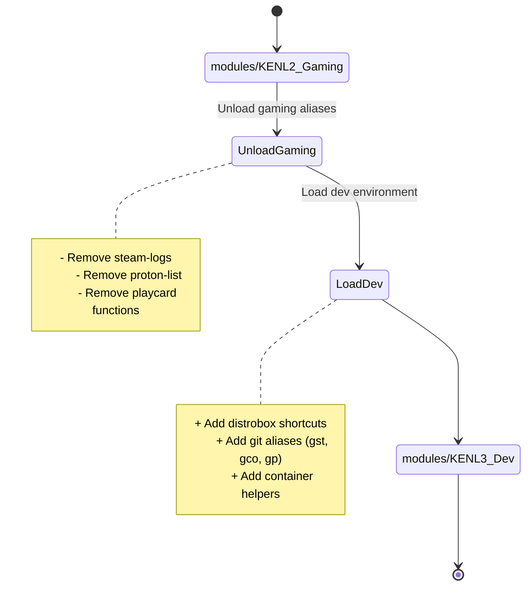

# modules/KENL5: Facades & Theming

**Version:** 1.0.0
**Target Platform:** Bazzite (rpm-ostree) and Linux with distrobox
**Status:** Production Ready

---

## Overview

KENL5 provides **visual identity and context switching** for all modules/KENL modules. Each modules/KENL context gets its own:

- 🎨 **Shell prompt** with unique icon and colors
- 🖥️ **Terminal theme** optimized for the context
- 📝 **Profile configuration** with environment variables
- 🔄 **Easy switching** between contexts
- 🔒 **rpm-ostree compatible** (user-space only, respects immutability)

```
⚛️  modules/KENL1  Framework    (Purple)  - ATOM+SAGE+OWI Core
🎮  modules/KENL2  Gaming       (Red)     - Bazzite Gaming (GWI)
💻  modules/KENL3  Development  (Blue)    - Bazzite-DX Development
📊  modules/KENL4  Monitoring   (Green)   - Monitoring & Observability
🎨  modules/KENL5  Facades      (Yellow)  - Theming & Customization
```

---

## Why Facades?

### Problem: Context Confusion

When working across multiple modules/KENL modules, it's easy to forget which context you're in:

```bash
# Are we in gaming mode or dev mode?
$ cd ~/game-configs
$ # Wait, am I about to edit production code or game settings?
```

### Solution: Visual Context

With modules/KENL5 facades, each context is **immediately obvious**:

```bash
🎮  modules/KENL2 user@bazzite:~/game-configs$
# ✅ Clear: You're in gaming context

💻  modules/KENL3 user@bazzite:~/code$
# ✅ Clear: You're in development context
```

---

## Installation

### Quick Start

```bash
# Install modules/KENL5 facades
cd ~/kenl/KENL5-facades
./switch-kenl.sh install

# Restart shell or:
source ~/.bashrc

# You're now in modules/KENL1 (default) context:
⚛️  modules/KENL1 user@bazzite:~$
```

### What It Does

1. Creates `~/.kenl_profile` with context configuration
2. Adds modules/KENL integration to `~/.bashrc` (if not present)
3. Sets default context (KENL1-framework)
4. **No system modifications** (rpm-ostree compatible)

---

## Usage

### Switching Contexts

```bash
# Switch to gaming context
./switch-kenl.sh gaming
```

**What changes:**
```diff
Before:
⚛️  modules/KENL1 user@bazzite:~$

After:
🎮  modules/KENL2 user@bazzite:~$

Environment:
+ modules/KENL_CONTEXT=KENL2-gaming
+ modules/KENL_ICON=🎮
+ modules/KENL_COLOR=RED
+ PS1='🎮  modules/KENL2 \u@\h:\w\$ '

Loaded:
+ Gaming aliases (steam-logs, proton-list)
+ Play Card functions (create-playcard, apply-playcard)
+ ProtonDB integration
+ Performance tracking commands
```

**Visual comparison:**
| Context | Before (KENL1) | After (KENL2) |
|---------|----------------|---------------|
| **Icon** | ⚛️ | 🎮 |
| **Color** | Purple | Red |
| **Label** | modules/KENL1 | modules/KENL2 |
| **Focus** | Framework | Gaming |

**Why:** Visual prompt prevents accidents like running gaming commands in dev context or system commands in gaming context.

---

```bash
# Switch to dev context
./switch-kenl.sh dev
```

**What changes:**


**Prompt transformation:**
```
🎮  modules/KENL2 user@bazzite:~/games$    →    💻  modules/KENL3 user@bazzite:~/code$
   (Red, gaming focus)                    (Blue, development focus)
```

**Environment differences:**
| Variable | modules/KENL2 (Gaming) | modules/KENL3 (Dev) |
|----------|----------------|-------------|
| `KENL_CONTEXT` | modules/KENL2-gaming | modules/KENL3-dev |
| `KENL_ICON` | 🎮 | 💻 |
| `KENL_COLOR` | RED | BLUE |
| `PATH` | + Steam tools | + Dev tools |

**Why:** Different contexts load different tools. Dev context has git helpers, gaming context has Steam helpers.

### Checking Current Context

```bash
./switch-kenl.sh current
# Output: Current context: modules/KENL2-gaming
```

### Listing All Contexts

```bash
./switch-kenl.sh list

Available modules/KENL contexts:

  1) modules/KENL1-framework  ⚛️  Purple  - ATOM+SAGE+OWI Core
  2) modules/KENL2-gaming     🎮  Red     - Bazzite Gaming (GWI)
  3) modules/KENL3-dev        💻  Blue    - Bazzite-DX Development
  4) modules/KENL4-monitoring 📊  Green   - Monitoring & Observability
  5) modules/KENL5-facades    🎨  Yellow  - Facades & Theming
```

---

## Context Details

### modules/KENL1: Framework (Purple ⚛️)

**Prompt:**
```bash
⚛️  modules/KENL1 user@hostname:~/kenl/KENL1-framework$
```

**When to use:**
- Working on core ATOM+SAGE+OWI framework
- Creating governance documents (ARCREF, ADR)
- Platform integration case studies
- Framework development

**Environment:**
- `$KENL_CONTEXT` = `KENL1-framework`
- `$KENL_ICON` = `⚛️`
- `$KENL_COLOR` = `purple`

---

### modules/KENL2: Gaming (Red 🎮)

**Prompt:**
```bash
🎮  modules/KENL2 user@hostname:~/kenl/KENL2-gaming$
```

**When to use:**
- Configuring game settings
- Creating/sharing Play Cards
- Optimizing Proton/GE-Proton
- GameScope/MangoHud tweaking
- Windows 10 EOL migration planning

**Environment:**
- `$KENL_CONTEXT` = `KENL2-gaming`
- `$KENL_ICON` = `🎮`
- `$KENL_COLOR` = `red`

---

### modules/KENL3: Development (Blue 💻)

**Prompt:**
```bash
💻  modules/KENL3 user@hostname:~/kenl/KENL3-dev$
```

**When to use:**
- Software development
- Distrobox environment setup
- Claude Code integration
- MCP server configuration
- Immutable system development

**Environment:**
- `$KENL_CONTEXT` = `KENL3-dev`
- `$KENL_ICON` = `💻`
- `$KENL_COLOR` = `blue`

---

### modules/KENL4: Monitoring (Green 📊)

**Prompt:**
```bash
📊  modules/KENL4 user@hostname:~/kenl/KENL4-monitoring$
```

**When to use:**
- Setting up Logdy/Grafana/Prometheus
- Analyzing ATOM trail data
- Performance monitoring
- Play Card tracking
- Observability configuration

**Environment:**
- `$KENL_CONTEXT` = `KENL4-monitoring`
- `$KENL_ICON` = `📊`
- `$KENL_COLOR` = `green`

---

### modules/KENL5: Facades (Yellow 🎨)

**Prompt:**
```bash
🎨  modules/KENL5 user@hostname:~/kenl/KENL5-facades$
```

**When to use:**
- Customizing themes
- Creating new prompts
- Managing visual identity
- Theming configuration

**Environment:**
- `$KENL_CONTEXT` = `KENL5-facades`
- `$KENL_ICON` = `🎨`
- `$KENL_COLOR` = `yellow`

---

## rpm-ostree Compatibility

### How It Works on Bazzite

Bazzite uses **rpm-ostree** (immutable filesystem):
- System files (`/usr`, `/etc`) are read-only
- User modifications go in `~/.config` or `~/.local`
- modules/KENL5 **respects this** by only modifying user space

### What modules/KENL5 Installs

✅ **User Space Only** (no system changes):
```
~/.kenl_profile              # Context configuration
~/.bashrc                    # Hook to load contexts (appended)
~/.config/kenl-facades/      # Theme storage
```

❌ **No System Modifications**:
- No `/usr` changes
- No `/etc` changes
- No rpm-ostree layering required
- Works across system updates/rollbacks

### Distrobox Integration

KENL5 works perfectly with distrobox:

```bash
# Host system (Bazzite)
⚛️  modules/KENL1 user@bazzite:~$ distrobox enter ubuntu-dev

# Inside distrobox (inherits context)
⚛️  modules/KENL1 user@ubuntu-dev:~$

# Switch context from host
./switch-kenl.sh dev

# Distrobox picks up new context
💻  modules/KENL3 user@ubuntu-dev:~$
```

---

## Documentation Formatting

KENL5 manages theming and visual identity. When editing documentation with Mermaid diagrams or tables:

📝 **See [../../CONTRIBUTING.md](../../CONTRIBUTING.md#documentation-formatting-standards)** for:
- Mermaid diagram syntax and styling conventions
- Table formatting and column alignment rules
- Color coding standards for visual hierarchy

---

## Customization

### Creating Custom Themes

Create your own modules/KENL context prompt:

```bash
# Create new prompt file
vim prompts/kenl-custom.sh
```

Example:
```bash
#!/usr/bin/env bash
# Custom modules/KENL Context

RED='\[\033[0;31m\]'
RESET='\[\033[0m\]'

export PS1="${RED}🔥  CUSTOM${RESET} \u@\h:\w\$ "
export modules/KENL_CONTEXT="custom"
export modules/KENL_COLOR="red"
export modules/KENL_ICON="🔥"

echo "Custom modules/KENL context loaded!"
```

### Per-Context Aliases

Add context-specific aliases to prompt files:

```bash
# In prompts/kenl2-gaming.sh
alias play="cd ~/kenl/KENL2-gaming/play-cards"
alias proton="cd ~/.steam/steam/compatibilitytools.d"
alias games="cd ~/Games"
```

### Terminal Color Schemes

Store terminal color schemes in `themes/`:

```bash
themes/
├── kenl1-purple.json      # Konsole/Yakuake theme
├── kenl2-red.json         # Gaming theme
├── kenl3-blue.json        # Development theme
└── kenl4-green.json       # Monitoring theme
```

---

## Integration with Other modules/KENLs

### Automatic Context Detection

KENL5 can detect which modules/KENL directory you're in:

```bash
# Add to ~/.kenl_profile for auto-switching
cd ~/kenl/KENL2-gaming && source ~/.kenl_profile
# Automatically switches to 🎮 gaming context
```

### ATOM Trail Integration

All context switches are logged via ATOM trail:

```bash
./switch-kenl.sh gaming
# Creates: ATOM-FACADE-20251109-001

atom-analytics --search FACADE
# Query all context switches
```

### Claude Code Integration

Claude Code can switch contexts:

```bash
claude: "Switch to gaming context"
# Executes: ./switch-kenl.sh gaming

claude: "What modules/KENL context am I in?"
# Reads: $KENL_CONTEXT environment variable
```

---

## Directory Structure

```
KENL5-facades/
├── prompts/                 # Shell prompt configurations
│   ├── kenl1-framework.sh
│   ├── kenl2-gaming.sh
│   ├── kenl3-dev.sh
│   ├── kenl4-monitoring.sh
│   └── kenl5-facades.sh
│
├── themes/                  # Terminal color schemes
│   ├── konsole/
│   ├── gnome-terminal/
│   └── alacritty/
│
├── profiles/                # .profile additions per context
│   ├── kenl1.profile
│   ├── kenl2.profile
│   └── ...
│
├── fonts/                   # Recommended fonts
│   └── README.md
│
├── terminal-configs/        # Terminal app configs
│   ├── konsole/
│   ├── yakuake/
│   └── foot/
│
├── systemwide/              # System-wide theme hooks
│   └── README.md            # (rpm-ostree compatible)
│
├── switch-kenl.sh          # Main context switcher
└── README.md               # This file
```

---

## Advanced Features

### Multi-Terminal Support

Run different contexts in different terminals:

```bash
# Terminal 1: Gaming
🎮  modules/KENL2 user@bazzite:~/gaming$

# Terminal 2: Development (same time)
💻  modules/KENL3 user@bazzite:~/code$
```

Each terminal can have its own context!

### Tmux/Screen Integration

KENL5 works with tmux/screen sessions:

```bash
# Create gaming tmux session
tmux new -s gaming
./switch-kenl.sh gaming

# Create dev tmux session
tmux new -s dev
./switch-kenl.sh dev

# Each session maintains its own context
```

### SSH Context Preservation

When SSH'ing to remote systems, context is preserved:

```bash
🎮  modules/KENL2 user@local:~$ ssh remote-server
🎮  modules/KENL2 user@remote:~$  # Context preserved!
```

---

## Troubleshooting

### Context Not Showing

**Problem**: Prompt doesn't change after switching

**Solution**:
```bash
# Make sure you sourced the profile
source ~/.bashrc

# Or restart shell
exec bash
```

### Icon Not Displaying

**Problem**: Emoji icons show as `�` or empty boxes

**Solution**: Install a font with emoji support
```bash
# On Bazzite
rpm-ostree install google-noto-emoji-fonts

# Or use text-only mode (edit prompts to use ASCII)
```

### Context Resets After Reboot

**Problem**: Context goes back to modules/KENL1 after reboot

**Solution**: This is by design (safe default). To change:
```bash
# Set persistent default context
echo "2-gaming" > ~/.config/kenl-facades/default-context

# Edit ~/.kenl_profile to use default-context
```

---

## Examples

### Daily Workflow

```bash
# Morning: Check system, framework updates
./switch-kenl.sh framework
⚛️  modules/KENL1 user@bazzite:~$ atom STATUS "Morning system check"

# Afternoon: Gaming session
./switch-kenl.sh gaming
🎮  modules/KENL2 user@bazzite:~$ cd play-cards && ./validate-playcard.sh elden-ring

# Evening: Development
./switch-kenl.sh dev
💻  modules/KENL3 user@bazzite:~$ distrobox enter dev-env
💻  modules/KENL3 user@dev-env:~$ code .

# Night: Check monitoring
./switch-kenl.sh monitoring
📊  modules/KENL4 user@bazzite:~$ logdy
```

### Gaming With Intent (GWI)

```bash
# Switch to gaming context
./switch-kenl.sh gaming
🎮  modules/KENL2 user@bazzite:~$

# Activate Play Card
cd ~/kenl/KENL2-gaming/play-cards
./activate-playcard.sh baldurs-gate-3

# Gaming session (tracked via ATOM trail)
atom GAMING "BG3 session - testing Proton GE-9-15"
# ... play game ...
atom STATUS "Session complete - 4 hours, 60 FPS stable"

# Switch back to normal
./switch-kenl.sh framework
⚛️  modules/KENL1 user@bazzite:~$
```

---

## License

MIT License - See [../modules/KENL1-framework/LICENSE](../modules/KENL1-framework/LICENSE)

---

## Navigation

- **← [Root README](../README.md)** - Overview of all modules/KENL modules
- **→ [KENL1: Framework](../modules/KENL1-framework/README.md)** - Core ATOM+SAGE+OWI
- **→ [KENL2: Gaming](../modules/KENL2-gaming/README.md)** - Bazzite Gaming
- **→ [KENL3: Development](../modules/KENL3-dev/README.md)** - Bazzite-DX Development
- **→ [KENL4: Monitoring](../modules/KENL4-monitoring/README.md)** - Observability

---

**Status**: Production Ready | **Version**: 1.0.0 | **Platform**: Bazzite (rpm-ostree) / Linux
