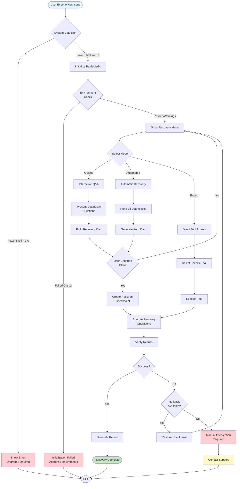
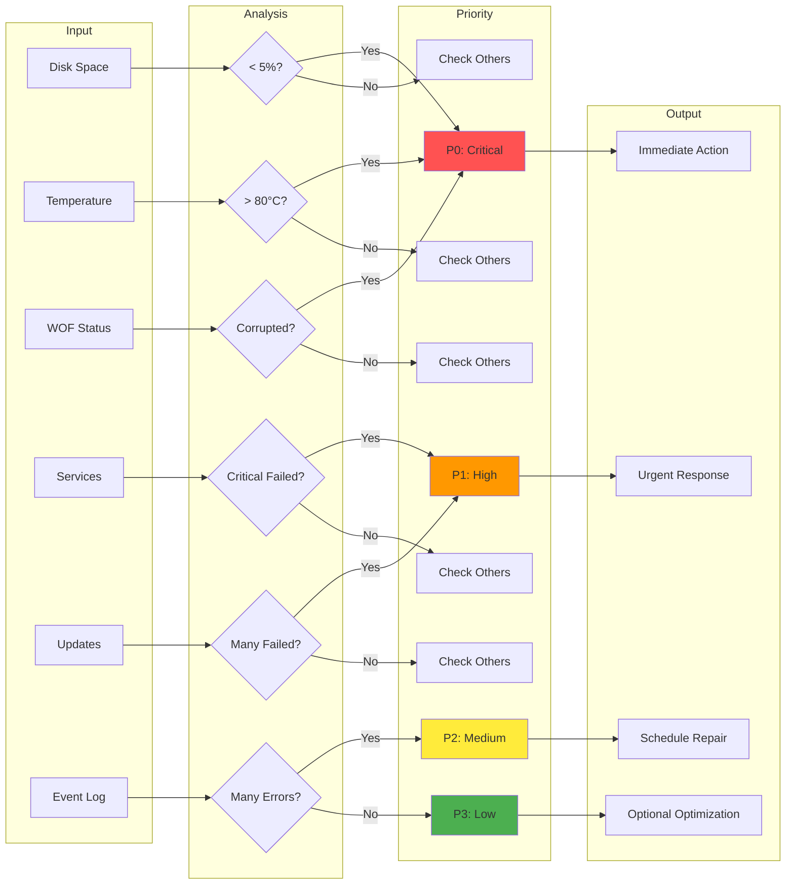
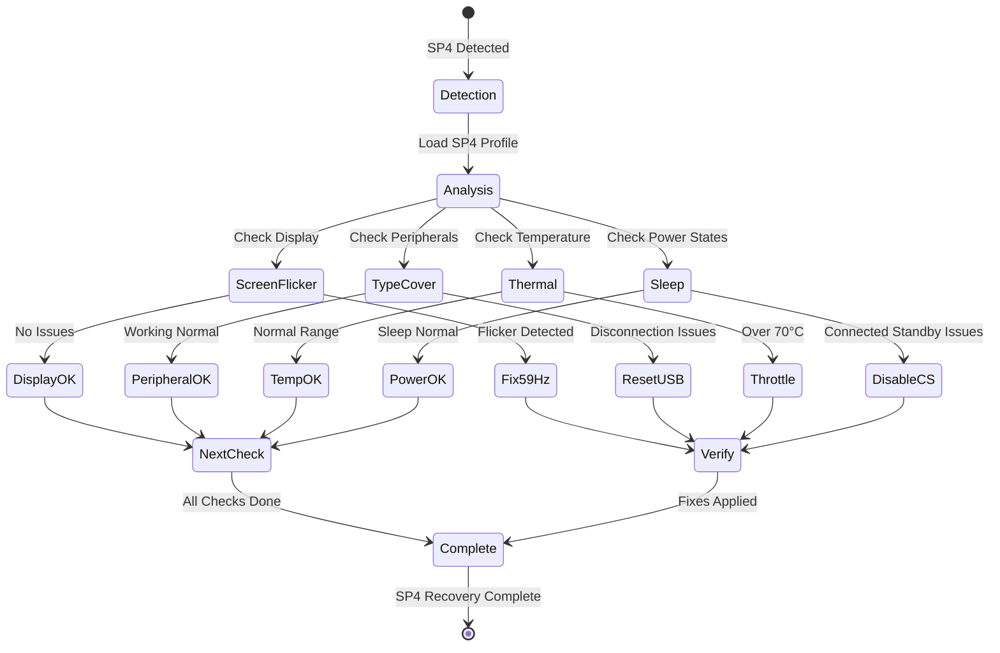
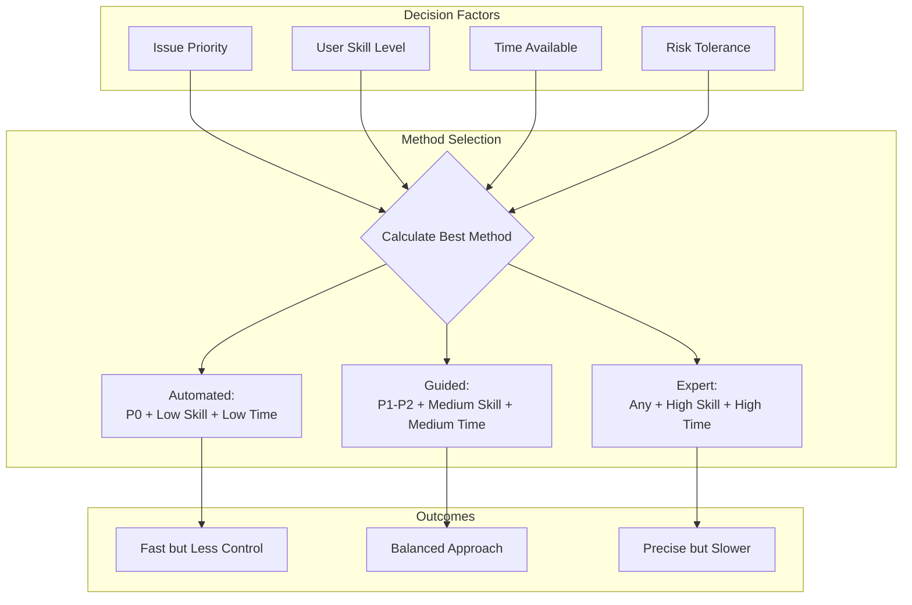
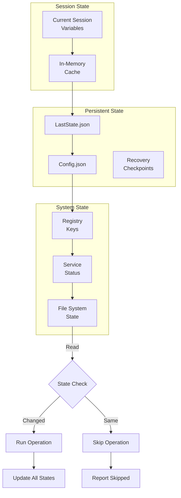
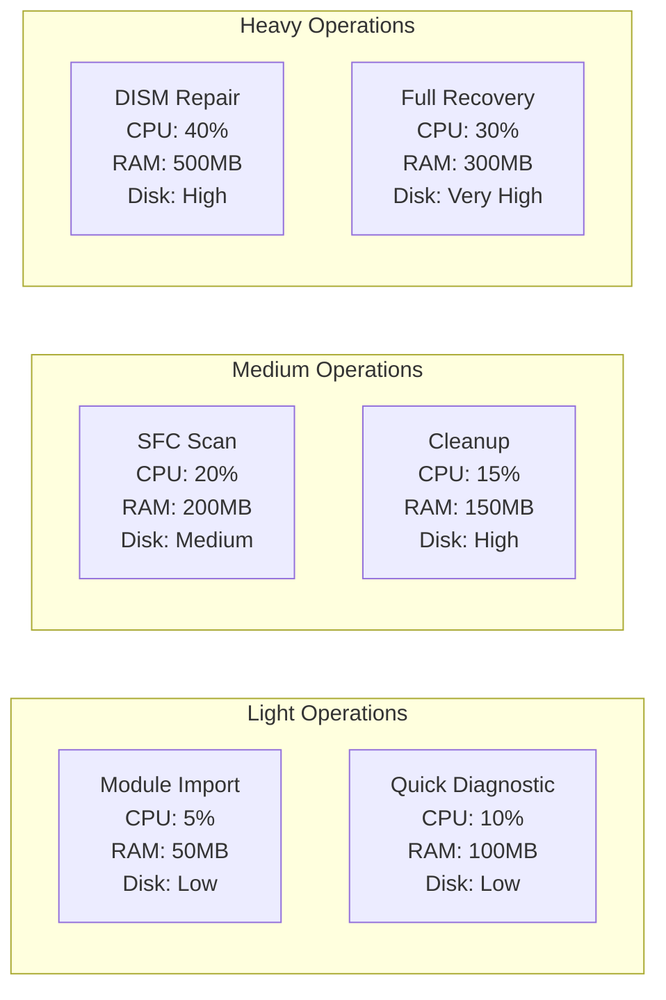
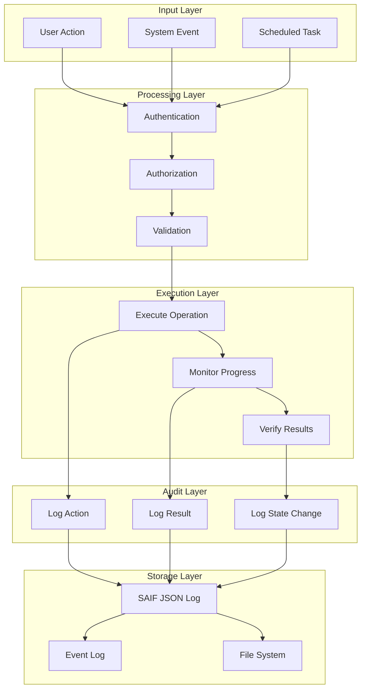

# Battle Medic Recovery Suite v2.1
## Complete Obsidian Documentation & Initialization Checklist

> **Purpose**: This document serves as your complete initialization checklist, reference manual, and knowledge base for the Battle Medic Recovery Suite. When you complete this checklist, your Obsidian vault will contain everything needed for deployment, testing, and operation.

---

## 📋 Initialization Checklist

Complete these steps to initialize your Battle Medic deployment:

- [ ] **Environment Preparation**
  - [ ] Verify PowerShell version (`$PSVersionTable.PSVersion`)
  - [ ] Check administrative privileges
  - [ ] Document target systems (Windows versions, hardware models)
  - [ ] Create backup storage location
  - [ ] Set up logging directory

- [ ] **Module Installation**
  - [ ] Download Battle Medic module package
  - [ ] Extract to PowerShell modules directory
  - [ ] Verify file integrity (checksums)
  - [ ] Review dependency requirements
  - [ ] Test import: `Import-Module BattleMedic -Verbose`

- [ ] **Initial Configuration**
  - [ ] Run `Initialize-BattleMedic` for first-time setup
  - [ ] Configure SAIF logging preferences
  - [ ] Set recovery checkpoint policies
  - [ ] Enable/disable SP4 specific features
  - [ ] Configure Claude Code integration (if applicable)

- [ ] **Validation**
  - [ ] Execute `Test-BattleMedicEnvironment`
  - [ ] Review prerequisite report
  - [ ] Address any warnings or errors
  - [ ] Create initial system baseline
  - [ ] Generate first diagnostic report

- [ ] **Documentation Setup**
  - [ ] Import this document into Obsidian
  - [ ] Link related documentation files
  - [ ] Set up daily notes template
  - [ ] Configure recovery log structure
  - [ ] Create system inventory notes

---

## 🎯 Best Practices & Advice (One-Pager)

### Executive Summary

The Battle Medic Recovery Suite represents a paradigm shift in Windows system recovery methodology. Rather than treating system issues as isolated incidents requiring manual intervention, Battle Medic implements an intelligent triage system that automatically classifies, prioritizes, and resolves issues based on severity and impact.

### Core Principles

**1. Idempotency First**
Every operation in Battle Medic is designed to be safely repeatable. The system checks current state before making changes, ensuring that running a repair multiple times won't cause damage. This principle is crucial when dealing with unstable systems where operations might be interrupted.

**2. Progressive Enhancement**
The module adapts to its environment, providing basic functionality on PowerShell 3.0 while unlocking advanced features on newer versions. This ensures maximum compatibility without sacrificing capability where available.

**3. Evidence-Based Recovery**
All decisions are logged with SAIF compliance, creating an audit trail that documents not just what was done, but why. This transforms system recovery from an art into a science, with each intervention building on previous learnings.

### Critical Success Factors

**Always Create Checkpoints**
Before any major intervention, the system should create a recovery checkpoint. This isn't just about safety—it's about building confidence that allows more aggressive troubleshooting when needed.

**Understand Priority Levels**
The P0-P3 classification system isn't arbitrary. P0 issues (like thermal critical or boot failure) require immediate action and justify more aggressive interventions. P3 issues can wait and should be batched for efficiency.

**Leverage Automation Gradually**
Start with guided recovery mode to understand what the system is doing. Move to automated mode only after you're comfortable with the decision patterns. Expert mode is for when you need surgical precision.

### Common Pitfalls to Avoid

**Running Without Admin Rights**
Many recovery operations require administrative privileges. Running without them doesn't just limit functionality—it can give false negative results that mask real issues.

**Ignoring Battery Warnings**
On mobile devices like Surface Pro 4, running intensive recovery operations on low battery can cause corruption if the system loses power. Always heed battery warnings.

**Skipping Prerequisite Checks**
The temptation to use `-SkipPrerequisites` for speed is strong, but these checks exist to prevent operations that would fail anyway, potentially leaving the system in an inconsistent state.

### Surface Pro 4 Specific Wisdom

The Surface Pro 4 presents unique challenges that standard Windows recovery tools don't address. The screen flicker issue, for instance, isn't just a display problem—it's often thermal-related, requiring a holistic approach that includes refresh rate adjustment, thermal management, and driver optimization.

Type Cover disconnection issues often correlate with sleep state problems. When you see one, check for the other. The SP4's Connected Standby feature, while power-efficient, is the root of many stability issues and disabling it often provides immediate relief.

### Integration Strategy

Battle Medic works best as part of a larger system management strategy. Use it alongside:
- Configuration management tools for preventive maintenance
- Monitoring systems for early warning
- Documentation systems (like this Obsidian vault) for knowledge retention
- Communication tools (Signal-CLI integration) for alerting

### Performance Expectations

Recovery operations are not instant. Expect:
- WOF driver repair: 15-20 minutes
- Full system file check: 30-45 minutes
- Automated recovery: 30-60 minutes
- Emergency cleanup: Variable based on disk state

These times assume no user interaction. Guided mode will take longer but provides more control.

### Final Recommendation

Treat Battle Medic as a force multiplier, not a magic solution. It automates the tedious parts of system recovery, but human judgment remains essential for interpreting results and choosing appropriate interventions. The tool's greatest value is in standardizing recovery procedures across teams and preserving institutional knowledge about system issues.

---

## 📊 Expected Process Steps

### Standard Recovery Flow

The typical Battle Medic recovery process follows these steps:

• **Initial Assessment Phase**
  - System detection and hardware identification
  - PowerShell version compatibility check
  - Administrative privilege verification
  - Available disk space calculation
  - Battery status check (mobile devices)
  - WinRE availability confirmation

• **Diagnostic Phase**
  - WMI/CIM service availability check
  - System file integrity quick scan
  - WOF driver corruption detection
  - Thermal sensor reading
  - Event log critical error analysis
  - Windows Update status review
  - Service failure enumeration

• **Priority Classification**
  - P0 identification (immediate threats)
  - P1 assessment (high-impact issues)
  - P2 evaluation (medium concerns)
  - P3 cataloging (optimization opportunities)
  - Issue correlation and root cause analysis
  - Recovery plan generation

• **Intervention Phase**
  - Recovery checkpoint creation
  - P0 emergency interventions
  - Progressive P1-P3 repairs
  - State verification after each action
  - Rollback preparation for failures
  - Progress logging and reporting

• **Verification Phase**
  - Post-intervention diagnostic run
  - Priority level reassessment
  - Success criteria validation
  - Performance baseline comparison
  - Remaining issue documentation
  - Next action recommendations

• **Documentation Phase**
  - SAIF audit log generation
  - Recovery report creation
  - Knowledge base updates
  - Team notification (if configured)
  - Checkpoint cleanup
  - State persistence for next run

### Surface Pro 4 Specific Flow

When SP4 hardware is detected, additional steps are inserted:

• **SP4 Hardware Assessment**
  - Manufacturing date decode from serial
  - Known issue batch identification
  - Screen refresh rate detection
  - Type Cover firmware check
  - Intel GPU driver version audit
  - Connected Standby status

• **SP4 Targeted Interventions**
  - Screen flicker mitigation (59Hz setting)
  - Thermal throttling adjustment
  - Type Cover connection reset
  - GPU driver rollback if needed
  - Sleep state reconfiguration
  - Panel self-refresh disable

• **SP4 Validation**
  - Temperature monitoring post-intervention
  - Display stability testing
  - Peripheral connection verification
  - Sleep/wake cycle testing
  - Battery drain rate assessment

---

## 🧪 Testing & Verification Guide

### Pre-Deployment Testing Protocol

Before deploying Battle Medic on production systems, follow this comprehensive testing protocol:

#### Phase 1: Safe Environment Setup

Create an isolated test environment that mirrors your production systems but won't impact operations if something goes wrong. This means:

Setting up a test VM or spare physical machine with the same Windows version as your target systems. The key is matching the OS build number, not just the version. Install the same PowerShell version that your production systems run—don't assume everyone has 5.1 or later. Include similar third-party software, especially security tools that might interfere with recovery operations.

#### Phase 2: Compatibility Verification

The compatibility check goes beyond just importing the module. You need to verify that each subsystem works correctly:

```powershell
# Comprehensive compatibility test script
$testResults = @{
    DateTime = Get-Date
    MachineName = $env:COMPUTERNAME
    Results = @{}
}

# Test 1: Module Import
try {
    Import-Module BattleMedic -Force -Verbose
    $testResults.Results['ModuleImport'] = 'PASS'
} catch {
    $testResults.Results['ModuleImport'] = "FAIL: $_"
}

# Test 2: PowerShell Version Compatibility
$testResults.Results['PSVersion'] = "$($PSVersionTable.PSVersion)"
if ($PSVersionTable.PSVersion.Major -ge 3) {
    $testResults.Results['PSCompatibility'] = 'PASS'
} else {
    $testResults.Results['PSCompatibility'] = 'FAIL: Requires PS 3.0+'
}

# Test 3: WMI/CIM Functionality
try {
    if (Get-Command Get-CimInstance -ErrorAction SilentlyContinue) {
        $os = Get-CimInstance Win32_OperatingSystem
    } else {
        $os = Get-WmiObject Win32_OperatingSystem
    }
    $testResults.Results['WMI_CIM'] = 'PASS'
} catch {
    $testResults.Results['WMI_CIM'] = "FAIL: $_"
}

# Test 4: Administrative Rights Detection
$isAdmin = ([Security.Principal.WindowsPrincipal][Security.Principal.WindowsIdentity]::GetCurrent()).IsInRole([Security.Principal.WindowsBuiltInRole]::Administrator)
$testResults.Results['AdminDetection'] = if ($isAdmin) { 'PASS: Running as Admin' } else { 'PASS: Correctly detected non-admin' }

# Test 5: Core Function Availability
$coreFunctions = @(
    'Initialize-BattleMedic',
    'Test-BattleMedicEnvironment',
    'Get-BattleMedicDiagnostic',
    'Start-BattleMedicRecovery'
)

foreach ($func in $coreFunctions) {
    if (Get-Command $func -ErrorAction SilentlyContinue) {
        $testResults.Results["Function_$func"] = 'PASS'
    } else {
        $testResults.Results["Function_$func"] = 'FAIL: Not found'
    }
}

# Export results
$testResults | ConvertTo-Json -Depth 3 | Out-File "BattleMedic_CompatTest_$(Get-Date -Format 'yyyyMMdd_HHmmss').json"
```

#### Phase 3: Idempotency Testing

Idempotency is crucial for recovery tools. Test that operations can be run multiple times safely:

```powershell
# Idempotency test sequence
$idempotencyTests = @()

# Run initialization twice
$init1 = Initialize-BattleMedic -Config @{VerboseLogging = $true}
$init2 = Initialize-BattleMedic -Config @{VerboseLogging = $true}

# Results should be identical except for timestamps
$idempotencyTests += @{
    Test = 'Double Initialization'
    Pass = ($init1.Config.VerboseLogging -eq $init2.Config.VerboseLogging)
}

# Run diagnostic twice
$diag1 = Get-BattleMedicDiagnostic -Quick
Start-Sleep -Seconds 2
$diag2 = Get-BattleMedicDiagnostic -Quick

# Priority should be consistent if nothing changed
$idempotencyTests += @{
    Test = 'Consistent Diagnostics'
    Pass = ($diag1.Priority -eq $diag2.Priority)
}

# Test checkpoint creation with same name
$checkpoint1 = New-RecoveryCheckpoint -Name "TestCheckpoint" -Silent
$checkpoint2 = New-RecoveryCheckpoint -Name "TestCheckpoint" -Silent

$idempotencyTests += @{
    Test = 'Checkpoint Handling'
    Pass = ($checkpoint2.Success -or $checkpoint2.Message -like '*exists*')
}

$idempotencyTests | ForEach-Object {
    Write-Host "$($_.Test): $(if ($_.Pass) { 'PASS' } else { 'FAIL' })" -ForegroundColor $(if ($_.Pass) { 'Green' } else { 'Red' })
}
```

#### Phase 4: Failure Mode Testing

Test how the module handles various failure conditions:

```powershell
# Failure mode testing
$failureTests = @()

# Test 1: Low disk space warning
# Temporarily fill disk to trigger warning (careful with this!)

# Test 2: No admin rights behavior
# Run specific functions without elevation

# Test 3: WMI service stopped
Stop-Service winmgmt -Force -ErrorAction SilentlyContinue
$diagResult = Get-BattleMedicDiagnostic -Quick
$failureTests += @{
    Test = 'WMI Service Down'
    Handled = ($diagResult.Warnings -contains 'WMI not available')
}
Start-Service winmgmt

# Test 4: Corrupted module file simulation
# Temporarily rename a required file

# Test 5: Network isolation (for tools that might need it)
# Disable network adapters temporarily
```

#### Phase 5: Performance Testing

Measure the performance impact of recovery operations:

```powershell
# Performance baseline
$perfTests = @{}

# Measure diagnostic time
$perfTests['DiagnosticQuick'] = Measure-Command {
    Get-BattleMedicDiagnostic -Quick
}

$perfTests['DiagnosticFull'] = Measure-Command {
    Get-BattleMedicDiagnostic -IncludeHardware
}

# Measure initialization time
$perfTests['Initialization'] = Measure-Command {
    Initialize-BattleMedic -SkipPrerequisites
}

# Output performance results
$perfTests.GetEnumerator() | ForEach-Object {
    Write-Host "$($_.Key): $([Math]::Round($_.Value.TotalSeconds, 2)) seconds"
}
```

#### Phase 6: Recovery Simulation

Test actual recovery operations in a controlled manner:

```powershell
# Create controlled issues to test recovery

# Test 1: Create temporary files to trigger cleanup
$tempPath = "$env:TEMP\BattleMedic_Test"
New-Item -ItemType Directory -Path $tempPath -Force
1..100 | ForEach-Object {
    [System.IO.File]::WriteAllText("$tempPath\test_$_.tmp", "A" * 10MB)
}

# Run cleanup and verify
$cleanupResult = Start-EmergencyCleanup -TargetFreeGB 1
$cleanupResult.Success | Should -Be $true

# Test 2: Service recovery (stop a non-critical service)
Stop-Service -Name 'Themes' -Force
$recovery = Start-BattleMedicRecovery -Priority P2 -Force
Get-Service 'Themes' | Select-Object -ExpandProperty Status | Should -Be 'Running'
```

### Continuous Validation

After deployment, implement continuous validation to ensure ongoing effectiveness:

```powershell
# Daily validation job
$validationJob = {
    Import-Module BattleMedic

    $daily = @{
        Date = Get-Date
        Environment = Test-BattleMedicEnvironment
        QuickDiag = Get-BattleMedicDiagnostic -Quick
        ModuleVersion = Get-BattleMedicVersion
    }

    # Alert if priority is P0 or P1
    if ($daily.QuickDiag.Priority -in @('P0', 'P1')) {
        # Send alert via your preferred method
        Write-EventLog -LogName Application -Source "BattleMedic" `
            -EventId 1001 -EntryType Warning `
            -Message "System priority $($daily.QuickDiag.Priority) detected"
    }

    # Log validation results
    $daily | Export-Clixml -Path "C:\Logs\BattleMedic\Daily_$(Get-Date -Format 'yyyyMMdd').xml"
}

# Schedule the job
Register-ScheduledJob -Name "BattleMedic Daily Validation" `
    -ScriptBlock $validationJob `
    -Trigger (New-JobTrigger -Daily -At "6:00 AM") `
    -Credential (Get-Credential)
```

---

## 🗺️ User Journey Flowcharts

### Main Recovery Journey



### Diagnostic Priority Flow



### SP4 Specific Recovery Path



---

## 📊 Recovery Decision Matrix

### Issue Priority Classification Table

| Priority | Indicators | Examples | Response Time | Automation |
|----------|-----------|----------|---------------|------------|
| **P0** | System cannot boot<br>Data loss imminent<br>Thermal critical (>80°C)<br>Disk space <5% | BSOD loops<br>WOF.SYS 0xD3<br>No free space<br>CPU thermal throttle | Immediate<br><5 minutes | Full auto authorized |
| **P1** | Major functionality broken<br>Performance severely degraded<br>Security compromise risk | Services failing<br>Update loops<br>Driver crashes<br>Network offline | Urgent<br><30 minutes | Auto with notification |
| **P2** | Noticeable issues<br>Degraded performance<br>Non-critical errors | Slow boot<br>App crashes<br>Update warnings<br>Log errors | Scheduled<br><4 hours | Confirmation required |
| **P3** | Minor annoyances<br>Optimization opportunities<br>Preventive maintenance | Temp files<br>Old logs<br>Registry bloat<br>Fragmentation | Best effort<br>Next maintenance | Manual only |

### Recovery Method Selection



### Component Interaction Map

| Component | Depends On | Provides To | Critical? | Fallback |
|-----------|-----------|-------------|-----------|----------|
| **Core Module** | PowerShell 3.0+ | All modules | Yes | None - Required |
| **Diagnostics** | WMI/CIM | Recovery planning | Yes | Limited functionality |
| **Recovery** | Admin rights | System repairs | Yes | Read-only mode |
| **SP4 Module** | Hardware detection | SP4 fixes | No | Generic recovery |
| **WinRE** | Recovery partition | Offline repairs | No | Online only |
| **Logging** | Disk write access | Audit trail | No | Event log |
| **SAIF** | JSON support | Compliance | No | Basic logging |

---

## 🔄 State Management & Idempotency

### Operation State Tracking

The module maintains state across three levels to ensure idempotency:



### Idempotent Operation Example

Every recovery operation follows this pattern to ensure it can be safely re-run:

```powershell
function Repair-Something {
    [CmdletBinding()]
    param()

    # 1. Check current state
    $currentState = Get-CurrentState

    # 2. Determine if action needed
    if ($currentState.AlreadyFixed) {
        Write-Verbose "Already in desired state - skipping"
        return @{
            Success = $true
            Skipped = $true
            State = $currentState
        }
    }

    # 3. Create checkpoint before changes
    $checkpoint = New-RecoveryCheckpoint -Name "Pre_Repair_$(Get-Date -Format 'yyyyMMdd_HHmmss')"

    try {
        # 4. Perform the repair
        $result = Invoke-RepairOperation

        # 5. Verify the repair worked
        $newState = Get-CurrentState
        if (-not $newState.AlreadyFixed) {
            throw "Repair failed verification"
        }

        # 6. Log success
        Write-Log -Action "Repair-Something" -Result "Success" -Details $result

        return @{
            Success = $true
            Skipped = $false
            State = $newState
            Checkpoint = $checkpoint
        }
    }
    catch {
        # 7. Rollback on failure
        if ($checkpoint) {
            Restore-RecoveryCheckpoint -Name $checkpoint.Name
        }

        # 8. Log failure
        Write-Log -Action "Repair-Something" -Result "Failure" -Error $_

        throw
    }
}
```

---

## 🚀 Claude Code Integration

### Enabling Claude Code Support

Battle Medic is designed to work seamlessly with Claude Code for enhanced automation:

```json
{
  "claude-code": {
    "version": "1.0+",
    "compatibility": true,
    "features": {
      "auto-diagnostics": true,
      "guided-recovery": true,
      "report-generation": true,
      "state-tracking": true
    }
  }
}
```

### Claude Code Commands

When integrated with Claude Code, these commands become available:

```powershell
# Claude Code specific commands
Claude-Diagnose -System $ComputerName
Claude-Repair -Priority P0 -AutoApprove
Claude-Report -Format Markdown -IncludeRecommendations
Claude-Monitor -Interval 300 -AlertThreshold P1
```

---

## 📈 Performance Benchmarks

### Expected Operation Timings

Understanding how long operations take helps set appropriate expectations:

| Operation | Best Case | Typical | Worst Case | Factors |
|-----------|-----------|---------|------------|---------|
| Module Import | 1-2 sec | 3-5 sec | 10+ sec | PS version, disk speed |
| Quick Diagnostic | 5 sec | 15 sec | 60 sec | WMI responsiveness |
| Full Diagnostic | 30 sec | 2 min | 10 min | System load, disk queue |
| WOF Repair | 10 min | 15 min | 30 min | Compression level |
| SFC Scan | 15 min | 30 min | 90 min | File count, corruption |
| DISM Repair | 10 min | 20 min | 60 min | Internet speed, CBS size |
| Emergency Cleanup | 5 min | 15 min | 120 min | Disk fragmentation |
| Full Recovery | 20 min | 45 min | 3 hours | Issue complexity |

### Resource Utilization

Expected resource usage during operations:



---

## 🔐 Security & Compliance

### SAIF Compliance Architecture

The Security Automation and Integration Framework compliance is built into every operation:



### Audit Log Structure

Every SAIF-compliant log entry contains:

```json
{
  "Timestamp": "2024-11-24T15:30:45.123Z",
  "Version": "SAIF-1.0",
  "Component": "BattleMedic",
  "ComponentVersion": "2.1.0",
  "Action": "Repair-WOFDriver",
  "Result": "Success",
  "User": "DOMAIN\\Username",
  "Computer": "HOSTNAME",
  "ProcessId": 12345,
  "SessionId": "uuid-here",
  "Environment": {
    "PowerShellVersion": "5.1",
    "OSVersion": "Windows 10 22H2",
    "IsAdmin": true
  },
  "Details": {
    "Duration": "15m23s",
    "StateChange": "WOF.Corrupted: true -> false"
  }
}
```

---

## 🎓 Learning Path

### Beginner Journey

If you're new to Battle Medic, follow this progression:


### Advanced Mastery Path

For experienced users seeking mastery:

1. **Understand the Architecture** - Study how modules interact and dependencies flow
2. **Master Priority Classification** - Learn to predict priority levels before diagnostics
3. **Customize Recovery Plans** - Build your own recovery sequences for specific scenarios
4. **Integrate with Infrastructure** - Connect to monitoring, alerting, and documentation systems
5. **Contribute Improvements** - Submit fixes and enhancements back to the project

---

## 📚 Quick Reference

### Essential Commands Cheatsheet

```powershell
# First Time Setup
Import-Module BattleMedic
Initialize-BattleMedic

# Daily Operations
Get-BattleMedicDiagnostic -Quick          # Fast system check
Show-RecoveryMenu                         # Interactive recovery
Start-BattleMedicRecovery -Auto -Force    # Automated fix

# Troubleshooting
Test-BattleMedicEnvironment               # Verify setup
Get-BattleMedicLog -Latest 10            # Recent activities
Repair-WOFDriver -DisableCompactOS       # Fix BSOD 0xD3

# SP4 Specific
Get-SP4Status -Detailed                   # SP4 hardware check
Repair-SP4ScreenFlicker                   # Fix display issues
Start-SP4ThermalMitigation               # Cool down system

# Advanced
New-RecoveryCheckpoint -Name "PreWork"    # Create restore point
Export-BattleMedicReport -Format HTML     # Generate report
New-SAIFAuditEntry -Action "Custom"       # Log custom action
```

### Common Issues Quick Fixes

| Symptom | Command | Time |
|---------|---------|------|
| BSOD 0xD3 | `Repair-WOFDriver -Force` | 15m |
| No disk space | `Start-EmergencyCleanup` | 20m |
| System slow | `Get-BattleMedicDiagnostic` then `bmr` | 45m |
| SP4 screen flicker | `Repair-SP4ScreenFlicker` | 5m |
| Windows Update stuck | `Reset-WindowsUpdate` | 30m |
| High temperature | `Start-ThermalMitigation` | Immediate |

---

## 🏁 Final Checklist

Before considering your Battle Medic deployment complete:

- [ ] Module successfully imported on all target systems
- [ ] Initialization completed without critical errors
- [ ] Test recovery performed successfully
- [ ] Logging configured and verified
- [ ] Documentation imported to Obsidian
- [ ] Team trained on basic usage
- [ ] Escalation procedures defined
- [ ] Backup/rollback procedures tested
- [ ] Integration with existing tools completed
- [ ] Performance baselines established

---

## 📝 Notes Section

_Use this section to document your organization-specific customizations, lessons learned, and operational procedures._

### Custom Configuration

```yaml
# Your custom settings here
```

### Known Issues in Our Environment

```markdown
# Document environment-specific issues
```

### Team Contacts

```markdown
# Recovery team escalation contacts
```

---

*This document is part of the Battle Medic Recovery Suite v2.1.0*
*Last Updated: 2024-11-24*
*Status: Production Ready*
