# Workflow Diagrams - 1.8TB External Drive Setup

**Purpose:** Visual guide for complete dual-boot partition setup

**ATOM Tag:** `ATOM-CFG-20251112-005`

---

## Complete Workflow Overview

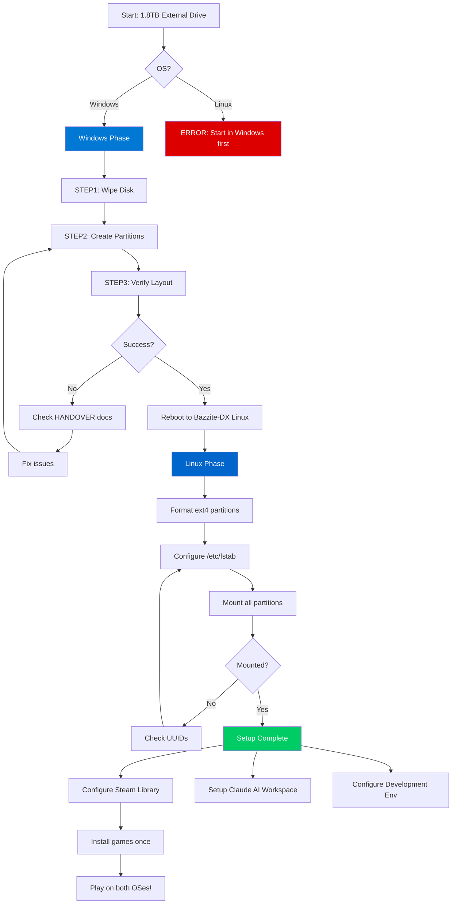

---

## Windows Phase Detail

```mermaid
stateDiagram-v2
    [*] --> CheckDisk: Get-Disk

    CheckDisk --> VerifyNotSystem: Is external drive?
    VerifyNotSystem --> [*]: ABORT - System disk!

    VerifyNotSystem --> STEP1: Confirmed

    state STEP1 {
        [*] --> OnlineDisk
        OnlineDisk --> ClearPartitions
        ClearPartitions --> WipeDisk: Clear-Disk
        WipeDisk --> CreateHandover: Success
        CreateHandover --> [*]
    }

    STEP1 --> STEP2: HANDOVER-WIPE created

    state STEP2 {
        [*] --> InitGPT: Initialize-Disk
        InitGPT --> CreateP1: Partition 1 (NTFS)
        CreateP1 --> CreateP2: Partition 2 (RAW)
        CreateP2 --> CreateP3: Partition 3 (RAW)
        CreateP3 --> CreateP4: Partition 4 (NTFS)
        CreateP4 --> CreateP5: Partition 5 (exFAT)
        CreateP5 --> WriteTest: Test all formatted
        WriteTest --> [*]
    }

    STEP2 --> STEP3: HANDOVER-PARTITION created

    state STEP3 {
        [*] --> CountPartitions
        CountPartitions --> VerifyFS: Count = 5?
        VerifyFS --> TestNTFS: Check filesystems
        TestNTFS --> TestExFAT
        TestExFAT --> TestRAW
        TestRAW --> Report: Generate verification
        Report --> [*]
    }

    STEP3 --> RebootLinux: All verified
    RebootLinux --> [*]
```

---

## Linux Phase Detail

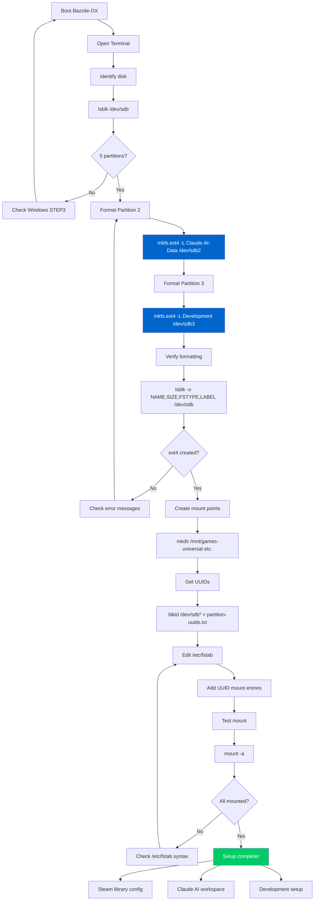

---

## Partition Layout Visualization

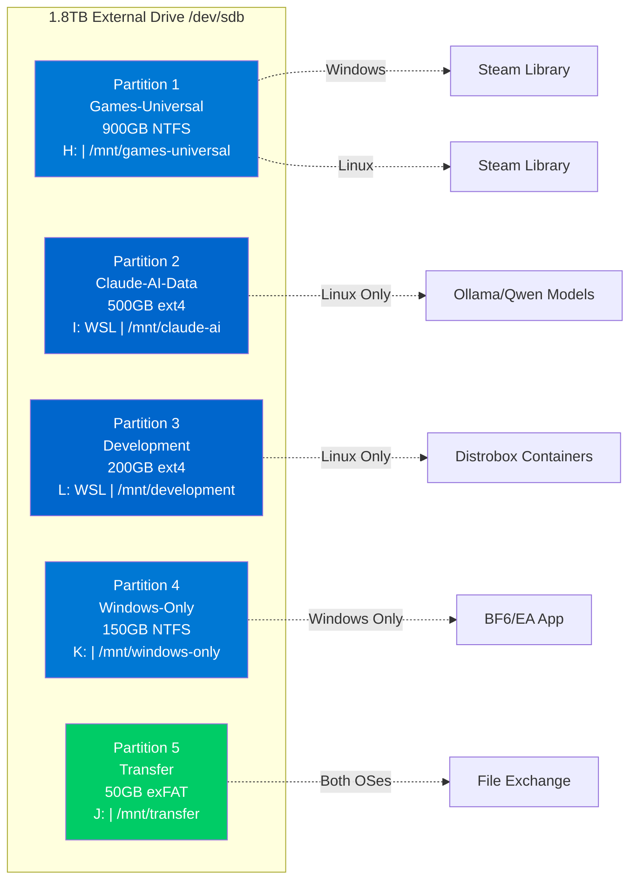

---

## Filesystem Access Matrix

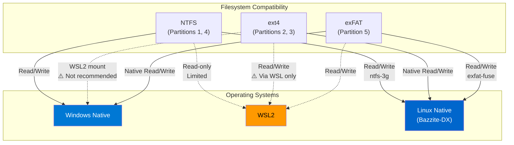

---

## Error Handling Flow

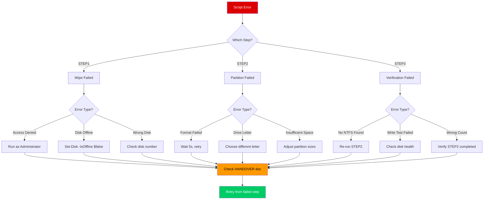

---

## Safety Decision Tree

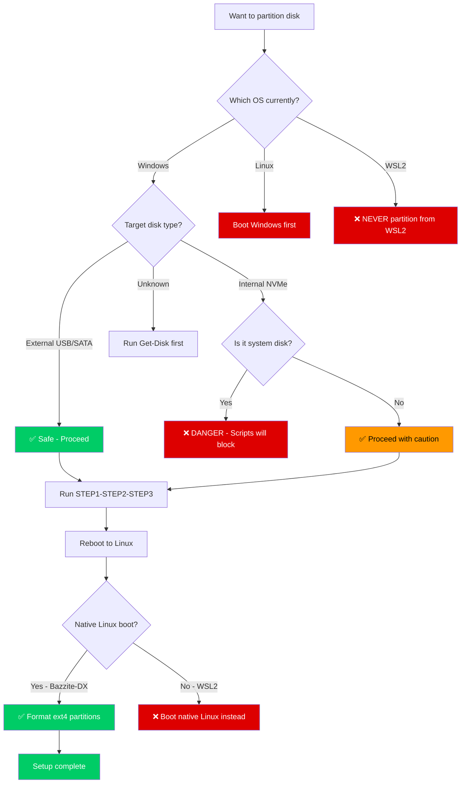

---

## Usage Patterns

### Pattern 1: Gaming Setup

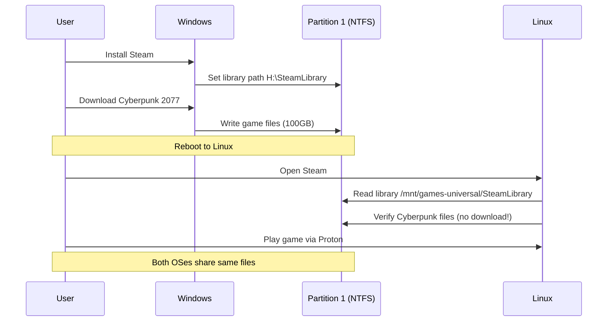

### Pattern 2: Anti-Cheat Gaming

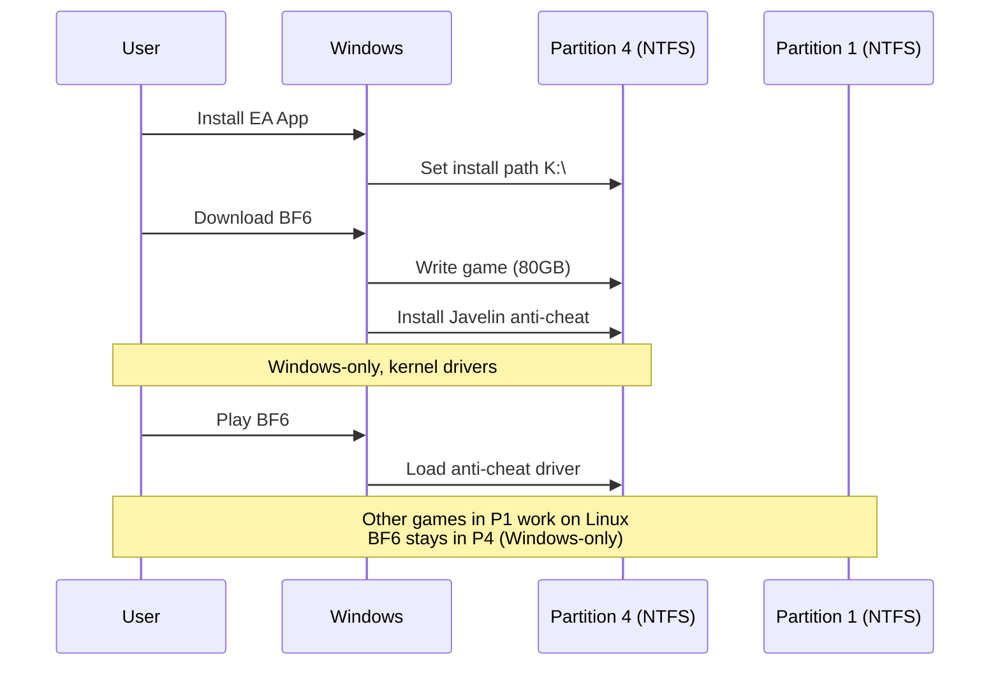

### Pattern 3: AI Development

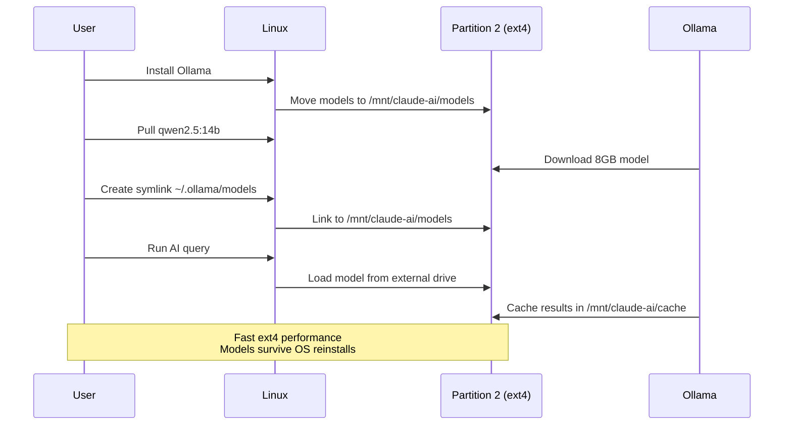

---

## Troubleshooting Decision Flow

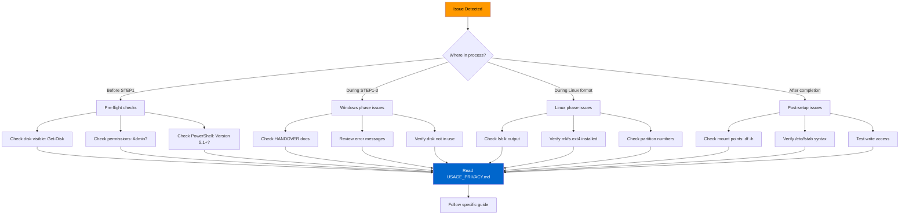

---

**Last Updated:** 2025-11-12
**ATOM:** ATOM-CFG-20251112-005
