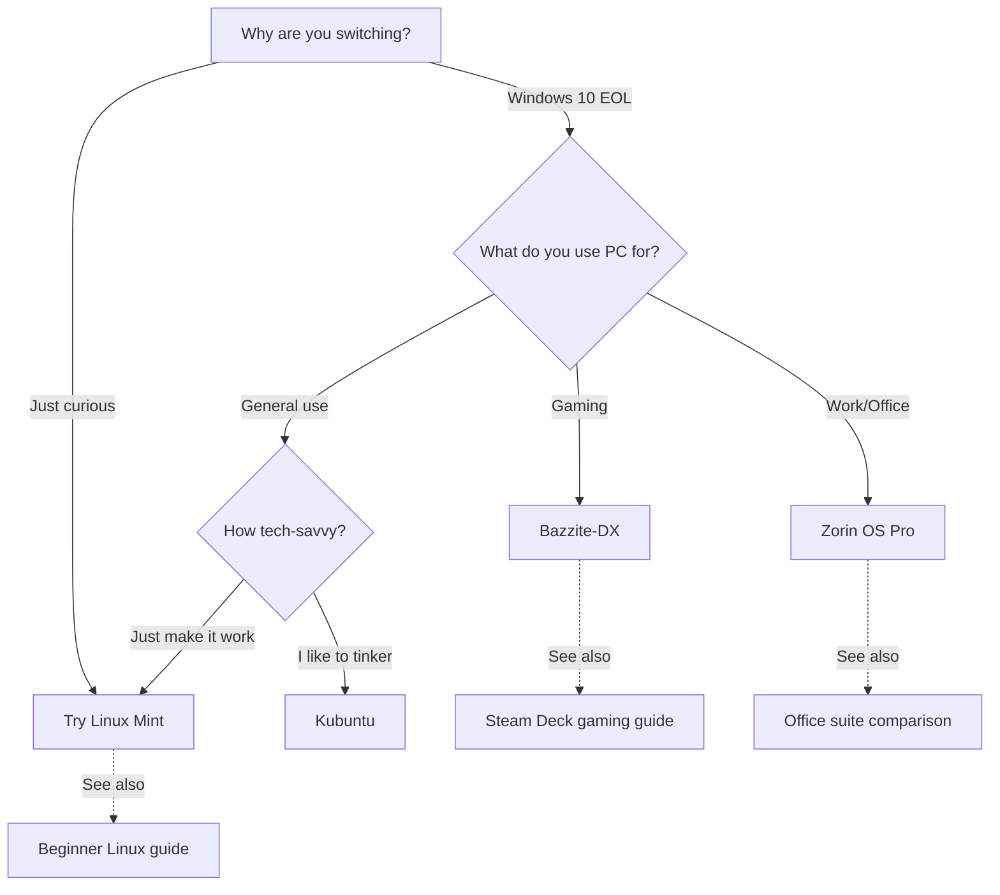

# Windows Alternatives - Linux Distributions That Look and Feel Like Windows

**For Windows 10 EOL refugees who want familiarity, not a learning curve.**

If Windows 10 support ending in October 2025 has you worried, but you don't want to learn a completely new interface, these Linux distributions are designed to look and feel just like Windows.

## 🎯 Why Switch?

| Windows 11 "Solution" | Reality | Linux Alternative | Reality |
|----------------------|---------|-------------------|---------|
| Buy new PC ($800+) | Most PCs from 2018-2023 "not compatible" | Use same hardware | Works on 10+ year old PCs |
| Accept bloatware | Ads, forced updates, telemetry | Clean system | Your PC, your rules |
| Subscribe to services | Office 365, OneDrive required | Free forever | LibreOffice, local storage |
| Slower over time | Needs reinstall every 2 years | Stays fast | No registry rot |

## 🏆 Top 5 Windows Look-Alikes

These distributions are specifically designed to look and feel like Windows. Click each for detailed one-pager:

### 1. **[Linuxfx (formerly Windowsfx)](./linuxfx.md)** - Most Windows 11-like
- **Looks like:** Windows 11 (almost identical)
- **Best for:** People who want to pretend they upgraded to Windows 11
- **Key feature:** Taskbar, Start Menu, Settings app all look identical
- 📊 [DistroWatch: Linuxfx](https://distrowatch.com/table.php?distribution=linuxfx)

### 2. **[Zorin OS](./zorin-os.md)** - Most polished
- **Looks like:** Windows 10/11 (you choose)
- **Best for:** People who want Windows familiarity + modern design
- **Key feature:** "Zorin Appearance" app lets you switch between Windows 11, Windows 10, or macOS layouts
- 📊 [DistroWatch: Zorin OS](https://distrowatch.com/table.php?distribution=zorin)

### 3. **[Linux Mint Cinnamon](./linux-mint.md)** - Most stable
- **Looks like:** Windows 7/10
- **Best for:** "I just want it to work" users
- **Key feature:** Most popular beginner distro, huge support community
- 📊 [DistroWatch: Linux Mint](https://distrowatch.com/table.php?distribution=mint)

### 4. **[AnduinOS](./anduin-os.md)** - Most Windows 7-like
- **Looks like:** Windows 7 (classic Aero theme)
- **Best for:** Windows 7 holdouts who hate Windows 10/11
- **Key feature:** Authentic Windows 7 Aero Glass theme, start menu, taskbar
- 📊 [DistroWatch: AnduinOS](https://distrowatch.com/table.php?distribution=anduin)

### 5. **[Kubuntu](./kubuntu.md)** - Most customizable
- **Looks like:** Windows 10 (but can look like anything)
- **Best for:** Tinkerers who want Windows-style + power user features
- **Key feature:** KDE Plasma desktop - looks like Windows but infinitely customizable
- 📊 [DistroWatch: Kubuntu](https://distrowatch.com/table.php?distribution=kubuntu)

## 🥇 Best 3 OS to Actually Convert To

**[See detailed comparison guide →](./BEST_3_TO_CONVERT.md)**

If you're serious about leaving Windows, these three offer the best long-term experience:

1. **Linux Mint** - Easiest transition, works like Windows 7
2. **Zorin OS** - Best Windows 11 replica + premium polish
3. **Bazzite-DX** - For gamers (Proton, Steam Deck UI, gaming-optimized)

## 🤔 "But I don't want to learn Linux..."

**You won't have to.** These distros are designed so you never touch a terminal.

**[Windows vs Linux: What's Different (And Easier) →](./WINDOWS_SCHMINDOWS.md)**

Visual guide showing:
- Where the Control Panel went (it's called Settings)
- How to install apps (just click, no .exe files)
- Why you don't need antivirus anymore
- What "sudo" means (and why you rarely need it)

## 📋 Quick Decision Tree

## 🚀 Next Steps

1. **Research:** Read the one-pager for 2-3 distros that interest you
2. **Try it:** Download and create a bootable USB (no installation needed)
3. **Test drive:** Boot from USB, try it out for a day (your Windows install is untouched)
4. **Decide:** If you like it, install alongside Windows (dual-boot) or replace Windows

**[Creating a bootable USB guide →](../surface-pro-4/QUICK_START_GUIDE.md#creating-bootable-usb)** (works for any distro)

## ❓ FAQ

**Q: Will my files be deleted?**
A: No. You can dual-boot (keep Windows) or backup files before replacing Windows.

**Q: Can I go back to Windows?**
A: Yes. Keep Windows in dual-boot, or reinstall Windows later if you want.

**Q: Will my hardware work?**
A: Probably better than Windows. Linux has drivers built-in for most hardware.

**Q: Can I run Windows apps?**
A: Some yes (Wine, Bottles), some no. Most have Linux alternatives (see WINDOWS_SCHMINDOWS.md).

**Q: Is it really free?**
A: Yes. No trials, no subscriptions, no catch. Free forever.

**Q: What about games?**
A: See [Bazzite-DX gaming guide](../../modules/KENL2-gaming/README.md) - most Steam games work via Proton.

---

**Part of:** Windows 10 EOL Support
**Updated:** 2025-11-10
**Maintained by:** KENL Community 🏠
